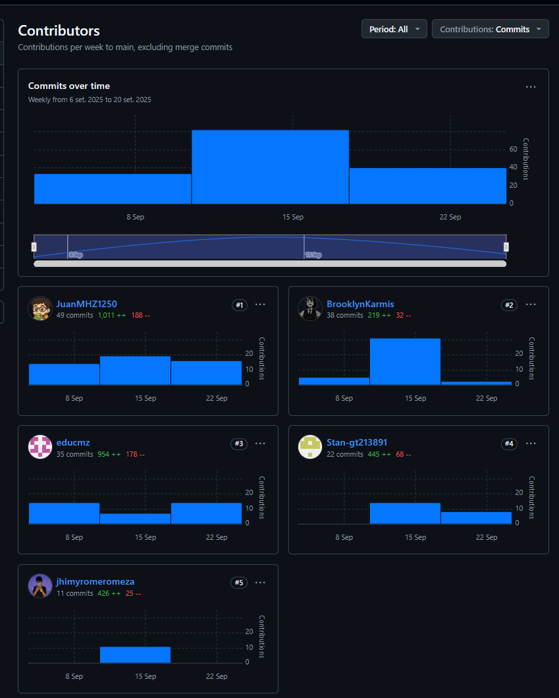
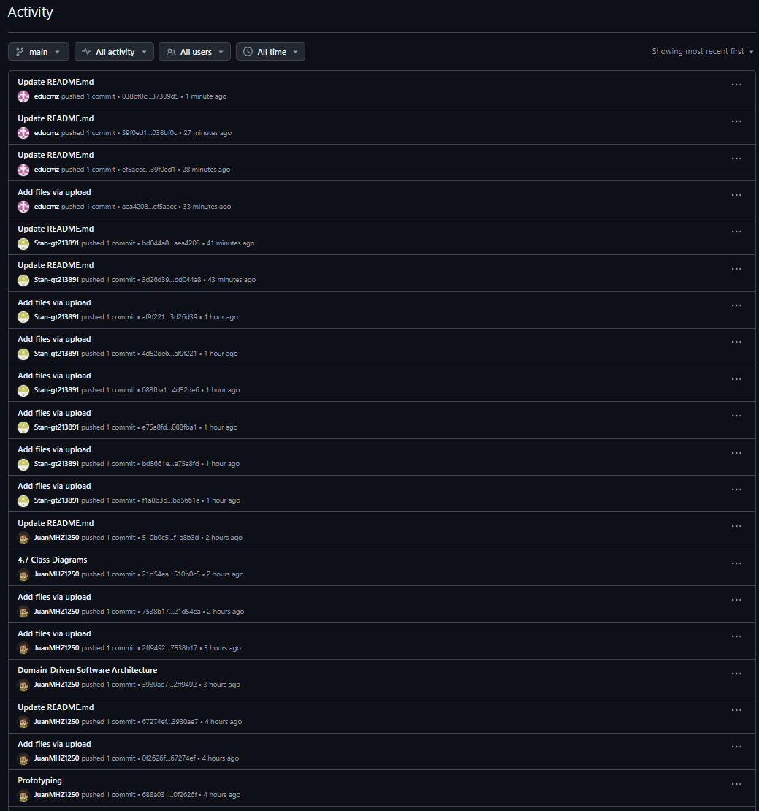
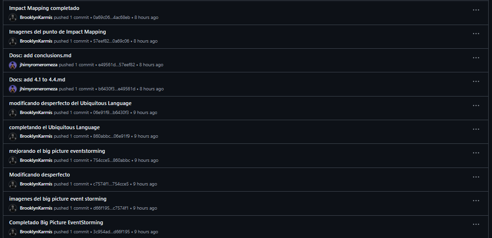

  

<h2 style="text-align: center">Universidad Peruana de Ciencias Aplicadas</h2>  
<h3 style="text-align: center">Carrera de Ingeniería de Sistemas</h3>  
<h3 style="text-align: center">Ciclo 2025-2</h3>

<strong>Código del curso:</strong> 1ASI0730
  

<strong>Nombre del curso:</strong> Aplicaciones Web
  

<strong>NRC:</strong> 7468
  

<strong>Profesor:</strong> Angel Augusto Velasquez Nuñez

<h1 style="text-align: center">Informe de Trabajo Final</h1>

<strong>Startup:</strong> Mythicore
  

<strong>Producto:</strong> AuraNeuro

## Integrantes

- U202118152 – Gutierrez Tume, Stanley Jeremy – Team Leader
- U202320574 – Meza Huanacune, Juan José – Backend Engineer
- U202324129 – Chacaliaza Minaya, Eduardo Fabián – Frontend & UX/UI Engineer
- U202320442 – Quispe Barzola, Fabricio Fabián – Data & IoT Integration Engineer
- U202321510 – Meza Jhimy Pool, Romero – Frontend & UX/UI Engineer

---

<strong>Septiembre 2025</strong>

---

## Registro de Versiones del Informe

<table>
  <thead>
      <th>Versión</th>
      <th>Fecha</th>
      <th>Autor</th>
      <th>Descripción</th>
  </thead>
  <tbody>
    <tr>
      <td>0.1.0</td>
      <td>2025-09-13</td>
      <td>
        - Romero Meza jhimy Pool 
          
        - Meza Huanacune, Juan José  
           
        - Gutierrez Tume, Stanley Jeremy 
              
        - Chacaliaza Minaya, Eduardo Fabián  
             
        - Quispe Barzola, Fabricio Fabián  
      </td>
      <td>
        - Carátula  
        - Registro de Versiones del Informe 
        - Project Report Collaboration Insights 
        - Contenido 
        - Student Outcome 
        - Capítulo I: Introducción 
        - Capítulo II: Requirements Elicitation & Analysis. 
        - Capítulo III: Requirements Specification.
        - Capítulo IV: Product Design.
        - Capítulo V: Product Implementation, Validation & Deployment. 
        - 5.1. Software Configuration Management. 
        - 5.1.1. Software Development Environment Configuration. 
        - 5.1.2. Source Code Management. 
        - 5.1.3. Source Code Style Guide & Conventions. 
        - 5.1.4. Software Deployment Configuration. 
        - 5.2. Landing Page, Services & Applications Implementation. 
        - 5.2.1. Sprint 1 
        - 5.2.1.1. Sprint Planning 1. 
        - 5.2.1.2. Aspect Leaders and Collaborators.
        - 5.2.1.3. Sprint Backlog 1. 
        - 5.2.1.4. Development Evidence for Sprint Review. 
        - 5.2.1.5. Execution Evidence for Sprint Review. 
        - 5.2.1.6. Services Documentation Evidence for Sprint Review. 
        - 5.2.1.7. Software Deployment Evidence for Sprint Review. 
        - 5.2.1.8. Team Collaboration Insights during Sprint. 
        - Conclusiones 
        - Bibliografía 
        - Anexos 
      </td>
    </tr>
  </tbody>
</table>

---

## Project Report Collaboration Insights

El equipo ha trabajado de manera colaborativa en el repositorio de GitHub, registrando avances constantes en la construcción del informe.  
Repositorio del informe: [https://github.com/upc-2025-1asi0730-MithyCore/project-report](https://github.com/upc-2025-1asi0730-MithyCore/final-project-report)

A continuación, se presentan las evidencias de participación y colaboración de los integrantes:

- Cada integrante del grupo realizó commits, modificaciones y carga de archivos en distintas secciones del informe.
- Se refleja la división de tareas entre redacción, correcciones de estilo, incorporación de imágenes y ajustes técnicos en Markdown.
- Todos los miembros participaron en mayor o menor medida, garantizando que el documento evolucionara de forma colaborativa y transparente.
- La evidencia gráfica incluye la vista de contribuciones, así como el historial de actividad donde se observa el detalle de commits y cambios en el repositorio.

### Contribuciones por integrante

  

En esta vista se observa la cantidad de commits realizados, junto con el balance de líneas añadidas y eliminadas.

### Historial de actividad del repositorio

  

 

  

---

En conjunto, las capturas reflejan el cumplimiento de los objetivos de colaboración: **participación activa de todos los integrantes**, registro claro de los aportes y una evolución continua y transparente del informe del proyecto.

# Student Outcome

El curso contribuye al cumplimiento del **ABET – EAC - Student Outcome 5**:  
_“La capacidad de funcionar efectivamente en un equipo cuyos miembros juntos proporcionan liderazgo, crean un entorno de colaboración e inclusivo, establecen objetivos, planifican tareas y cumplen objetivos.”_

En la siguiente tabla se describen las acciones realizadas y las conclusiones del equipo en relación con este Outcome.  
La información se irá ampliando en cada entrega (TB1, TP1, TB2, TF1).

### Contenido

### [Capítulo I: Introducción](./chapter01.md)

- [1.1. Startup Profile](./chapter01.md#11-startup-profile)
  - [1.1.1. Descripción de la Startup](./chapter01.md#111-descripción-de-la-startup)
  - [1.1.2. Perfiles de integrantes del equipo](/chapter01.md#112-perfiles-de-integrantes-del-equipo)
  - [1.2. Solution Profile](/chapter01.md#12-Solution-profile)
  - [1.2.1 Antecedentes y problemática](/chapter01.md#121-Antecedentes-y-problemática)
  - [1.2.2 Lean UX Process](/chapter01.md#12-Solution-profile)
    - [1.2.2.1. Lean UX Problem Statements](/chapter01.md#1221-Lean-ux-problem-statements)
    - [1.2.2.2. Lean UX Assumptions](/chapter01.md#1222-Lean-ux-assumptions)
    - [1.2.2.3. Lean UX Hypothesis Statements](/chapter01.md#1223-Lean-ux-hypothesis-statements)
    - [1.2.2.4. Lean UX Canvas](/chapter01.md#1224-Lean-ux-canvas)
- [1.3. Segmentos objetivos](/chapter01.md#13-Segmentos-objetivos)

### [Capítulo II: Requirements Elicitation & Analysis](/chapter02.md)

- [2.1. Competidores](/chapter02.md#21-Competidores)
  - [2.1.1. Análisis competitivo](/chapter02.md#211-Análisis-competitivo)
  - [2.1.2. Estrategias y tácticas frente a competidores](/chapter02.md#212-Estrategias-y-tácticas-frente-a-competidores)
- [2.2. Entrevistas](/chapter02.md#22-Entrevistas)
  - [2.2.1. Diseño de entrevistas](/chapter02.md#221-Diseño-de-entrevistas)
  - [2.2.2. Registro de entrevistas](/chapter02.md#222-registro-de-entrevistas)
  - [2.2.3. Análisis de entrevistas](/chapter02.md#223-Análisis-de-entrevistas)
- [2.3. Needfinding](/chapter02.md#23-Needfinding)
  - [2.3.1. User Persona](/chapter02.md#231-User-persona)
  - [2.3.2. User Task Matrix](/chapter02.md#232-user-task-matrix)
  - [2.3.3. User Journey Mapping](/chapter02.md#233-user-journey-mapping)
  - [2.3.4. Empathy Mapping](/chapter02.md#234-empathy-mapping)
  - [2.3.5. As-is Scenario Mapping](/chapter02.md#235-as-is-scenario-mapping)

### [Capítulo III: Requirements Specification](/chapter03.md)

- [3.1. To-Be Scenario Mapping](/chapter03.md#31-to-be-scenario-mapping)
- [3.2. User Stories](/chapter03.md#32-user-stories)
- [3.3. Impact Mapping](/chapter03.md#33-impact-mapping)
- [3.4. Product Backlog](/chapter03.md#34-product-backlog)

### [Capítulo IV: Product Design](/chapter04.md)

- [4.1. Style Guidelines](./chapter04.md#41-Style-guidelines)
  - [4.1.1. General Style Guidelines](/chapter04.md#411-General-style-guidelines)
  - [4.1.2. Web Style Guidelines](/chapter04.md#412-Web-style-guidelines)
- [4.2. Information Architecture](/chapter04.md#42-Information-architecture)
  - [4.2.1. Organization Systems](/chapter04.md#421-Organization-systems)
  - [4.2.2. Labeling Systems](/chapter04.md#422-Labeling-systems)
  - [4.2.3. SEO Tags and Meta Tags](/chapter04.md#423-Seo-tags-and-meta-tags)
  - [4.2.4. Searching Systems](/chapter04.md#424-Searching-systems)
  - [4.2.5. Navigation Systems](/chapter04.md#425-Navigation-systems)
- [4.3. Landing Page UI Design](/chapter04.md#43-Landing-page-ui-design)
  - [4.3.1. Landing Page Wireframe](/chapter04.md#431-Landing-page-wireframe)
  - [4.3.2. Landing Page Mock-up](/chapter04.md#432-Landing-page-mock-up)
- [4.4. Web Applications UX/UI Design](/chapter04.md#44-Web-applications-uxui-design)
  - [4.4.1. Web Applications Wireframes](/chapter04.md#441-Web-applications-wireframes)
  - [4.4.2. Web Applications Wireflow Diagrams](/chapter04.md#442-Web-applications-mock-ups)
  - [4.4.3. Web Applications Mock-ups](/chapter04.md#443-Web-applications-user-flow-diagrams)
  - [4.4.4. Web Applications User Flow Diagrams](/chapter04.md)
- [4.5. Web Applications Prototyping](/chapter04.md#45-Web-applications-prototyping)
- [4.6. Domain-Driven Software Architecture](/chapter04.md#46-Domain-driven-software-architecture)
  - [4.6.1. Software Architecture Context Diagram](/chapter04.md#461-Software-architecture-context-diagram)
  - [4.6.2. Software Architecture Container Diagrams](/chapter04.md#462-Software-architecture-container-diagrams)
  - [4.6.3. Software Architecture Components Diagrams](/chapter04.md#463-Software-architecture-components-diagrams)
- [4.7. Software Object-Oriented Design](/chapter04.md#47-Software-object-oriented-design)
  - [4.7.1. Class Diagrams](/chapter04.md#471-Class-diagrams)
  - [4.7.2. Class Dictionary](/chapter04.md#472-Class-dictionary)
- [4.8. Database Design](/chapter04.md#48-Database-design)
  - [4.8.1. Database Diagram](/chapter04.md#481-Database-diagram)

### [Capítulo V: Product Implementation, Validation & Deployment](/chapter05.md)

- [5.1. Software Configuration Management](/chapter05.md#51-Software-configuration-management)
  - [5.1.1. Software Development Environment Configuration](/chapter05.md#511-software-development-environment-configuration)
  - [5.1.2. Source Code Management](/chapter05.md#512-Source-code-management)
  - [5.1.3. Source Code Style Guide & Conventions](/chapter05.md#513-source-code-style-guide--conventions)
  - [5.1.4. Software Deployment Configuration](/chapter05.md#514-Software-deployment-configuration)
- [5.2. Landing Page, Services & Applications Implementation](/chapter05.md#52-landing-page-services--applications-implementation)
  - [5.2.1. Sprint 1](/chapter05.md#521-sprint-1)
    - [5.2.1.1. Sprint Planning 1](/chapter05.md#5211-sprint-planning-1)
    - [5.2.1.2. Aspect Leaders and Collaborators](/chapter05.md#5212-Aspect-leaders-and-collaborators)
    - [5.2.1.3. Sprint Backlog 1](/chapter05.md#5213-sprint-backlog-1)
    - [5.2.1.4. Development Evidence for Sprint Review](/chapter05.md#5214-development-evidence-for-sprint-review)
    - [5.2.1.5. Execution Evidence for Sprint Review](/chapter05.md#5215-Execution-evidence-for-sprint-review)
    - [5.2.1.6. Services Documentation Evidence for Sprint Review](/chapter05.md#5216-services-documentation-evidence-for-sprint-review)
    - [5.2.1.7. Software Deployment Evidence for Sprint Review](/chapter05.md#5217-software-deployment-evidence-for-sprint-review)
    - [5.2.1.8. Team Collaboration Insights during Sprint](/chapter05.md#5218-team-collaboration-insights-during-sprint)
  - [5.2.2. Sprint 2](/chapter05.md#522-sprint-2)
    - [5.2.2.1. Sprint Planning 2](/chapter05.md#5221-sprint-planning-2)
    - [5.2.2.2. Aspect Leaders and Collaborators](/chapter05.md#5222-aspect-leaders-and-collaborators)
    - [5.2.2.3. Sprint Backlog 2](/chapter05.md#5223-sprint-backlog-2)
    - [5.2.2.4. Development Evidence for Sprint Review](/chapter05.md#5224-development-evidence-for-sprint-review)
    - [5.2.2.5. Execution Evidence for Sprint Review](/chapter05.md#5225-execution-evidence-for-sprint-review)
    - [5.2.2.6. Services Documentation Evidence for Sprint Review](/chapter05.md#5226-services-documentation-evidence-for-sprint-review)
    - [5.2.2.7. Software Deployment Evidence for Sprint Review](/chapter05.md#5227-software-deployment-evidence-for-sprint-review)
    - [5.2.2.8. Team Collaboration Insights during Sprint](/chapter05.md#5228-team-collaboration-insights-during-sprint)
  - [5.2.3. Sprint 3](/chapter05.md#523-sprint-3)
    - [5.2.3.1. Sprint Planning 3](/chapter05.md#5231-Sprint-planning-3)
    - [5.2.3.2. Aspect Leaders and Collaborators](/chapter05.md#5232-aspect-leaders-and-collaborators)
    - [5.2.3.3. Sprint Backlog 3](/chapter05.md#5233-sprint-backlog-3)
    - [5.2.3.4. Development Evidence for Sprint Review](/chapter05.md#5234-development-evidence-for-sprint-review)
    - [5.2.3.5. Execution Evidence for Sprint Review](/chapter05.md#5235-execution-evidence-for-sprint-review)
    - [5.2.3.6. Services Documentation Evidence for Sprint Review](/chapter05.md#5236-services-documentation-evidence-for-sprint-review)
    - [5.2.3.7. Software Deployment Evidence for Sprint Review](/chapter05.md#5237-software-deployment-evidence-for-sprint-review)
    - [5.2.3.8. Team Collaboration Insights during Sprint](/chapter05.md#5238-team-collaboration-insights-during-sprint)
  - [5.2.4. Sprint 4](/chapter05.md#524-sprint-4)
    - [5.2.4.1. Sprint Planning 4](/chapter05.md#5241-sprint-planning-4)
    - [5.2.4.2. Aspect Leaders and Collaborators](/chapter05.md#5242-aspect-leaders-and-collaborators)
    - [5.2.4.3. Sprint Backlog 4](/chapter05.md#5243-sprint-backlog-4)
    - [5.2.4.4. Development Evidence for Sprint Review](/chapter05.md#5244-development-evidence-for-sprint-review)
    - [5.2.4.5. Execution Evidence for Sprint Review](/chapter05.md#5245-execution-evidence-for-sprint-review)
    - [5.2.4.6. Services Documentation Evidence for Sprint Review](/chapter05.md#5246-services-documentation-evidence-for-sprint-review)
    - [5.2.4.7. Software Deployment Evidence for Sprint Review](/chapter05.md#5247-software-deployment-evidence-for-sprint-review)
    - [5.2.4.8. Team Collaboration Insights during Sprint](/chapter05.md#5248-team-collaboration-insights-during-sprint)
- [5.3. Validation Interviews](/chapter05.md#53-Validation-interviews)
  - [5.3.1. Diseño de Entrevistas](/chapter05.md#531-diseño-de-entrevistas)
  - [5.3.1. Registro de Entrevistas](/chapter05.md#532-Registro-de-entrevistas)
  - [5.3.1. Evaluaciones según heurísticas](/chapter05.md#533-Evaluaciones-según-heurísticas)
- [5.4. Video About-the-Product](/chapter05.md#54-Video-about-the-product)
- [Conclusiones](./conclusiones.md)
- [Bibliografia](./bibliografia.md)
- [Anexos](./anexos.md)
