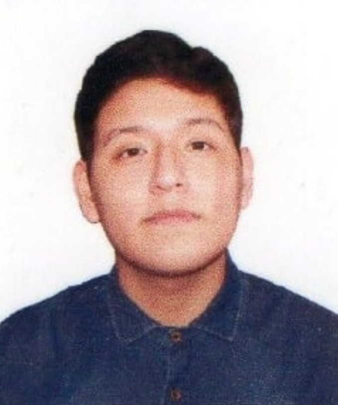

# Capitulo I: Introducción

## 1.1. Startup Profile  

### 1.1.1. Descripción de la Startup  

**Mythicore** es una plataforma digital para atención neurológica que integra dispositivos IoT y analítica de IA.  
Su propósito es mejorar el diagnóstico temprano, monitorear en tiempo real a pacientes con enfermedades crónicas y facilitar la telemedicina mediante datos objetivos, reduciendo hospitalizaciones y optimizando la calidad de vida.

- **Misión**  
Brindar atención neurológica personalizada mediante IoT e inteligencia artificial, mejorando el diagnóstico, el seguimiento y la prevención de crisis en pacientes.  

- **Visión**  
Convertirse en la plataforma líder en salud neurológica digital, integrando monitoreo continuo y telemedicina segura a nivel global.

### 1.1.2. Perfiles de integrantes del equipo  

| Foto | Nombre y Código | Rol | Descripción |
|------|-----------------|-----|-------------|
|  | **Stanley Jeremy Gutierrez Tume (U202118152)** | **Team Leader** | Estudiante de Ingeniería de Software, asume el rol de *Team Leader*. Su enfoque colaborativo le permite asignar tareas de manera eficiente, mientras que sus habilidades técnicas en HTML y CSS respaldan la capacidad para materializar ideas. Busca constantemente oportunidades de crecimiento y aprendizaje, y está comprometido con impulsar la innovación y el éxito en entornos de desarrollo de software. |
|  | **Juan José Meza Huanacune (U202320574)** | **Backend Engineer** | Estudiante de Ingeniería de Software, asume el rol de *Backend Engineer*. Tiene experiencia en arquitecturas backend con C#, Java y Python, además del manejo de bases de datos relacionales. Su capacidad de organización, liderazgo y aplicación de metodologías ágiles le permite coordinar tareas y asegurar el cumplimiento de objetivos del equipo. |
|  | **Eduardo Fabián Chacaliaza Minaya (U202324129)** | **Frontend & UX/UI Engineer** | Estudiante de Ingeniería de Software, desempeña el rol de *Frontend & UX/UI Engineer*. Domina HTML5, CSS3 y JavaScript, junto con frameworks modernos como Vue.js y React. Se especializa en diseño de interfaces accesibles y centradas en el usuario, aportando creatividad y una visión enfocada en la experiencia de usuario para lograr aplicaciones intuitivas y atractivas. |
|  | **Fabricio Fabián Quispe Barzola (U202320442)** | **Data & IoT Integration Engineer** | Estudiante de Ingeniería de Software, cumple el rol de *Data & IoT Integration Engineer*. Cuenta con conocimientos en machine learning, procesamiento de datos y analítica con Python y R, además de experiencia en la integración de dispositivos IoT. Su aporte principal es implementar soluciones inteligentes que conecten sensores y servicios en la nube, garantizando un flujo de datos seguro y en tiempo real. |
|  | **Romero Meza Jhimy Pool (U202321510)** | **Frontend & UX/UI Engineer** | Estudiante de Ingeniería de Software, cumple el rol de UX/UI Designer & Frontend Engineer. Cuenta con conocimientos en diseño de interfaces, experiencia de usuario y desarrollo frontend con tecnologías modernas. Su aporte principal es la conceptualización y creación de wireframes, mockups y prototipos interactivos, asegurando que la experiencia del usuario sea clara, intuitiva y alineada con los objetivos del proyecto. Además, garantiza la coherencia visual del sistema y facilita la transición entre la fase de diseño y desarrollo.  |

---

## 1.2. Solution Profile 

### 1.2.1. Antecedentes y problemática  

### 1.2.2. Lean UX Process 

#### 1.2.2.1. Lean UX Problem Statements  

#### 1.2.2.2. Lean UX Assumptions  

#### 1.2.2.3. Lean UX Hypothesis Statements  

#### 1.2.2.4. Lean UX Canvas  

## 1.3. Segmentos objetivo