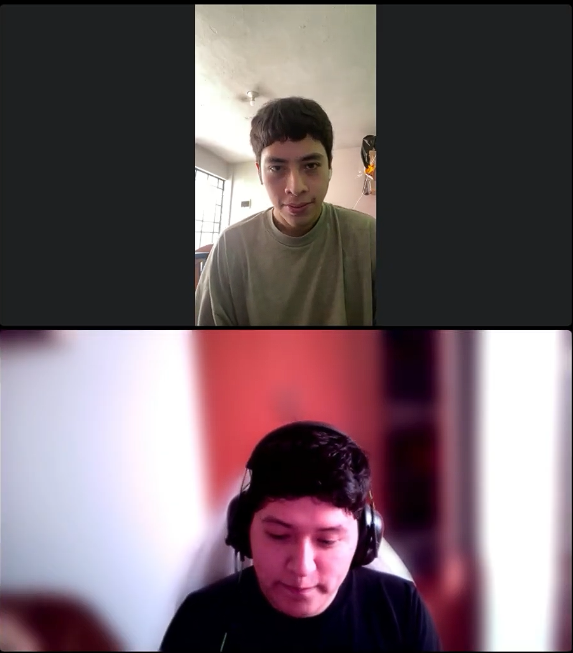
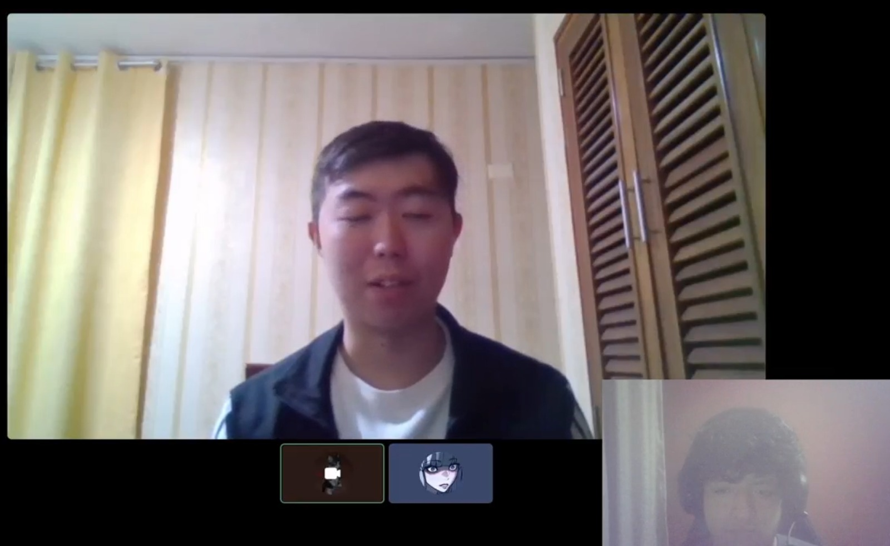
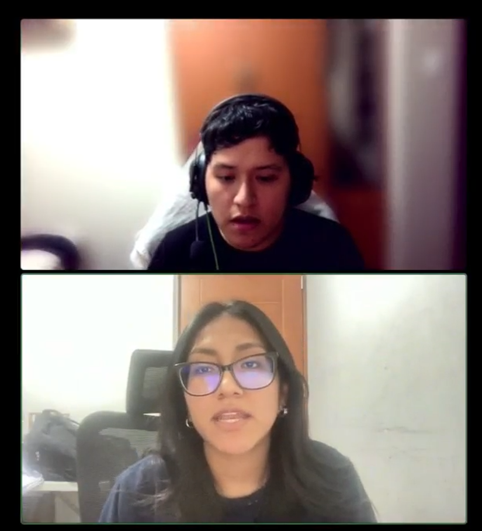
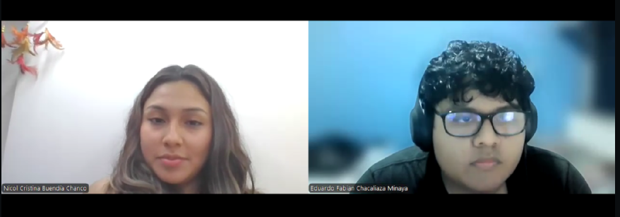
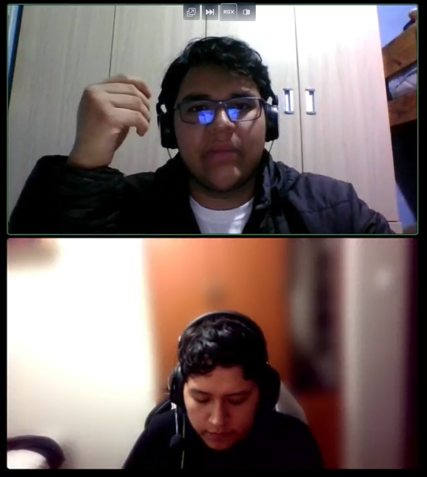
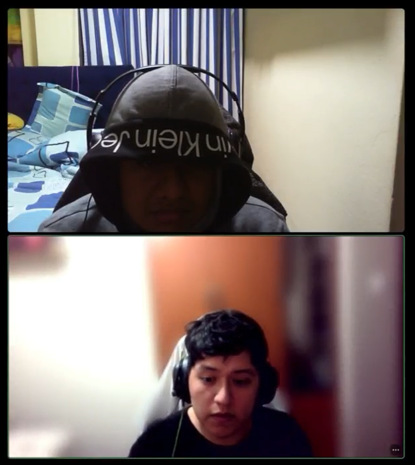
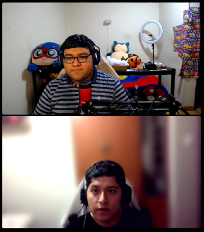

# Capítulo II: Requirements Elicitation & Analysis

## 2.1. Competidores.

### 2.1.1. Análisis competitivo.  

En esta sección se presentan algunos competidores relevantes en el ámbito del monitoreo neurológico y la telemedicina, así como un análisis de las características que nuestra plataforma IoT busca superar.  

<table>
  <tr>
    <th colspan="22">Competitive Analysis Landscape</th>
  </tr>
  <tr>
    <td colspan="1">¿Por qué llevar a cabo el análisis?</td>
    <td colspan="17">El análisis competitivo es esencial para entender el mercado, identificar oportunidades que nos diferencien y anticipar amenazas. Permite ajustar la estrategia para ganar ventaja sobre la competencia y asegurar el éxito del producto.</td>
  </tr>
  <tr>
    <td colspan="2"></td>
    <td>startup </td>
    <td>Ceribell </td>
    <td>Empatica (Embrace/EmbracePlus) </td>
    <td>NeuroPace (RNS) </td>
</tr>
  <tr>
    <td rowspan="2">Perfil</td>
    <td>Overview</td>
    <td>Plataforma web + IoT + IA para monitoreo neurológico continuo, gestión de pacientes, agenda y teleconsultas; alertas con geolocalización (con consentimiento).</td>
    <td>EEG portátil orientado a diagnóstico rápido en entornos hospitalarios (UCI / emergencias).</td>
    <td>Wearable biomédico (pulseras) para monitorización continua; orientado a investigación y monitoreo ambulatorio de epilepsia.</td>
    <td>Sistema implantable de neuromodulación con detección y respuesta adaptativa para epilepsia refractaria.</td>
</tr>
  <tr>
  <td>Ventaja competitiva ¿Qué valor ofrece a los clientes?</td>
    <td>Gestión clínica completa (registro, agenda, teleconsulta), monitoreo 24/7, alertas y ubicación para respuesta rápida; análisis longitudinal con IA.</td>
    <td>Diagnóstico rápido en situaciones agudas; reducción de tiempo a diagnóstico en emergencias.</td>
    <td>Recolección continua y validada de biométricos para investigación y monitoreo domiciliario.</td>
    <td>Terapia activa: detecta actividad anómala y entrega estimulación; solución terapéutica implantable.</td>
    </tr>
<tr>
    <td rowspan="2">Perfil de Marketing</td>
    <td>Mercado Objetivo</td>
    <td>Pacientes crónicos, neurólogos, clínicas, aseguradoras, cuidadores.</td>
    <td>Hospitales, UCI, equipos de emergencias.</td>
    <td>Investigadores, centros clínicos y pacientes con epilepsia ambulatoria.</td>
    <td>Pacientes con epilepsia farmacorresistente candidatos a implante; neurocirujanos.</td>
  </tr>
  <tr>
  <td>Estrategias de Marketing</td>
    <td>Pilotos con clínicas/aseguradoras, marketing B2B a neurólogos, alianzas con asociaciones de pacientes, contenido científico (casos de uso/papers), campañas digitales dirigidas a cuidadores y profesionales, conferencias médicas.</td>
    <td>Marketing B2B directo a hospitales y UCIs; publicaciones clínicas y demostraciones en entornos de emergencias; ferias médicas hospitalarias.</td>
    <td>Alianzas con universidades e investigadores; marketing dirigido a pacientes y familias (comunidad epilepsia); publicaciones científicas y colaboraciones en estudios clínicos.</td>
    <td>Comunicación dirigida a especialistas (neurocirujanos, epileptólogos), publicaciones en revistas clínicas y presentaciones en congresos; relaciones con centros de referencia.</td>
    </tr>
<tr>
    <td rowspan="3">Perfil de Producto</td>
    <td>Productos y Servicios</td>
    <td>Plataforma web + app móvil: registro clínico, agenda, teleconsultas (WebRTC), ingestión de datos IoT, detección de eventos (IA), alertas (incl. ubicación con consentimiento), dashboard clínico, módulo de investigación/exportes.</td>
    <td>Dispositivo EEG portátil + software de análisis para diagnóstico rápido en hospital; entrenamiento clínico y soporte.</td>
    <td>Wearable (pulsera) + plataforma de datos para monitorización continua (actividad, ritmo cardiaco, eventos), APIs para investigación y dashboard.</td>
    <td>Sistema implantable (neurostimulación adaptativa RNS) + plataforma de seguimiento clínico para equipo médico.</td>
  </tr>
  <tr>
  <td>Precios y Costos</td>
    <td>Modelo mixto: suscripción institucional (clínicas/hospitals) y/o por paciente; paquetes piloto con descuento; posible tarifa añadida por integración y soporte. Costos: desarrollo backend, hosting seguro, integraciones, licencias de video, soporte IoT.</td>
    <td>Venta de hardware y licencias de software; costo alto por equipo hospitalario; mantenimiento y soporte.</td>
    <td>Venta del dispositivo + suscripción a la plataforma/datos; coste medio (dispositivo + servicio).</td>
    <td>Alto coste único por dispositivo + coste quirúrgico e implante; seguimiento y mantenimiento clínico.</td>
  </tr>
<td>Canales de distribución (Web y/o Móvil)</td>
    <td>Web + App móvil (iOS/Android); ventas directas B2B (equipos clínicos/aseguradoras); integraciones API con sistemas hospitalarios; portales para pacientes y profesionales.</td>
    <td>Principalmente reposicionamiento en hospitales (venta directa y distribuidores); software para estaciones clínicas (desktop).</td>
    <td>Web para gestión y móvil para pacientes; venta online para consumidores y a través de centros de investigación.</td>
    <td>Soporte hospitalario especializado — implante y seguimiento en centros referencia; plataforma web para seguimiento.</td>
<tr>
    <td rowspan="4">Análisis SWOT</td>
    <td>Fortalezas</td>
    <td>Solución integral que combina gestión clínica (agenda, teleconsulta), monitorización IoT, alertas y análisis IA; enfoque en coordinación y respuesta rápida (geolocalización con permiso).</td>
    <td>Rápida capacidad diagnóstica en entorno crítico; solución probada para emergencias hospitalarias.</td>
    <td>Sensores validados para investigación; aceptación entre académicos y pacientes; diseño cómodo para uso ambulatorio.</td>
    <td>Terapia demostrada para epilepsia resistente; eficacia clínica documentada; seguimiento especializado.</td>
  </tr>
  <tr>
  <td>Debilidades</td>
    <td>Necesidad de validación clínica y adopción por profesionales; dependencia de integración con hardware de terceros; riesgo de falsas alarmas de IA; requisitos regulatorios.</td>
    <td>Enfoque limitado al hospital (no para monitoreo domiciliario ni teleconsulta); alto coste de implementación.</td>
    <td>Menor foco en gestión clínica (agenda/teleconsulta); posible limitación en la integración de flujo clínico hospitalario.</td>
    <td>Muy invasivo y caro; limitada población objetivo; altos requisitos regulatorios y quirúrgicos.</td>
    </tr>
  <tr>
<td>Oportunidades</td>
    <td>Alianzas con fabricantes de wearables y hospitales; mercado de telemedicina en crecimiento; convenios con aseguradoras por reducción de costos; ampliar a manejo de Parkinson, caídas y rehabilitación.</td>
    <td>Extender uso en más UCIs y servicios de emergencias; integración con plataformas de triage hospitalario.</td>
    <td>Expandir integraciones con plataformas de telemedicina (ej. AuraNeuro), paquetes para programas de salud pública e investigación a gran escala.</td>
    <td>Ampliar indicaciones terapéuticas, integraciones con plataformas de manejo de epilepsia y ofrecer datos para investigación longitudinal.</td>
</tr>
  <tr>
<td>Amenazas</td>
    <td>Competidores con dispositivos validados que ofrezcan plataforma propia; regulación y barreras legales por geolocalización/datos; entrantes con fuerte financiación..</td>
    <td>Competencia de otros equipos portátiles y soluciones de monitorización avanzada; presión para certificaciones y soporte.</td>
    <td>Competencia de wearables generalistas (Apple, Fitbit) y necesidad de demostrar ventaja clínica; adopción limitada fuera de investigación.</td>
    <td>Nuevas terapias no invasivas o avances en fármacos; costes y barreras regulatorias; alternativas de neuromodulación menos invasivas.</td>
</tr>
</table>

---

### 2.1.2. Estrategias y tácticas frente a competidores

### 2.2. Entrevistas  
#### 2.2.1. Diseño de entrevistas  

Muy buenos días/tardes/noches, estamos contentos de que haya aceptado esta entrevista. Somos estudiantes de la carrera de Ingeniería de Software e Informática de la UPC. A nombre del grupo desarrollador de la Plataforma IoT para la Optimización de la Atención Neurológica, queremos conversar con usted sobre las dificultades y necesidades que enfrentan los pacientes con enfermedades neurológicas y los profesionales de la salud que los atienden.  

Nuestro objetivo es conocer su experiencia y su perspectiva, ya que buscamos validar y mejorar nuestro producto. Esta plataforma integra dispositivos IoT que recolectan datos neurológicos en tiempo real (EEG, EMG, actividad motora, calidad del sueño, etc.) con inteligencia artificial para generar reportes, alertas predictivas y facilitar el seguimiento remoto por parte de los médicos. Sus respuestas serán muy valiosas para construir una solución útil, accesible y empática.  

---

### Segmento #1: Pacientes con enfermedades neurológicas crónicas  

**Preguntas complementarias:**  
- ¿Cuál es tu nombre completo?  
- ¿Cuántos años tienes?  
- ¿Dónde resides actualmente?  
- ¿Vives solo o acompañado?  
- ¿Tienes algún diagnóstico neurológico específico?  
- ¿Has recibido tratamiento o seguimiento médico especializado anteriormente?  
- ¿Qué dispositivos tecnológicos usas con mayor frecuencia? 
- ¿Qué navegador web utilizas normalmente? 
- ¿Cuáles son los métodos que utilizas más para autenticarte o logearte en plataformas?  

**Preguntas principales:** *Obtener información sobre el impacto de la enfermedad, necesidades, expectativas y aceptación de nuevas tecnologías*  
- ¿Cómo ha impactado tu condición en tu vida diaria o en la de tus familiares?  
- ¿Qué dificultades enfrentas actualmente para llevar un control de tu enfermedad?  
- ¿Qué tan útil consideras que sería contar con un sistema que envíe alertas tempranas sobre crisis o anomalías?  
- ¿Qué información te gustaría poder consultar en una aplicación?  
- ¿Qué tan dispuesto estarías a usar dispositivos IoT para mejorar tu seguimiento médico?  
- ¿Cuáles serían tus principales preocupaciones respecto al uso de esta tecnología?  

### Segmento #2: Psicólogos clínicos / Neuropsicólogos  

**Preguntas complementarias:**  
- ¿Cuál es su nombre completo?  
- ¿Cuántos años tiene?  
- ¿Dónde ejerce actualmente su profesión? (clínica, hospital, consultorio privado, universidad, etc.)  
- ¿Cuántos años de experiencia tiene en el área de neurología / salud mental?  
- ¿Cuál es su especialidad o campo principal de trabajo? (neurología, neuropsicología, psicología clínica, terapia de rehabilitación, etc.)  
- ¿Con qué frecuencia atiende a pacientes con enfermedades neurológicas crónicas?  
- ¿Qué dispositivos tecnológicos utiliza con mayor frecuencia en su práctica profesional? (ejemplo: laptop, tablet, smartphone, dispositivos médicos digitales)  
- ¿Qué software o plataformas médicas emplea habitualmente? (ejemplo: historias clínicas electrónicas, Epic, Cerner, otros)  
- ¿Qué navegador web utiliza normalmente para su trabajo? (ejemplo: Chrome, Safari, Edge, Opera)  
- ¿Cuáles son los métodos que utiliza más para autenticarse en sistemas o plataformas profesionales? (ejemplo: correo institucional, Gmail, SMS, autenticación en dos pasos, otros)  

**Preguntas principales (Segmento 2 – Profesionales de la salud):**  
- ¿Cómo realiza actualmente el seguimiento de sus pacientes con epilepsia u otras condiciones neurológicas?  
- ¿Qué tan útil considera contar con una plataforma que integre registros de crisis, calidad de sueño y datos biométricos en tiempo real?  
- ¿Qué marcas o sistemas le generan más confianza para trabajar con este tipo de soluciones?  
- ¿Le sería útil acceder a los registros de sus pacientes desde una aplicación web conectada a la nube?  
- ¿Qué comunidades científicas sigue para mantenerse actualizado en este tema?  
- ¿Cómo cree que estas herramientas digitales impactarían en el sistema de salud en general?  
- ¿Cómo visualiza el futuro de la neurología con IoT y plataformas digitales integradas?  

### Segmento #3: Proveedores IoT

**Preguntas complementarias:**  
- ¿Cuál es el nombre de su empresa o marca?  
- ¿Cuál es su nombre completo y cargo dentro de la empresa?  
- ¿Cuántos años de experiencia tiene su empresa en el desarrollo de dispositivos IoT para el sector salud?  
- ¿Qué tipo de dispositivos IoT produce o distribuye actualmente? (ejemplo: bandas EEG, wearables, relojes inteligentes, sensores implantables, otros)  
- ¿En qué mercados o regiones tienen mayor presencia?  
- ¿Cuáles son los principales clientes a los que venden sus soluciones? (hospitales, clínicas, investigadores, aseguradoras, pacientes directamente)  
- ¿Qué dispositivos tecnológicos utilizan con mayor frecuencia en su operación diaria? (ejemplo: servidores, plataformas cloud, aplicaciones de monitoreo)  
- ¿Qué software o plataformas emplean para la gestión y seguridad de datos recolectados por sus dispositivos?  
- ¿Qué navegador web utilizan normalmente para el trabajo administrativo o de integración de plataformas?  
- ¿Cuáles son los métodos más utilizados para autenticar usuarios en sus dispositivos o plataformas? (ejemplo: correo institucional, Gmail, SMS, autenticación en dos pasos, biometría)  

**Preguntas principales:**  
- ¿Cómo desarrollan actualmente sus dispositivos IoT aplicados a la salud neurológica y cuáles son sus principales funcionalidades?  
- ¿Qué tan capacitado considera que está su equipo en la integración de dispositivos IoT con plataformas digitales de salud, como historias clínicas electrónicas o dashboards médicos?  
- ¿Qué marcas, certificaciones o estándares internacionales considera fundamentales para que los profesionales de la salud confíen en sus dispositivos? 
- ¿Le sería útil contar con alianzas estratégicas que permitan acceder a los datos de sus dispositivos desde aplicaciones web o plataformas en la nube utilizadas por médicos y hospitales?  
- ¿En qué comunidades profesionales o foros online participa su empresa para mantenerse actualizada sobre tendencias y regulaciones de IoT en el sector salud?  
- ¿Cómo cree que la adopción de dispositivos IoT impactará en hospitales, clínicas y aseguradoras que atienden a pacientes neurológicos?  
- ¿Cómo visualiza el futuro de los dispositivos IoT aplicados a la neurología en los próximos 5 a 10 años?  

---  

**Despedida:** 
Muchas gracias por tu tiempo hoy. Tu opinión y las ideas que compartiste nos ayudarán mucho a mejorar nuestro producto. Apreciamos tu sinceridad y disposición para participar. Si necesitas más información, no dudes en contactarnos. ¡Gracias!

#### 2.2.2. Registro de entrevistas  

## Segmento 1: Pacientes con enfermedades neurológicas crónicas  

### Entrevista N°1  

- **Nombre:** Cesar Aaron Cornejo  
- **Sexo:** Masculino  
- **Edad:** 21  
- **Estado Civil:** Soltero
- **Residencia:** Lima - San Juan de Lurigancho  
- **Link:** [Entrevista Aaron](https://upcedupe-my.sharepoint.com/:v:/g/personal/u202320574_upc_edu_pe/EZxZ3WlYjT1Cp7yqP_OKdSIBRR0IFKAnrzwQjBEJNXY9YQ?nav=eyJyZWZlcnJhbEluZm8iOnsicmVmZXJyYWxBcHAiOiJTdHJlYW1XZWJBcHAiLCJyZWZlcnJhbFZpZXciOiJTaGFyZURpYWxvZy1MaW5rIiwicmVmZXJyYWxBcHBQbGF0Zm9ybSI6IldlYiIsInJlZmVycmFsTW9kZSI6InZpZXcifX0%3D&e=j1Yf0B)
- **Condición:** Paciente diagnosticado con epilepsia  

**Detalles de la entrevista:**  
Cesar Aaron Cornejo es un joven de 21 años que reside en Lima. Durante la conversación compartió que una de las principales dificultades que enfrenta es la imprevisibilidad de sus crisis, las cuales generan ansiedad y preocupación, tanto en él como en su familia.  

Actualmente lleva un registro manual de sus episodios en un cuaderno, aunque reconoce que este método no siempre es preciso, ya que puede olvidar anotar detalles importantes. Señala que esta limitación dificulta que su neuróloga tenga información completa para ajustar su tratamiento.  

Aaron considera que recibir alertas tempranas sobre posibles crisis en tiempo real sería muy útil, pues le permitiría tomar precauciones inmediatas y dar mayor tranquilidad a su familia. Le interesaría consultar en una aplicación móvil datos como la frecuencia y duración de las crisis, la calidad de su sueño y los factores desencadenantes, presentados en gráficos y estadísticas fáciles de entender.  

En cuanto a tecnologías de monitoreo, se muestra abierto al uso de **wearables** como relojes inteligentes de marcas confiables (Garmin, Fitbit), y señala que aceptaría sensores implantables siempre que fueran seguros y validados médicamente. Para él, la posibilidad de que su neuróloga pueda acceder a sus datos a través de una aplicación web conectada a su historia clínica representaría un gran avance, reduciendo la necesidad de visitas presenciales.  

Finalmente, menciona que ha participado en comunidades online como foros de la **Epilepsy Foundation** o grupos de Facebook sobre epilepsia, los cuales le han ayudado a sentirse acompañado. Afirma que el uso de estas herramientas digitales le daría mayor independencia y mejoraría la calidad de vida tanto para él como para su familia.  

- **Inicio de la entrevista:** 0:10
- **Fin de la entrevista:** 4:21 

---

### Resumen de los puntos clave en la entrevista  

- El entrevistado se llama **Cesar Aaron Cornejo**, tiene 21 años, vive en Lima y está diagnosticado con epilepsia.  
- Su principal dificultad es la **imprevisibilidad de las crisis**, lo que genera ansiedad en él y preocupación en su familia.  
- Actualmente lleva un **registro manual** de sus episodios, pero reconoce que es incompleto y poco confiable.  
- Considera muy útil contar con **alertas tempranas** que detecten anomalías en tiempo real, para actuar con mayor seguridad.  
- Le gustaría consultar en una app móvil registros de crisis, calidad del sueño y factores desencadenantes, con **gráficos y estadísticas claras**.  
- Tiene **confianza en wearables** como Garmin y Fitbit, y aceptaría sensores implantables si son seguros y certificados.  
- Valora que su neuróloga pueda **acceder a sus datos desde una plataforma web** conectada a la historia clínica.  
- Ha participado en **comunidades online** de pacientes, lo que le ha dado apoyo emocional.  
- Cree que estas herramientas digitales le darían **independencia, seguridad y tranquilidad familiar**.  

---

### Registro visual de la entrevista  
  

---

#### Entrevista N°2  

- **Nombre:** Xin Yu Shi Lin  
- **Sexo:** Masculino  
- **Edad:** 25  
- **Estado Civil:** Soltero
- **Residencia:** Lima - Perú
- **Link:** [Entrevista Xin](https://upcedupe-my.sharepoint.com/:v:/g/personal/u202320442_upc_edu_pe/EVgqZffZGQtFmtniG8D9sCMBK5K39T_bMbQSLhM_WlAlsg?nav=eyJyZWZlcnJhbEluZm8iOnsicmVmZXJyYWxBcHAiOiJTdHJlYW1XZWJBcHAiLCJyZWZlcnJhbFZpZXciOiJTaGFyZURpYWxvZy1MaW5rIiwicmVmZXJyYWxBcHBQbGF0Zm9ybSI6IldlYiIsInJlZmVycmFsTW9kZSI6InZpZXcifX0%3D&e=h8BhtU)
- **Condición:** Paciente diagnosticado con epilepsia  

**Detalles de la entrevista:**  
Xin Yu Shi Lin es un joven de 25 años que reside en Lima y trabaja como mesero en un chifa. Durante la entrevista compartió que una de sus principales preocupaciones es la posibilidad de sufrir una crisis en el trabajo y no poder avisar a tiempo a alguien. Para su familia también es un reto, ya que viven con la preocupación constante de que pueda pasarle algo de forma repentina.  

Actualmente lleva un control limitado de su condición, anotando a veces en papeles o recordando los episodios de memoria, lo que reconoce como un método poco confiable. Señala que le cuesta recordar detalles importantes como la hora, la duración o los síntomas de cada crisis, lo que genera un seguimiento incompleto y dificulta la labor de sus médicos.  

Considera que un sistema de alertas tempranas sería muy útil, ya que le permitiría tomar precauciones antes de que la crisis empeore y daría tranquilidad tanto a él como a su familia y compañeros de trabajo. También le gustaría contar con una aplicación móvil que registre de forma clara y confiable la frecuencia y duración de sus crisis, factores desencadenantes y recordatorios de medicación, presentados en gráficos y estadísticas fáciles de consultar.  

En cuanto al uso de dispositivos IoT, señala que estaría dispuesto a emplear relojes inteligentes o sensores que registren datos y los compartan directamente con su médico. Menciona que conoce dispositivos como los **Fitbit Ionic**, que pueden monitorear la salud, y cree que serían útiles para su caso. No obstante, expresa preocupaciones respecto a la seguridad de sus datos y la posibilidad de fallas en momentos críticos, por lo que para él la **confianza en la tecnología** es fundamental.  

Además, Xin comenta que participa en comunidades de apoyo, como grupos de Facebook y la **Asociación Peruana de Epilepsia**, lo cual le ha permitido compartir experiencias y recibir consejos útiles de otros pacientes. En cuanto a habilidades digitales, se describe con un nivel básico en smartphones y medio en el uso de laptops, destacando que está muy familiarizado con aplicaciones de mensajería como WhatsApp y SMS.  

- **Inicio de la entrevista:** 0:05
- **Fin de la entrevista:** 4:22 

---

### Resumen de los puntos clave en la entrevista  

- El entrevistado se llama Xin Yu Shi Lin, tiene 25 años, vive en Lima y está diagnosticado con epilepsia.  
- Su mayor preocupación es sufrir una crisis en el trabajo y no poder avisar a tiempo.  
- Actualmente lleva un control incompleto, anotando de manera poco confiable o recordando de memoria.  
- Considera muy útil contar con alertas tempranas que anticipen crisis y den seguridad a su familia.  
- Le gustaría usar una app móvil con registros claros, gráficos de evolución y recordatorios de medicación.  
- Está dispuesto a usar dispositivos IoT como relojes inteligentes (ej. Fitbit Ionic), siempre que sean seguros.  
- Sus principales preocupaciones son fallas técnicas y la protección de datos personales.  
- Participa en comunidades de apoyo como la Asociación Peruana de Epilepsia, lo que le ha dado orientación y acompañamiento.  
- Sus habilidades digitales son básicas en smartphones y medias en laptops, con uso frecuente de WhatsApp, Gmail y SMS.  

---

### Registro visual de la entrevista  

  

---

**Segmento #2: Profesionales de la salud en neurología**  

### Entrevista N°1

- **Nombre:** Karen Guadalupe Villanueva Castillo  
- **Sexo:** Femenino  
- **Edad:** 27  
- **Estado Civil:** Soltera  
- **Profesión:** Neuróloga especialista  
- **Link:** [Entrevista Karen](https://upcedupe-my.sharepoint.com/:v:/g/personal/u202320574_upc_edu_pe/EQiEyBrJx-JGoHK_l4x45sYBAWGLVSJzu40JYMV2arNWBA?nav=eyJyZWZlcnJhbEluZm8iOnsicmVmZXJyYWxBcHAiOiJTdHJlYW1XZWJBcHAiLCJyZWZlcnJhbFZpZXciOiJTaGFyZURpYWxvZy1MaW5rIiwicmVmZXJyYWxBcHBQbGF0Zm9ybSI6IldlYiIsInJlZmVycmFsTW9kZSI6InZpZXcifX0%3D&e=dL6y9t)

---

#### Detalles de la entrevista:
Karen Guadalupe Villanueva Castillo es una neuróloga de 27 años que actualmente reside en Lima. Durante la entrevista explicó que el seguimiento de sus pacientes con epilepsia u otras condiciones neurológicas depende, en gran medida, de los registros que ellos mismos llevan en cuadernos o de la información que recuerdan en sus consultas. Aunque utiliza historias clínicas electrónicas, reconoce que la información no siempre es continua ni detallada, lo cual limita la precisión de los diagnósticos y la toma de decisiones clínicas.  

La doctora considera que una plataforma que integre registros de crisis, calidad de sueño y datos biométricos en tiempo real sería de gran valor, pues le permitiría contar con información objetiva y confiable. En cuanto a marcas y sistemas, confía en plataformas estandarizadas como **Epic** y **Cerner** para la gestión clínica, y en dispositivos de monitoreo como los desarrollados por **Medtronic** y **Empatica**, que cuentan con certificaciones médicas.  

Señaló que poder acceder a los datos de sus pacientes desde una aplicación web conectada a la nube sería muy útil, ya que le permitiría revisar información actualizada sin necesidad de visitas presenciales tan frecuentes. Además, destacó que es miembro de comunidades científicas como la **International League Against Epilepsy (ILAE)** y participa en congresos de la **American Academy of Neurology (AAN)**, donde se difunden los avances más recientes en neurotecnología.  

Respecto al impacto de estas herramientas digitales en el sistema de salud, considera que permitirían reducir costos, prevenir hospitalizaciones innecesarias y optimizar recursos en casos críticos. Finalmente, proyecta que el futuro de la neurología con IoT y plataformas digitales será **más preventivo y personalizado**, con monitoreo 24/7 que permita ajustar tratamientos en tiempo real.  

- **Inicio de la entrevista:** 0:04
- **Fin de la entrevista:** 6:58

---

#### Resumen de los puntos clave en la entrevista
- La entrevistada es **Karen Guadalupe Villanueva Castillo**, neuróloga especialista de 27 años.  
- Señala que actualmente depende de registros manuales de los pacientes, lo que dificulta diagnósticos precisos.  
- Considera muy valiosa una plataforma que integre **datos de crisis, sueño y biometría en tiempo real**.  
- Confía en software clínico como **Epic** y **Cerner**, y en dispositivos de monitoreo de **Medtronic** y **Empatica**.  
- Valora el acceso remoto a datos de pacientes mediante aplicaciones web en la nube.  
- Forma parte de comunidades científicas como la **ILAE** y la **AAN**.  
- Opina que estas herramientas reducirán costos hospitalarios, mejorarán la prevención y harán más eficiente al sistema de salud.  
- Visualiza la neurología del futuro como **preventiva, personalizada y soportada por IoT**.  

---

#### Registro visual de la entrevista

---

### Entrevista N°2

- **Nombre:** Nicol Buendía  
- **Sexo:** Femenino  
- **Edad:** 26  
- **Estado Civil:** No especificado  
- **Profesión:** Terapeuta en rehabilitación neurológica
- **Residencia:** Lima - Perú     
- **Link:** [Entrevista Nicol](https://upcedupe-my.sharepoint.com/:v:/g/personal/u202320574_upc_edu_pe/ERy66J4mXqlEjW4IcsmtsVwBdu-vmnMGzi9ZldbU61cQnQ?nav=eyJyZWZlcnJhbEluZm8iOnsicmVmZXJyYWxBcHAiOiJTdHJlYW1XZWJBcHAiLCJyZWZlcnJhbFZpZXciOiJTaGFyZURpYWxvZy1MaW5rIiwicmVmZXJyYWxBcHBQbGF0Zm9ybSI6IldlYiIsInJlZmVycmFsTW9kZSI6InZpZXcifX0%3D&e=YYQLlB)  

---

#### Detalles de la entrevista:
Nicol Buendía es una terapeuta de rehabilitación neurológica de 26 años que actualmente trabaja en una clínica especializada y en un centro comunitario. Durante la entrevista comentó que el seguimiento de pacientes depende principalmente de observaciones presenciales y reportes familiares, lo que limita la continuidad y precisión del tratamiento.

Explicó que, aunque utiliza historias clínicas electrónicas y algunas plataformas de telemedicina, estas no se integran con dispositivos IoT. Señaló que contar con una plataforma que registre datos de actividad motora, frecuencia de crisis y calidad del sueño en tiempo real sería de gran valor para personalizar sus terapias y mejorar los resultados.

Nicol confía en soluciones de rehabilitación como **Rehametrics** y **MindMotion**, así como en dispositivos de monitoreo neurológico de **Empatica** y **NeuroPace**. Además, considera clave disponer de un dashboard en la nube para acceder a datos en tiempo real y coordinar con neurólogos y familiares.

Mencionó que forma parte de comunidades científicas como la **World Federation for NeuroRehabilitation (WFNR)** y la **Sociedad Española de Neurorrehabilitación**, además de capacitarse en cursos y webinars sobre nuevas tecnologías aplicadas a la terapia. Finalmente, destacó que las herramientas digitales permitirían reducir tiempos de hospitalización, mejorar la rehabilitación en casa y avanzar hacia terapias más personalizadas y accesibles.

- **Inicio de la entrevista:** 0:33
- **Fin de la entrevista:** 7:50 

---

#### Resumen de los puntos clave en la entrevista
- La entrevistada es **Nicol Buendía**, terapeuta en rehabilitación neurológica de 26 años.  
- Señala que el seguimiento actual depende de observaciones presenciales y reportes familiares.  
- Considera muy útil una plataforma que integre **actividad motora, crisis y sueño en tiempo real**.  
- Confía en plataformas como **Rehametrics** y **MindMotion**, y en dispositivos de **Empatica** y **NeuroPace**.  
- Destaca la importancia de un **dashboard en la nube** para colaboración con neurólogos y familiares.  
- Forma parte de comunidades como la **WFNR** y la **Sociedad Española de Neurorrehabilitación**.  
- Opina que estas herramientas reducirían hospitalizaciones y facilitarían terapias en casa.  
- Visualiza la rehabilitación del futuro como **personalizada, digital e integrada con IoT**.  

---

#### Registro visual de la entrevista

---

**Segmento #3: Terapeutas**   

### Entrevista N°1

- **Nombre:** Carlos Paredes  
- **Sexo:** Masculino  
- **Edad:** 32  
- **Estado Civil:** Soltero  
- **Profesión:** Ingeniero electrónico – Proveedor de soluciones IoT
- **Residencia:** Lima - Perú     
- **Link:** [Entrevista Carlos](https://upcedupe-my.sharepoint.com/:v:/g/personal/u202320574_upc_edu_pe/EabaC7sEU_9GrDDU69Xv9owBK49d_g1TTHwcW7RoBKtmZg?nav=eyJyZWZlcnJhbEluZm8iOnsicmVmZXJyYWxBcHAiOiJTdHJlYW1XZWJBcHAiLCJyZWZlcnJhbFZpZXciOiJTaGFyZURpYWxvZy1MaW5rIiwicmVmZXJyYWxBcHBQbGF0Zm9ybSI6IldlYiIsInJlZmVycmFsTW9kZSI6InZpZXcifX0%3D&e=CKbOGC)  

---

#### Detalles de la entrevista:
Carlos Paredes es un ingeniero electrónico de 32 años que trabaja como proveedor de soluciones IoT aplicadas a la salud. Durante la entrevista explicó que actualmente desarrolla proyectos de integración de **sensores biométricos**, pulseras de monitoreo y dispositivos EEG portátiles que generan datos en tiempo real. Estos dispositivos son utilizados por hospitales y clínicas para hacer seguimiento remoto de pacientes con enfermedades crónicas.  

Comentó que uno de los principales retos es la **interoperabilidad**: muchas veces los dispositivos generan información en distintos formatos, lo que dificulta integrarlos en plataformas médicas centralizadas. También subrayó que la **seguridad de los datos** es fundamental, ya que los clientes demandan protocolos robustos de encriptación y cumplimiento de normas como **HIPAA** o equivalentes locales.  

Carlos confía en marcas como **Empatica**, **Medtronic** y **NeuroSky**, ya que han demostrado respaldo clínico y certificaciones internacionales. Señaló que una colaboración con startups como **Mithycore** puede acelerar la innovación porque estas empresas suelen ser más ágiles para probar pilotos y personalizar soluciones.  

En cuanto a habilidades, dijo sentirse altamente competente en **protocolos IoT (MQTT, BLE, Wi-Fi seguro)**, en el uso de plataformas de nube como **AWS IoT Core** y en el manejo de dashboards analíticos con **Grafana** y **Power BI**. Reconoce que una de sus principales **frustraciones** es que muchas instituciones médicas aún son reacias a adoptar estas tecnologías por falta de presupuesto o desconocimiento.  

Su **objetivo principal** es lograr que las soluciones IoT se integren de forma fluida con historias clínicas electrónicas y plataformas de telemedicina, para que los médicos tengan información confiable y continua sin sobrecargar al paciente.  

- **Inicio de la entrevista:** 0:09
- **Fin de la entrevista:** 13:09 

---

#### Resumen de los puntos clave en la entrevista
- El entrevistado es **Carlos Paredes**, ingeniero electrónico de 32 años, proveedor de soluciones IoT.  
- Explica que desarrolla proyectos con **sensores biométricos, wearables y EEG portátiles**.  
- Señala como reto principal la **interoperabilidad** de datos y la **seguridad** bajo normas como HIPAA.  
- Confía en dispositivos de **Empatica, Medtronic y NeuroSky**.  
- Domina **protocolos IoT (MQTT, BLE, Wi-Fi seguro)** y plataformas como **AWS IoT, Grafana y Power BI**.  
- Considera que una alianza con startups como **Mithycore** puede agilizar pilotos y soluciones personalizadas.  
- Menciona como **frustración** la resistencia institucional por falta de presupuesto o desconocimiento.  
- Su **objetivo** es integrar IoT con historias clínicas electrónicas y telemedicina para dar soporte en tiempo real a médicos y pacientes.  

---

#### Registro visual de la entrevista

---

### Entrevista N°2

- **Nombre:** Eduardo Gabriel Díaz Veliz  
- **Sexo:** Masculino  
- **Edad:** 27  
- **Estado Civil:** Soltero  
- **Profesión:** Ingeniero de telecomunicaciones – Desarrollador de soluciones IoT para salud
- **Residencia:** Lima - San Borja    
- **Link:** [Entrevista Eduardo](https://upcedupe-my.sharepoint.com/:v:/g/personal/u202320574_upc_edu_pe/EYkNwKwupDNBubgFbxYToRcBjpdK5VuueGVGPPJ4TGq2NA?nav=eyJyZWZlcnJhbEluZm8iOnsicmVmZXJyYWxBcHAiOiJTdHJlYW1XZWJBcHAiLCJyZWZlcnJhbFZpZXciOiJTaGFyZURpYWxvZy1MaW5rIiwicmVmZXJyYWxBcHBQbGF0Zm9ybSI6IldlYiIsInJlZmVycmFsTW9kZSI6InZpZXcifX0%3D&e=eZbHLJ)  

---

#### Detalles de la entrevista:
Eduardo Gabriel Díaz Veliz es un ingeniero de telecomunicaciones de 27 años, especializado en el desarrollo de **infraestructura IoT aplicada a la salud neurológica**. Actualmente trabaja como consultor independiente colaborando con startups y hospitales que buscan implementar dispositivos de monitoreo continuo.  

Durante la entrevista mencionó que ha participado en proyectos con **pulseras biométricas** y **dispositivos EEG portátiles**, destacando la importancia de que los datos puedan transmitirse en tiempo real a plataformas seguras en la nube. Sin embargo, identificó como reto principal la **conectividad inestable en hospitales de provincia** y la **falta de estandarización** entre dispositivos.  

Eduardo confía en dispositivos como los de **Empatica** y los desarrollos de **NeuroSky**, y también ha seguido de cerca los avances de **Fitbit Health Solutions** en el campo clínico. Señaló que la seguridad de los datos y la **confidencialidad bajo protocolos de encriptación** son requisitos indispensables para que los médicos confíen en la tecnología.  

En cuanto a **skills**, Eduardo domina el diseño de redes IoT con **LoRaWAN, 4G/5G y Wi-Fi industrial**, además de tener experiencia en **cloud computing con Azure IoT Hub y AWS**. Maneja herramientas de análisis de datos con **Python** y **Grafana**. Su **frustración principal** es que muchos proyectos pilotos no escalan porque las instituciones de salud no cuentan con presupuestos sostenibles o personal técnico capacitado.  

Su **objetivo** es lograr que las soluciones IoT puedan ser implementadas en hospitales públicos de bajo presupuesto, garantizando accesibilidad y escalabilidad sin perder calidad en la información recolectada.  

- **Inicio de la entrevista:** 0:10
- **Fin de la entrevista:** 4:47   

---

#### Resumen de los puntos clave en la entrevista
- El entrevistado es **Eduardo Gabriel Díaz Veliz**, ingeniero de telecomunicaciones de 27 años.  
- Se especializa en **infraestructura IoT aplicada a la salud neurológica**.  
- Ha trabajado con **pulseras biométricas y EEG portátiles**.  
- Identifica como retos la **conectividad deficiente en provincias** y la **falta de estandarización** de dispositivos.  
- Confía en **Empatica, NeuroSky** y **Fitbit Health Solutions**.  
- Domina **LoRaWAN, 4G/5G, Wi-Fi industrial, Azure IoT, AWS, Python y Grafana**.  
- Su **frustración** es la falta de presupuesto y personal capacitado para escalar pilotos en hospitales.  
- Su **objetivo** es implementar soluciones IoT accesibles en hospitales públicos sin comprometer la seguridad y calidad de los datos.  

---

#### Registro visual de la entrevista

---

### Entrevista N°3

- **Nombre:** Jesús Antonio Manrique Meza  
- **Sexo:** Masculino  
- **Edad:** 30  
- **Estado Civil:** Soltero  
- **Profesión:** Ingeniero electrónico – Especialista en desarrollo de hardware IoT para salud
- **Residencia:** Lima - San Borja   
- **Link:** [Entrevista Jesús](https://upcedupe-my.sharepoint.com/:v:/g/personal/u202320574_upc_edu_pe/Ed8tDkB2EAZDvApUbhk1InsB0V6tVOvnhvWsGZ-6EWsAQQ?nav=eyJyZWZlcnJhbEluZm8iOnsicmVmZXJyYWxBcHAiOiJTdHJlYW1XZWJBcHAiLCJyZWZlcnJhbFZpZXciOiJTaGFyZURpYWxvZy1MaW5rIiwicmVmZXJyYWxBcHBQbGF0Zm9ybSI6IldlYiIsInJlZmVycmFsTW9kZSI6InZpZXcifX0%3D&e=Kh4w0E)  

---

#### Detalles de la entrevista:
Jesús Antonio Manrique Meza es un ingeniero electrónico de 30 años que trabaja en el desarrollo de **hardware IoT médico especializado en monitoreo neurológico**. Actualmente colabora con empresas que diseñan sensores portátiles y dispositivos implantables orientados al diagnóstico temprano y a la telemedicina.  

Durante la entrevista, mencionó que su experiencia está centrada en el diseño de **placas electrónicas, integración de biosensores y protocolos de comunicación segura**. Señaló que el principal reto es lograr un **equilibrio entre precisión clínica y usabilidad del dispositivo**, ya que muchos productos no logran ser aceptados por los pacientes por su incomodidad o falta de fiabilidad en los datos.  

Jesús comentó que confía en dispositivos desarrollados por **Medtronic y NeuroPace**, además de seguir de cerca proyectos open-source que promueven la interoperabilidad de sensores médicos. Destacó que la **certificación regulatoria** es uno de los mayores obstáculos para que los prototipos lleguen al mercado, pues los procesos suelen ser largos y costosos.  

En cuanto a **skills**, domina el diseño de PCBs, programación en **C/C++ y Python**, además de manejar herramientas de **simulación electrónica (MATLAB, Proteus, Altium Designer)**. También tiene experiencia en **protocolos de comunicación BLE y Zigbee**. Sus **frustraciones** principales son que muchos proyectos quedan en fase de investigación y que existe poca inversión local para escalar innovaciones.  

Su objetivo es contribuir al desarrollo de dispositivos IoT accesibles y validados clínicamente, que puedan integrarse a plataformas como **Mithycore** para apoyar el seguimiento de pacientes neurológicos en tiempo real y reducir las hospitalizaciones.  

- **Inicio de la entrevista:** 0:04
- **Fin de la entrevista:** 6:36 

---

#### Resumen de los puntos clave en la entrevista
- El entrevistado es **Jesús Antonio Manrique Meza**, ingeniero electrónico de 30 años.  
- Trabaja en el **desarrollo de hardware IoT para monitoreo neurológico**.  
- Experiencia en **placas electrónicas, biosensores e integración de protocolos seguros**.  
- Señala como reto principal el **balance entre precisión clínica y usabilidad**.  
- Confía en Medtronic y NeuroPace, además de proyectos open-source.  
- Destaca la dificultad de la certificación regulatoria como barrera de entrada.  
- Domina C/C++, Python, MATLAB, Proteus, Altium Designer, BLE y Zigbee.  
- Sus **frustraciones**: proyectos que no escalan y falta de inversión local.  
- Su **objetivo**: desarrollar dispositivos IoT accesibles y clínicamente validados que se integren con **Mithycore**.  

---

#### Registro visual de la entrevista

### 2.2.3. Análisis de entrevistas

---

#### Segmento #1: Pacientes con enfermedades neurológicas crónicas

Las entrevistas con **César Aaron Cornejo (21 años)** y **Xin Yu Shi Lin (25 años)** muestran que la **imprevisibilidad de las crisis epilépticas** genera altos niveles de **ansiedad, inseguridad y dependencia familiar**. Ambos pacientes expresan frustración al no poder anticipar sus crisis, lo que afecta su rutina diaria y su bienestar emocional.

**Características objetivas:**
- **Edad y género:** Hombres jóvenes entre 21 y 25 años.  
- **Ocupación:** Estudiante y trabajador de restaurante.  
- **Educación:** Nivel técnico o universitario en curso.  
- **Dispositivos utilizados:** Smartphone Android y laptop personal.  
- **Tecnologías actuales:** Cuadernos de registro, cronómetros y wearables (Garmin, Fitbit).  
- **Canales digitales:** WhatsApp, Facebook, correo electrónico, navegador Chrome.  
- **Entorno de uso:** Principalmente el hogar y el trabajo, con apoyo familiar durante las crisis.  

**Características subjetivas:**
- **Personalidad:** Responsables, disciplinados, pero emocionalmente vulnerables ante la incertidumbre.  
- **Motivaciones:** Prevenir crisis, mantener independencia y reducir la preocupación de sus familias.  
- **Barreras:** Falta de precisión en los registros manuales y desconfianza en la privacidad de los datos.  
- **Actitud hacia la tecnología:** Abierta, pero exigen fiabilidad y validación médica.  
- **Emociones predominantes:** Ansiedad, frustración y alivio ante la posibilidad de automatizar el seguimiento.  

**Patrones conductuales comunes:**
- Olvidan registrar episodios por estrés o falta de tiempo.  
- Prefieren interfaces simples con recordatorios visuales.  
- Participan en comunidades online (grupos de epilepsia, Facebook).  
- Buscan aprobación médica antes de adoptar nuevas tecnologías.  

**Conclusión:**  
Este segmento evidencia la necesidad de herramientas **confiables, seguras y automatizadas** que permitan registrar, visualizar y compartir información médica.  
El sistema **Mithycore** puede mejorar su calidad de vida al ofrecer **alertas tempranas, registros digitales y comunicación directa con profesionales de salud**.

---

#### Segmento #2: Profesionales de la salud neurológica

Las entrevistas con **neurólogos y especialistas en salud mental** reflejan la necesidad de **eficiencia diagnóstica, datos objetivos y trazabilidad clínica**. La falta de información en tiempo real limita el seguimiento y retrasa las decisiones terapéuticas.

**Características objetivas:**
- **Edad:** Entre 30 y 45 años.  
- **Ocupación:** Neurólogos, psicólogos y tecnólogos médicos.  
- **Experiencia profesional:** Entre 5 y 15 años en diagnóstico clínico.  
- **Tecnologías utilizadas:** Historias clínicas electrónicas, Microsoft Teams, Google Drive, sistemas hospitalarios.  
- **Canales digitales:** Correo institucional, WhatsApp profesional, navegador Chrome.  
- **Entorno laboral:** Hospitales, clínicas y consultorios privados.  

**Características subjetivas:**
- **Personalidad:** Analíticos, metódicos y orientados a la evidencia.  
- **Motivaciones:** Mejorar la precisión diagnóstica y optimizar la comunicación con los pacientes.  
- **Barreras:** Falta de interoperabilidad entre sistemas y resistencia de algunos pacientes al uso de tecnología.  
- **Actitud hacia la tecnología:** Positiva pero exigente; buscan herramientas validadas y seguras.  
- **Emociones predominantes:** Frustración por datos incompletos y satisfacción al acceder a información confiable.  

**Patrones conductuales comunes:**
- Buscan integrar registros digitales automáticos al historial clínico.  
- Prefieren gráficos claros y tableros visuales para el análisis de datos.  
- Valoran la seguridad y trazabilidad de la información médica.  
- Requieren soluciones compatibles con normas médicas (HIPAA, HL7).  

**Conclusión:**  
Los profesionales de salud perciben **Mithycore** como una herramienta que puede **mejorar la precisión diagnóstica y el monitoreo remoto**.  
El sistema debe priorizar **la confiabilidad de los datos, la integridad de la información y la visualización clara de resultados clínicos**.

---

#### Segmento #3: Proveedores y desarrolladores de tecnología IoT

Las entrevistas con **proveedores de soluciones tecnológicas y desarrolladores IoT** resaltan el enfoque en la **seguridad, escalabilidad y sostenibilidad técnica**. Este grupo prioriza la estabilidad del sistema, la infraestructura y la compatibilidad de los dispositivos.

**Características objetivas:**
- **Edad:** Entre 27 y 38 años.  
- **Ocupación:** Ingenieros de software, desarrolladores IoT y diseñadores UX/UI.  
- **Experiencia:** De 3 a 10 años en proyectos de conectividad y tecnología médica.  
- **Tecnologías dominadas:** Node.js, Python, C#, Azure, AWS.  
- **Canales digitales:** GitHub, Slack, correo corporativo, Google Meet, navegador Chrome.  
- **Entorno laboral:** Trabajo remoto o híbrido, colaborativo y orientado a proyectos.  

**Características subjetivas:**
- **Personalidad:** Proactivos, innovadores y orientados a la resolución de problemas.  
- **Motivaciones:** Crear soluciones estables, seguras y escalables.  
- **Barreras:** Limitaciones presupuestarias, compatibilidad de hardware y requisitos normativos.  
- **Actitud hacia la tecnología:** Altamente positiva y enfocada en la mejora continua.  
- **Emociones predominantes:** Satisfacción al lograr resultados funcionales y preocupación por la seguridad de los datos.  

**Patrones conductuales comunes:**
- Prefieren frameworks abiertos y bien documentados (React, .NET, ASP.NET Core).  
- Requieren documentación clara de APIs y endpoints para integraciones.  
- Usan metodologías colaborativas (GitFlow, CI/CD).  
- Se centran en la estabilidad del sistema y la protección de datos.  

**Conclusión:**  
Los proveedores tecnológicos consideran que **Mithycore** tiene gran potencial para integrarse en entornos de salud digital, siempre que garantice **seguridad, estabilidad y cumplimiento normativo**.  
Recomiendan priorizar **una arquitectura escalable, cifrado de datos y conectividad fluida con dispositivos médicos**.

## 2.3. Needfinding.  

### 2.3.1. User Personas.  

En esta sección se presentan los **User Personas** desarrollados en **UXPressia** a partir de entrevistas semiestructuradas y hallazgos de campo de los tres segmentos objetivo de **Mithycore**.  
Cada persona resume motivaciones, frustraciones y comportamientos observados, funcionando como una herramienta de empatía para orientar las decisiones de diseño y priorización de funcionalidades de **AuraNeuro**.  

---

### User Persona – Segmento 1: Paciente neurológico (Epilepsia crónica)

**Descripción general:**  
Representa a los pacientes adultos jóvenes con epilepsia que buscan mantener una vida laboral y social estable a pesar de su condición. **Xin Yu Shi Lin**, de 25 años, trabaja en un restaurante (chifa) y sufre episodios epilépticos inesperados que generan preocupación por la seguridad y la continuidad en el trabajo.  
Carece de un registro estructurado de sus crisis y depende de la memoria o de notas escritas, lo que provoca falta de precisión en la información médica que entrega al neurólogo.  

**Principales objetivos:**  
- Mantener estabilidad laboral y evitar pérdida de ingresos.  
- Avisar rápidamente a familiares o compañeros en caso de emergencia.  
- Registrar de manera simple y confiable sus crisis y tratamientos.  

**Motivaciones:**  
- Desea llevar un control más organizado de su enfermedad y sentirse acompañado.  
- Busca apoyarse en la tecnología para prevenir riesgos y no depender únicamente de su memoria.  
- Quiere sentirse seguro tanto en casa como en el trabajo, sabiendo que alguien puede asistirlo ante una crisis.  

**Frustraciones:**  
- Dificultad para recordar detalles de las crisis (hora, duración, síntomas).  
- Miedo a sufrir un episodio en público sin poder pedir ayuda.  
- Limitada experiencia con aplicaciones de salud o herramientas digitales.  

**Análisis interpretativo:**  
Este perfil revela la **necesidad central de accesibilidad, simplicidad y acompañamiento**. La experiencia del usuario debe priorizar interfaces claras, recordatorios automáticos y alertas de emergencia en tiempo real.  
La información recopilada por este tipo de usuarios es fundamental para generar los datos clínicos que luego utilizarán los médicos.  
Por ello, este persona orienta el diseño de la **app móvil de paciente**: registro rápido de síntomas, historial accesible, notificaciones y comunicación directa con cuidadores.

---

### User Persona – Segmento 2: Profesional de la salud (Neuróloga especialista)

**Descripción general:**  
**Karen Guadalupe Villanueva Castillo**, neuróloga de 29 años, representa a los profesionales que buscan herramientas clínicas que integren la información del paciente de manera continua, visual y objetiva.  
Percibe que los sistemas actuales (HCE/EHR) no se conectan con los dispositivos IoT y que los registros son subjetivos o incompletos.  
Su trabajo diario en hospital público la enfrenta a limitaciones de tiempo y sobrecarga de pacientes, por lo que valora soluciones que optimicen el seguimiento remoto.  

**Principales objetivos:**  
- Acceder a datos clínicos continuos y en tiempo real.  
- Reducir controles presenciales innecesarios.  
- Tomar decisiones más rápidas y basadas en evidencia objetiva.  
- Evolucionar hacia una neurología preventiva y personalizada.  

**Motivaciones:**  
- Incrementar la confianza del paciente mediante evidencia objetiva.  
- Optimizar el tiempo clínico y los recursos hospitalarios.  
- Incorporar tecnología validada científicamente y alineada a estándares.  

**Frustraciones:**  
- Registros médicos subjetivos, incompletos o no actualizados.  
- Falta de integración entre plataformas clínicas y dispositivos IoT.  
- Dificultad para analizar grandes volúmenes de datos manualmente.  

**Análisis interpretativo:**  
Este perfil es clave para el diseño del **panel clínico de AuraNeuro**.  
La doctora Villanueva representa el usuario que necesita **información fiable, interoperable y visualmente clara**.  
Su contexto impulsa la integración con estándares **HL7–FHIR**, la generación automática de reportes exportables y el diseño de dashboards con métricas de evolución, adherencia y eventos críticos.  
También valida la necesidad de incluir filtros, visualizaciones gráficas y alertas inteligentes que reduzcan la carga de revisión manual.

---

### User Persona – Segmento 3: Proveedor de dispositivos IoT (Integrador tecnológico)

**Descripción general:**  
**Carlos Augusto Paredes Chávez**, de 29 años, es un integrador IoT especializado en soluciones biomédicas para neurología.  
Trabaja conectando wearables multiparámetro con plataformas cloud como **Azure IoT Hub** o **AWS IoT Core** y busca posicionarse en el mercado latinoamericano mediante interoperabilidad con estándares médicos.  
Percibe que la falta de integración fluida y las certificaciones regulatorias dificultan la expansión del sector IoT en salud.  

**Principales objetivos:**  
- Impulsar un monitoreo continuo y no invasivo en neurología.  
- Integrar biometría con plataformas cloud de manera segura.  
- Aportar datos objetivos y en tiempo real a los clínicos.  
- Potenciar un modelo de salud digital con servicios remotos.  

**Motivaciones:**  
- Innovar para lograr independencia y prevención en pacientes.  
- Lograr interoperabilidad con estándares como **HL7–FHIR**.  
- Posicionar su empresa en ecosistemas internacionales de salud IoT.  

**Frustraciones:**  
- Ecosistemas que no integran dispositivos IoT de forma fluida.  
- Certificaciones y regulaciones complejas para hardware médico.  
- Dependencia excesiva de apps móviles: si el dispositivo falla, se pierde valor.  

**Análisis interpretativo:**  
Este perfil representa al **socio tecnológico** de AuraNeuro.  
Su visión es crucial para definir los requerimientos del **API de integración**, la arquitectura del sistema y la estrategia B2B2C.  
Las frustraciones de Carlos reflejan la necesidad de ofrecer documentación técnica, entornos de prueba y soporte de estándares internacionales.  
Gracias a este arquetipo, el equipo puede diseñar una plataforma abierta, segura y escalable que fomente alianzas con proveedores de dispositivos biomédicos.

---

**Conclusión general:**  
Los tres **User Personas** evidencian una cadena de valor conectada: el **paciente genera datos**, el **médico los interpreta**, y el **proveedor IoT los posibilita** mediante tecnología segura e interoperable.  
Esta relación circular confirma que AuraNeuro debe diseñarse como un **ecosistema integral**, priorizando la experiencia, la precisión clínica y la sostenibilidad tecnológica.

### 2.3.2. User Task Matrix.

En esta sección se presenta la matriz de tareas de usuario (**User Task Matrix**) que reúne las principales acciones que los tres **User Personas** de **AuraNeuro** realizan para cumplir sus objetivos, independientemente del uso del software.  
Las tareas fueron identificadas a partir de entrevistas y observaciones de campo, clasificadas según su **frecuencia (Alta, Media, Baja)** y **importancia (Alta, Media, Baja)** para cada segmento.

---

| **Tareas principales** | **Paciente (Xin Yu Shi Lin)** |  | **Profesional de salud (Karen Villanueva)** |  | **Proveedor IoT (Carlos Paredes)** |  |
|--------------------------|-------------------------------|--|---------------------------------------------|--|------------------------------------|--|
|  | **Frecuencia** | **Importancia** | **Frecuencia** | **Importancia** | **Frecuencia** | **Importancia** |
| Registrar síntomas o crisis neurológicas | Alta | Alta | Media | Alta | Baja | Media |
| Revisar métricas o reportes de evolución | Media | Alta | Alta | Alta | Baja | Media |
| Cumplir tratamiento o recordatorios médicos | Alta | Alta | Media | Alta | — | — |
| Comunicarse con médico o cuidador | Alta | Alta | Alta | Alta | Baja | Media |
| Analizar datos clínicos o biométricos | — | — | Alta | Alta | Alta | Alta |
| Atender consultas o reuniones remotas | Media | Alta | Alta | Alta | Media | Media |
| Integrar o configurar dispositivos IoT | Baja | Media | Media | Alta | Alta | Alta |
| Validar interoperabilidad (FHIR/API) | — | — | Media | Alta | Alta | Alta |
| Probar prototipos o nuevas funciones | Media | Media | Media | Media | Alta | Alta |
| Compartir feedback sobre desempeño | Media | Alta | Media | Alta | Media | Alta |

---

**Interpretación de la matriz:**

Las tareas con **mayor coincidencia de frecuencia e importancia** entre los tres segmentos son:  
- **Comunicación médico–paciente:** clave para la continuidad del monitoreo.  
- **Revisión de reportes y métricas:** tarea compartida por pacientes y médicos, indispensable para decisiones clínicas.  

El **paciente** concentra su esfuerzo en tareas cotidianas (registro, adherencia, comunicación), que son **frecuentes y críticas** para su bienestar.  
El **profesional de salud** se enfoca en **análisis y toma de decisiones** con datos objetivos, priorizando interoperabilidad y confiabilidad.  
El **proveedor IoT** realiza tareas más técnicas y menos frecuentes, pero con **alta importancia estratégica** para la sostenibilidad del ecosistema (integración, validación y soporte de datos).

Estas relaciones confirman que AuraNeuro debe facilitar la **fluidez de información entre los tres actores**, priorizando tareas donde las necesidades convergen.

---

**Conclusión:**  
El **User Task Matrix** evidencia que las tareas más relevantes son aquellas que **conectan los flujos de datos** entre usuarios —desde la captura por el paciente, la interpretación por el médico y la validación técnica del proveedor—, lo cual guía directamente la definición de **requisitos funcionales prioritarios** en el *Product Backlog*.

### 2.3.3. User Journey Mapping.    

El presente apartado describe los **User Journey Maps** elaborados en **UXPressia**, uno por cada segmento objetivo de la startup **Mithycore**.  
Estos diagramas visualizan el recorrido actual que los usuarios realizan **antes de la existencia de AuraNeuro**, evidenciando sus metas, procesos, canales, puntos de fricción y oportunidades de mejora.  

---

### Metodología de elaboración  

Los *journeys* se desarrollaron a partir de:  
- **Entrevistas semiestructuradas** realizadas a tres perfiles representativos (paciente, profesional y proveedor).  
- **Observación contextual y benchmark** de soluciones digitales existentes (MySeizureDiary, Medtronic CareLink, NeuroSky, entre otras).  
- Análisis de los *User Personas* previamente definidos, para identificar **motivaciones, frustraciones y canales de interacción reales**.  

Cada mapa fue construido en la herramienta **UXPressia**, utilizando la versión **As-Is** (estado actual), lo que permite entender el **comportamiento previo a la adopción del producto**.

---

### User Journey Mapping – Segmento 1: Paciente (Epilepsia crónica)

**Síntesis del recorrido:**  
El paciente busca información sobre su enfermedad, prueba métodos manuales de registro y abandona aplicaciones que no le ofrecen resultados visibles.  
Su experiencia emocional pasa de la **curiosidad inicial** a la **frustración y resignación**, debido a información dispersa, falta de apoyo y herramientas poco accesibles.

**Pain points identificados:**  
- Dificultad para validar información médica en línea.  
- Pérdida de motivación por falta de resultados tangibles.  
- Registro manual ineficiente y dependiente de la memoria.

**Oportunidades detectadas:**  
- Crear un repositorio confiable con recursos médicos validados.  
- Incorporar registro automático mediante sensores IoT y recordatorios guiados.  
- Implementar gamificación y retroalimentación médica que aumente la adherencia.

---

### User Journey Mapping – Segmento 2: Profesional de la salud (Neurólogos)

**Síntesis del recorrido:**  
El profesional se muestra inicialmente interesado en tecnologías IoT, pero enfrenta **altos costos, poca validación local y registros incompletos**.  
La sobrecarga de datos manuales y la falta de interoperabilidad lo llevan a perder interés en la digitalización.  
Su experiencia emocional transita de la **curiosidad** a la **frustración y desconfianza**.

**Pain points identificados:**  
- Exceso de oferta sin validación científica.  
- Costos y procesos burocráticos en adopción hospitalaria.  
- Ausencia de integración entre sistemas clínicos e IoT.

**Oportunidades detectadas:**  
- Ofrecer pilotos gratuitos con soporte técnico y validación institucional.  
- Diseñar un panel IoT centralizado que unifique HCE + métricas IoT.  
- Integrar estándares HL7–FHIR y visualizaciones de diagnóstico preventivo.

---

### User Journey Mapping – Segmento 3: Proveedores IoT

**Síntesis del recorrido:**  
Los proveedores buscan vender e integrar sus dispositivos en hospitales, pero enfrentan **desconfianza institucional, regulaciones complejas y baja estandarización local**.  
Su experiencia emocional decae progresivamente hacia la **frustración y desmotivación**, al no encontrar condiciones que favorezcan la adopción tecnológica.

**Pain points identificados:**  
- Burocracia y desconfianza en hospitales.  
- Procesos regulatorios extensos y costosos.  
- Dificultad para lograr interoperabilidad con los sistemas clínicos.

**Oportunidades detectadas:**  
- Estrategias de *awareness* con casos locales y resultados medibles.  
- Middleware plug-and-play para integración rápida y segura.  
- Modelo SaaS escalable con menor riesgo financiero inicial.

---

### Interpretación general de los journeys  

El análisis cruzado de los tres *User Journey Maps* evidencia patrones comunes:

| **Aspecto** | **Hallazgo transversal** | **Implicancia para el diseño de AuraNeuro** |
|--------------|---------------------------|---------------------------------------------|
| **Emoción dominante** | Frustración y desconfianza en herramientas actuales. | Priorizar diseño empático y comunicación transparente. |
| **Canales principales** | WhatsApp, correo, foros y herramientas móviles. | Integrar canales familiares en la app (notificaciones, chat seguro). |
| **Pain point recurrente** | Falta de interoperabilidad entre actores. | Foco en integraciones FHIR/API y dashboards compartidos. |
| **Oportunidad clave** | Automatizar registro de datos y ofrecer valor tangible desde el primer uso. | Prototipo MVP centrado en registro IoT + feedback inmediato. |

---

**Conclusión:**  
Los *journeys As-Is* demuestran que los tres segmentos enfrentan un ecosistema fragmentado y dependiente de procesos manuales.  
El diseño de **AuraNeuro** debe enfocarse en **integrar flujos y reducir la carga cognitiva del usuario**, fomentando confianza, interoperabilidad y adopción sostenida.

### 2.3.4. Empathy Mapping.  

El presente apartado presenta los **Empathy Maps** elaborados por el equipo **Mithycore** en la herramienta **UXPressia**, uno por cada **User Persona** definido previamente.  
Estos mapas permitieron **profundizar en la comprensión emocional y cognitiva** de cada usuario, identificando sus pensamientos, frustraciones, motivaciones y percepciones frente al problema actual de seguimiento neurológico.  

---

### Metodología de elaboración  

El proceso de empatía se realizó en tres fases principales:

1. **Preparación:** cada integrante del equipo analizó las entrevistas y observaciones asociadas a los tres segmentos (pacientes, profesionales y proveedores IoT).  
2. **Colaboración:** se colocó al centro de la plantilla a cada *User Persona*, discutiendo en equipo las respuestas a las preguntas del modelo de empatía (*¿Qué ve?, ¿Qué dice?, ¿Qué piensa?, ¿Qué siente?, ¿Qué hace?, ¿Qué escucha?*).  
3. **Síntesis:** se consolidaron los *pains* (dolores) y *gains* (ganancias) para identificar **insights clave** que orientan las hipótesis y oportunidades de diseño del producto **AuraNeuro**.

---

### Empathy Mapping – Segmento 1: Paciente (Epilepsia crónica)

**Síntesis del mapa:**  
El paciente **Xin Yu Shi Lin** muestra preocupación constante por su independencia y seguridad.  
Registra manualmente sus crisis, pero suele olvidar detalles y perder datos.  
Su entorno (familia y trabajo) lo percibe como vulnerable, lo que refuerza su miedo a tener una crisis en público.  

**Pains:**  
- Olvido de detalles importantes de sus crisis.  
- Miedo a sufrir un episodio sin poder pedir ayuda.  
- Escaso seguimiento digital y baja confianza en las apps actuales.  

**Gains:**  
- Un sistema que lo alerte y notifique automáticamente a sus contactos.  
- Mayor seguridad y confianza personal y familiar.  
- Un historial digital confiable con datos visuales.  

**Interpretación:**  
El mapa evidencia la necesidad de **seguridad, acompañamiento y simplicidad de uso**.  
El paciente busca herramientas que no requieran esfuerzo técnico y que le ofrezcan **valor inmediato**, como alertas automáticas y seguimiento visual de su evolución.  
Estos hallazgos sustentan el diseño del **módulo móvil de AuraNeuro** centrado en la accesibilidad, los recordatorios y la comunicación directa con el neurólogo.

---

### Empathy Mapping – Segmento 2: Profesional de la salud (Neuróloga especialista)

**Síntesis del mapa:**  
La doctora **Karen Villanueva** manifiesta frustración ante datos subjetivos y sistemas que no integran IoT ni ofrecen evidencia objetiva.  
Su entorno hospitalario es burocrático y carece de interoperabilidad.  
Ella escucha de sus colegas sobre soluciones innovadoras, pero teme los problemas regulatorios o la falta de certificación.  

**Pains:**  
- Dependencia de registros subjetivos y manuales.  
- Integración deficiente entre sistemas (HCE + IoT).  
- Riesgo de pérdida de tiempo en plataformas no validadas.  

**Gains:**  
- Acceso a datos continuos y objetivos (biometría, crisis, sueño).  
- Reducción de consultas presenciales innecesarias.  
- Soluciones con respaldo científico y certificación médica.  

**Interpretación:**  
El mapa evidencia una clara oportunidad de **credibilidad y eficiencia**.  
La doctora representa al usuario que adopta tecnología solo si es **segura, validada y científicamente confiable**.  
Este insight refuerza el enfoque de **interoperabilidad (HL7–FHIR)** y **certificación** como pilares técnicos de AuraNeuro, además de la necesidad de **visualizaciones clínicas precisas**.

---

### Empathy Mapping – Segmento 3: Proveedores IoT

**Síntesis del mapa:**  
**Carlos Augusto Paredes**, proveedor de dispositivos IoT, busca integrar sus productos en hospitales, pero enfrenta **procesos regulatorios lentos**, **falta de estandarización** y **dependencia de aplicaciones móviles**.  
Su equipo técnico siente presión por innovar rápidamente mientras lidia con limitaciones normativas locales.  

**Pains:**  
- Procesos de compra largos y burocráticos.  
- Ecosistemas de salud poco integrados con IoT.  
- Certificaciones costosas y lentas.  

**Gains:**  
- Integración bajo estándares internacionales (HL7 FHIR, HIPAA).  
- Expansión hacia mercados internacionales.  
- Reputación como proveedor validado y seguro.  

**Interpretación:**  
El mapa evidencia la necesidad de **facilitar la adopción tecnológica hospitalaria**.  
El proveedor busca una plataforma confiable y rápida de integrar, con modelos SaaS que reduzcan riesgos financieros y barreras regulatorias.  
Este insight fundamenta la estrategia de **API abierta, sandbox IoT y documentación técnica** que diferenciará a AuraNeuro frente a otras plataformas cerradas.

---

### Conclusión general  

Los tres *Empathy Maps* revelan una cadena emocional conectada entre los actores del ecosistema neurológico:

| **Actor** | **Emoción dominante** | **Necesidad clave** | **Oportunidad de diseño** |
|------------|------------------------|----------------------|----------------------------|
| **Paciente** | Miedo e inseguridad | Confianza y acompañamiento | Alertas IoT, registro guiado y visualización de evolución |
| **Profesional de salud** | Frustración y escepticismo | Datos confiables y eficiencia | Dashboard validado, interoperable y certificado |
| **Proveedor IoT** | Desmotivación y lentitud percibida | Simplificación y estandarización | API abierta y soporte técnico hospitalario |

Estos resultados consolidan los *insights de empatía* que guían la siguiente fase de diseño:  
**construir una experiencia integral, confiable y conectada entre paciente, médico y proveedor.**

---

## 2.4. Big Picture EventStorming.  

El **Big Picture Event Storming** es una técnica colaborativa aplicada por el equipo **Mithycore** para comprender el dominio completo del negocio y descubrir oportunidades de mejora dentro del ecosistema de **AuraNeuro**.  
Mediante esta sesión se representaron los procesos de la atención neurológica digital, los actores involucrados, los eventos clave, los problemas existentes, las preguntas que surgen en el flujo, los sistemas externos conectados y las posibles oportunidades de solución.  

---

### Metodología aplicada  

La sesión se desarrolló siguiendo el *Step-by-Step Guide to Run Your Big Picture EventStorming* de **EventStorming Journal (2023)**, adaptado al contexto del proyecto.  

#### Fase 1 – Open the system  
- Se identificaron los **actores principales**: paciente, profesional de salud, proveedor IoT y sistema Mithycore.  
- Cada actor fue analizado en sus interacciones iniciales dentro del proceso de seguimiento neurológico: registro de crisis, envío de datos biométricos, revisión médica y generación de alertas.  
- Se mapearon **eventos de dominio** que representan acciones críticas como *registrar crisis*, *integrar datos en HCE*, *ajustar tratamiento* o *procesar pago/licencia*.  

#### Fase 2 – Explore  
- En esta etapa se clasificaron los eventos según **problemas**, **dudas** y **sistemas externos**:  
  - Los **problemas (rojo)** reflejan fricciones como *historial subjetivo*, *notificaciones tardías*, *baja interoperabilidad* y *dependencia de la app móvil*.  
  - Las **dudas (azul)** evidencian incertidumbres sobre confiabilidad de datos IoT, pérdidas de conexión y procesos de pago.  
  - Los **sistemas externos (violeta)** incluyen herramientas actuales usadas por los actores: *WhatsApp API*, *EPIC / Cerner*, *AWS HealthLake* y *Azure IoT Hub*.  

#### Fase 3 – Close the loop  
- En el cierre se identificaron **oportunidades (verde)** alineadas con los hallazgos anteriores:  
  - *Validación automática de biometría.*  
  - *Dashboard IoT integrado y redundante.*  
  - *Middleware plug-and-play para integración rápida.*  
  - *Reintento / validación automática ante fallas.*  
  - *Personalización de notificaciones y escalado a familiares / médicos.*  
- Estas oportunidades fueron priorizadas como **requisitos potenciales del MVP de AuraNeuro**, reflejando la visión compartida del equipo sobre cómo resolver los problemas detectados.

---

### Big Picture Event Storming – Leyenda de colores  
 

### Big Picture Event Storming – Mapa General  
 

---

### Interpretación y hallazgos clave  

| **Categoría** | **Hallazgo principal** | **Implicancia para el diseño de AuraNeuro** |
|----------------|------------------------|---------------------------------------------|
| **Problemas (rojo)** | Procesos manuales, datos subjetivos y falta de interoperabilidad. | Priorizar registro automático, conectividad IoT y exportación FHIR. |
| **Dudas (azul)** | Inseguridad en datos auto-reportados y fallas de conexión. | Implementar redundancia de datos, sincronización offline y monitoreo de integridad. |
| **Sistemas externos (violeta)** | Dependencia de herramientas no integradas (WhatsApp, EPIC). | Integrar APIs seguras con mensajería y HCE. |
| **Oportunidades (verde)** | Validación automática, personalización y middleware adaptable. | Diseñar un MVP modular con enfoque de interoperabilidad escalable. |

---

### Conclusión  

El **Big Picture Event Storming** permitió al equipo:  
- Entender de forma visual y compartida el dominio de la atención neurológica digital.  
- Identificar **brechas críticas de integración** entre pacientes, médicos y proveedores IoT.  
- Transformar los problemas detectados en **requisitos de oportunidad**, que guiarán las fases de **Domain Modeling** y **Design Sprint**.  

Esta representación constituye la base del entendimiento de negocio del proyecto **AuraNeuro**, alineando al equipo en una visión común sobre cómo **convertir datos biométricos en decisiones clínicas inteligentes**.

---

## 2.5. Ubiquitous Language.  

Este glosario define los términos clave del dominio de **AuraNeuro**, proyecto desarrollado por **Mithycore**, con el propósito de mantener un **lenguaje común y sin ambigüedades** entre los equipos de desarrollo, los profesionales de la salud, los proveedores de dispositivos IoT y los demás stakeholders involucrados.  

El proceso de elaboración se realizó en conjunto con el equipo multidisciplinario, tomando como referencia el libro *“Domain-Driven Design: Tackling Complexity in the Heart of Software”* de **Eric Evans (2003)**.  
Durante la fase de *Event Storming* y *Needfinding*, se identificaron los conceptos más recurrentes en entrevistas, flujos y artefactos clínicos, los cuales se estandarizaron en este glosario.

---

| **Term (English)** | **Definición (Español)** |
|---------------------|---------------------------|
| **Patient (Paciente)** | Persona diagnosticada con una enfermedad neurológica crónica (epilepsia, Parkinson, Alzheimer) que utiliza la plataforma para registrar síntomas, monitorear su evolución y compartir información con su neurólogo. |
| **Neurologist (Neurólogo/a)** | Especialista médico encargado del diagnóstico y tratamiento de enfermedades neurológicas. Usa el panel de AuraNeuro para visualizar métricas y ajustar tratamientos. |
| **Caregiver (Cuidador/Familiar)** | Persona que apoya al paciente en su rutina diaria y puede recibir alertas ante una crisis neurológica. |
| **Health event (Evento de salud)** | Suceso registrado por el sistema relacionado a una alteración neurológica o crisis detectada por sensores IoT. |
| **Seizure (Crisis epiléptica)** | Episodio súbito de actividad eléctrica anormal en el cerebro, manifestado mediante convulsiones, pérdida de conciencia u otros síntomas neurológicos. |
| **Crisis log (Registro de crisis)** | Bitácora digital donde el paciente documenta fecha, hora, duración y características de cada episodio. Puede generarse manualmente o automáticamente a partir de sensores IoT. |
| **Biometric data (Datos biométricos)** | Señales fisiológicas capturadas por dispositivos IoT (EEG, frecuencia cardíaca, actividad cerebral, calidad del sueño) que permiten evaluar el estado neurológico del paciente. |
| **Wearable device (Dispositivo vestible / IoT)** | Tecnología portátil (sensor EEG, smartwatch médico) que monitorea la actividad neurológica y transmite los datos a la nube de AuraNeuro. |
| **EEG – Electroencephalogram (Electroencefalograma)** | Examen que registra la actividad eléctrica cerebral a través de electrodos, utilizado para diagnosticar y monitorear epilepsia y otras condiciones neurológicas. |
| **Health Record (Historia clínica electrónica / HCE)** | Documento digital que almacena la información médica del paciente, interoperable mediante estándares **HL7–FHIR**. |
| **Alert (Alerta temprana)** | Notificación automática que advierte a paciente, cuidador o médico sobre una crisis inminente o irregularidad biométrica. |
| **Medication adherence (Adherencia al tratamiento)** | Nivel en que el paciente sigue correctamente la medicación prescrita por su neurólogo, controlada mediante recordatorios y registro de cumplimiento. |
| **Sleep quality (Calidad del sueño)** | Indicador de descanso medido por sensores IoT; factor asociado a la frecuencia de crisis y evolución del paciente. |
| **Dashboard (Panel de control clínico)** | Interfaz que muestra métricas, tendencias y alertas de evolución en tiempo real, accesible a médicos y pacientes. |
| **Scientific community (Comunidad científica)** | Grupos o instituciones que validan, difunden y promueven evidencia científica sobre tratamientos neurológicos y tecnologías médicas. |
| **Support group (Grupo de apoyo)** | Comunidad de pacientes y cuidadores que comparten experiencias, consejos y acompañamiento emocional en el manejo de enfermedades neurológicas. |
| **Data privacy (Privacidad de datos)** | Principio que garantiza la protección de los datos personales, médicos y biométricos frente a accesos no autorizados, conforme a HIPAA e ISO 27001. |
| **AuraNeuro Platform (Plataforma AuraNeuro)** | Sistema desarrollado por Mithycore que integra datos IoT, algoritmos de IA y paneles clínicos para monitoreo neurológico continuo. |
| **Early detection (Detección temprana)** | Capacidad del sistema para identificar patrones anómalos y advertir posibles crisis antes de su ocurrencia. |
| **Data integrity (Integridad de datos)** | Garantía de que la información biométrica transmitida por los sensores no ha sido alterada y se mantiene completa y verificable. |
| **Pilot implementation (Implementación piloto)** | Prueba controlada con usuarios reales (pacientes, médicos y proveedores) que permite validar hipótesis del producto antes de su despliegue total. |

---

### Conclusión  

El **Ubiquitous Language** establece una base de comunicación compartida entre los dominios médico, tecnológico y de negocio.  
Gracias a este glosario, el equipo puede **mantener coherencia conceptual** en el modelado de software, los flujos de trabajo clínico y la documentación del proyecto.  
Este lenguaje común será actualizado de manera iterativa conforme se avance hacia el modelado de dominio y la implementación del MVP.

---
