# Capítulo II: Requirements Elicitation & Analysis

## 2.1. Competidores.

### 2.1.1. Análisis competitivo.  

En esta sección se presentan algunos competidores relevantes en el ámbito del monitoreo neurológico y la telemedicina, así como un análisis de las características que nuestra plataforma IoT busca superar.  

<table>
  <tr>
    <th colspan="22">Competitive Analysis Landscape</th>
  </tr>
  <tr>
    <td colspan="1">¿Por qué llevar a cabo el análisis?</td>
    <td colspan="17">El análisis competitivo es esencial para entender el mercado, identificar oportunidades que nos diferencien y anticipar amenazas. Permite ajustar la estrategia para ganar ventaja sobre la competencia y asegurar el éxito del producto.</td>
  </tr>
  <tr>
    <td colspan="2"></td>
    <td>startup </td>
    <td>Ceribell </td>
    <td>Empatica (Embrace/EmbracePlus) </td>
    <td>NeuroPace (RNS) </td>
</tr>
  <tr>
    <td rowspan="2">Perfil</td>
    <td>Overview</td>
    <td>Plataforma web + IoT + IA para monitoreo neurológico continuo, gestión de pacientes, agenda y teleconsultas; alertas con geolocalización (con consentimiento).</td>
    <td>EEG portátil orientado a diagnóstico rápido en entornos hospitalarios (UCI / emergencias).</td>
    <td>Wearable biomédico (pulseras) para monitorización continua; orientado a investigación y monitoreo ambulatorio de epilepsia.</td>
    <td>Sistema implantable de neuromodulación con detección y respuesta adaptativa para epilepsia refractaria.</td>
</tr>
  <tr>
  <td>Ventaja competitiva ¿Qué valor ofrece a los clientes?</td>
    <td>Gestión clínica completa (registro, agenda, teleconsulta), monitoreo 24/7, alertas y ubicación para respuesta rápida; análisis longitudinal con IA.</td>
    <td>Diagnóstico rápido en situaciones agudas; reducción de tiempo a diagnóstico en emergencias.</td>
    <td>Recolección continua y validada de biométricos para investigación y monitoreo domiciliario.</td>
    <td>Terapia activa: detecta actividad anómala y entrega estimulación; solución terapéutica implantable.</td>
    </tr>
<tr>
    <td rowspan="2">Perfil de Marketing</td>
    <td>Mercado Objetivo</td>
    <td>Pacientes crónicos, neurólogos, clínicas, aseguradoras, cuidadores.</td>
    <td>Hospitales, UCI, equipos de emergencias.</td>
    <td>Investigadores, centros clínicos y pacientes con epilepsia ambulatoria.</td>
    <td>Pacientes con epilepsia farmacorresistente candidatos a implante; neurocirujanos.</td>
  </tr>
  <tr>
  <td>Estrategias de Marketing</td>
    <td>Pilotos con clínicas/aseguradoras, marketing B2B a neurólogos, alianzas con asociaciones de pacientes, contenido científico (casos de uso/papers), campañas digitales dirigidas a cuidadores y profesionales, conferencias médicas.</td>
    <td>Marketing B2B directo a hospitales y UCIs; publicaciones clínicas y demostraciones en entornos de emergencias; ferias médicas hospitalarias.</td>
    <td>Alianzas con universidades e investigadores; marketing dirigido a pacientes y familias (comunidad epilepsia); publicaciones científicas y colaboraciones en estudios clínicos.</td>
    <td>Comunicación dirigida a especialistas (neurocirujanos, epileptólogos), publicaciones en revistas clínicas y presentaciones en congresos; relaciones con centros de referencia.</td>
    </tr>
<tr>
    <td rowspan="3">Perfil de Producto</td>
    <td>Productos y Servicios</td>
    <td>Plataforma web + app móvil: registro clínico, agenda, teleconsultas (WebRTC), ingestión de datos IoT, detección de eventos (IA), alertas (incl. ubicación con consentimiento), dashboard clínico, módulo de investigación/exportes.</td>
    <td>Dispositivo EEG portátil + software de análisis para diagnóstico rápido en hospital; entrenamiento clínico y soporte.</td>
    <td>Wearable (pulsera) + plataforma de datos para monitorización continua (actividad, ritmo cardiaco, eventos), APIs para investigación y dashboard.</td>
    <td>Sistema implantable (neurostimulación adaptativa RNS) + plataforma de seguimiento clínico para equipo médico.</td>
  </tr>
  <tr>
  <td>Precios y Costos</td>
    <td>Modelo mixto: suscripción institucional (clínicas/hospitals) y/o por paciente; paquetes piloto con descuento; posible tarifa añadida por integración y soporte. Costos: desarrollo backend, hosting seguro, integraciones, licencias de video, soporte IoT.</td>
    <td>Venta de hardware y licencias de software; costo alto por equipo hospitalario; mantenimiento y soporte.</td>
    <td>Venta del dispositivo + suscripción a la plataforma/datos; coste medio (dispositivo + servicio).</td>
    <td>Alto coste único por dispositivo + coste quirúrgico e implante; seguimiento y mantenimiento clínico.</td>
  </tr>
<td>Canales de distribución (Web y/o Móvil)</td>
    <td>Web + App móvil (iOS/Android); ventas directas B2B (equipos clínicos/aseguradoras); integraciones API con sistemas hospitalarios; portales para pacientes y profesionales.</td>
    <td>Principalmente reposicionamiento en hospitales (venta directa y distribuidores); software para estaciones clínicas (desktop).</td>
    <td>Web para gestión y móvil para pacientes; venta online para consumidores y a través de centros de investigación.</td>
    <td>Soporte hospitalario especializado — implante y seguimiento en centros referencia; plataforma web para seguimiento.</td>
<tr>
    <td rowspan="4">Análisis SWOT</td>
    <td>Fortalezas</td>
    <td>Solución integral que combina gestión clínica (agenda, teleconsulta), monitorización IoT, alertas y análisis IA; enfoque en coordinación y respuesta rápida (geolocalización con permiso).</td>
    <td>Rápida capacidad diagnóstica en entorno crítico; solución probada para emergencias hospitalarias.</td>
    <td>Sensores validados para investigación; aceptación entre académicos y pacientes; diseño cómodo para uso ambulatorio.</td>
    <td>Terapia demostrada para epilepsia resistente; eficacia clínica documentada; seguimiento especializado.</td>
  </tr>
  <tr>
  <td>Debilidades</td>
    <td>Necesidad de validación clínica y adopción por profesionales; dependencia de integración con hardware de terceros; riesgo de falsas alarmas de IA; requisitos regulatorios.</td>
    <td>Enfoque limitado al hospital (no para monitoreo domiciliario ni teleconsulta); alto coste de implementación.</td>
    <td>Menor foco en gestión clínica (agenda/teleconsulta); posible limitación en la integración de flujo clínico hospitalario.</td>
    <td>Muy invasivo y caro; limitada población objetivo; altos requisitos regulatorios y quirúrgicos.</td>
    </tr>
  <tr>
<td>Oportunidades</td>
    <td>Alianzas con fabricantes de wearables y hospitales; mercado de telemedicina en crecimiento; convenios con aseguradoras por reducción de costos; ampliar a manejo de Parkinson, caídas y rehabilitación.</td>
    <td>Extender uso en más UCIs y servicios de emergencias; integración con plataformas de triage hospitalario.</td>
    <td>Expandir integraciones con plataformas de telemedicina (ej. AuraNeuro), paquetes para programas de salud pública e investigación a gran escala.</td>
    <td>Ampliar indicaciones terapéuticas, integraciones con plataformas de manejo de epilepsia y ofrecer datos para investigación longitudinal.</td>
</tr>
  <tr>
<td>Amenazas</td>
    <td>Competidores con dispositivos validados que ofrezcan plataforma propia; regulación y barreras legales por geolocalización/datos; entrantes con fuerte financiación..</td>
    <td>Competencia de otros equipos portátiles y soluciones de monitorización avanzada; presión para certificaciones y soporte.</td>
    <td>Competencia de wearables generalistas (Apple, Fitbit) y necesidad de demostrar ventaja clínica; adopción limitada fuera de investigación.</td>
    <td>Nuevas terapias no invasivas o avances en fármacos; costes y barreras regulatorias; alternativas de neuromodulación menos invasivas.</td>
</tr>
</table>

---

### 2.1.2. Estrategias y tácticas frente a competidores

## 2.2. Entrevistas.

### 2.2.1. Diseño de entrevistas.

Muy buenos días/tardes/noches, estamos contentos de que haya aceptado esta entrevista. Somos estudiantes de la carrera de Ingeniería de Software e Informática de la UPC. A nombre del grupo desarrollador de la Plataforma IoT para la Optimización de la Atención Neurológica, queremos conversar con usted sobre las dificultades y necesidades que enfrentan los pacientes con enfermedades neurológicas y los profesionales de la salud que los atienden.  

Nuestro objetivo es conocer su experiencia y su perspectiva, ya que buscamos validar y mejorar nuestro producto. Esta plataforma integra dispositivos IoT que recolectan datos neurológicos en tiempo real (EEG, EMG, actividad motora, calidad del sueño, etc.) con inteligencia artificial para generar reportes, alertas predictivas y facilitar el seguimiento remoto por parte de los médicos. Sus respuestas serán muy valiosas para construir una solución útil, accesible y empática.  

---

### Segmento #1: Pacientes con enfermedades neurológicas crónicas  

**Preguntas complementarias:**  
- ¿Cuál es tu nombre completo?  
- ¿Cuántos años tienes?  
- ¿Dónde resides actualmente?  
- ¿Vives solo o acompañado?  
- ¿Tienes algún diagnóstico neurológico específico?  
- ¿Has recibido tratamiento o seguimiento médico especializado anteriormente?  
- ¿Qué dispositivos tecnológicos usas con mayor frecuencia? 
- ¿Qué navegador web utilizas normalmente? 
- ¿Cuáles son los métodos que utilizas más para autenticarte o logearte en plataformas?  

**Preguntas principales:** *Obtener información sobre el impacto de la enfermedad, necesidades, expectativas y aceptación de nuevas tecnologías*  
- ¿Cómo ha impactado tu condición en tu vida diaria o en la de tus familiares?  
- ¿Qué dificultades enfrentas actualmente para llevar un control de tu enfermedad?  
- ¿Qué tan útil consideras que sería contar con un sistema que envíe alertas tempranas sobre crisis o anomalías?  
- ¿Qué información te gustaría poder consultar en una aplicación?  
- ¿Qué tan dispuesto estarías a usar dispositivos IoT para mejorar tu seguimiento médico?  
- ¿Cuáles serían tus principales preocupaciones respecto al uso de esta tecnología?  

 
### Segmento #2: Psicólogos clínicos / Neuropsicólogos  

**Preguntas complementarias:**  
- ¿Cuál es su nombre completo?  
- ¿Cuántos años tiene?  
- ¿Dónde ejerce actualmente su profesión? (clínica, hospital, consultorio privado, universidad, etc.)  
- ¿Cuántos años de experiencia tiene en el área de neurología / salud mental?  
- ¿Cuál es su especialidad o campo principal de trabajo? (neurología, neuropsicología, psicología clínica, terapia de rehabilitación, etc.)  
- ¿Con qué frecuencia atiende a pacientes con enfermedades neurológicas crónicas?  
- ¿Qué dispositivos tecnológicos utiliza con mayor frecuencia en su práctica profesional? (ejemplo: laptop, tablet, smartphone, dispositivos médicos digitales)  
- ¿Qué software o plataformas médicas emplea habitualmente? (ejemplo: historias clínicas electrónicas, Epic, Cerner, otros)  
- ¿Qué navegador web utiliza normalmente para su trabajo? (ejemplo: Chrome, Safari, Edge, Opera)  
- ¿Cuáles son los métodos que utiliza más para autenticarse en sistemas o plataformas profesionales? (ejemplo: correo institucional, Gmail, SMS, autenticación en dos pasos, otros)  

**Preguntas principales (Segmento 2 – Profesionales de la salud):**  
- ¿Cómo realiza actualmente el seguimiento de sus pacientes con epilepsia u otras condiciones neurológicas?  
- ¿Qué tan útil considera contar con una plataforma que integre registros de crisis, calidad de sueño y datos biométricos en tiempo real?  
- ¿Qué marcas o sistemas le generan más confianza para trabajar con este tipo de soluciones?  
- ¿Le sería útil acceder a los registros de sus pacientes desde una aplicación web conectada a la nube?  
- ¿Qué comunidades científicas sigue para mantenerse actualizado en este tema?  
- ¿Cómo cree que estas herramientas digitales impactarían en el sistema de salud en general?  
- ¿Cómo visualiza el futuro de la neurología con IoT y plataformas digitales integradas?  

### Segmento #3: Proveedores IoT

**Preguntas complementarias:**  
- ¿Cuál es el nombre de su empresa o marca?  
- ¿Cuál es su nombre completo y cargo dentro de la empresa?  
- ¿Cuántos años de experiencia tiene su empresa en el desarrollo de dispositivos IoT para el sector salud?  
- ¿Qué tipo de dispositivos IoT produce o distribuye actualmente? (ejemplo: bandas EEG, wearables, relojes inteligentes, sensores implantables, otros)  
- ¿En qué mercados o regiones tienen mayor presencia?  
- ¿Cuáles son los principales clientes a los que venden sus soluciones? (hospitales, clínicas, investigadores, aseguradoras, pacientes directamente)  
- ¿Qué dispositivos tecnológicos utilizan con mayor frecuencia en su operación diaria? (ejemplo: servidores, plataformas cloud, aplicaciones de monitoreo)  
- ¿Qué software o plataformas emplean para la gestión y seguridad de datos recolectados por sus dispositivos?  
- ¿Qué navegador web utilizan normalmente para el trabajo administrativo o de integración de plataformas?  
- ¿Cuáles son los métodos más utilizados para autenticar usuarios en sus dispositivos o plataformas? (ejemplo: correo institucional, Gmail, SMS, autenticación en dos pasos, biometría)  

**Preguntas principales:**  
- ¿Cómo desarrollan actualmente sus dispositivos IoT aplicados a la salud neurológica y cuáles son sus principales funcionalidades?  
- ¿Qué tan capacitado considera que está su equipo en la integración de dispositivos IoT con plataformas digitales de salud, como historias clínicas electrónicas o dashboards médicos?  
- ¿Qué marcas, certificaciones o estándares internacionales considera fundamentales para que los profesionales de la salud confíen en sus dispositivos? 
- ¿Le sería útil contar con alianzas estratégicas que permitan acceder a los datos de sus dispositivos desde aplicaciones web o plataformas en la nube utilizadas por médicos y hospitales?  
- ¿En qué comunidades profesionales o foros online participa su empresa para mantenerse actualizada sobre tendencias y regulaciones de IoT en el sector salud?  
- ¿Cómo cree que la adopción de dispositivos IoT impactará en hospitales, clínicas y aseguradoras que atienden a pacientes neurológicos?  
- ¿Cómo visualiza el futuro de los dispositivos IoT aplicados a la neurología en los próximos 5 a 10 años?  

---  

**Despedida:** 
Muchas gracias por tu tiempo hoy. Tu opinión y las ideas que compartiste nos ayudarán mucho a mejorar nuestro producto. Apreciamos tu sinceridad y disposición para participar. Si necesitas más información, no dudes en contactarnos. ¡Gracias!

### 2.2.2. Registro de entrevistas.

**Segmento 1**

<table>
  <tr>
    <th colspan="2">Entrevistado N° 1</th>
  </tr>
  <tr>
    <td colspan="2" style="text-align: center;">
      
    </td>
  </tr>
  <tr>
    <td><b>Nombre y Apellido:</b>Cesar Aaron Cornejo</td>
    <td><b>Edad:</b> 21</td>
  </tr>
  <tr>
    <td><b>Residencia:</b> Lima - San Juan de Lurigancho</td>
    <td><b>Sexo:</b> Masculino</td>
  </tr>
  <tr>
    <td><b>Instante de inicio:</b> 0:10</td>
    <td><b>Duración:</b>  4:21 </td>
  </tr>
  <tr>
    <td><b>Link de entrevista:</b> </td>
    <td>https://upcedupe-my.sharepoint.com/:v:/g/personal/u202320574_upc_edu_pe/EZxZ3WlYjT1Cp7yqP_OKdSIBRR0IFKAnrzwQjBEJNXY9YQ?nav=eyJyZWZlcnJhbEluZm8iOnsicmVmZXJyYWxBcHAiOiJTdHJlYW1XZWJBcHAiLCJyZWZlcnJhbFZpZXciOiJTaGFyZURpYWxvZy1MaW5rIiwicmVmZXJyYWxBcHBQbGF0Zm9ybSI6IldlYiIsInJlZmVycmFsTW9kZSI6InZpZXcifX0%3D&e=j1Yf0B</td>
  </tr>
  <tr>
    <td colspan="2">
      <b>Resumen de entrevista:</b> 
      - El entrevistado se llama **Cesar Aaron Cornejo**, tiene 21 años, vive en Lima y está diagnosticado con epilepsia.  
      - Su principal dificultad es la **imprevisibilidad de las crisis**, lo que genera ansiedad en él y preocupación en su familia.  
      - Actualmente lleva un **registro manual** de sus episodios, pero reconoce que es incompleto y poco confiable.  
      - Considera muy útil contar con **alertas tempranas** que detecten anomalías en tiempo real, para actuar con mayor seguridad.  
      - Le gustaría consultar en una app móvil registros de crisis, calidad del sueño y factores desencadenantes, con **gráficos y estadísticas claras**.  
      - Tiene **confianza en wearables** como Garmin y Fitbit, y aceptaría sensores implantables si son seguros y certificados.  
      - Valora que su neuróloga pueda **acceder a sus datos desde una plataforma web** conectada a la historia clínica.  
      - Ha participado en **comunidades online** de pacientes, lo que le ha dado apoyo emocional.  
      - Cree que estas herramientas digitales le darían **independencia, seguridad y tranquilidad familiar**.  
    </td>
  </tr>
</table>

<table style="width: 100%">
  <tr>
    <th colspan="2">Entrevistado N° 2</th>
  </tr>
  <tr>
    <td colspan="2" style="text-align: center;">
      
    </td>
  </tr>
  <tr>
    <td><b>Nombre y Apellido:</b> Xin Yu Shi Lin</td>
    <td><b>Edad:</b> 25</td>
  </tr>
  <tr>
    <td><b>Residencia:</b> Lima - Perú</td>
    <td><b>Sexo:</b> Maculino</td>
  </tr>
  <tr>
    <td><b>Instante de inicio:</b> 0:05</td>
    <td><b>Duración:</b> 4:22</td>
  </tr>
  <tr>
    <td><b>Link de entrevista:</b> </td><
    <td>https://upcedupe-my.sharepoint.com/:v:/g/personal/u202320442_upc_edu_pe/EVgqZffZGQtFmtniG8D9sCMBK5K39T_bMbQSLhM_WlAlsg?nav=eyJyZWZlcnJhbEluZm8iOnsicmVmZXJyYWxBcHAiOiJTdHJlYW1XZWJBcHAiLCJyZWZlcnJhbFZpZXciOiJTaGFyZURpYWxvZy1MaW5rIiwicmVmZXJyYWxBcHBQbGF0Zm9ybSI6IldlYiIsInJlZmVycmFsTW9kZSI6InZpZXcifX0%3D&e=h8BhtU</td>
  </tr>
  <tr>
    <td colspan="2">
      <b>Resumen de entrevista:</b> 
      - El entrevistado se llama Xin Yu Shi Lin, tiene 25 años, vive en Lima y está diagnosticado con epilepsia.  
      - Su mayor preocupación es sufrir una crisis en el trabajo y no poder avisar a tiempo.  
      - Actualmente lleva un control incompleto, anotando de manera poco confiable o recordando de memoria.  
      - Considera muy útil contar con alertas tempranas que anticipen crisis y den seguridad a su familia.  
      - Le gustaría usar una app móvil con registros claros, gráficos de evolución y recordatorios de medicación.  
      - Está dispuesto a usar dispositivos IoT como relojes inteligentes (ej. Fitbit Ionic), siempre que sean seguros.  
      - Sus principales preocupaciones son fallas técnicas y la protección de datos personales.  
      - Participa en comunidades de apoyo como la Asociación Peruana de Epilepsia, lo que le ha dado orientación y acompañamiento.  
      - Sus habilidades digitales son básicas en smartphones y medias en laptops, con uso frecuente de WhatsApp, Gmail y SMS. 
    </td>
  </tr>
</table>

<table style="width: 100%">
  <tr>
    <th colspan="2">Entrevistado N° 3</th>
  </tr>
  <tr>
    <td colspan="2" style="text-align: center;">
      
    </td>
  </tr>
  <tr>
    <td><b>Nombre y Apellido:</b> Eduardo Gabriel Díaz Veliz</td>
    <td><b>Edad:</b> 27</td>
  </tr>
  <tr>
    <td><b>Profesión:</b>Ingeniero de telecomunicaciones – Desarrollador de soluciones IoT para salud</td>
    <td><b>Sexo:</b> Masculino</td>
  </tr>
  <tr>
    <td><b>Instante de inicio:</b> 0:10</td>
    <td><b>Duración:</b> 4:47</td>
  </tr>
  <tr>
    <td><b>Link de entrevista:</b> ...</td>
    <td>https://upcedupe-my.sharepoint.com/:v:/g/personal/u202320574_upc_edu_pe/EYkNwKwupDNBubgFbxYToRcBjpdK5VuueGVGPPJ4TGq2NA?nav=eyJyZWZlcnJhbEluZm8iOnsicmVmZXJyYWxBcHAiOiJTdHJlYW1XZWJBcHAiLCJyZWZlcnJhbFZpZXciOiJTaGFyZURpYWxvZy1MaW5rIiwicmVmZXJyYWxBcHBQbGF0Zm9ybSI6IldlYiIsInJlZmVycmFsTW9kZSI6InZpZXcifX0%3D&e=eZbHLJ</td>
  </tr>
  <tr>
    <td colspan="2">
      <b>Resumen de entrevista:</b> 
      - El entrevistado es **Eduardo Gabriel Díaz Veliz**, ingeniero de telecomunicaciones de 27 años.  
- Se especializa en **infraestructura IoT aplicada a la salud neurológica**.  
- Ha trabajado con **pulseras biométricas y EEG portátiles**.  
- Identifica como retos la **conectividad deficiente en provincias** y la **falta de estandarización** de dispositivos.  
- Confía en **Empatica, NeuroSky** y **Fitbit Health Solutions**.  
- Domina **LoRaWAN, 4G/5G, Wi-Fi industrial, Azure IoT, AWS, Python y Grafana**.  
- Su **frustración** es la falta de presupuesto y personal capacitado para escalar pilotos en hospitales.  
- Su **objetivo** es implementar soluciones IoT accesibles en hospitales públicos sin comprometer la seguridad y calidad de los datos.  

    </td>
  </tr>
</table>

**Segmento 2**

<table style="width: 100%">
  <tr>
    <th colspan="2">Entrevistado N° 1</th>
  </tr>
  <tr>
    <td colspan="2" style="text-align: center;">
      
    </td>
  </tr>
  <tr>
    <td><b>Nombre y Apellido:</b> Karen Guadalupe Villanueva Castillo</td>
    <td><b>Edad:</b> 27</td>
  </tr>
  <tr>
    <td><b>Profesión:</b> Neuróloga especialista </td>
    <td><b>Sexo:</b> Femenino</td>
  </tr>
  <tr>
    <td><b>Instante de inicio:</b> 0:04</td>
    <td><b>Duración:</b> 6:58</td>
  </tr>
  <tr>
    <td><b>Link de entrevista:</b> </td>
    <td>https://upcedupe-my.sharepoint.com/:v:/g/personal/u202320574_upc_edu_pe/EQiEyBrJx-JGoHK_l4x45sYBAWGLVSJzu40JYMV2arNWBA?nav=eyJyZWZlcnJhbEluZm8iOnsicmVmZXJyYWxBcHAiOiJTdHJlYW1XZWJBcHAiLCJyZWZlcnJhbFZpZXciOiJTaGFyZURpYWxvZy1MaW5rIiwicmVmZXJyYWxBcHBQbGF0Zm9ybSI6IldlYiIsInJlZmVycmFsTW9kZSI6InZpZXcifX0%3D&e=dL6y9t</td>
  </tr>
  <tr>
    <td colspan="2">
      <b>Resumen de entrevista:</b> 
      - La entrevistada es **Karen Guadalupe Villanueva Castillo**, neuróloga especialista de 27 años.  
      - Señala que actualmente depende de registros manuales de los pacientes, lo que dificulta diagnósticos precisos.  
      - Considera muy valiosa una plataforma que integre **datos de crisis, sueño y biometría en tiempo real**.  
      - Confía en software clínico como **Epic** y **Cerner**, y en dispositivos de monitoreo de **Medtronic** y **Empatica**.  
      - Valora el acceso remoto a datos de pacientes mediante aplicaciones web en la nube.  
      - Forma parte de comunidades científicas como la **ILAE** y la **AAN**.  
      - Opina que estas herramientas reducirán costos hospitalarios, mejorarán la prevención y harán más eficiente al sistema de salud.  
      - Visualiza la neurología del futuro como **preventiva, personalizada y soportada por IoT**.
    </td>
  </tr>
</table>

<table style="width: 100%">
  <tr>
    <th colspan="2">Entrevistado N° 2</th>
  </tr>
  <tr>
    <td colspan="2" style="text-align: center;">
      
    </td>
  </tr>
  <tr>
    <td><b>Nombre y Apellido:</b> Nicol Buendía</td>
    <td><b>Edad:</b> 26</td>
  </tr>
  <tr>
    <td><b>Profesión:</b> Terapeuta en rehabilitación neurológica</td>
    <td><b>Sexo:</b> Femenino</td>
  </tr>
  <tr>
    <td><b>Instante de inicio:</b> 0:33</td>
    <td><b>Duración:</b> 7:50</td>
  </tr>
  <tr>
    <td><b>Link de entrevista:</b> </td><
    <td>https://upcedupe-my.sharepoint.com/:v:/g/personal/u202320574_upc_edu_pe/ERy66J4mXqlEjW4IcsmtsVwBdu-vmnMGzi9ZldbU61cQnQ?nav=eyJyZWZlcnJhbEluZm8iOnsicmVmZXJyYWxBcHAiOiJTdHJlYW1XZWJBcHAiLCJyZWZlcnJhbFZpZXciOiJTaGFyZURpYWxvZy1MaW5rIiwicmVmZXJyYWxBcHBQbGF0Zm9ybSI6IldlYiIsInJlZmVycmFsTW9kZSI6InZpZXcifX0%3D&e=YYQLlB</td>
  </tr>
  <tr>
    <td colspan="2">
      <b>Resumen de entrevista:</b> 
      <td>- La entrevistada es **Nicol Buendía**, terapeuta en rehabilitación neurológica de 26 años.  
      - Señala que el seguimiento actual depende de observaciones presenciales y reportes familiares.  
      - Considera muy útil una plataforma que integre **actividad motora, crisis y sueño en tiempo real**.  
      - Confía en plataformas como **Rehametrics** y **MindMotion**, y en dispositivos de **Empatica** y **NeuroPace**.  
      - Destaca la importancia de un **dashboard en la nube** para colaboración con neurólogos y familiares.  
      - Forma parte de comunidades como la **WFNR** y la **Sociedad Española de Neurorrehabilitación**.  
      - Opina que estas herramientas reducirían hospitalizaciones y facilitarían terapias en casa.  
      - Visualiza la rehabilitación del futuro como **personalizada, digital e integrada con IoT**. </td>
    </td>
  </tr>
</table>

<table style="width: 100%">
  <tr>
    <th colspan="2">Entrevistado N° 1</th>
  </tr>
  <tr>
    <td colspan="2" style="text-align: center;">
      
    </td>
  </tr>
  <tr>
    <td><b>Nombre y Apellido:</b> Carlos Paredes</td>
    <td><b>Edad:</b> ...</td>
  </tr>
  <tr>
    <td><b>Profesión:</b> Ingeniero electrónico – Proveedor de soluciones IoT</td>
    <td><b>Sexo:</b> Masculino</td>
  </tr>
  <tr>
    <td><b>Instante de inicio:</b> 0:09</td>
    <td><b>Duración:</b> 13:09</td>
  </tr>
  <tr>
    <td><b>Link de entrevista:</b> ...</td>
    <td>https://upcedupe-my.sharepoint.com/:v:/g/personal/u202320574_upc_edu_pe/EabaC7sEU_9GrDDU69Xv9owBK49d_g1TTHwcW7RoBKtmZg?nav=eyJyZWZlcnJhbEluZm8iOnsicmVmZXJyYWxBcHAiOiJTdHJlYW1XZWJBcHAiLCJyZWZlcnJhbFZpZXciOiJTaGFyZURpYWxvZy1MaW5rIiwicmVmZXJyYWxBcHBQbGF0Zm9ybSI6IldlYiIsInJlZmVycmFsTW9kZSI6InZpZXcifX0%3D&e=CKbOGC</td>
  </tr>
  <tr>
    <td colspan="2">
      <b>Resumen de entrevista:</b> 
      - El entrevistado es **Carlos Paredes**, ingeniero electrónico de 32 años, proveedor de soluciones IoT.  
      - Explica que desarrolla proyectos con **sensores biométricos, wearables y EEG portátiles**.  
      - Señala como reto principal la **interoperabilidad** de datos y la **seguridad** bajo normas como HIPAA.  
      - Confía en dispositivos de **Empatica, Medtronic y NeuroSky**.  
      - Domina **protocolos IoT (MQTT, BLE, Wi-Fi seguro)** y plataformas como **AWS IoT, Grafana y Power BI**.  
      - Considera que una alianza con startups como **Mithycore** puede agilizar pilotos y soluciones personalizadas.  
      - Menciona como **frustración** la resistencia institucional por falta de presupuesto o desconocimiento.  
      - Su **objetivo** es integrar IoT con historias clínicas electrónicas y telemedicina para dar soporte en tiempo real a médicos y pacientes.  
    </td>
  </tr>
</table>

### 2.2.3. Análisis de entrevistas.

## 2.3. Needfinding.  

### 2.3.1. User Personas.  

En esta sección se presentan los **User Personas** desarrollados en **UXPressia** a partir de entrevistas semiestructuradas y hallazgos de campo de los tres segmentos objetivo de **Mithycore**.  
Cada persona resume motivaciones, frustraciones y comportamientos observados, funcionando como una herramienta de empatía para orientar las decisiones de diseño y priorización de funcionalidades de **AuraNeuro**.  

---

### User Persona – Segmento 1: Paciente neurológico (Epilepsia crónica)

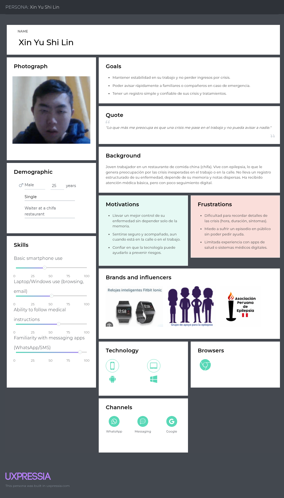

**Descripción general:**  
Representa a los pacientes adultos jóvenes con epilepsia que buscan mantener una vida laboral y social estable a pesar de su condición. **Xin Yu Shi Lin**, de 25 años, trabaja en un restaurante (chifa) y sufre episodios epilépticos inesperados que generan preocupación por la seguridad y la continuidad en el trabajo.  
Carece de un registro estructurado de sus crisis y depende de la memoria o de notas escritas, lo que provoca falta de precisión en la información médica que entrega al neurólogo.  

**Principales objetivos:**  
- Mantener estabilidad laboral y evitar pérdida de ingresos.  
- Avisar rápidamente a familiares o compañeros en caso de emergencia.  
- Registrar de manera simple y confiable sus crisis y tratamientos.  

**Motivaciones:**  
- Desea llevar un control más organizado de su enfermedad y sentirse acompañado.  
- Busca apoyarse en la tecnología para prevenir riesgos y no depender únicamente de su memoria.  
- Quiere sentirse seguro tanto en casa como en el trabajo, sabiendo que alguien puede asistirlo ante una crisis.  

**Frustraciones:**  
- Dificultad para recordar detalles de las crisis (hora, duración, síntomas).  
- Miedo a sufrir un episodio en público sin poder pedir ayuda.  
- Limitada experiencia con aplicaciones de salud o herramientas digitales.  

**Análisis interpretativo:**  
Este perfil revela la **necesidad central de accesibilidad, simplicidad y acompañamiento**. La experiencia del usuario debe priorizar interfaces claras, recordatorios automáticos y alertas de emergencia en tiempo real.  
La información recopilada por este tipo de usuarios es fundamental para generar los datos clínicos que luego utilizarán los médicos.  
Por ello, este persona orienta el diseño de la **app móvil de paciente**: registro rápido de síntomas, historial accesible, notificaciones y comunicación directa con cuidadores.

---

### User Persona – Segmento 2: Profesional de la salud (Neuróloga especialista)

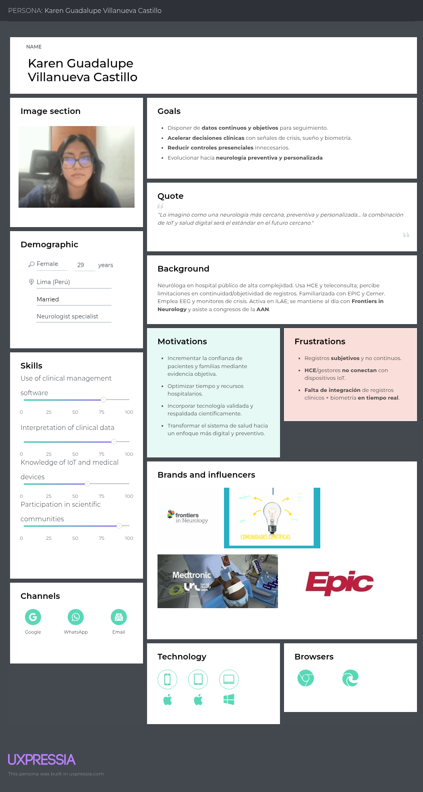

**Descripción general:**  
**Karen Guadalupe Villanueva Castillo**, neuróloga de 29 años, representa a los profesionales que buscan herramientas clínicas que integren la información del paciente de manera continua, visual y objetiva.  
Percibe que los sistemas actuales (HCE/EHR) no se conectan con los dispositivos IoT y que los registros son subjetivos o incompletos.  
Su trabajo diario en hospital público la enfrenta a limitaciones de tiempo y sobrecarga de pacientes, por lo que valora soluciones que optimicen el seguimiento remoto.  

**Principales objetivos:**  
- Acceder a datos clínicos continuos y en tiempo real.  
- Reducir controles presenciales innecesarios.  
- Tomar decisiones más rápidas y basadas en evidencia objetiva.  
- Evolucionar hacia una neurología preventiva y personalizada.  

**Motivaciones:**  
- Incrementar la confianza del paciente mediante evidencia objetiva.  
- Optimizar el tiempo clínico y los recursos hospitalarios.  
- Incorporar tecnología validada científicamente y alineada a estándares.  

**Frustraciones:**  
- Registros médicos subjetivos, incompletos o no actualizados.  
- Falta de integración entre plataformas clínicas y dispositivos IoT.  
- Dificultad para analizar grandes volúmenes de datos manualmente.  

**Análisis interpretativo:**  
Este perfil es clave para el diseño del **panel clínico de AuraNeuro**.  
La doctora Villanueva representa el usuario que necesita **información fiable, interoperable y visualmente clara**.  
Su contexto impulsa la integración con estándares **HL7–FHIR**, la generación automática de reportes exportables y el diseño de dashboards con métricas de evolución, adherencia y eventos críticos.  
También valida la necesidad de incluir filtros, visualizaciones gráficas y alertas inteligentes que reduzcan la carga de revisión manual.

---

### User Persona – Segmento 3: Proveedor de dispositivos IoT (Integrador tecnológico)

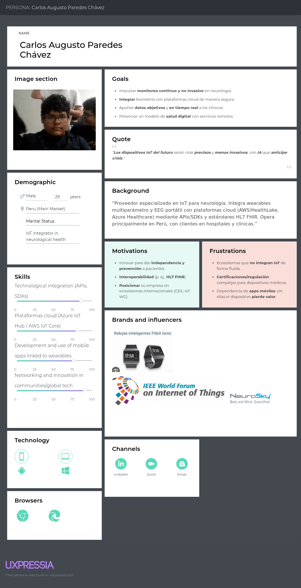

**Descripción general:**  
**Carlos Augusto Paredes Chávez**, de 29 años, es un integrador IoT especializado en soluciones biomédicas para neurología.  
Trabaja conectando wearables multiparámetro con plataformas cloud como **Azure IoT Hub** o **AWS IoT Core** y busca posicionarse en el mercado latinoamericano mediante interoperabilidad con estándares médicos.  
Percibe que la falta de integración fluida y las certificaciones regulatorias dificultan la expansión del sector IoT en salud.  

**Principales objetivos:**  
- Impulsar un monitoreo continuo y no invasivo en neurología.  
- Integrar biometría con plataformas cloud de manera segura.  
- Aportar datos objetivos y en tiempo real a los clínicos.  
- Potenciar un modelo de salud digital con servicios remotos.  

**Motivaciones:**  
- Innovar para lograr independencia y prevención en pacientes.  
- Lograr interoperabilidad con estándares como **HL7–FHIR**.  
- Posicionar su empresa en ecosistemas internacionales de salud IoT.  

**Frustraciones:**  
- Ecosistemas que no integran dispositivos IoT de forma fluida.  
- Certificaciones y regulaciones complejas para hardware médico.  
- Dependencia excesiva de apps móviles: si el dispositivo falla, se pierde valor.  

**Análisis interpretativo:**  
Este perfil representa al **socio tecnológico** de AuraNeuro.  
Su visión es crucial para definir los requerimientos del **API de integración**, la arquitectura del sistema y la estrategia B2B2C.  
Las frustraciones de Carlos reflejan la necesidad de ofrecer documentación técnica, entornos de prueba y soporte de estándares internacionales.  
Gracias a este arquetipo, el equipo puede diseñar una plataforma abierta, segura y escalable que fomente alianzas con proveedores de dispositivos biomédicos.

---

**Conclusión general:**  
Los tres **User Personas** evidencian una cadena de valor conectada: el **paciente genera datos**, el **médico los interpreta**, y el **proveedor IoT los posibilita** mediante tecnología segura e interoperable.  
Esta relación circular confirma que AuraNeuro debe diseñarse como un **ecosistema integral**, priorizando la experiencia, la precisión clínica y la sostenibilidad tecnológica.

### 2.3.2. User Task Matrix.

En esta sección se presenta la matriz de tareas de usuario (**User Task Matrix**) que reúne las principales acciones que los tres **User Personas** de **AuraNeuro** realizan para cumplir sus objetivos, independientemente del uso del software.  
Las tareas fueron identificadas a partir de entrevistas y observaciones de campo, clasificadas según su **frecuencia (Alta, Media, Baja)** y **importancia (Alta, Media, Baja)** para cada segmento.

---

| **Tareas principales** | **Paciente (Xin Yu Shi Lin)** |  | **Profesional de salud (Karen Villanueva)** |  | **Proveedor IoT (Carlos Paredes)** |  |
|--------------------------|-------------------------------|--|---------------------------------------------|--|------------------------------------|--|
|  | **Frecuencia** | **Importancia** | **Frecuencia** | **Importancia** | **Frecuencia** | **Importancia** |
| Registrar síntomas o crisis neurológicas | Alta | Alta | Media | Alta | Baja | Media |
| Revisar métricas o reportes de evolución | Media | Alta | Alta | Alta | Baja | Media |
| Cumplir tratamiento o recordatorios médicos | Alta | Alta | Media | Alta | — | — |
| Comunicarse con médico o cuidador | Alta | Alta | Alta | Alta | Baja | Media |
| Analizar datos clínicos o biométricos | — | — | Alta | Alta | Alta | Alta |
| Atender consultas o reuniones remotas | Media | Alta | Alta | Alta | Media | Media |
| Integrar o configurar dispositivos IoT | Baja | Media | Media | Alta | Alta | Alta |
| Validar interoperabilidad (FHIR/API) | — | — | Media | Alta | Alta | Alta |
| Probar prototipos o nuevas funciones | Media | Media | Media | Media | Alta | Alta |
| Compartir feedback sobre desempeño | Media | Alta | Media | Alta | Media | Alta |

---

**Interpretación de la matriz:**

Las tareas con **mayor coincidencia de frecuencia e importancia** entre los tres segmentos son:  
- **Comunicación médico–paciente:** clave para la continuidad del monitoreo.  
- **Revisión de reportes y métricas:** tarea compartida por pacientes y médicos, indispensable para decisiones clínicas.  

El **paciente** concentra su esfuerzo en tareas cotidianas (registro, adherencia, comunicación), que son **frecuentes y críticas** para su bienestar.  
El **profesional de salud** se enfoca en **análisis y toma de decisiones** con datos objetivos, priorizando interoperabilidad y confiabilidad.  
El **proveedor IoT** realiza tareas más técnicas y menos frecuentes, pero con **alta importancia estratégica** para la sostenibilidad del ecosistema (integración, validación y soporte de datos).

Estas relaciones confirman que AuraNeuro debe facilitar la **fluidez de información entre los tres actores**, priorizando tareas donde las necesidades convergen.

---

**Conclusión:**  
El **User Task Matrix** evidencia que las tareas más relevantes son aquellas que **conectan los flujos de datos** entre usuarios —desde la captura por el paciente, la interpretación por el médico y la validación técnica del proveedor—, lo cual guía directamente la definición de **requisitos funcionales prioritarios** en el *Product Backlog*.

### 2.3.3. User Journey Mapping.    

El presente apartado describe los **User Journey Maps** elaborados en **UXPressia**, uno por cada segmento objetivo de la startup **Mithycore**.  
Estos diagramas visualizan el recorrido actual que los usuarios realizan **antes de la existencia de AuraNeuro**, evidenciando sus metas, procesos, canales, puntos de fricción y oportunidades de mejora.  

---

### Metodología de elaboración  

Los *journeys* se desarrollaron a partir de:  
- **Entrevistas semiestructuradas** realizadas a tres perfiles representativos (paciente, profesional y proveedor).  
- **Observación contextual y benchmark** de soluciones digitales existentes (MySeizureDiary, Medtronic CareLink, NeuroSky, entre otras).  
- Análisis de los *User Personas* previamente definidos, para identificar **motivaciones, frustraciones y canales de interacción reales**.  

Cada mapa fue construido en la herramienta **UXPressia**, utilizando la versión **As-Is** (estado actual), lo que permite entender el **comportamiento previo a la adopción del producto**.

---

### User Journey Mapping – Segmento 1: Paciente (Epilepsia crónica)

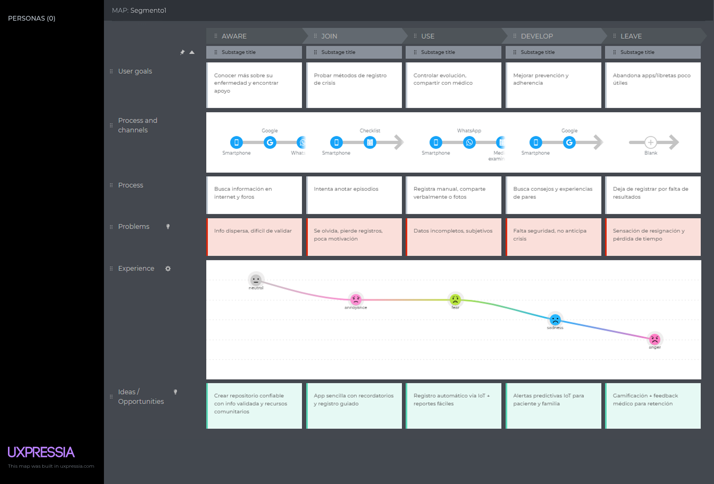

**Síntesis del recorrido:**  
El paciente busca información sobre su enfermedad, prueba métodos manuales de registro y abandona aplicaciones que no le ofrecen resultados visibles.  
Su experiencia emocional pasa de la **curiosidad inicial** a la **frustración y resignación**, debido a información dispersa, falta de apoyo y herramientas poco accesibles.

**Pain points identificados:**  
- Dificultad para validar información médica en línea.  
- Pérdida de motivación por falta de resultados tangibles.  
- Registro manual ineficiente y dependiente de la memoria.

**Oportunidades detectadas:**  
- Crear un repositorio confiable con recursos médicos validados.  
- Incorporar registro automático mediante sensores IoT y recordatorios guiados.  
- Implementar gamificación y retroalimentación médica que aumente la adherencia.

---

### User Journey Mapping – Segmento 2: Profesional de la salud (Neurólogos)

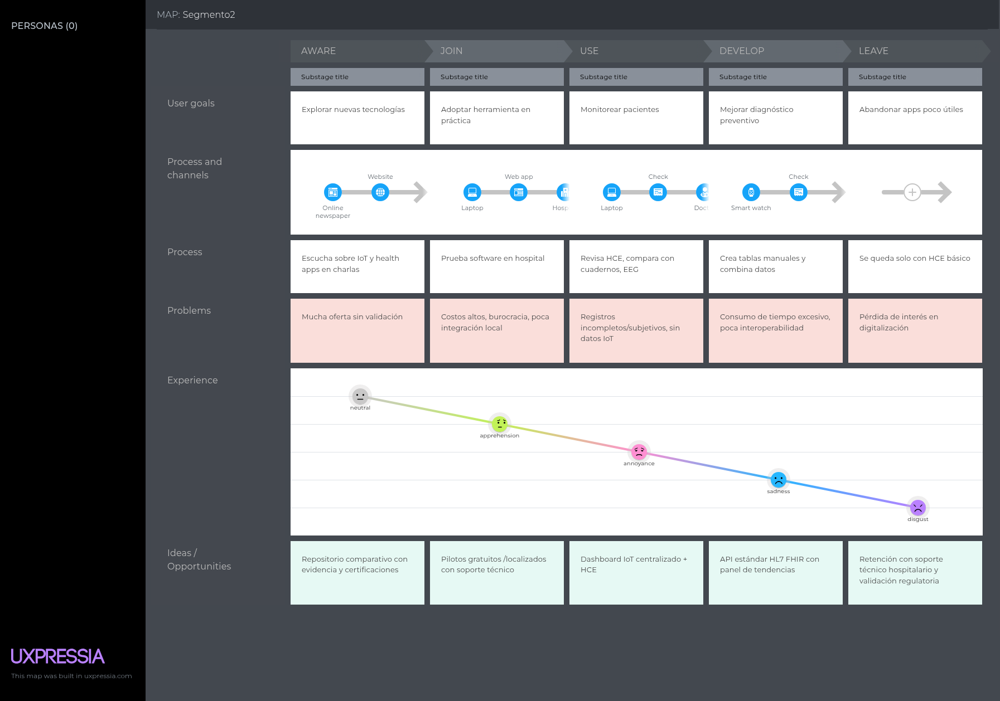

**Síntesis del recorrido:**  
El profesional se muestra inicialmente interesado en tecnologías IoT, pero enfrenta **altos costos, poca validación local y registros incompletos**.  
La sobrecarga de datos manuales y la falta de interoperabilidad lo llevan a perder interés en la digitalización.  
Su experiencia emocional transita de la **curiosidad** a la **frustración y desconfianza**.

**Pain points identificados:**  
- Exceso de oferta sin validación científica.  
- Costos y procesos burocráticos en adopción hospitalaria.  
- Ausencia de integración entre sistemas clínicos e IoT.

**Oportunidades detectadas:**  
- Ofrecer pilotos gratuitos con soporte técnico y validación institucional.  
- Diseñar un panel IoT centralizado que unifique HCE + métricas IoT.  
- Integrar estándares HL7–FHIR y visualizaciones de diagnóstico preventivo.

---

### User Journey Mapping – Segmento 3: Proveedores IoT

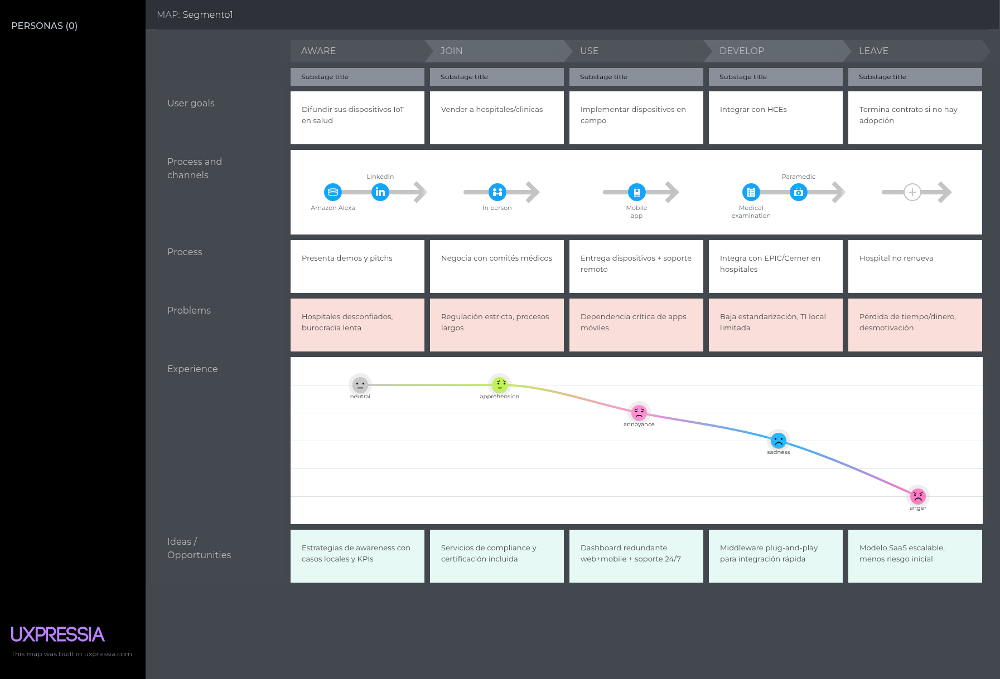

**Síntesis del recorrido:**  
Los proveedores buscan vender e integrar sus dispositivos en hospitales, pero enfrentan **desconfianza institucional, regulaciones complejas y baja estandarización local**.  
Su experiencia emocional decae progresivamente hacia la **frustración y desmotivación**, al no encontrar condiciones que favorezcan la adopción tecnológica.

**Pain points identificados:**  
- Burocracia y desconfianza en hospitales.  
- Procesos regulatorios extensos y costosos.  
- Dificultad para lograr interoperabilidad con los sistemas clínicos.

**Oportunidades detectadas:**  
- Estrategias de *awareness* con casos locales y resultados medibles.  
- Middleware plug-and-play para integración rápida y segura.  
- Modelo SaaS escalable con menor riesgo financiero inicial.

---

### Interpretación general de los journeys  

El análisis cruzado de los tres *User Journey Maps* evidencia patrones comunes:

| **Aspecto** | **Hallazgo transversal** | **Implicancia para el diseño de AuraNeuro** |
|--------------|---------------------------|---------------------------------------------|
| **Emoción dominante** | Frustración y desconfianza en herramientas actuales. | Priorizar diseño empático y comunicación transparente. |
| **Canales principales** | WhatsApp, correo, foros y herramientas móviles. | Integrar canales familiares en la app (notificaciones, chat seguro). |
| **Pain point recurrente** | Falta de interoperabilidad entre actores. | Foco en integraciones FHIR/API y dashboards compartidos. |
| **Oportunidad clave** | Automatizar registro de datos y ofrecer valor tangible desde el primer uso. | Prototipo MVP centrado en registro IoT + feedback inmediato. |

---

**Conclusión:**  
Los *journeys As-Is* demuestran que los tres segmentos enfrentan un ecosistema fragmentado y dependiente de procesos manuales.  
El diseño de **AuraNeuro** debe enfocarse en **integrar flujos y reducir la carga cognitiva del usuario**, fomentando confianza, interoperabilidad y adopción sostenida.

### 2.3.4. Empathy Mapping.  

El presente apartado presenta los **Empathy Maps** elaborados por el equipo **Mithycore** en la herramienta **UXPressia**, uno por cada **User Persona** definido previamente.  
Estos mapas permitieron **profundizar en la comprensión emocional y cognitiva** de cada usuario, identificando sus pensamientos, frustraciones, motivaciones y percepciones frente al problema actual de seguimiento neurológico.  

---

### Metodología de elaboración  

El proceso de empatía se realizó en tres fases principales:

1. **Preparación:** cada integrante del equipo analizó las entrevistas y observaciones asociadas a los tres segmentos (pacientes, profesionales y proveedores IoT).  
2. **Colaboración:** se colocó al centro de la plantilla a cada *User Persona*, discutiendo en equipo las respuestas a las preguntas del modelo de empatía (*¿Qué ve?, ¿Qué dice?, ¿Qué piensa?, ¿Qué siente?, ¿Qué hace?, ¿Qué escucha?*).  
3. **Síntesis:** se consolidaron los *pains* (dolores) y *gains* (ganancias) para identificar **insights clave** que orientan las hipótesis y oportunidades de diseño del producto **AuraNeuro**.

---

### Empathy Mapping – Segmento 1: Paciente (Epilepsia crónica)

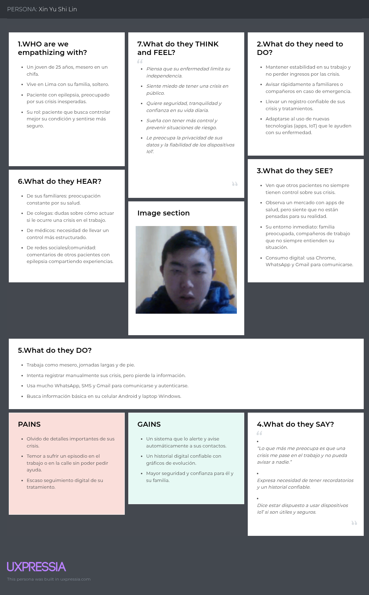

**Síntesis del mapa:**  
El paciente **Xin Yu Shi Lin** muestra preocupación constante por su independencia y seguridad.  
Registra manualmente sus crisis, pero suele olvidar detalles y perder datos.  
Su entorno (familia y trabajo) lo percibe como vulnerable, lo que refuerza su miedo a tener una crisis en público.  

**Pains:**  
- Olvido de detalles importantes de sus crisis.  
- Miedo a sufrir un episodio sin poder pedir ayuda.  
- Escaso seguimiento digital y baja confianza en las apps actuales.  

**Gains:**  
- Un sistema que lo alerte y notifique automáticamente a sus contactos.  
- Mayor seguridad y confianza personal y familiar.  
- Un historial digital confiable con datos visuales.  

**Interpretación:**  
El mapa evidencia la necesidad de **seguridad, acompañamiento y simplicidad de uso**.  
El paciente busca herramientas que no requieran esfuerzo técnico y que le ofrezcan **valor inmediato**, como alertas automáticas y seguimiento visual de su evolución.  
Estos hallazgos sustentan el diseño del **módulo móvil de AuraNeuro** centrado en la accesibilidad, los recordatorios y la comunicación directa con el neurólogo.

---

### Empathy Mapping – Segmento 2: Profesional de la salud (Neuróloga especialista)

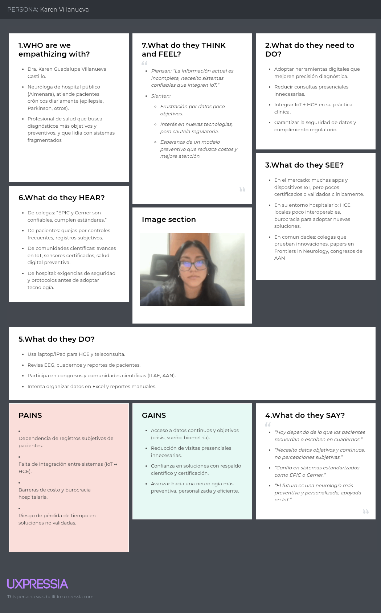

**Síntesis del mapa:**  
La doctora **Karen Villanueva** manifiesta frustración ante datos subjetivos y sistemas que no integran IoT ni ofrecen evidencia objetiva.  
Su entorno hospitalario es burocrático y carece de interoperabilidad.  
Ella escucha de sus colegas sobre soluciones innovadoras, pero teme los problemas regulatorios o la falta de certificación.  

**Pains:**  
- Dependencia de registros subjetivos y manuales.  
- Integración deficiente entre sistemas (HCE + IoT).  
- Riesgo de pérdida de tiempo en plataformas no validadas.  

**Gains:**  
- Acceso a datos continuos y objetivos (biometría, crisis, sueño).  
- Reducción de consultas presenciales innecesarias.  
- Soluciones con respaldo científico y certificación médica.  

**Interpretación:**  
El mapa evidencia una clara oportunidad de **credibilidad y eficiencia**.  
La doctora representa al usuario que adopta tecnología solo si es **segura, validada y científicamente confiable**.  
Este insight refuerza el enfoque de **interoperabilidad (HL7–FHIR)** y **certificación** como pilares técnicos de AuraNeuro, además de la necesidad de **visualizaciones clínicas precisas**.

---

### Empathy Mapping – Segmento 3: Proveedores IoT

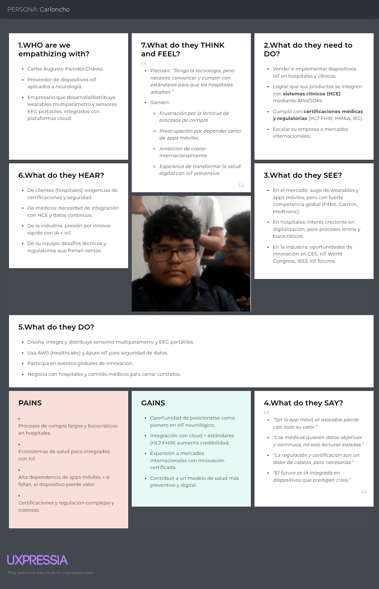

**Síntesis del mapa:**  
**Carlos Augusto Paredes**, proveedor de dispositivos IoT, busca integrar sus productos en hospitales, pero enfrenta **procesos regulatorios lentos**, **falta de estandarización** y **dependencia de aplicaciones móviles**.  
Su equipo técnico siente presión por innovar rápidamente mientras lidia con limitaciones normativas locales.  

**Pains:**  
- Procesos de compra largos y burocráticos.  
- Ecosistemas de salud poco integrados con IoT.  
- Certificaciones costosas y lentas.  

**Gains:**  
- Integración bajo estándares internacionales (HL7 FHIR, HIPAA).  
- Expansión hacia mercados internacionales.  
- Reputación como proveedor validado y seguro.  

**Interpretación:**  
El mapa evidencia la necesidad de **facilitar la adopción tecnológica hospitalaria**.  
El proveedor busca una plataforma confiable y rápida de integrar, con modelos SaaS que reduzcan riesgos financieros y barreras regulatorias.  
Este insight fundamenta la estrategia de **API abierta, sandbox IoT y documentación técnica** que diferenciará a AuraNeuro frente a otras plataformas cerradas.

---

### Conclusión general  

Los tres *Empathy Maps* revelan una cadena emocional conectada entre los actores del ecosistema neurológico:

| **Actor** | **Emoción dominante** | **Necesidad clave** | **Oportunidad de diseño** |
|------------|------------------------|----------------------|----------------------------|
| **Paciente** | Miedo e inseguridad | Confianza y acompañamiento | Alertas IoT, registro guiado y visualización de evolución |
| **Profesional de salud** | Frustración y escepticismo | Datos confiables y eficiencia | Dashboard validado, interoperable y certificado |
| **Proveedor IoT** | Desmotivación y lentitud percibida | Simplificación y estandarización | API abierta y soporte técnico hospitalario |

Estos resultados consolidan los *insights de empatía* que guían la siguiente fase de diseño:  
**construir una experiencia integral, confiable y conectada entre paciente, médico y proveedor.**

---

## 2.4. Big Picture EventStorming.  

El Big Picture Event Storming es una técnica colaborativa que nos permitió visualizar el dominio completo de nuestra solución, identificando actores, eventos clave, problemas, dudas, sistemas externos y oportunidades. A través de esta dinámica, el equipo logró comprender de manera compartida el flujo de procesos en la atención neurológica digital y cómo nuestra plataforma Mythicore puede integrarse para resolver brechas críticas.  

**Big Picture Event Storming - Leyenda de Colores**    
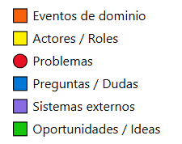 

**Big Picture Event Storming - Mapa General**   
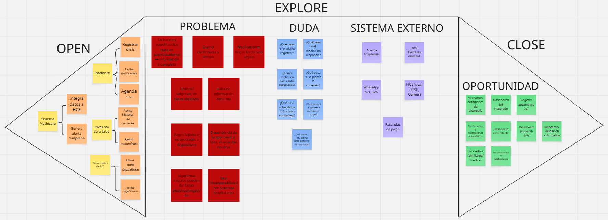 

## 2.5. Ubiquitous Language.  

Este glosario define los términos clave que usamos en el proyecto para mantener un **lenguaje común** entre el equipo de desarrollo, los médicos especialistas y los demás stakeholders.    

| Term (English) | Definición (Español) |
|----------------|-----------------------|
| **Patient (Paciente)** | Persona diagnosticada con una enfermedad neurológica crónica, como epilepsia o Parkinson, que utiliza la plataforma para registrar, monitorear y compartir información de su condición. |
| **Neurologist (Neurólogo/a)** | Médico especialista en el diagnóstico y tratamiento de enfermedades neurológicas, encargado de revisar la información registrada por los pacientes y ajustar tratamientos. |
| **Caregiver (Cuidador/Familiar)** | Persona cercana al paciente que brinda apoyo en el manejo diario de la enfermedad y puede recibir alertas tempranas en situaciones de crisis. |
| **Seizure (Crisis epiléptica)** | Episodio súbito generado por actividad eléctrica anormal en el cerebro, caracterizado por convulsiones, pérdida de conciencia u otros síntomas neurológicos. |
| **Crisis log (Registro de crisis)** | Historial digital donde el paciente documenta la fecha, hora, duración y características de cada crisis. |
| **Biometric data (Datos biométricos)** | Señales fisiológicas obtenidas mediante dispositivos IoT (ej. ritmo cardíaco, actividad cerebral, calidad del sueño) que permiten un seguimiento objetivo de la salud del paciente. |
| **Wearable device (Dispositivo vestible/IoT)** | Tecnología portátil (reloj inteligente, sensor EEG, pulsera médica) que mide y transmite datos biométricos del paciente. |
| **EEG – Electroencephalogram (Electroencefalograma)** | Examen que registra la actividad eléctrica cerebral a través de sensores en el cuero cabelludo; utilizado para diagnosticar y monitorear epilepsia y otras condiciones neurológicas. |
| **Health Record (Historia clínica electrónica)** | Documento digital que almacena la información médica del paciente, accesible por el neurólogo para evaluar evolución y tratamientos. |
| **Alert (Alerta temprana)** | Notificación automática que advierte al paciente, familiares o médicos sobre una crisis inminente o anomalía detectada por los sensores. |
| **Medication adherence (Adherencia al tratamiento)** | Grado en el que el paciente sigue correctamente la toma de medicamentos prescritos por el neurólogo. |
| **Sleep quality (Calidad de sueño)** | Indicador de descanso del paciente, medido por dispositivos IoT, que influye directamente en la frecuencia de crisis. |
| **Dashboard (Panel de control clínico)** | Interfaz visual que muestra estadísticas, gráficos y tendencias de la evolución del paciente, accesible para médicos y pacientes. |
| **Scientific community (Comunidad científica)** | Organismos y grupos de investigación internacionales (ej. ILAE, AAN) que validan y difunden prácticas y tecnologías para el tratamiento de enfermedades neurológicas. |
| **Support group (Grupo de apoyo)** | Comunidad de pacientes que comparte experiencias, consejos y acompañamiento sobre el manejo de su condición neurológica. |
| **Data privacy (Privacidad de datos)** | Principio que garantiza la protección de la información médica y biométrica del paciente frente a accesos no autorizados. |

---
