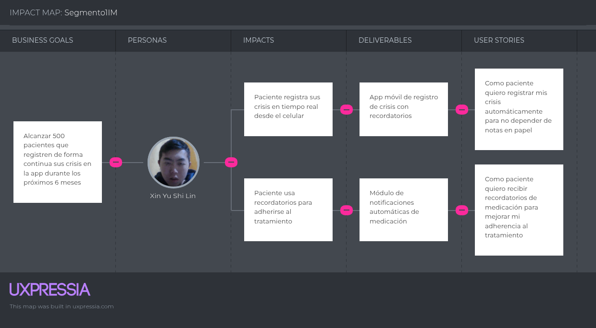
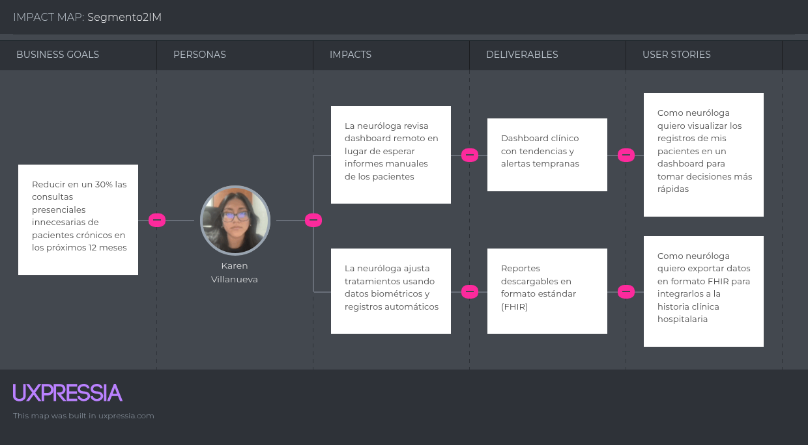
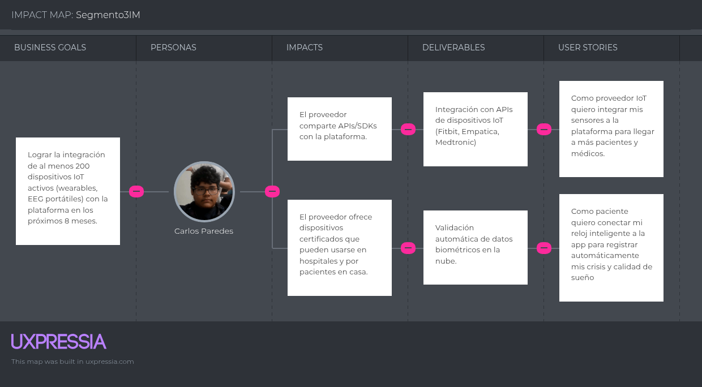

# Capítulo III: Requirements Specification  

## 3.1. User Stories.  
Lista de Epicas  

| Epic ID | Tipo                          | Descripción (Como / quiero / para)                                                                                      | Nombre de la épica                                   |
|---------|-------------------------------|-------------------------------------------------------------------------------------------------------------------------|------------------------------------------------------|
| EP-01  | Funcional                      | Como **usuario (paciente o neurólogo)**, quiero **registrarme e iniciar sesión de forma segura** para **acceder a mi cuenta y servicios personalizados**. | Autenticación y Gestión de Cuentas                   |
| EP-02  | Funcional                      | Como **profesional o paciente**, quiero **editar y consultar mi perfil clínico y datos personales** para **mantener información actualizada y útil en la atención**. | Gestión de Perfiles Médicos y Datos                  |
| EP-03  | Funcional                      | Como **paciente o neurólogo**, quiero **gestionar citas y disponibilidad** para **programar, confirmar y recibir recordatorios de consultas**. | Gestión de Citas y Agenda Médica                     |
| EP-04  | Funcional                      | Como **paciente**, quiero **iniciar videollamadas one-click con mi neurólogo** para **realizar teleconsultas y seguimiento remoto**. | Videollamadas y Teleconsulta                         |
| EP-05  | Funcional                      | Como **paciente**, quiero **enviar y recibir mensajes seguros con mi neurólogo** para **aclarar dudas y comunicar síntomas entre consultas**. | Comunicación por Chat Seguro                         |
| EP-06  | Funcional                      | Como **neurólogo**, quiero **emitir y enviar recetas electrónicas** para **facilitar la adherencia al tratamiento y mantener un historial prescriptivo**. | Gestión de Recetas y Tratamientos                    |
| EP-07  | Funcional                      | Como **paciente**, quiero **emparejar y sincronizar mis dispositivos IoT** para **registrar automáticamente biomarcadores en mi historial clínico**. | Monitoreo IoT y Registro de Datos                    |
| EP-08  | Funcional / Seguridad         | Como **sistema clínico**, quiero **detectar anomalías y enviar alertas (con geolocalización con consentimiento)** para **activar respuestas rápidas ante eventos críticos**. | Alertas, Geolocalización y Respuesta                 |
| EP-09  | No funcional / Seguridad      | Como **administrador del sistema**, quiero **garantizar cifrado, control de accesos y logs de auditoría** para **proteger la confidencialidad y cumplir normativas**. | Privacidad, Seguridad y Cumplimiento                 |
| EP-10  | No funcional / Rendimiento    | Como **usuario**, quiero **tiempos de respuesta y escalabilidad garantizados** para **tener una experiencia fluida incluso con uso concurrente**. | Escalabilidad y Rendimiento                          |
| EP-11  | Funcional / Analítica         | Como **neurólogo**, quiero **recibir análisis e informes generados por IA** para **identificar patrones, priorizar pacientes y apoyar decisiones clínicas**. | Analítica con IA y Dashboard Clínico                 |
| EP-12  | Funcional / UX                | Como **usuario (paciente o profesional)**, quiero **personalizar accesibilidad y apariencia de la interfaz** para **adaptarla a mis preferencias y necesidades**. | Usabilidad, Personalización y Accesibilidad          |

Listas de historias de usuario
<table>
  <tbody>
    <tr>
      <th>ID (HU)</th>
      <th>Título</th>
      <th>Descripción</th>
      <th>Criterios de aceptación</th>
      <th>Epic-ID</th>
    </tr>
    <tr>
      <td>US-01</td>
        <td>Inicio de sesión</td>
        <td>Como usuario (paciente o neurólogo) registrado, quiero iniciar sesión en la plataforma con mis credenciales para acceder de forma segura a mis datos y servicios personalizados.</td>
        <td>
          Escenario A (inicio exitoso): 
          Given que el usuario tiene una cuenta registrada y credenciales válidas. 
          When ingresa correo y contraseña correctos y presiona "Iniciar sesión". 
          Then el sistema autentica al usuario y lo redirige al panel correspondiente.  
          Escenario B (credenciales inválidas): 
          Given que el usuario introduce una contraseña incorrecta. 
          When intenta iniciar sesión. 
          Then el sistema muestra un mensaje de error indicando credenciales inválidas y no permite acceso.
        </td>
        <td>EP-01</td>
    </tr>
    <tr>
      <td>US-02</td>
      <td>Registro de paciente</td>
      <td>Como paciente, quiero registrarme en la plataforma proporcionando mis datos personales básicos para crear una cuenta y usar los servicios de atención neurológica remota.</td>
      <td>
        Escenario A (registro válido): 
        Given que el paciente completa el formulario con datos válidos (email único, contraseña segura). 
        When envía el formulario. 
        Then el sistema crea la cuenta, envía correo de verificación y muestra confirmación.  
        Escenario B (correo ya registrado): 
        Given que el paciente utiliza un correo ya existente. 
        When intenta registrarse. 
        Then el sistema muestra error indicando que el correo ya está en uso y solicita otro.
      </td>
      <td>EP-01</td>
    </tr>
    <tr>
      <tr>
        <td>US-03</td>
        <td>Registro de neurólogo</td>
        <td>Como neurólogo, quiero registrarme en la plataforma proporcionando mis credenciales profesionales (p. ej. número de licencia) para ofrecer consultas remotas.</td>
        <td>
          Escenario A (registro con documentación): Given que el neurólogo ingresa datos válidos y su número de licencia. When envía el formulario. Then la cuenta queda creada en estado “pendiente de verificación” y el equipo admin recibe notificación para validar la licencia.
          Escenario B (licencia inválida): Given que el número de licencia no pasa la validación interna. When intenta registrarse. Then el sistema muestra un mensaje indicando la incompatibilidad y solicita documentación adicional.
        </td>
        <td>EP-01</td>
      </tr>
    <tr>
      <td>US-04</td>
        <td>Datos de usuario</td>
        <td>Como usuario (paciente o neurólogo), quiero actualizar mis datos de perfil personal para mantener mi información actualizada en la plataforma.</td>
        <td>
          Escenario A (actualización correcta): Given que el usuario está autenticado y edita sus datos con formato válido. When guarda los cambios. Then el sistema actualiza el perfil y muestra confirmación.
          Escenario B (datos inválidos): Given que el usuario introduce un email con formato incorrecto. When intenta guardar. Then el sistema valida y muestra errores en los campos inválidos sin persistir cambios.
        </td>
        <td>EP-01</td>
    </tr>
    <tr>
      <td>US-05</td>
      <td>Ver agenda de citas</td>
      <td>Como paciente, quiero consultar mi agenda de citas programadas para visualizar la fecha, hora y neurólogo asignado de cada cita.</td>
      <td>
        Escenario A (con citas): Given que el paciente tiene citas futuras registradas. When accede a la sección “Agenda”. Then el sistema muestra lista/calendario con fechas, horas y profesionales asignados.
        Escenario B (sin citas): Given que el paciente no tiene citas. When abre la agenda. Then el sistema muestra un estado vacío con CTA para solicitar cita.
      </td>
      <td>EP-02</td>
    </tr>  
    <tr>
      <td>US-06</td>
        <td>Solicitar nueva cita</td>
        <td>Como paciente, quiero solicitar una nueva cita con el neurólogo eligiendo una fecha y hora disponibles para recibir atención médica remota.</td>
        <td>
          Escenario A (solicitud exitosa): Given que existen franjas libres en la agenda del neurólogo. When el paciente selecciona una franja y confirma la solicitud. Then el sistema crea la cita en estado “pendiente/confirmación”, envía notificación al paciente y notifica al neurólogo.
          Escenario B (conflicto de horario): Given que otro paciente reservó el mismo turno en paralelo. When el usuario intenta confirmar la cita. Then el sistema informa que la franja ya no está disponible y sugiere alternativas.
        </td>
        <td>EP-02</td>
    </tr>
    <tr>
      <td>US-07</td>
        <td>Definir disponibilidad horaria</td>
        <td>Como neurólogo, quiero configurar mis franjas horarias disponibles en la plataforma para que los pacientes puedan verlas y solicitar citas en esos periodos.</td>
        <td>
          scenario A (guardar franjas válidas): Given que el neurólogo introduce franjas sin solapamientos. When guarda la disponibilidad. Then el sistema la publica y la hace visible a pacientes.
          Escenario B (conflicto/solapamiento): Given que el neurólogo define franjas que se solapan. When intenta guardar. Then el sistema detecta el conflicto y muestra error pidiendo corrección.
        </td>
        <td>EP-02</td>
    </tr>
    <tr>
      <td>US-08</td>
        <td>Consulta por videollamada</td>
        <td>Como paciente, quiero iniciar la videollamada con mi neurólogo en la hora acordada para recibir la consulta médica de forma remota.</td>
        <td>
          Escenario A (conexión exitosa): Given que es la hora de la cita y ambos están autenticados. When el paciente hace clic en “Iniciar videollamada”. Then el sistema establece conexión WebRTC y ambos participantes ven/audio funcionan correctamente.
          Escenario B (médico no conectado): Given que el neurólogo no se ha conectado aún. When el paciente intenta iniciar la sesión. Then el sistema notifica que el profesional aún no está disponible y ofrece reintentar o dejar mensaje.
        </td>
        <td>EP-02</td>
    </tr>
    <tr>
      <td>US-09</td>
        <td>Emitir receta médica electrónica</td>
        <td>Como neurólogo, quiero generar y enviar recetas médicas electrónicas al paciente al finalizar la consulta para que pueda adquirir los medicamentos necesarios.</td>
        <td>
          Escenario A (receta válida enviada): Given que el neurólogo completa campos requeridos (medicamento, dosis, duración). When confirma la receta. Then el sistema guarda la receta en el historial del paciente y notifica al paciente.
          Escenario B (campos incompletos): Given que falta dosis en al menos un medicamento. When intenta guardar. Then el sistema bloquea la emisión y muestra error indicando campos obligatorios.
        </td>
        <td>EP-03</td>
    </tr>
    <tr>
      <td>US-10</td>
        <td>Consultar recetas médicas</td>
        <td>Como paciente, quiero acceder al historial de mis recetas médicas para visualizar y descargar las prescripciones que me ha enviado mi neurólogo.</td>
        <td>
          Escenario A (recetas disponibles): Given que existen recetas emitidas al paciente. When accede a “Recetas”. Then el sistema lista recetas con fecha, médico emisor y opción de descargar PDF.
          Escenario B (sin recetas): Given que no hay recetas registradas. When entra a la sección. Then el sistema muestra mensaje indicando ausencia y sugiere contactar al neurólogo.
        </td>
        <td>EP-03</td>
    </tr>
    <tr>
      <td>US-11</td>
      <td>Chat con el neurólogo</td>
      <td>Como paciente, quiero enviar mensajes de texto a mi neurólogo mediante un chat dentro de la plataforma para aclarar dudas o informar sobre mis síntomas entre consultas.</td>
      <td>
        Escenario A (envío y notificación): Given que el paciente y el neurólogo están activos en la plataforma. When el paciente envía un mensaje en el chat. Then el sistema entrega el mensaje y notifica al neurólogo (push/email según preferencia).
        Escenario B (mensaje vacío): Given que el campo del mensaje está vacío. When el usuario presiona “Enviar”. Then el sistema previene el envío y muestra validación “Ingrese un mensaje”.
      </td>
      <td>EP-04</td>
    </tr>
    <tr>
      <td>US-12</td>
        <td>Visualizar ubicación del paciente</td>
        <td>Como neurólogo, quiero ver la ubicación geográfica aproximada del paciente (con su permiso) durante la consulta para tener contexto en caso de emergencia.</td>
        <td>
          Escenario A (permiso otorgado): Given que el paciente otorgó permiso de geolocalización y la sesión está activa. When el neurólogo solicita ver ubicación. Then el sistema muestra mapa con ubicación aproximada y tiempo de actualización.
          Escenario B (permiso denegado): Given que el paciente no otorgó permiso o lo revocó. When el neurólogo solicita ver ubicación. Then el sistema indica “Ubicación no disponible por falta de permiso”.
        </td>
        <td>EP-05</td>
    </tr>
    <tr>
      <td>US-13</td>
      <td>Integrar dispositivo IoT médico</td>
      <td>Como paciente, quiero conectar mi dispositivo médico IoT a la plataforma para que los datos de salud se registren automáticamente en mi historial médico.</td>
      <td>
        Escenario A (emparejamiento exitoso): Given que el dispositivo es compatible y está en modo emparejamiento. When el paciente inicia emparejamiento desde la web/app y autoriza la conexión. Then la plataforma confirma la vinculación y comienza a recibir datos.
        Escenario B (fallo de emparejamiento): Given que hay interferencia Bluetooth o credenciales del dispositivo inválidas. When intenta emparejar. Then el sistema muestra error paso a paso y sugiere acciones (reintentar, revisar batería, soporte).
      </td>
      <td>EP-05</td>
    </tr>
     <tr>
      <td>US-14</td>
      <td>Alertas automáticas de salud</td>
      <td>Como paciente, quiero recibir alertas automáticas si los datos de mi dispositivo de monitoreo indican valores críticos, para que tanto yo como mi neurólogo podamos actuar.</td>
      <td>
        EEscenario A (alerta crítica): Given que los datos enviados exceden umbrales críticos definidos. When el sistema detecta la anomalía. Then envía alerta inmediata al paciente, al neurólogo y a contactos de emergencia (según configuración) con detalle del evento.
        Escenario B (falsa alarma/umbral ajustado): Given que el dato bordea el umbral pero no supera criterio validado. When el sistema procesa la señal. Then no envía alerta inmediata pero lo marca para revisión y genera nota en el historial para análisis posterior.
      </td>
      <td>EP-05</td>
    </tr>
    <tr>
      <td>US-15</td>
      <td>Seguridad y encriptación</td>
      <td>Como plataforma, la aplicación debe implementar protocolos de seguridad (HTTPS, cifrado) para proteger la información médica de accesos no autorizados.</td>
      <td>
        Escenario A (transmisión segura): Given que el usuario envía datos sensibles por la app web. When se transmite información hacia servidor. Then la comunicación usa HTTPS/TLS y el servidor registra acceso en logs de auditoría.
        Escenario B (intento de acceso no autorizado): Given que existe un intento de login sospechoso (IP anómala). When el sistema detecta patrón inusual. Then bloquea intentos, solicita verificación adicional (2FA) y registra incidente.
      </td>
      <td>EP-05</td>
    </tr>
    <tr>
      <td>US-16</td>
      <td>Rendimiento de la plataforma</td>
      <td>Como paciente o neurólogo, quiero que la plataforma cargue las páginas rápidamente (p. ej., en -2 s) para garantizar una experiencia fluida.</td>
      <td>
        Escenario A (carga under load normal): Given carga promedio de usuarios. When un usuario solicita su dashboard. Then la respuesta se entrega en -2s y la interfaz se renderiza sin errores.
        Escenario B (picos de tráfico): Given tráfico elevado (pruebas de stress). When se realizan múltiples peticiones simultáneas. Then el sistema mantiene respuesta aceptable (-4s en picos) y no presenta fallos críticos; registros de degradación quedan en logs.
      </td>
      <td>EP-06</td>
    </tr>   
    <td>US-17</td>
      <td>Privacidad de datos</td>
      <td>Como paciente o neurólogo, quiero que la plataforma garantice la confidencialidad de mis datos personales y médicos, cumpliendo normativas de privacidad (p. ej. GDPR/HIPAA).</td>
      <td>
        Escenario A (consentimiento válido): Given que un paciente firma consentimiento para uso de datos. When los datos se procesan para atención y/o investigación. Then se aplica anonimización cuando procede y acceso restringido según rol.
        Escenario B (solicitud de eliminación): Given que usuario solicita eliminación de sus datos. When se procesa la solicitud conforme a política. Then los datos personales se borran o anonimizan y se notifica al solicitante.
      </td>
      <td>EP-06</td>
    </tr>
    <tr>
    <td>US-18</td>
      <td>Analítica de salud con IA</td>
      <td>Como neurólogo, quiero que la plataforma utilice IA para analizar datos del paciente y sugerir patrones relevantes para apoyar la toma de decisiones.</td>
      <td>
        Escenario A (informe generado): Given suficientes datos históricos y configuraciones válidas. When se ejecuta análisis IA. Then se genera informe con hallazgos, nivel de confianza y recomendaciones claras para revisión por el neurólogo.
        Escenario B (insuficiencia de datos): Given que hay datos insuficientes o de baja calidad. When se solicita análisis. Then la plataforma notifica que no hay datos suficientes y sugiere recolectar más información antes de ejecutar modelos.
      </td>
      <td>EP-06</td>
    </tr>
    <tr>
      <td>US-19</td>
      <td>Recordatorios de citas</td>
      <td>Como paciente, quiero recibir recordatorios automáticos (email/ push) sobre mis próximas citas para asegurar mi asistencia a tiempo.</td>
      <td>
        Escenario A (recordatorio enviado): Given que existe una cita en 24 horas y el paciente tiene notificaciones habilitadas. When el sistema programa recordatorios. Then envía notificación por los canales configurados y registra entrega.
        Escenario B (usuario pospone cita): Given que recibe recordatorio y decide posponer. When actualiza la cita. Then el sistema actualiza el calendario y envía confirmación de la nueva fecha/hora.
      </td>
      <td>EP-07</td>
    </tr>
    <tr>
      <td>US-20</td>
      <td>Personalización de la interfaz</td>
      <td>Como paciente o neurólogo, quiero personalizar la interfaz (tema oscuro, tamaño de fuente) para adaptarla a mis preferencias de accesibilidad.</td>
      <td>
        Escenario A (aplicar preferencia): Given que el usuario selecciona tema oscuro y tamaño de fuente mayor. When guarda preferencias. Then la UI se aplica inmediatamente y se persisten sus preferencias para próximas sesiones.
        Escenario B (preferencia no aplicable en componente): Given que una vista antigua no soporta cambio de fuente. When aplica nueva preferencia. Then la mayoría de la interfaz cambia y la plataforma muestra nota indicando qué componentes no son totalmente compatibles hasta actualizarse.
      </td>
      <td>EP-07</td>
    </tr>
  </tbody>
</table>

## 3.2. Impact Mapping.  

Impact Mapping – Segmento 1: Paciente(epilepsia crónica):  

Impact Mapping - Segmento 2: Profesionales de la salud(neurólogos):  

Impact Mapping - Segmento 3: Proveedores IoT:  

## 3.3. Product Backlog.

| Order | User Story Id | Título                            | Descripción (Como... deseo... para...)                                                                                                 | Story Points (1 / 2 / 3 / 5 / 8) |
|-------|---------------|-----------------------------------|-----------------------------------------------------------------------------------------------------------------------------------------|----------------------------------|
| 1     | US01          | Inicio de sesión                  | Como usuario (paciente o neurólogo) deseo iniciar sesión con mis credenciales para acceder de forma segura a mi panel personal.         | 2                                |
| 2     | US02          | Registro de paciente              | Como paciente deseo registrarme con mis datos personales para crear una cuenta y acceder a los servicios de atención remota.            | 3                                |
| 3     | US03          | Registro de neurólogo             | Como neurólogo deseo registrarme aportando credenciales profesionales para ofrecer consultas remotas y ser verificado por el sistema.   | 3                                |
| 4     | US04          | Gestión de perfil                 | Como usuario deseo actualizar mi perfil (foto, contacto, datos) para mantener mi información clínica y de contacto actualizada.         | 2                                |
| 5     | US05          | Ver agenda de citas               | Como paciente deseo ver mi agenda de citas para conocer fechas, horas y el neurólogo asignado.                                         | 2                                |
| 6     | US06          | Solicitar nueva cita              | Como paciente deseo solicitar una nueva cita eligiendo fecha/hora disponible para programar atención remota.                            | 3                                |
| 7     | US07          | Definir disponibilidad horaria    | Como neurólogo deseo configurar mis franjas horarias disponibles para que los pacientes puedan solicitar citas en esos periodos.         | 3                                |
| 8     | US08          | Consulta por videollamada         | Como paciente deseo iniciar la videollamada con mi neurólogo en la hora acordada para realizar la consulta remota en tiempo real.        | 8                                |
| 9     | US09          | Emitir receta médica electrónica  | Como neurólogo deseo generar y enviar recetas electrónicas al paciente para que pueda adquirir los medicamentos prescritos.              | 5                                |
| 10    | US10          | Consultar recetas médicas         | Como paciente deseo acceder a mi historial de recetas para ver, descargar o imprimir las prescripciones recibidas.                       | 2                                |
| 11    | US11          | Chat con el neurólogo             | Como paciente deseo comunicarme por chat con mi neurólogo para aclarar dudas y reportar síntomas entre consultas.                       | 5                                |
| 12    | US12          | Visualizar ubicación del paciente | Como neurólogo deseo ver la ubicación aproximada del paciente (con permiso) para tener contexto en caso de emergencia.                   | 3                                |
| 13    | US13          | Integrar dispositivo IoT médico   | Como paciente deseo emparejar mi dispositivo IoT para que los datos biométricos se registren automáticamente en mi historial clínico.   | 8                                |
| 14    | US14          | Alertas automáticas de salud      | Como paciente (y neurólogo) deseo recibir alertas automáticas cuando los datos IoT indiquen valores críticos para actuar oportunamente. | 8                                |
| 15    | US15          | Seguridad y encriptación          | Como plataforma deseo implementar HTTPS/ TLS y cifrado en reposo para proteger los datos médicos frente a accesos no autorizados.        | 5                                |
| 16    | US16          | Rendimiento de la plataforma      | Como usuario deseo que las páginas críticas carguen rápido (ej. < 2s) para una experiencia fluida y eficiente.                          | 3                                |
| 17    | US17          | Privacidad de datos               | Como usuario deseo que mis datos se manejen conforme a normativas (consentimientos, anonimización, borrado) para proteger mi privacidad. | 5                                |
| 18    | US18          | Analítica de salud con IA         | Como neurólogo deseo que la plataforma analice datos con IA para sugerir patrones o riesgos que apoyen la toma de decisiones.             | 8                                |
| 19    | US19          | Recordatorios de citas            | Como paciente deseo recibir recordatorios automáticos (email/push) sobre mis próximas citas para asegurar mi asistencia.                 | 2                                |
| 20    | US20          | Personalización de la interfaz    | Como usuario deseo personalizar la UI (tema, tamaño de fuente) para adaptar la plataforma a mis preferencias y necesidades de accesibilidad. | 2                             |
