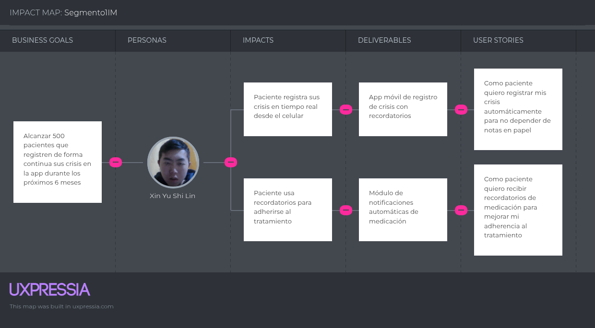
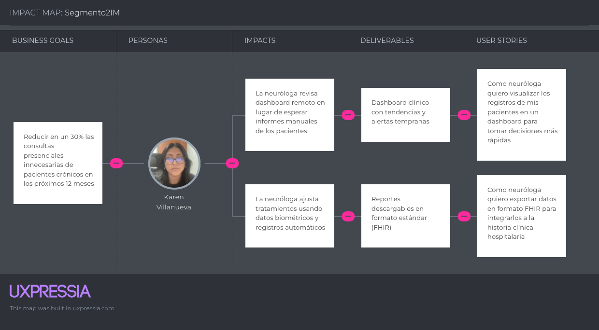
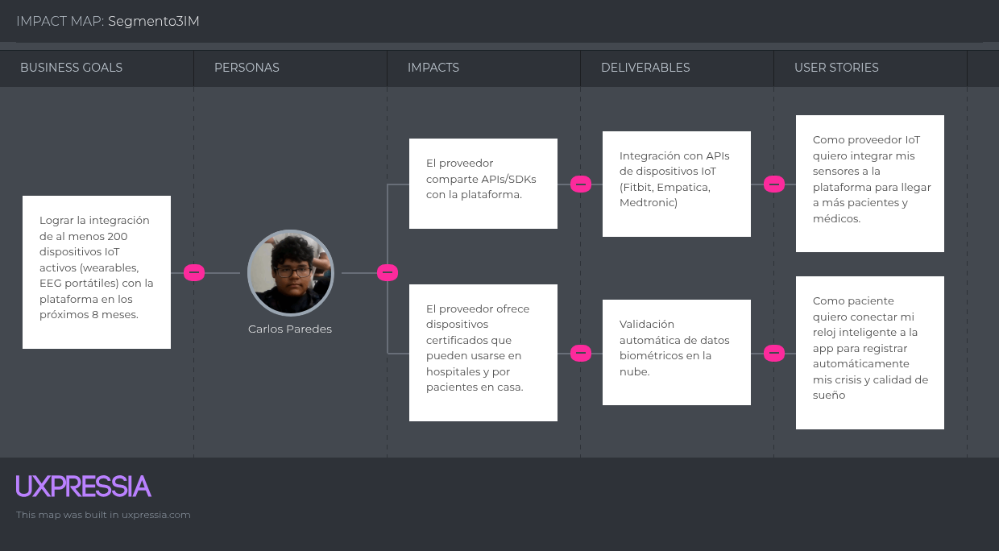

# Capítulo III: Requirements Specification  

## 3.1. User Stories.  

### Lista de Epicas  
| Epic ID | Tipo | Descripción (Como / quiero / para) | Nombre de la épica |
|--------|--------|--------------------------------------|----------------------|
| EP-01 | Funcional | Como **usuario (paciente o neurólogo)** quiero registrarme e iniciar sesión de forma segura (correo, teléfono, Google) para acceder a mis servicios clínicos digitales. | Autenticación y Gestión de Cuentas |
| EP-02 | Funcional | Como **profesional o paciente**, quiero editar y consultar mi perfil clínico para mantener información actualizada y útil. | Gestión de Perfiles Médicos |
| EP-03 | Funcional | Como **paciente o neurólogo**, quiero gestionar citas, disponibilidad y recordatorios para coordinar correctamente mis atenciones. | Agenda Médica y Citas |
| EP-04 | Funcional | Como **paciente**, quiero iniciar videollamadas confiables para recibir atención médica remota. | Teleconsulta y Videollamadas |
| EP-05 | Funcional | Como **paciente y neurólogo**, quiero compartir información clínica (mensajes, biomarcadores, recetas) para asegurar continuidad asistencial. | Comunicación y Registro Clínico |
| EP-06 | Funcional | Como **neurólogo**, quiero emitir recetas electrónicas y revisar historial médico para mejorar adherencia al tratamiento. | Recetas y Tratamientos |
| EP-07 | Funcional | Como **paciente**, quiero sincronizar mis dispositivos IoT para registrar automáticamente signos vitales. | Integración IoT y Monitoreo |
| EP-08 | Funcional / Seguridad | Como **sistema clínico**, quiero detectar anomalías críticas y enviar alertas con geolocalización para responder rápido ante emergencias. | Alertas y Respuesta Médica |
| EP-09 | No funcional / Seguridad | Como **administrador**, quiero garantizar cifrado, control de accesos, OTP y logs de auditoría para cumplir normas de privacidad. | Seguridad y Cumplimiento |
| EP-10 | No funcional / Rendimiento | Como **usuario**, quiero que el sistema responda rápido y escale bajo demanda para garantizar disponibilidad constante. | Escalabilidad y Performance |
| EP-11 | Funcional / Analítica | Como **neurólogo**, quiero dashboards con IA para interpretar datos históricos y patrones clínicos. | Analítica Médica con IA |
| EP-12 | Funcional / UX | Como **usuario**, quiero personalizar interfaz (tema, fuente, accesibilidad) para usar la plataforma cómodamente. | Personalización y Accesibilidad |
| EP-13 | Funcional / Contenido | Como **visitante**, quiero información clara (hero, how-it-works, features) para entender el valor antes de registrarme. | Landing – Contenido Principal |
| EP-14 | Funcional / UI | Como **usuario**, quiero una navegación responsive para moverme entre secciones en cualquier dispositivo. | Navegación y Responsive |
| EP-15 | Funcional / Conversión | Como **visitante**, quiero formularios y footer para contactar o solicitar información fácilmente. | Contacto y Conversión |
| EP-16 | No funcional / Técnica | Como **SEO/Marketing**, quiero una landing rápida y optimizada para buen ranking y experiencia. | Performance y SEO |
| EP-17 | Funcional / Técnico | Como **equipo de marketing**, quiero un CMS para actualizar contenidos sin despliegue técnico. | CMS y Gestión de Contenido |
| EP-18 | No funcional / Legal | Como **usuario**, quiero controles de privacidad, cookies y cumplimiento WCAG para usar el sistema con seguridad. | Privacidad y Accesibilidad |
| EP-19 | No funcional / Calidad | Como **equipo de desarrollo**, quiero definir estrategias de prueba para asegurar calidad en cada entrega. | Estrategia de Pruebas |
| EP-20 | No funcional / QA | Como **QA Engineer**, quiero diseñar casos de prueba para asegurar funcionamiento correcto. | Pruebas Unitarias e Integración |
| EP-21 | No funcional / Validación | Como **equipo**, quiero validar requisitos funcionales y no funcionales antes de cada entrega. | Validación de Requisitos |
| EP-22 | No funcional / Documentación | Como **usuario**, quiero acceder a guías, manuales y documentación del sistema. | Documentación y Ayuda |
| EP-23 | No funcional / Soporte | Como **usuario**, quiero soporte y FAQ para resolver dudas de uso. | Soporte y Atención a Usuario |
| EP-24 | No funcional / Gestión | Como **administrador**, quiero monitorear métricas del sistema (carga, errores, rendimiento). | Monitoreo y Gestión |
| EP-25 | No funcional / Métricas | Como **administrador**, quiero analizar métricas de calidad para identificar mejoras. | Métricas y Calidad |
| EP-26 | No funcional / Mantenimiento | Como **plataforma**, quiero procesos de mantenimiento, actualizaciones y optimización continua. | Mantenimiento y Continuidad |

### Listas de historias de usuario
| ID (HU) | Título | Descripción (Como / quiero / para) | Criterios de aceptación (Gherkin incluido) | Epic-ID |
|--------|--------|--------------------------------------|----------------------------------------------|---------|
| US-01 | Inicio de sesión | Como usuario (paciente o neurólogo) quiero iniciar sesión con credenciales válidas para acceder de forma segura a mi cuenta y servicios personalizados. | **Escenario A (inicio exitoso):** Given usuario registrado; When ingresa credenciales válidas y presiona “Iniciar sesión”; Then el sistema autentica y redirige al panel correspondiente. **Escenario B (credenciales inválidas):** Given usuario ingresa contraseña incorrecta; When intenta iniciar; Then sistema muestra error y no permite acceso. | EP-01 |
| US-02 | Registro de paciente | Como paciente quiero registrarme con mis datos personales para crear una cuenta y acceder a servicios de atención neurológica remota. | **Escenario A (registro válido):** Given formulario con datos válidos; When envía; Then la cuenta se crea, se envía verificación y se muestra confirmación. **Escenario B (correo duplicado):** Given correo existente; When intenta registrarse; Then sistema indica que debe ingresar un correo distinto. | EP-01 |
| US-03 | Registro de neurólogo | Como neurólogo quiero registrarme ingresando mis credenciales profesionales para acceder al panel clínico y ofrecer consultas remotas. | **Escenario A (licencia válida):** Given neurólogo ingresa datos y licencia válida; When registra; Then sistema marca cuenta como “pendiente de validación” y envía notificación. **Escenario B (licencia inválida):** Given número de licencia inválido; When registra; Then sistema solicita documentación adicional. | EP-01 |
| US-04 | Datos de usuario | Como usuario (paciente o neurólogo) quiero actualizar mis datos personales para mantener mi información vigente y correcta. | **Escenario A (actualización correcta):** Given usuario autenticado; When guarda datos válidos; Then sistema actualiza perfil. **Escenario B (datos inválidos):** Given usuario envía email inválido; When guarda; Then sistema muestra errores de validación. | EP-01 |
| US-05 | Ver agenda de citas | Como paciente quiero visualizar las citas programadas para conocer fecha, hora y neurólogo asignado. | **Escenario A (citas existentes):** Given citas registradas; When abre Agenda; Then sistema lista citas con fecha/hora/profesional. **Escenario B (sin citas):** Given no hay citas; When abre Agenda; Then sistema muestra mensaje vacío y CTA para solicitar cita. | EP-02 |
| US-06 | Solicitar nueva cita | Como paciente quiero solicitar una nueva cita eligiendo fecha y hora disponibles para recibir atención médica remota. | Escenario A (solicitud exitosa): Given hay franjas libres; When selecciono fecha/hora y confirmo; Then se crea cita en estado pendiente y se notifica al neurólogo. Escenario B (conflicto): Given franja ocupada simultáneamente; When confirmo; Then sistema informa no disponible y sugiere alternativas. | EP-03 |
| US-07 | Definir disponibilidad horaria | Como neurólogo quiero configurar mis horarios disponibles para que los pacientes puedan solicitar citas. | Escenario A (válido): Given horarios sin solapamientos; When guardo; Then sistema publica disponibilidad. Escenario B (solapamiento): Given horarios se traslapan; When guardo; Then sistema muestra error de conflicto. | EP-03 |
| US-08 | Consulta por videollamada | Como paciente quiero iniciar videollamada con mi neurólogo para recibir atención remota. | Escenario A (éxito): Given hora de la cita; When presiono “Iniciar videollamada”; Then se establece sesión WebRTC estable. Escenario B (neurólogo ausente): Given profesional no conectado; When inicio llamada; Then sistema notifica indisponibilidad y permite dejar mensaje. | EP-04 |
| US-09 | Emitir receta electrónica | Como neurólogo quiero generar recetas médicas electrónicas para que el paciente pueda adquirir medicación. | Escenario A (válida): Given campos completos; When confirmo receta; Then se crea, se firma digitalmente y se notifica al paciente. Escenario B (incompleto): Given datos faltantes; When guardo; Then sistema muestra errores. | EP-06 |
| US-10 | Consultar recetas | Como paciente quiero visualizar y descargar mis recetas para acceder a prescripciones anteriores. | Escenario A (con recetas): Given recetas registradas; When accedo a “Recetas”; Then veo lista y opción de PDF. Escenario B (sin recetas): Given ninguna receta; When abro sección; Then se muestra mensaje de ausencia. | EP-06 |
| US-11 | Chat con neurólogo | Como paciente quiero enviar mensajes al neurólogo para resolver dudas entre consultas. | Escenario A (envío válido): Given mensaje no vacío; When envío; Then sistema entrega al profesional y notifica. Escenario B (mensaje vacío): Given input vacío; When envío; Then sistema bloquea envío y muestra validación. | EP-05 |
| US-12 | Visualizar ubicación del paciente | Como neurólogo quiero visualizar ubicación aproximada del paciente (con permiso) durante consulta para contexto clínico. | Escenario A (permiso otorgado): Given paciente habilitó geolocalización; When neurólogo consulta; Then sistema muestra posición. Escenario B (sin permiso): Given permiso no otorgado; When consulta; Then sistema indica no disponible. | EP-08 |
| US-13 | Integrar dispositivo IoT | Como paciente quiero vincular mi dispositivo IoT para registrar automáticamente datos biométricos. | Escenario A (emparejamiento válido): Given dispositivo compatible; When lo vinculo; Then sistema recibe y registra datos. Escenario B (fallo): Given credenciales IoT inválidas; When emparejo; Then sistema muestra error. | EP-07 |
| US-14 | Alertas automáticas | Como paciente quiero recibir alertas automáticas si mis biomarcadores indican valores críticos. | Escenario A (alerta real): Given valor excede umbral; When detectado; Then se envía alerta inmediata. Escenario B (falsa alarma): Given dato inconsistente; When detectado; Then no envía alerta y marca para revisión. | EP-08 |
| US-15 | Seguridad y encriptación | Como plataforma quiero cifrar datos sensibles y registrar auditorías para proteger información clínica. | Escenario A (comunicación segura): Given envío datos; When transmito; Then canal es HTTPS/TLS. Escenario B (intento sospechoso): Given patrón anómalo; When detectado; Then sistema bloquea e informa. | EP-09 |
| US-16 | Rendimiento | Como usuario quiero que la plataforma cargue rápido para una experiencia fluida. | Escenario A (normal): Given carga promedio; When navego; Then respuesta <2s. Escenario B (picos): Given alta concurrencia; When carga; Then mantiene estabilidad. | EP-10 |
| US-17 | Privacidad de datos | Como paciente quiero que mis datos se anonimicen cuando sea requerido para cumplir normativas. | Escenario A (consentimiento válido): Given lo otorgo; When datos se procesan; Then anonimización ocurre según ley. Escenario B (solicito eliminación): Given pido borrar; When proceso; Then datos se eliminan o anonimizan. | EP-09 |
| US-18 | Analítica con IA | Como neurólogo quiero informes basados en IA para interpretar patrones clínicos. | Escenario A (suficientes datos): Given historial completo; When IA procesa; Then genera reporte. Escenario B (datos insuficientes): Given historial parcial; When solicito; Then sistema informa falta de datos. | EP-11 |
| US-19 | Recordatorios de citas | Como paciente quiero recibir recordatorios automáticos para asistir a mis citas. | Escenario A (recordatorio enviado): Given cita en 24h; When sistema ejecuta recordatorio; Then se envía email/SMS. Escenario B (cancelada): Given cita cancelada; When actualiza; Then no se envía recordatorio. | EP-03 |
| US-20 | Personalización UI | Como usuario quiero personalizar la interfaz para adaptarla a mis necesidades. | Escenario A (preferencia válida): Given selecciono tema; When guardo; Then cambios persisten. Escenario B (no soportado): Given dispositivo no soporta tamaño fuente; When aplico; Then sistema notifica incompatibilidad. | EP-12 |
| US-21 | Navegación responsive | Como visitante quiero navegar fácilmente desde cualquier dispositivo. | Escenario A (desktop): Given vista PC; When cargo página; Then menú horizontal visible. Escenario B (móvil): Given vista móvil; When pulso menú; Then menú se despliega correctamente. | EP-14 |
| US-22 | How it works | Como visitante quiero ver pasos claros que expliquen el flujo de registro y uso. | Escenario A (contenido visible): Given landing cargada; When navego a sección; Then veo pasos con título y descripción. Escenario B (lectores pantalla): Given accesibilidad activa; When leo; Then se respetan etiquetas. | EP-13 |
| US-23 | Features Cards | Como visitante quiero ver tarjetas de features para explorar servicios. | Escenario A (hover): Given desktop; When paso cursor; Then card muestra detalle. Escenario B (clic): Given interacción; When selecciono; Then se abre detalle ampliado. | EP-22 |
| US-24 | About / Who we are | Como visitante quiero conocer al equipo para validar credibilidad. | Escenario A (visible): Given landing; When abro sección; Then información aparece alineada. Escenario B (descarga): Given usuario imprime; When descarga; Then sección se muestra limpia. | EP-23 |
| US-25 | Beneficios | Como decisor institucional quiero ver beneficios clínicos y comerciales para evaluar el caso. | Escenario A (listado): Given landing; When entro; Then veo beneficios para pacientes/empresas. Escenario B (CTA): Given interesado; When clic; Then se abre formulario de contacto. | EP-22 |
| US-26 | Formulario de contacto | Como visitante quiero enviar formulario con validaciones para contactar al equipo. | Escenario A (válido): Given campos completos; When envío; Then se genera registro y notificación. Escenario B (inválido): Given email erróneo; When envío; Then se muestran errores. | EP-15 |
| US-27 | Footer con enlaces | Como visitante quiero acceder a enlaces y redes desde el footer. | Escenario A (funciona): Given clic en enlace; When selecciono; Then abre página destino. Escenario B (accesibilidad): Given uso teclado; When tabulo; Then enlaces accesibles. | EP-15 |
| US-28 | Responsive mobile | Como usuario móvil quiero que la landing sea totalmente adaptable. | Escenario A (pantallas pequeñas): Given <768px; When cargo; Then diseño reorganiza columnas. Escenario B (tablet): Given tablet; When giro pantalla; Then navegación sigue usable. | EP-24 |
| US-29 | Optimización de imágenes | Como usuario quiero que la landing cargue rápido con imágenes optimizadas. | Escenario A (inicial): Given primera carga; When renderiza; Then imágenes lazy-load. Escenario B (scroll): Given desplazamiento; When imágenes aparecen; Then no saltan layout. | EP-24 |
| US-30 | SEO básico | Como marketing quiero meta tags correctos para mejorar posicionamiento. | Escenario A (head correcto): Given inspecto; When reviso; Then title/OG/tags correctos. Escenario B (redes): Given URL compartida; When preview; Then descripción e imagen correctas. | EP-16 |
| US-31 | Cookie consent | Como visitante quiero aceptar/rechazar cookies según mis preferencias. | Escenario A (aceptar): Given primera visita; When acepto; Then se habilitan cookies permitidas. Escenario B (rechazar): Given rechazo; When navego; Then cookies no esenciales deshabilitadas. | EP-18 |
| US-32 | Tracking & Analytics | Como product owner quiero medir clicks y conversiones para optimizar. | Escenario A (CTA): Given visitante hace clic; When ocurre; Then evento se registra. Escenario B (form submit): Given formulario válido; When envío; Then registra conversión. | EP-25 |
| US-33 | Login con teléfono | Como usuario quiero iniciar sesión con mi número de teléfono sin usar contraseña. | Escenario A (teléfono registrado): Given número válido; When solicito OTP; Then ingreso código y accedo. Escenario B (nuevo): Given número no registrado; When solicito OTP; Then sistema crea cuenta básica y pide completar perfil. | EP-01 |
| US-34 | Verificación OTP | Como usuario quiero verificar mi número usando OTP para seguridad. | Escenario A (correcto): Given OTP válido; When ingreso; Then verifico acceso. Escenario B (incorrecto): Given OTP erróneo; When ingreso; Then sistema bloquea intentos tras límite. | EP-09 |
| US-35 | Login con Google | Como usuario quiero autenticarme con Google para acceder rápidamente. | Escenario A (nuevo usuario): Given cuenta Google nueva; When autorizo; Then sistema crea cuenta vinculada. Escenario B (existente): Given correo ya registrado; When ingreso por Google; Then vincula sesión sin duplicados. | EP-01 |
| US-36 | Consentimiento SMS | Como usuario quiero dar/revocar consentimiento para uso de SMS. | Escenario A (otorgado): Given activo consentimiento; When habilito SMS; Then se envían OTP/alertas. Escenario B (revocado): Given retiro consentimiento; When ejecuto función; Then SMS se bloquean. | EP-18 |
| US-37 | Protección OTP | Como plataforma quiero aplicar rate-limit y monitoreo para evitar abuso de OTP. | Escenario A (límite envíos): Given muchos OTP solicitados; When supera umbral; Then bloquea temporalmente. Escenario B (fraude): Given intentos masivos; When detectados; Then bloquea IP/número. | EP-26 |
| US-38 | Auditoría sensible | Como administrador quiero registrar en audit log eventos sensibles. | Escenario A (login): Given inicio sesión; When ocurre; Then se registra evento. Escenario B (creación receta): Given receta emitida; When generada; Then se registra en log. | EP-09 |
| US-39 | OBTENER perfil | Como usuario quiero consultar mi perfil clínico para verificar información. | Escenario A (correcto): Given autenticado; When consulto; Then veo datos clínicos. Escenario B (incompleto): Given faltan datos; When consulto; Then indica campos faltantes. | EP-02 |
| US-40 | Login (JWT) | Como usuario quiero iniciar sesión y recibir tokens JWT para consumir APIs protegidas. | Escenario A (correcto): Given credenciales válidas; When POST/login; Then recibo accessToken y refreshToken. Escenario B (inválido): Given credenciales erróneas; When login; Then 401. | EP-01 |
| US-41 | Refresh token | Como usuario quiero refrescar mi sesión usando refresh token sin autenticarme otra vez. | Escenario A (refresh válido): Given refresh válido; When POST/refresh; Then recibo nuevo token. Escenario B (revocado): Given refresh revocado; When uso; Then 401 y registro en auditoría. | EP-09 |
| US-42 | Logout | Como usuario quiero cerrar sesión y revocar refresh token. | Escenario A (correcto): Given autenticado; When POST/logout; Then tokens revocados. Escenario B (token ya revocado): Given token revocado; When logout; Then respuesta 200 idempotente. | EP-09 |
| US-43 | Recuperar contraseña | Como usuario quiero recuperar acceso mediante token seguro. | Escenario A (solicitud): Given correo válido; When POST/forgot; Then sistema envía token. Escenario B (reset): Given token válido; When POST/reset; Then actualiza contraseña. | EP-01 |
| US-44 | Cambiar contraseña | Como usuario quiero cambiar mi contraseña para mantener seguridad. | Escenario A (válido): Given oldPassword correcto; When POST/change; Then sistema actualiza hash. Escenario B (incorrecto): Given oldPassword incorrecto; When intento cambiar; Then 400. | EP-01 |
| US-45 | Roles y permisos | Como sistema quiero gestionar roles (asignar/ver/quitar) para controlar acceso. | Escenario A (consulta): Given JWT con claims; When GET/roles; Then lista permisos. Escenario B (asignar): Given admin; When POST/roles; Then asigna rol y registra auditoría. | EP-09 |
| US-46 | Obtener perfil (API) | Como usuario quiero obtener mi perfil a través de API. | Escenario A (válido): Given autenticado; When GET/me; Then retorno datos completos. Escenario B (incompleto): Given faltan campos; When consulto; Then profileComplete=false. | EP-02 |
| US-47 | Editar perfil (API) | Como usuario quiero actualizar campos de mi perfil mediante API. | Escenario A (válido): Given autenticado; When PATCH/me; Then actualiza campos. Escenario B (permiso denegado): Given intento modificar campo restringido; When PATCH; Then 403. | EP-02 |
| US-48 | Crear receta (API) | Como neurólogo quiero crear recetas electrónicas firmadas desde API. | Escenario A (válido): Given rol NEUROLOGIST; When POST/recipes; Then receta creada y firmada. Escenario B (prohibido): Given rol no válido; When POST; Then 403. | EP-06 |
| US-49 | Listar recetas | Como paciente o neurólogo quiero listar recetas emitidas. | Escenario A (paciente): Given autenticado; When GET/recipes; Then lista recetas con enlaces PDF. Escenario B (neurólogo): Given profesional; When GET/recipes/{id}; Then visualiza receta completa. | EP-06 |
| US-50 | Auditoría | Como administrador quiero visualizar y filtrar eventos del audit log. | Escenario A (consulta): Given admin; When GET/audit; Then retorno paginado. Escenario B (evento sensible): Given login exitoso; When auditoría; Then se registra. | EP-09 |
| US-51 | Protección OTP avanzada | Como plataforma quiero mitigar abuso implementando límites y bloqueo dinámico. | Escenario A (rate limit): Given múltiples solicitudes; When supera umbral; Then bloquea temporalmente. Escenario B (fraude): Given actividad sospechosa; When detectada; Then notifica y bloquea. | EP-26 |

## 3.2. Impact Mapping  

El presente apartado muestra los **Impact Maps** elaborados en **UXPressia**, uno por cada segmento objetivo del proyecto **AuraNeuro**.  
Esta técnica permitió vincular los **objetivos estratégicos del negocio digital (Business Goals)** con las **acciones esperadas de los usuarios (Impacts)**, los **entregables del producto (Deliverables)** y las **User Stories** que los harán posibles.  
El análisis se realizó siguiendo el formato propuesto por *Impact Mapping (Gojko Adzic, 2012)*, asegurando que los objetivos cumplan criterios **SMART** (específicos, medibles, alcanzables, relevantes y con tiempo definido).

---

### Metodología de elaboración  
1. Se revisaron los *User Personas* creados previamente para identificar cómo cada uno puede **contribuir a los objetivos del negocio**.  
2. Se definieron **Business Goals medibles** basados en los resultados esperados del MVP.  
3. Se formularon los **Impacts** como comportamientos o acciones observables que los usuarios deberían realizar.  
4. A partir de los *Impacts*, se definieron los **Deliverables**, es decir, las funcionalidades o productos digitales que el equipo de desarrollo debe construir.  
5. Finalmente, se redactaron **User Stories** en formato *“Como [rol], quiero [acción], para [beneficio]”*, que servirán de base para el *Product Backlog*.

---

### Impact Mapping – Segmento 1: Paciente (Epilepsia crónica)

**Business Goal (SMART):**  
> Alcanzar **500 pacientes activos** que registren de forma continua sus crisis neurológicas en la aplicación durante los **próximos 6 meses**.

**Síntesis:**  
El paciente **Xin Yu Shi Lin** necesita registrar crisis en tiempo real y recibir recordatorios automáticos para mejorar su adherencia al tratamiento.  
Las *User Stories* derivadas priorizan la **automatización del registro** y la **personalización de notificaciones médicas**.  
Esto permitirá medir el progreso del paciente y generar engagement sostenido en la app.

---

### Impact Mapping – Segmento 2: Profesional de la salud (Neuróloga especialista)

**Business Goal (SMART):**  
> Reducir en **30 %** las consultas presenciales innecesarias de pacientes neurológicos crónicos durante los **próximos 12 meses**.

**Síntesis:**  
La doctora **Karen Villanueva** busca optimizar su tiempo clínico y disponer de datos confiables para decisiones rápidas.  
Las historias de usuario se orientan al **uso de dashboards en tiempo real** y a la **exportación FHIR**, facilitando diagnósticos más precisos y disminuyendo la carga administrativa.

---

### Impact Mapping – Segmento 3: Proveedores IoT  

**Business Goal (SMART):**  
> Lograr la **integración de 200 dispositivos IoT activos** (wearables, EEG portátiles) con la plataforma **en los próximos 8 meses**.

**Síntesis:**  
El proveedor **Carlos Paredes** busca escalar sus productos al ecosistema médico mediante integraciones seguras.  
Los impactos propuestos impulsan la **colaboración B2B** a través de APIs y SDKs abiertos, reforzando la interoperabilidad y la validación automática de datos biométricos.

---

### Interpretación general  

| **Dimensión** | **Hallazgo transversal** | **Implicancia para el MVP de AuraNeuro** |
|----------------|---------------------------|-------------------------------------------|
| **Alineación estratégica** | Todos los segmentos contribuyen a objetivos medibles y alcanzables. | Las metas SMART permiten monitorear el progreso de adopción y valor. |
| **Ecosistema conectado** | Los tres actores (paciente, médico, proveedor) dependen de datos sincronizados. | Se debe priorizar interoperabilidad IoT + FHIR desde la primera versión. |
| **Entrega de valor** | Cada Deliverable representa una funcionalidad crítica validada por usuarios. | Los User Stories se convierten en base directa para el *Product Backlog*. |

---

### Conclusión  

El **Impact Mapping** permitió visualizar cómo cada *User Persona* contribuye de manera medible al éxito del negocio digital de **AuraNeuro**.  
Las relaciones entre *Goals–Impacts–Deliverables–User Stories* garantizan que el desarrollo del MVP mantenga **enfoque, trazabilidad y alineación con los resultados clínicos y de negocio**.

---

## 3.3. Product Backlog.

#  Plataforma AuraNeuro

# Product Backlog – AuraNeuro (Ordenado por Valor de Negocio)

| # Orden | User Story ID | Título | Descripción (Como / deseo / para) | Story Points |
|--------|----------------|--------|------------------------------------|--------------|
| 1 | US-21 | Navegación responsive | Como visitante deseo una navegación clara y adaptable para acceder a secciones clave desde cualquier dispositivo. | 3 |
| 2 | US-22 | Sección “How it works” | Como visitante deseo ver pasos claros para comprender el flujo de registro y uso del servicio. | 2 |
| 3 | US-23 | Features Cards | Como visitante deseo ver tarjetas de beneficios para entender los servicios disponibles. | 3 |
| 4 | US-24 | About / Who we are | Como visitante deseo conocer al equipo para validar confianza y credibilidad. | 2 |
| 5 | US-26 | Formulario de contacto | Como visitante deseo contactar al equipo mediante un formulario validado. | 3 |
| 6 | US-27 | Footer con enlaces | Como visitante deseo acceder rápidamente a políticas, redes y contactos desde el footer. | 2 |
| 7 | US-31 | Cookie consent | Como visitante deseo aceptar/rechazar cookies para controlar el manejo de mis datos. | 3 |
| 8 | US-01 | Inicio de sesión | Como usuario registrado deseo iniciar sesión para acceder a mis datos y servicios. | 2 |
| 9 | US-02 | Registro de paciente | Como paciente deseo registrarme para crear una cuenta y acceder a atención neurológica remota. | 3 |
| 10 | US-03 | Registro de neurólogo | Como neurólogo deseo registrarme con credenciales verificadas para ofrecer consultas. | 3 |
| 11 | US-20 | Personalización UI | Como usuario deseo personalizar la interfaz para mejorar mi accesibilidad. | 2 |
| 12 | US-33 | Login con teléfono | Como usuario deseo iniciar sesión usando número celular y OTP. | 5 |
| 13 | US-35 | Login con Google OAuth | Como usuario deseo ingresar con mi cuenta de Google para agilizar acceso. | 3 |
| 14 | US-05 | Ver agenda de citas | Como paciente deseo ver mis citas programadas para organizar mis atenciones. | 2 |
| 15 | US-06 | Solicitar nueva cita | Como paciente deseo solicitar una cita eligiendo fecha/hora disponible. | 3 |
| 16 | US-07 | Definir disponibilidad | Como neurólogo deseo definir mis horarios para habilitar citas. | 3 |
| 17 | US-19 | Recordatorios de citas | Como paciente deseo recibir recordatorios automáticos de mis próximas citas. | 2 |
| 18 | US-08 | Consulta por videollamada | Como paciente deseo conectarme mediante videollamada con mi neurólogo. | 8 |
| 19 | US-11 | Chat con neurólogo | Como paciente deseo comunicarme por chat para resolver dudas entre consultas. | 5 |
| 20 | US-10 | Consultar recetas | Como paciente deseo ver mis recetas y descargarlas en PDF. | 2 |
| 21 | US-09 | Emitir receta médica | Como neurólogo deseo generar y firmar recetas electrónicas. | 5 |
| 22 | US-12 | Visualizar ubicación del paciente | Como neurólogo deseo ver la ubicación aproximada del paciente (con permiso). | 3 |
| 23 | US-13 | Integración IoT | Como paciente deseo vincular un dispositivo IoT para registrar biomarcadores automáticamente. | 8 |
| 24 | US-14 | Alertas automáticas | Como paciente deseo recibir alertas si mis biomarcadores indican riesgo. | 8 |
| 25 | US-18 | Analítica médica con IA | Como neurólogo deseo dashboards con IA para interpretar patrones clínicos. | 8 |
| 26 | US-29 | Optimización de imágenes | Como usuario deseo carga rápida con imágenes optimizadas. | 2 |
| 27 | US-28 | Responsive mobile | Como usuario móvil deseo que la landing se adapte totalmente. | 3 |
| 28 | US-30 | SEO básico | Como marketing deseo meta tags correctos para mejorar posicionamiento. | 2 |
| 29 | US-32 | Tracking & Analytics | Como product owner deseo registrar eventos para optimizar conversión. | 3 |
| 30 | US-15 | Seguridad y encriptación | Como plataforma deseo cifrar datos para proteger la información clínica. | 5 |
| 31 | US-17 | Privacidad de datos | Como paciente deseo garantizar confidencialidad y anonimización de mis datos. | 5 |
| 32 | US-36 | Consentimiento SMS | Como usuario deseo otorgar/revocar consentimiento de notificaciones por SMS. | 3 |
| 33 | US-37 | Protección OTP avanzada | Como plataforma deseo aplicar rate-limits y detección de fraude. | 5 |
| 34 | US-50 | Auditoría de acciones sensibles | Como administrador deseo registrar eventos críticos para trazabilidad. | 5 |
| 35 | US-40 | Login JWT | Como usuario deseo recibir tokens JWT para consumir APIs seguras. | 3 |
| 36 | US-41 | Refresh token | Como usuario deseo renovar sesión mediante refresh token. | 2 |
| 37 | US-42 | Logout | Como usuario deseo cerrar sesión y revocar tokens de forma segura. | 2 |
| 38 | US-43 | Recuperar contraseña | Como usuario deseo recuperar mi cuenta mediante token seguro. | 3 |
| 39 | US-44 | Cambiar contraseña | Como usuario deseo actualizar mi contraseña para mantener seguridad. | 2 |
| 40 | US-45 | Roles y permisos | Como sistema deseo asignar/ver/quitar roles para controlar accesos. | 3 |
| 41 | US-39 | Obtener perfil (API) | Como usuario deseo consultar mi perfil clínico desde API. | 2 |
| 42 | US-46 | Obtener perfil (me) | Como usuario deseo ver mis datos desde endpoint dedicado. | 2 |
| 43 | US-47 | Editar perfil (API) | Como usuario deseo actualizar campos mediante API. | 3 |
| 44 | US-48 | Crear receta (API) | Como neurólogo deseo generar recetas firmadas desde el backend. | 5 |
| 45 | US-49 | Listar recetas por API | Como paciente o neurólogo deseo listar recetas desde backend. | 3 |
| 46 | US-25 | Beneficios “Good for Business” | Como decisor deseo ver beneficios clínicos y comerciales. | 3 |
| 47 | US-16 | Rendimiento | Como usuario deseo que la plataforma cargue rápido incluso con alta concurrencia. | 5 |
| 48 | US-38 | Auditoría sensible | Como administrador deseo registrar eventos críticos del sistema. | 3 |
| 49 | US-51 | Protección OTP avanzada (backend) | Como plataforma deseo bloquear intentos sospechosos de OTP. | 5 |
| 50 | US-34 | Verificación OTP | Como usuario deseo validar mi número mediante SMS/OTP. | 3 |
| 51 | US-33 | Autenticación por teléfono | Como usuario deseo autenticación rápida basada en celular. | 5 |

