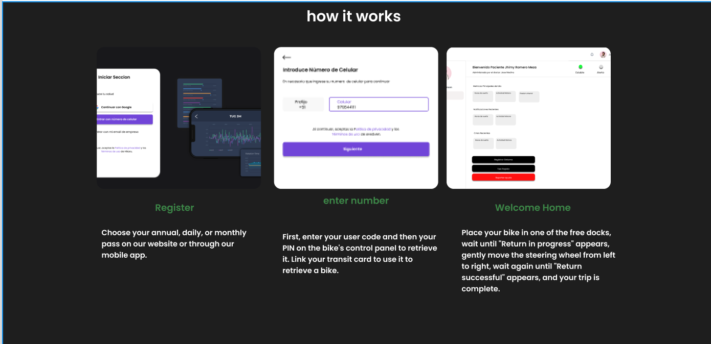
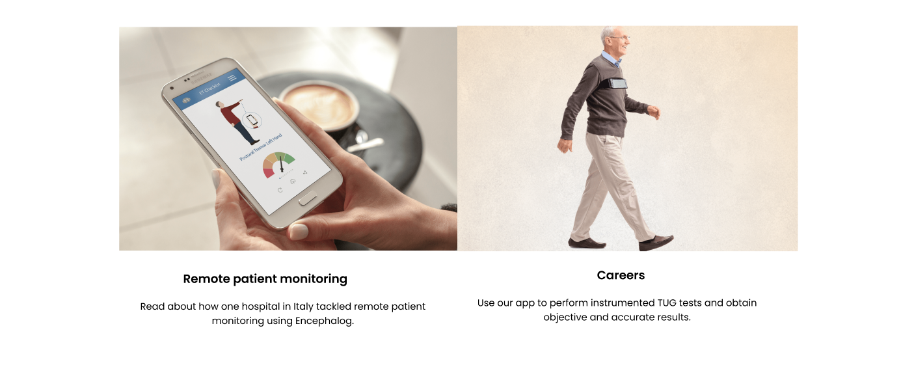

# Capítulo IV: Product Design  

## 4.1. Style Guidelines.  

### 4.1.1. General Style Guidelines.  

**Branding**

El logo de Aura Neuro sintetiza la esencia de innovación y confianza en el cuidado neurológico remoto. La tipografía moderna en verde vital y negro sólido refleja equilibrio entre salud, tecnología y profesionalismo.  

El concepto de “aura” transmite cercanía y bienestar, mientras que “neuro” refuerza el enfoque científico en el sistema nervioso.  
La simplicidad del diseño asegura legibilidad en cualquier soporte digital o físico, desde dispositivos móviles hasta presentaciones clínicas.  

El conjunto proyecta confianza médica, innovación tecnológica y humanización de la salud digital.  

  
  

**Variantes de logo**  

Logo original → Verde + negro sobre fondo blanco (uso principal en web).  
  

Logo invertido → Blanco sobre fondo negro/azul (para headers o footers oscuros).  
  

Logo minimal → Solo “Aura” o solo el ícono (para favicon y apps móviles).  

**Typography**  

La tipografía de Aura Neuro debe transmitir tecnología, claridad y accesibilidad.  
Se recomienda usar fuentes sans-serif limpias que comuniquen modernidad y precisión científica:  

- Fuente principal: Poppins o Inter (para títulos y subtítulos).  

- Poppins Bold en H1 (ej. “La neurología a distancia ya está aquí”).  

- Poppins Medium en H2.  

- Fuente secundaria: Roboto (para cuerpo de texto).  

- Roboto Regular en descripciones.  

- Roboto Light en textos secundarios.  

- El contraste de peso permite jerarquizar fácilmente la información sin saturar la interfaz.  

El lenguaje debe ser profesional pero cercano, evitando tecnicismos innecesarios y usando un tono tranquilo y confiable, ideal para pacientes y médicos.  

**Paleta de colores**  
La paleta de Aura Neuro combina la confianza médica con la innovación tecnológica:  
 

### 4.1.2. Web Style Guidelines.  

A continuación se presenta la sección 4.1.2 Web Style Guidelines preparada para incluir en el informe de Aura Neuro. Está redactada en formato Markdown y lista para pegar en tu documento. Contiene directrices de diseño visual, experiencia de usuario, accesibilidad, rendimiento y consideraciones de implementación web para mantener coherencia en la interfaz pública y en el área de usuarios autenticados.  

**Propósito**  

Las directrices de estilo web definen las normas visuales, de interacción y técnicas que deben seguirse en todo el sitio web y la aplicación web de Aura Neuro. El objetivo es asegurar una experiencia coherente, accesible, profesional y confiable para pacientes, médicos y administradores, preservando al mismo tiempo la privacidad y seguridad de los datos clínicos.  

**1. Tono y voz**  

El texto de la plataforma debe mantener un lenguaje profesional, claro y empático. En contenido público (landing, blog) el tono puede ser divulgativo y persuasivo; en áreas clínicas (dashboard, reportes) el lenguaje debe ser técnico, preciso y neutral. Evitar jergas innecesarias y siempre definir términos médicos la primera vez que aparecen.  

**2. Sistema de retícula y layout**  

- Retícula base: 12 columnas para desktop, con gutters de 24px y un contenedor máximo de 1200px.  

- Espaciado: usar una escala modular (ej. 4px, 8px, 16px, 24px, 32px, 48px).  

- Alineación: contenido principal centrado; sidebars sólo cuando aporten valor (p. ej. historial breve, acciones rápidas).  

- Hero / Landing: sección hero full-width con hero-image optimizada y CTA destacado.  

- Cards: tarjetas uniformes para dispositivos, reportes y profesionales; sombra suave y bordes redondeados (4–12px).  

**3. Logo y marca en la web**  

- Usar logo principal (verde+negro) en header claro; versión invertida en headers oscuros.  

- Espacio mínimo alrededor del logo: 16px o 2x altura del icono.  

- Usar favicon (32×32) y versión para Apple Touch.  

- No distorsionar, recolorear o añadir sombras al logo sin aprobación.  

**4. Imágenes, gráficos y multimedia**  

- Fotografía: estilo humano y cercano; evitar escenas clínicamente invasivas. Priorizar imágenes con diversidad de edad y género.  

- Gráficas: consistentes (mismos ejes, colores para métricas), incluir leyenda y alt descriptivo.  

- Formatos: WebP para imágenes, SVG para iconos e ilustraciones.  

- Tamaños: hero ≤ 500 KB optimizado, thumbnails ≤ 100 KB. Usar srcset para responsive images.  

- Vídeo: utilizar streaming / embed de player con reproducción segura; no autoload de cámaras en páginas públicas.  

**5. Iconografía**  

- Iconos simples, lineales (stroke) y con relleno cuando sea necesario.  

- Siempre acompañar icono con etiqueta textual (icon + label) para accesibilidad.  

- Mantener set consistente (ej. Heroicons, Material Icons) y usar cache de sprites/SVG.  

**6. Microinteracciones y animaciones**  

- Animaciones cortas (< 200ms para microinteracciones; < 400ms para transiciones de página).  

- Evitar animaciones que causen movimiento excesivo (respect prefers-reduced-motion).  
 
- Feedback inmediato para acciones del usuario (toasts, loaders).  

**7. Feedback, errores y mensajes**  

- Mensajes de error claros, no técnicos: explicar la causa y la acción recomendada.  

- Uso de toasts para acciones completadas (Guardado correctamente) y modales para confirmaciones críticas.  

- Logs para admins con trazas; para usuarios, mensajes simplificados.  

**8. Formularios críticos y consentimiento**  

- Formularios que recojan datos sensibles deben incluir consentimiento explícito y checkbox no preseleccionado.  

- Mostrar enlace a Política de Privacidad y Términos antes de enviar datos sensibles.  

- Almacenar solo el mínimo de datos necesarios y mostrar al usuario cómo serán usados.  

**9. Testing y calidad**  

- Tests visuales (regresión visual), pruebas de accesibilidad automatizadas (axe), pruebas E2E (Cypress/Playwright) para flujos críticos.  

- Revisiones de copy por experto clínico en páginas con contenido médico.  

- Checklist de lanzamiento: accesibilidad, privacidad (noindex en PHI), performance, tests E2E.  

**10. Versionado de UI y componentes**  

- Mantener una librería de componentes (component library) versionada (Storybook).  

- Documentar tokens (colores, tipografías, espaciados) y patrones (header, card, modal).  

- Usar naming convention CSS (BEM o utility-first con Tailwind) coherente en el proyecto. 

## 4.2. Information Architecture.  

A continuación se describen las decisiones y directrices para la arquitectura de la información de Aura Neuro (plataforma de neurología digital con IoT y telemedicina). Cada apartado está orientado a que el informe quede listo para implementación: estructura de contenido, etiquetado, accesibilidad, y recomendaciones SEO/meta tags cuidando la privacidad médica. 

### 4.2.1. Organization Systems.  

**Estructura jerárquica (sitemap lógico)**  

La plataforma se organiza en dos grandes dominios: Front (Landing / Marketing) y App (Usuarios autenticados: Pacientes / Médicos / Admins).  

**Landing / Marketing (index público)**  

- Home (Landing)  

- Cómo funciona  

- Tecnología / Dispositivos  

- Casos de uso / Beneficios  

- Equipo / Quiénes somos  

- Blog / Recursos  

- Contacto / Solicitar demo  

- Política de privacidad / Términos  

**App / Panel autenticado**  

- Dashboard (Inicio del usuario) — noindex por privacidad  

- Mis datos / Perfil  

- Dispositivos conectados  

- Monitor (datos en tiempo real) — noindex  

- Historial de episodios / Reportes — noindex  

- Teleconsulta / Agenda  

- Mensajería / Chats — noindex  

- Configuración / Preferencias  

- Admin: Gestión de dispositivos, usuarios, roles, integraciones (API, EHR)  

**Principios de organización**  

- Mobile-first: estructura priorizando navegación y pantallas móviles.  

- Progressive Disclosure: mostrar primero información esencial; opciones avanzadas bajo subsecciones.  

- Role-based Partitioning: vista y navegación adaptadas por rol (paciente, médico, admin).  

- Separación marketing / clínico: contenido público optimizado para SEO; contenido clínico restringido y protegido.  

- URLs limpias y semánticas: /, /como-funciona, /dispositivos/eeg-portatil, /app/dashboard.  

**Flujos y accesos**  

- Usuario no autenticado: landing → información → registro / solicitar demo.  

- Usuario autenticado (paciente): login → Dashboard → Monitor / Registrar síntoma → Teleconsulta.  

- Médico: login → Dashboard profesional → Panel de riesgo → Consultas.  

- Admin: panel con gestión de flota IoT, usuarios, logs y parámetros de IA.  

**Control de Indexación y Privacidad**  

- Todas las páginas que contienen PHI (Protected Health Information) deben llevar X-Robots-Tag: noindex y/o <meta name="robots" content="noindex, noarchive">.  

- Landing y páginas informativas públicas deben ser indexables y optimizadas para búsqueda.  

### 4.2.2. Labeling Systems.  

**Principios de etiquetado**  

**Consistencia:** mismas etiquetas para la misma función en toda la app (ej. “Historial” = siempre “Historial de episodios”).  

**Claridad y brevedad:** etiquetas cortas y significativas (CTA: “Solicitar demo”, “Reservar dispositivo”).  

**Accesibilidad:** cada etiqueta visible debe tener su aria-label si es interactiva.  

Evitar jerga clínica en público; en espacios clínicos usar términos precisos.  

Convenciones de nomenclatura (UI)  

**Botones (CTA):** verbo + objetivo — Reservar dispositivo, Iniciar consulta, Compartir reporte.  

**Menú principal:** términos familiares y directos: Inicio, Mis Datos, Dispositivos, Monitor, Historial, Teleconsulta, Configuración, Contacto.  

**Iconografía:** icono + etiqueta textual para evitar ambigüedad (ej. icono de mapa + “Mapa”).  

**Mensajes de estado:** usar tonos: Éxito (“Guardado correctamente”), Advertencia (“Conexión inestable”), Error (“No se pudo sincronizar”).  

**Microcopy y ejemplos (texto pequeño que guía al usuario)**  

- **Login:** Ingrese su número celular o correo  

- **Conexión IoT:** Dispositivo conectado • Última sincronización: 5 min  

- **Alerta de crisis:** Alerta: Posible evento detectado. ¿Notificar a contactos de emergencia?  

- **Consentimiento:** Autorizo el procesamiento de datos para seguimiento médico.  

- **Internacionalización (i18n)**  

- Preparar etiquetas para traducción (es_ES, en_US).  

- Evitar concatenaciones en código; usar placeholders ({{nombre_paciente}}) para evitar problemas de orden gramatical.  

- Mantener guía terminológica para traductores (glosario).  

**Accesibilidad (WCAG)**  

- Todos los enlaces y botones deben tener aria-label descriptivo.  

- Contraste mínimo 4.5:1 para texto normal.  

- Textos alternativos (alt) para imágenes y gráficos (ej. alt="Gráfica de actividad cerebral: 7 días").  

- Formularios con mensajes de error descriptivos y foco en primer campo inválido.  

### 4.2.3. SEO Tags and Meta Tags  

A continuación se presenta la sección 4.2.3 SEO Tags and Meta Tags lista para incluir en el informe, en formato Markdown. Incluye explicación, recomendaciones, ejemplos de meta tags para la landing y otras páginas, JSON-LD (schema.org), robots.txt y notas de privacidad.  

**Objetivo**  

Definir los meta tags y las prácticas SEO mínimas para la parte pública de la plataforma (landing, páginas informativas y blog), al tiempo que se protege la privacidad y seguridad de las páginas privadas (dashboard, monitor, historial).  

**Recomendaciones generales**  

- Título (title): 50–60 caracteres. Incluir keyword principal y la marca si es apropiado.  

- Meta description: 140–160 caracteres. Texto persuasivo que resuma la propuesta de valor y llame a la acción.  

- Robots: usar index,follow en páginas públicas; noindex, noarchive en páginas que manejan PHI.  

- Canonical: declarar canonical en páginas que puedan generarse con parámetros para evitar contenido duplicado.  

- Open Graph / Twitter Card: proveer imagen (1200×630 px) y texto para compartir en redes.  

- Schema.org (JSON-LD): incluir marcado para MedicalOrganization, WebApplication y/o Article en el blog.  

- Performance & Accessibility: optimizar imágenes (WebP), usar alt descriptivos, y cumplir Core Web Vitals.  

- Consent Management: no cargar trackers de terceros hasta obtener consentimiento explícito para no enviar datos de uso sensibles.  

**Buenas prácticas técnicas y de privacidad**  

- No exponer PHI en URLs, meta tags, titles o descripciones.  

- Implementar consentimiento (CMP) previo a trackers/analytics que recopilen datos.  

- Optimizar performance: imágenes WebP, lazy loading, minificación de assets para mejorar Core Web Vitals.  

- Accesibilidad: usar etiquetas semánticas HTML y alt en imágenes; mantener contraste mínimo 4.5:1 en textos.  

- Control de caché y cabeceras: evitar cacheo público de páginas con datos sensibles.  

- Seguridad: CSP, HSTS, cabeceras que prevengan exposición accidental de datos.  

- Monitoring: auditar regularmente lo que aparece indexado (Search Console / Bing Webmaster) para detectar exposición accidental.  

### 4.2.4. Searching Systems.  

El sistema integral de neurología digital incorporará un módulo de búsqueda y localización en tiempo real, cuya finalidad es permitir tanto a pacientes como a médicos identificar la disponibilidad de dispositivos médicos conectados y profesionales de la salud en la red. Este componente se constituye como un elemento esencial de la plataforma, ya que asegura la eficiencia en la localización de recursos médicos y optimiza el uso de la flota de dispositivos IoT disponibles.  

En primer lugar, la plataforma contará con un sistema de geolocalización en tiempo real. Cada dispositivo IoT, como sensores EEG portátiles, medidores de sueño o cascos de estimulación neurológica, transmitirá de manera constante su ubicación y los datos registrados hacia la plataforma central. De manera complementaria, los profesionales de la salud podrán habilitar su disponibilidad geolocalizada para consultas presenciales o híbridas, lo que garantiza un acceso más ágil y preciso a los servicios médicos.  

En la aplicación móvil, los usuarios dispondrán de un mapa interactivo que mostrará la ubicación de los dispositivos médicos disponibles para préstamo o uso clínico, así como la localización de centros de salud asociados y de profesionales cercanos diferenciados por especialidad. Este diseño asegura que la información sea presentada de forma clara, visual y accesible, facilitando la toma de decisiones en tiempo real.  

El sistema también integrará filtros de búsqueda avanzada que permitirán a los usuarios seleccionar según sus necesidades específicas. Entre estos criterios se incluirán el tipo de servicio requerido (consulta virtual, presencial o híbrida), la disponibilidad de dispositivos IoT como cascos EEG o wearables de monitoreo, la especialidad médica solicitada y la proximidad en relación con la ubicación actual del paciente. Estos filtros contribuyen a personalizar la experiencia de búsqueda y a agilizar el proceso de acceso a la atención.  

Una vez identificado el dispositivo o servicio, el usuario podrá seleccionarlo directamente en la aplicación y proceder a una reserva inmediata, recibiendo confirmación automática junto con las indicaciones necesarias para el uso del equipo o la consulta médica. Este mecanismo asegura rapidez y simplicidad en la interacción, factores determinantes para mejorar la experiencia de los pacientes.  

Finalmente, el sistema también contempla una optimización para empresas o instituciones educativas que adquieran suscripciones corporativas. En estos casos, el módulo de búsqueda permitirá a los empleados o estudiantes visualizar la disponibilidad de dispositivos médicos en oficinas o campus, acceder a médicos asociados en horarios de mayor demanda y garantizar la planificación de consultas grupales o chequeos preventivos.  

En conjunto, este enfoque convierte al módulo de búsqueda en un componente clave para la medicina personalizada y preventiva, ya que no solo facilita la localización de recursos en tiempo real, sino que también mejora la accesibilidad a especialistas y fomenta un uso más eficiente de la infraestructura tecnológica disponible.  

### 4.2.5. Navigation Systems.  

El sistema integral de neurología digital contará con un módulo de navegación inteligente que permitirá a los usuarios desplazarse de manera eficiente dentro de la aplicación y gestionar sus procesos médicos de forma intuitiva. Este módulo ha sido diseñado para mejorar la experiencia de interacción con la plataforma, garantizando accesibilidad y simplicidad en el uso de las distintas funciones disponibles.

En primer lugar, la navegación proporcionará una guía personalizada hacia los servicios principales. Una vez que el usuario inicie sesión, el sistema mostrará de manera clara las secciones esenciales, como el acceso a datos médicos, recetas electrónicas, chats con especialistas y el mapa de localización de centros o dispositivos IoT disponibles. El diseño de menús intuitivos permitirá reducir la curva de aprendizaje y favorecer un uso autónomo por parte de pacientes de diferentes edades.

Durante el uso cotidiano de la aplicación, el módulo de navegación ofrecerá rutas rápidas hacia las funciones más utilizadas, como la consulta de historiales clínicos o el acceso inmediato a un chat con el especialista. Para ello, se prioriza la usabilidad, integrando iconografía simple y accesible, que permite al usuario identificar sin dificultad el servicio requerido.

El sistema también contempla la seguridad y la confianza en la navegación. Cada apartado estará claramente diferenciado y protegido, garantizando que datos sensibles como resultados clínicos o recetas médicas electrónicas se gestionen bajo altos estándares de privacidad. Además, se ofrecerán recomendaciones de uso dentro de la interfaz, tales como accesos directos a información crítica o recordatorios de consultas programadas.

De manera complementaria, el módulo incluirá la localización de recursos dentro de la aplicación, como la identificación de dispositivos IoT activos, médicos disponibles o centros de atención asociados. Este mapa digital estará integrado en la interfaz y permitirá visualizar, en tiempo real, las opciones de atención disponibles según la necesidad del paciente.

Finalmente, en el caso de suscripciones corporativas o institucionales, la navegación ofrecerá accesos especiales que faciliten la coordinación de consultas grupales, el seguimiento de múltiples pacientes y la optimización de los recursos médicos compartidos. De este modo, la navegación se convierte en un componente clave que no solo orienta al usuario en la interfaz, sino que también garantiza eficiencia, seguridad y accesibilidad en todo el proceso de atención médica digital.  

## 4.3. Landing Page UI Design.  

### 4.3.1. Landing Page Wireframe.  

- Navbar Section  

- Hero Section  

- Functions Cards Section  

- Manual Section  

- About Section  

- Benefits Section  

- Contact Section  

- Footer Section  

### 4.3.2. Landing Page Mock-up.  

La siguiente propuesta de Landing Page busca comunicar de manera clara y visual el propósito de la plataforma, los beneficios para los usuarios y cómo funciona el sistema.  
Se diseñó con un enfoque en la **experiencia de usuario (UX)** y la **claridad de la información**, siguiendo buenas prácticas de diseño web.

---

- Sección Inicio
  - Desktop:  
  
  - Movile:  
  

La sección de **Inicio** presenta un mensaje introductorio que resume el propósito de la plataforma: mejorar la atención neurológica mediante IoT, IA y telemedicina.  
Se incluyen botones de llamada a la acción (*Call to Action*) para fomentar el registro y exploración de la solución.

---

- Sección ¿Quiénes Somos?
  - Desktop:  
  
  - Movile:  
  
En esta sección se describe la **misión y visión** de la plataforma, explicando cómo busca optimizar la salud neurológica y apoyar tanto a pacientes como a profesionales médicos.  
El objetivo es generar confianza y mostrar el **valor diferencial** del proyecto.

---

- Sección Beneficios
  - Desktop:  
  
  - Movile:  
  

Aquí se destacan los **principales beneficios** que ofrece la solución, tanto para pacientes (monitoreo en tiempo real, prevención, seguimiento) como para profesionales de la salud (acceso a datos confiables, analítica avanzada, telemedicina).  
La información se presenta de forma visual y accesible.

---

- Sección Cómo Funciona
  - Desktop:  
  
  - Movile:  
  

Esta sección explica el **flujo operativo de la plataforma**, desde la recolección de datos mediante dispositivos IoT hasta su análisis con IA y la generación de alertas o recomendaciones para médicos y pacientes.  
Se busca que el usuario entienda de manera sencilla el **valor tecnológico** de la propuesta.

---

- Sección Información y Recursos  
  - Desktop:  
  
  - Movile:  
  

  
Incluye recursos adicionales, datos técnicos y explicaciones sobre la integración de la plataforma con servicios médicos externos.  
Está pensada para usuarios más especializados (profesionales de salud, instituciones médicas) que buscan detalles adicionales antes de adoptar la solución.

---

- Vista general en dispositivos
  - Desktop:  
  
  - Movile:  
  

La página está optimizada para **dispositivos móviles y web**, asegurando accesibilidad en diferentes contextos de uso.  
Esto refuerza el objetivo de crear una plataforma inclusiva y práctica para todos los segmentos definidos.

## 4.4. Web Applications UX/UI Design.  

### 4.4.1. Web Applications Wireframes. 

- Login Page  
.png)  
- Insert Number Page  
.png)   
- Verify Otp Page  
.png)   
- Insert Data User Page  
  
- Inicio Page  
.png)  
- Data Page  
.png)  
- User Page  
.png)  
- Recetas Page  
.png)  
- Chats Page  
.png)  
- Map Page  
.png)  

### 4.4.2. Web Applications Wireflow Diagrams.  

   

### 4.4.2. Web Applications Mock-ups.  

- Login Page  
  
- Insert Number Page  
   
- Verify Otp Page  
   
- Insert Data User Page  
  
- Inicio Page  
  
- Data Page  
  
- User Page  
  
- Recetas Page  
  
- Chats Page  
  
- Map Page  
 

### 4.4.3. Web Applications User Flow Diagrams.  

  

## 4.5. Web Applications Prototyping.  

### Introducción
En esta sección se presentan los prototipos interactivos de la aplicación AuraNeuro, diseñados tanto para desktop como para mobile web browser. Estos prototipos simulan la navegación y los principales flujos de interacción, basados en los User Flow Diagrams previamente definidos.

Los criterios principales que guiaron las decisiones de interacción fueron:

- **Consistencia con la arquitectura de información:** se respetan los sistemas de organización, etiquetado y navegación definidos en los diagramas de flujo, garantizando coherencia en la experiencia de usuario.  
- **Usabilidad e inclusión:** se priorizó un diseño accesible, simple y claro, de manera que los usuarios puedan completar sus objetivos (registro, acceso a beneficios, contacto y monitoreo) de manera fluida.  
- **Coherencia visual:** los prototipos mantienen el sistema de diseño propuesto, con tipografía legible, componentes reutilizables y una paleta cromática uniforme para garantizar continuidad entre pantallas.  

---

### Prototipo Desktop
Los prototipos de escritorio muestran los siguientes flujos clave:

1. **Acceso al Home (Landing Page).**  
2. **Registro de usuario** a través del formulario de contacto.  
3. **Exploración de secciones informativas**:  
   - Quiénes somos.  
   - Acerca de nosotros.  
   - Beneficios.  
   - Cómo funciona.  
4. **Interacción con beneficios y servicios**, como la explicación de ventajas para pacientes y para negocios.  

**Screenshot de ejemplo (Desktop):**  

Enlace al video de simulación (Microsoft Stream):  
 [Video Prototipo Desktop](https://upcedupe-my.sharepoint.com/:v:/g/personal/u202320574_upc_edu_pe/EU3tLSOOMqBKoPOduEP8hT8B5YirLUIadNh7OPgbE-ZeIg?nav=eyJyZWZlcnJhbEluZm8iOnsicmVmZXJyYWxBcHAiOiJTdHJlYW1XZWJBcHAiLCJyZWZlcnJhbFZpZXciOiJTaGFyZURpYWxvZy1MaW5rIiwicmVmZXJyYWxBcHBQbGF0Zm9ybSI6IldlYiIsInJlZmVycmFsTW9kZSI6InZpZXcifX0%3D&e=7NroAo)

---

### Prototipo Mobile
Los prototipos móviles priorizan la navegación simplificada en pantallas pequeñas, asegurando la accesibilidad de todas las funciones principales:

1. **Inicio adaptado a mobile.**  
2. **Acceso al menú hamburguesa** para navegar entre secciones.  
3. **Visualización compacta de beneficios y secciones informativas.**  
4. **Sección de contacto optimizada en formulario vertical.**  

**Screenshot de ejemplo (Mobile):**  

Enlace al video de simulación (Microsoft Stream):  
 [Video Prototipo Mobile](https://upcedupe-my.sharepoint.com/:v:/g/personal/u202320574_upc_edu_pe/EVOCLtICjRlCnIbePhVTKRkBQjhxFgmXg-lHkXVoBIPzgA?nav=eyJyZWZlcnJhbEluZm8iOnsicmVmZXJyYWxBcHAiOiJTdHJlYW1XZWJBcHAiLCJyZWZlcnJhbFZpZXciOiJTaGFyZURpYWxvZy1MaW5rIiwicmVmZXJyYWxBcHBQbGF0Zm9ybSI6IldlYiIsInJlZmVycmFsTW9kZSI6InZpZXcifX0%3D&e=r7TzqS) 
 
 ---

### Conexión con los User Flow Diagrams
Los prototipos presentados corresponden directamente a los **User Flows** definidos en la sección 4.4:

- Registro de usuario.  
- Inicio en la landing page.  
- Exploración de secciones informativas: *Quiénes somos, Beneficios, Cómo funciona y Acerca de nosotros*.  
- Interacción con el formulario de contacto.  

**Screenshots de secciones clave:**

- Quiénes somos  
  

- Acerca de nosotros  
  

- Beneficios  
  

- Cómo funciona  
  

- Contacto  
  

---

En conclusión, los prototipos de **AuraNeuro** permiten visualizar cómo los usuarios finales navegarán en las versiones **desktop** y **mobile**, asegurando que los flujos definidos en los diagramas se traduzcan en interacciones claras, consistentes y alineadas con la propuesta de valor de la aplicación.

## 4.6. Domain-Driven Software Architecture.  

### 4.6.1. Design-Level EventStorming.  
Nuestro objetivo es estructurar el dominio de AuraNeuro en contextos claros, detallando los principales flujos de interacción (monitoreo de pacientes → procesamiento de datos IoT → análisis mediante IA → alertas y notificaciones → acceso de profesionales de la salud) y los cruces entre contextos (suscripciones, telemedicina, notificaciones).

**Captura:**  

**Bounded Contexts identificados:**
- **Identity & Access (IAM):** registro, login, autorización de usuarios.  
- **Profiles & Preferences:** datos del paciente, preferencias médicas.  
- **Stress Test & Support:** ingestión de datos IoT, score neurológico, reportes de evolución.  
- **Recommendations & Activities:** recomendaciones personalizadas y asignación de rutinas.  
- **Professionals Directory:** directorio de neurólogos/terapeutas, solicitud de contacto.  
- **Subscriptions & Payments:** gestión de planes, facturación y pasarela de pago.  
- **Notifications:** envío de alertas y recordatorios vía email/SMS/push.  
- **Analytics & Reporting:** métricas de uso, reportes clínicos.  

**Aggregates, Commands, Events, Queries (resumen):**
- **User:** `RegisterUser`, `LoginUser` → `UserRegistered`, `LoginSucceeded` / `LoginFailed` → `GetUserProfile`.  
- **Profile:** `UpdateProfile` → `ProfileUpdated` → `GetProfile`.  
- **TestSession:** `StartTest`, `SubmitAnswers` → `TestSubmitted`, `StressScoreCalculated` → `GetLastScore`.  
- **Plan/Activities:** `AssignActivities` → `ActivitiesAssigned` → `GetActivities`.  
- **Psychologist:** `CreateProProfile`, `RequestContact` → `PsychologistPublished`, `PsychologistContactRequested`.  
- **Subscription:** `StartSubscription`, `ProcessPayment` → `SubscriptionActivated`, `PaymentProcessed` / `PaymentFailed`.  
- **Notification:** `SendEmail/Push` → `EmailSent/PushSent`.  

**Flujo principal (happy path):**
1. El paciente inicia un test neurológico y se generan métricas biométricas.  
2. La IA calcula el **score neurológico** y asigna recomendaciones.  
3. Si se supera un umbral crítico, se generan alertas y se notifica al cuidador/familiar.  
4. El neurólogo accede al dashboard y puede contactar o ajustar la terapia.  

---

### 4.6.2. Software Architecture Context Diagram.  
El diagrama de contexto muestra la interacción de los tres segmentos principales (Pacientes, Cuidadores/Familiares y Proveedores IoT), junto con los neurólogos/terapeutas, dentro del ecosistema AuraNeuro. También se evidencian las integraciones externas (EHR/HIS, pasarelas de pago, servicios de mensajería y notificaciones).  

**Captura del diagrama de contexto:**  

---

### 4.6.3. Software Architecture Container Diagrams.  

El container diagram representa los principales contenedores de la plataforma AuraNeuro:  
- **Clientes:** navegador (desktop/mobile), app móvil/PWA del paciente, dashboard del profesional.  
- **Backend:** API Gateway + BFF, motor de reglas e IA, servicios de notificaciones, telemedicina (WebRTC), motor de ingestión IoT.  
- **Persistencia:** base de datos relacional, time-series DB/Data Lake, cache.  
- **Integraciones externas:** EHR/HIS, servicios clínicos externos, pasarela de pago, mensajería (email/SMS/push).  

**Captura del container diagram:**  

### 4.6.4. Software Architecture Components Diagrams.  

El component diagram detalla los servicios internos que conforman el Domain Core de AuraNeuro, incluyendo la lógica de negocio y la infraestructura. Se muestran los componentes principales como:  
- **AuthService / IAM** para gestión de identidades.  
- **TestSessionService** para captura y análisis de datos neurológicos.  
- **AlertingService** para generación de alertas en tiempo real.  
- **ProfessionalDirectoryService** para gestión de neurólogos y terapeutas.  
- **FHIRAdapter** para interoperabilidad con estándares clínicos (HL7-FHIR).  
- **Telemed Orchestrator** para habilitar videollamadas seguras.  

**Captura del component diagram:**  

---

## 4.7. Software Object-Oriented Design.  

En esta sección se presentan y explican los diagramas de clases UML que muestran el mayor nivel de detalle sobre la implementación de los componentes para cada *bounded context* de la plataforma AuraNeuro.  

La propuesta incluye **clases, interfaces, enumeraciones y sus relaciones**, detallando atributos, métodos y visibilidad (*public, private, protected*). Asimismo, se especifican **multiplicidades y asociaciones** entre clases, asegurando consistencia con los bounded contexts definidos previamente en la arquitectura de software.

---

### 4.7.1. Class Diagrams.  

#### A) Identity & Access (IAM)
Este diagrama modela el proceso de **registro, autenticación y gestión de sesiones**.  
Incluye las clases principales `Usuario`, `Sesion` y las interfaces de autenticación (`AuthProvider`).  
Se utiliza la enumeración `EstadoUsuario` para controlar el estado de la cuenta.  

---

#### B) Profiles & Preferences
Este diagrama representa la **gestión de perfiles de usuario** y sus preferencias de notificación.  
Incluye la clase `Perfil`, que se relaciona con `Preferencias` y las enumeraciones `Genero` y `CanalNotificacion`.  

---

#### C) IoT & Biometric Monitoring
Este diagrama modela la integración con **dispositivos IoT** (wearables, EEG, EMG) y la recolección de señales biométricas.  
La clase `Dispositivo` se relaciona con `SeñalBiometrica`, y se utiliza la enumeración `TipoDispositivo` para clasificar el hardware.  

---

#### D) Telemedicine (WebRTC)
Este diagrama representa el flujo de la **telemedicina**, con clases que gestionan las citas (`Cita`), salas virtuales (`Sala`) y mensajería instantánea (`MensajeChat`).  
Se incluye la enumeración `EstadoCita` para el ciclo de vida de la consulta.  

---

#### E) Subscriptions & Payments
Este diagrama describe la gestión de **planes de suscripción y pagos**.  
Las entidades principales son `Suscripcion`, `Plan` y `Pago`, relacionadas con la pasarela de pago (`PasarelaPago`).  
Se emplean las enumeraciones `EstadoSuscripcion`, `EstadoPago` y `MetodoPago`.  

---

#### F) Notifications
El diagrama de **notificaciones** modela cómo se generan, envían y marcan como entregadas o fallidas las alertas al usuario.  
Se incluyen las clases `Notificacion`, `ServicioCorreo` y `SMTPProvider`, junto con las enumeraciones `Canal` y `EstadoEnvio`.  

---

#### G) Analytics & Alerting
Este diagrama muestra el uso de **IA y reglas de detección de anomalías**.  
Incluye las clases `MotorIA`, `Regla`, `EventoAnomalia` y `Alerta`.  
La severidad de los eventos se gestiona con la enumeración `NivelSeveridad`.  

---

#### H) EHR / FHIR Adapter
Este diagrama representa la integración con sistemas clínicos externos vía **FHIR**.  
Se definen las clases `FHIRAdapter`, `Observacion` y `PacienteRef`, junto con la enumeración `TipoObservacion` (ej. frecuencia cardiaca, saturación, sueño).  

---

## 4.8. Database Design.  

### 4.8.1. Database Diagrams.  

La base de datos **AuraNeuro** fue diseñada siguiendo principios de **normalización (3FN)**, nomenclatura consistente en **MAYÚSCULAS** y uso de tipos de datos simples (INT, VARCHAR, DATE, DATETIME, BIT).  
El diseño busca garantizar **persistencia confiable**, **integridad referencial** y **evitar bucles** en las relaciones entre entidades.

---

### Principales características
- **Claves primarias**: todas las tablas utilizan un atributo ID_* como **PRIMARY KEY**.  
- **Claves foráneas**: definidas según bounded contexts, evitando ciclos entre entidades.  
- **Constraints**:  
  - UNIQUE en PACIENTE.ID_USR (relación 1–1 con USUARIO).  
  - UNIQUE en combinaciones clave (USUARIO_ROL, PACIENTE_DISPOSITIVO).  
- **Integridad referencial**: garantizada en relaciones 1–N y N–N.  
- **Optimización**: índices compuestos en tablas críticas como CITA, REGISTRO_BIOMETRICO y ADHERENCIA.  

---

### Bounded Contexts reflejados en el diagrama

#### Identity & Access
- **ORGANIZACION → USUARIO** (1–N)  
- **USUARIO ↔ ROL** mediante **USUARIO_ROL** (N–N)  
- **API_CLIENTE → API_TOKEN** (1–N)  

#### Patient Care
- **USUARIO → PACIENTE** (1–1)  
- **PACIENTE → CITA → MEDICO** (consultas presenciales o virtuales)  
- **CITA → TELECONSULTA** (1–1)  
- **PACIENTE → TRATAMIENTO → ADHERENCIA**  
- **PACIENTE → CONTACTO_EMERGENCIA**  
- **PACIENTE → CONSENTIMIENTO**  

#### IoT & Eventing
- **PACIENTE → PACIENTE_DISPOSITIVO → REGISTRO_BIOMETRICO**  
- **PACIENTE → EPISODIO → ALERTA**  
- **DISPOSITIVO** como catálogo de hardware compatible  

#### Interoperabilidad / Estándares
- **PACIENTE → EXPORTACION_FHIR** (tracking de recursos HL7 FHIR)  

---

### Diagrama de la base de datos
El siguiente diagrama evidencia las tablas, atributos principales, claves primarias (PK), foráneas (FK) y relaciones entre los bounded contexts:

  

---

### Validaciones de consistencia
- No existen bucles: MEDICO no referencia a USUARIO.  
- Relaciones claras y unidireccionales:  
  - CITA → MEDICO y CITA → PACIENTE  
  - ADHERENCIA → TRATAMIENTO`  
  - REGISTRO_BIOMETRICO → PACIENTE_DISPOSITIVO  
  - ALERTA → EPISODIO`  
- Se mantiene integridad en:
  - **1–1**: PACIENTE–USUARIO  
  - **1–N**: CITA–PACIENTE  
  - **N–N**: USUARIO–ROL  

---
