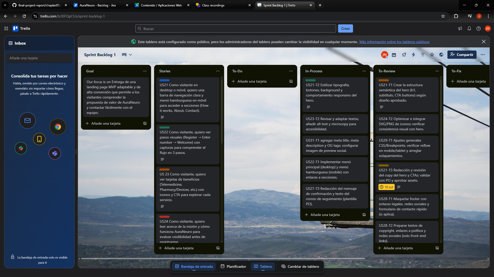
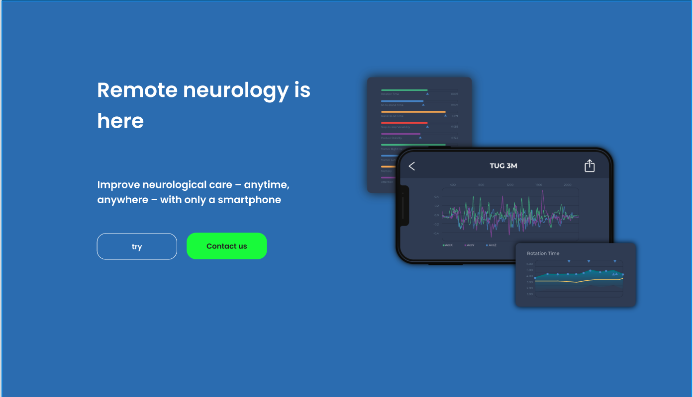
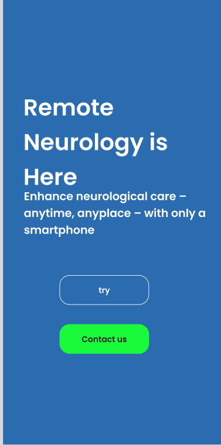
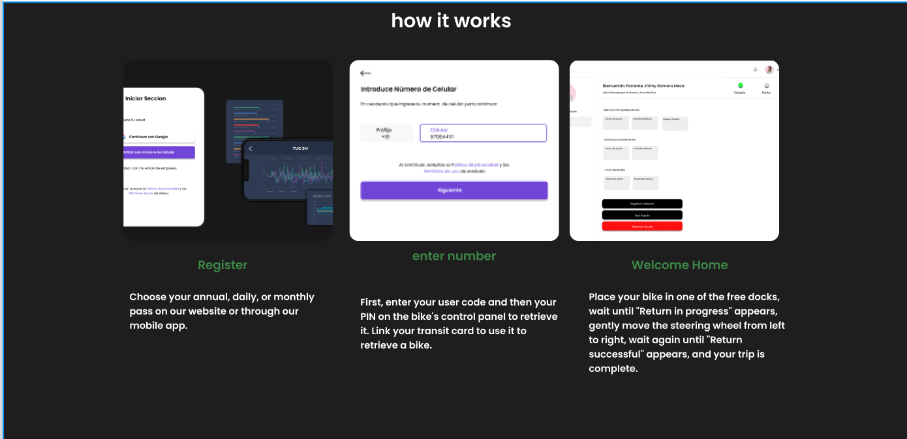
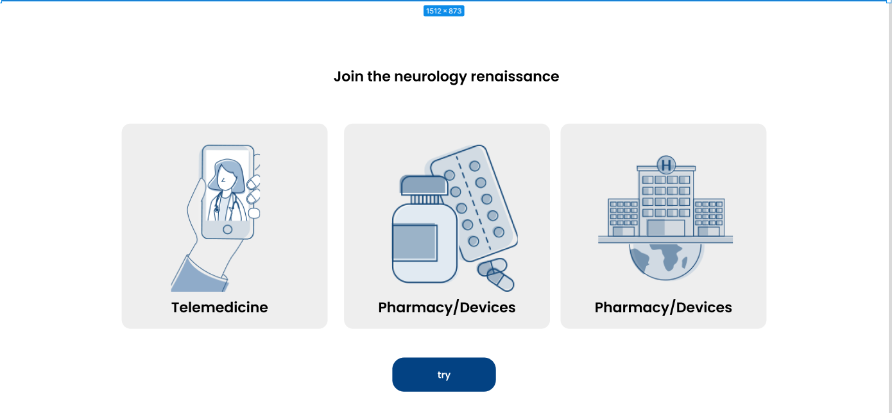
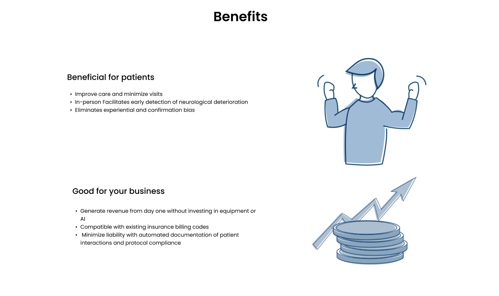
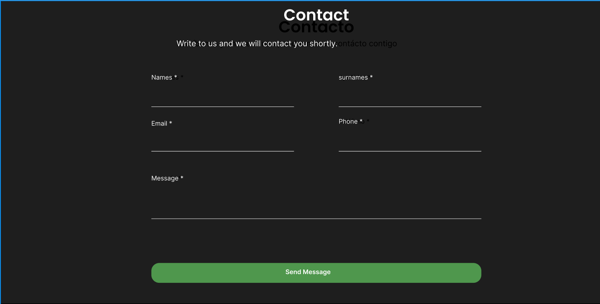
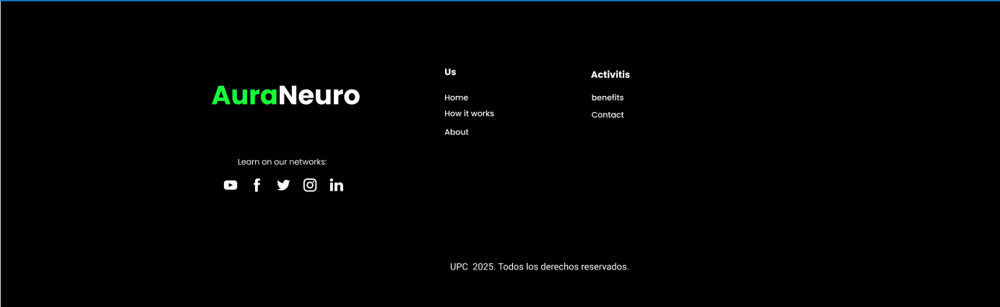
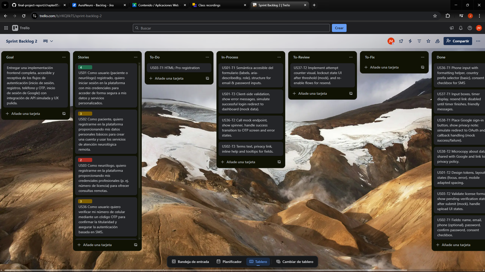

# Capítulo V: Product Implementation, Validation & Deployment

### 5.1. Software Configuration Management  
#### 5.1.1. Software Development Environment Configuration  
Esta sección detalla las herramientas utilizadas durante el desarrollo del software, organizadas según las distintas fases del proyecto.

*Project Management

-Google Meet: https://meet.google.com/

-Plataforma utilizada para realizar reuniones virtuales con los miembros del equipo. Permite compartir pantalla, imágenes, texto y video, todo en tiempo real. Es compatible con navegadores web, dispositivos móviles y computadoras, y solo requiere una cuenta activa para su uso.

-Product UX/UI Design

-UXpressia: https://uxpressia.com/

Fue clave para construir perfiles detallados de usuarios, mapear sus emociones, metas y comportamientos mediante herramientas como User Personas, Journey Maps y Empathy Maps.

-Figma: https://www.figma.com/ Plataforma colaborativa de diseño usada para crear wireframes y mockups. Su facilidad para compartir y editar en tiempo real la convirtió en una herramienta fundamental en el desarrollo de interfaces visuales.

*Software Development

-Landing Page

Se desarrolló la landing page con tecnologías como HTML5, CSS3 y JavaScript, apoyados en Bootstrap para lograr un diseño responsivo y acelerar el desarrollo de una interfaz adaptable a diversos dispositivos.

*IDE’s de desarrollo

-Visual Studio Code: https://code.visualstudio.com/

Usamos este IDE por su rendimiento, facilidad de uso y herramientas integradas para la edición, depuración y control de versiones. Fue esencial para implementar la landing page de forma ágil y ordenada.

-GitHub: https://github.com/

Plataforma para alojar el repositorio del proyecto y gestionar el control de versiones del código fuente y la documentación, facilitando la colaboración y el seguimiento de cambios.

*Software Deployment

-GitHub Pages

Utilizamos GitHub Pages para desplegar la landing page de forma gratuita y directamente desde el repositorio del proyecto. Esta herramienta permite alojar sitios estáticos fácilmente, integrándose con el flujo de trabajo de GitHub y facilitando una publicación continua con cada cambio en el repositorio.

*Software Documentation

-Canva: https://www.canva.com/

Empleamos Canva para la creación de material visual y presentaciones gráficas del proyecto. Su interfaz sencilla e intuitiva permite diseñar documentos importantes que ayudan a comunicar ideas de forma clara y profesional.

-Markdown:

Un lenguaje de marcado ligero y sencillo para crear documentos con formato, empleándose para redactar la documentación del proyecto de manera clara y estructurada.

#### 5.1.2. Source Code Management  

El equipo gestiona el código fuente utilizando **GitHub** como plataforma de control de versiones.  

- **Landing Page**: https://github.com/UPC-1ASI0730-2520-7468-Mithycore/LandingPageAuraNeuro

#### Workflow de Versionado – GitFlow
Para el control de versiones se aplica la estrategia **GitFlow**.La organización de ramas es la siguiente:

- **`main`**: contiene el código estable y liberado en producción.  
- **`develop`**: integra el trabajo de todas las features y sirve como base para la preparación de releases.  
- **Feature branches**: creados a partir de `develop` para nuevas funcionalidades. 
- **Release branches**: creados a partir de `develop` cuando se prepara una nueva versión estable. 
- **Hotfix branches**: creados a partir de `main` para resolver errores críticos detectados en producción. 

#### Convenciones de Commits
Se adoptó el estándar **Conventional Commits** para los mensajes de commit, garantizando claridad y trazabilidad.

Esto permite generar changelogs automáticos y facilita la integración continua.  

---

#### 5.1.3. Source Code Style Guide & Conventions  

En el proyecto **AuraNeuro**, se adoptaron convenciones de código para mantener consistencia, legibilidad y mantenibilidad. Todos los identificadores, clases, variables y comentarios se escriben en **inglés**. Las guías aplicadas se basan en estándares reconocidos para HTML, CSS, JavaScript y C#.

## 1. HTML
- Uso de HTML semántico: `<header>`, `<main>`, `<section>`, `<footer>`, `<article>`
- Clases e IDs en **kebab-case**: `hero-content`, `contact-form`, `navbar-container`
- Comentarios: `<!-- Comentario -->`
- Imágenes siempre con `alt` descriptivo

## 2. CSS
- Archivo principal: `Styles.css`
- Clases e IDs en **kebab-case**
- Variables CSS: `--variable-name`
- Responsividad con media queries

## 3. JavaScript
- Variables: `camelCase`
- Constantes: `UPPER_SNAKE_CASE`
- Funciones descriptivas; manejadores con prefijo `onEvent`
- `"use strict";` al inicio de scripts

## 4. C# (Backend – ASP.NET Core)
En el desarrollo del backend de AuraNeuro, se empleó C# con el framework ASP.NET Core, siguiendo las convenciones oficiales de Microsoft para mantener un código limpio, modular y mantenible.  
Estas guías garantizan la consistencia en la estructura de clases, métodos y nomenclatura de archivos dentro del API RESTful del proyecto.

- Naming conventions:
  - **Classes & Methods:** PascalCase → `PatientController`, `GetAllRecords()`
  - **Variables & Parameters:** camelCase → `patientId`, `recordList`
  - **Constants:** UPPER_SNAKE_CASE → `MAX_ATTEMPTS`
- File organization:
  - Estructura por capas: *Controllers*, *Models*, *Services*, *Data*
  - Separación de responsabilidades para mejorar mantenibilidad y testing.
- Comments:
  - XML documentation comments (`///`) para describir clases y métodos públicos.
- Framework guidelines:
  - Se siguieron las **Microsoft C# Coding Conventions** y las **ASP.NET Core Engineering Guidelines**.

## 5.2. Landing Page, Services & Applications Implementation.

## 5.2.1. Sprint 1  

#### 5.2.1.1. Sprint Planning 1.

En esta sección se presenta la planificación del Sprint 1, cuyo objetivo principal es convertir los diseños validados en un MVP funcional de la landing page de AuraNeuro. El sprint se centra en entregar las secciones críticas que permiten comunicar la propuesta de valor, captar leads y validar interés: Hero con CTA, How-it-works, Features, About, Formulario de contacto, Footer y ajustes básicos de SEO, rendimiento y accesibilidad.

El alcance de la iteración incluye la implementación front-end responsiva, la integración básica del formulario de contacto (envío y confirmación), la optimización de imágenes y meta-etiquetas, así como verificaciones iniciales de accesibilidad y performance. Este trabajo busca habilitar a marketing y ventas con una página pública utilizable para la captación de usuarios y proporcionar una base técnica estable sobre la que iterar en sprints siguientes.

<table border="1" cellpadding="6" cellspacing="0" style="border-collapse:collapse; width:100%; font-family:Arial, sans-serif;">
  <caption style="text-align:left; font-weight:bold; padding:6px 0;">Sprint Planning - Sprint 1 (Landing Page)</caption>
  <tbody>
    <tr>
      <th style="width:20%;">Sprint #</th>
      <td>Sprint 1</td>
    </tr>
    <tr>
      <th>Sprint Planning Background - Date</th>
      <td>2025-09-20</td>
    </tr>
    <tr>
      <th>Time</th>
      <td>10:00 AM - 11:30 AM</td>
    </tr>
    <tr>
      <th>Location</th>
      <td>Reunión virtual (Zoom) / Oficina central AuraNeuro</td>
    </tr>
    <tr>
      <th>Prepared By</th>
      <td>Romero Meza Jhimy Pool (Product Owner)</td>
    </tr>
    <tr>
      <th>Attendees (to planning meeting)</th>
      <td>Eduardo Fabián Chacaliaza Minaya  (PO), Gutierrez Tume, Jeremy (Lead Dev), Fabricio Fabián Quispe Barzola (Frontend), Romero Meza Jhimy Pool (Frontend), Juan José Meza Huanacune (Content/UX), Juan José (Forms)</td>
    </tr>
  </tbody>
</table>
 
<table border="1" cellpadding="6" cellspacing="0" style="border-collapse:collapse; width:100%; font-family:Arial, sans-serif;">
  <caption style="text-align:left; font-weight:bold; padding:6px 0;">Sprint n − 1 Review & Retrospective (Resumen)</caption>
  <tbody>
    <tr>
      <th style="width:25%;">Sprint n − 1 Review Summary</th>
      <td>
        <em>Contexto:</em> Pre-sprint (fase de descubrimiento y diseño). 
        <strong>Resultados:</strong> Wireframes y mockups de la landing validados por stakeholders; alcance del MVP de la landing definido (hero, how-it-works, features, contacto, footer, performance y accesibilidad básica). 
        <strong>Feedback:</strong> Ajustes menores de copy, necesidad de plan de performance y plan de accesibilidad (WCAG).
      </td>
    </tr>
    <tr>
      <th>Sprint n − 1 Retrospective Summary</th>
      <td>
        <strong>Lo que funcionó:</strong> Comunicación entre diseño y frontend rápida; entregas de assets a tiempo. 
        <strong>Mejoras:</strong> Planificar tiempo de QA y testing cross-browser; acordar criterios de aceptación más detallados para CMS y analytics.
      </td>
    </tr>
  </tbody>
</table>
 
<table border="1" cellpadding="6" cellspacing="0" style="border-collapse:collapse; width:100%; font-family:Arial, sans-serif;">
  <caption style="text-align:left; font-weight:bold; padding:6px 0;">Sprint Goal & User Stories</caption>
  <tbody>
    <tr>
      <th style="width:25%;">Sprint Goal (template)</th>
      <td>
        <strong>Our focus is on</strong> Entrega de una landing page MVP adaptable y de alta conversión que permite a los visitantes comprender la propuesta de valor de AuraNeuro y contactar fácilmente con el equipo.  
        <strong>We believe it delivers</strong> Se mejoró la captación de leads y se aceleró la incorporación de los primeros usuarios al producto, lo que aumentó los leads cualificados por marketing (MQL).  
        <strong>This will be confirmed when</strong> Los visitantes pueden: (1) ver el hero y el flujo del producto, (2) enviar el formulario de contacto correctamente, (3) navegar por el sitio web de forma adaptable y (4) cumplir los objetivos de las métricas clave de rendimiento (LCP < 2,5 s y comprobaciones de accesibilidad AA superadas).
      </td>
    </tr>
    <tr>
      <th>Sprint Goal (SMART)</th>
      <td>
        <strong>Specific:</strong> Cree y publique las secciones MVP de la página de destino: Héroe, Cómo funciona, Tarjetas de características, Acerca de, Formulario de contacto, Pie de página y optimizaciones de rendimiento y SEO de referencia. 
        <strong>Measurable:</strong> El envío del formulario de contacto funciona; LCP < 2,5 s; accesibilidad AA para páginas principales; clics de CTA rastreables en análisis. 
        <strong>Attainable:</strong> El equipo se compromete a sumar 29 puntos de historia (ver Suma de puntos de historia). 
        <strong>Relevant:</strong> Permite que el marketing capture clientes potenciales y valide el interés en el producto. 
        <strong>Time-bound:</strong>Finalización al final del Sprint 1 (sprint de 2 semanas).
      </td>
    </tr>
    <tr>
      <th>Sprint n Velocity (team capacity)</th>
      <td>
        <strong>Planned Velocity:</strong> 30 story points (team capacity estimate) 
        <strong>Committed:</strong> 29 story points (see Sum of Story Points below)
      </td>
    </tr>
    <tr>
      <th>Sum of Story Points (this Sprint)</th>
      <td><strong>29 SP</strong> (subconjunto seleccionado y priorizado de historias de destino US21–US35)</td>
    </tr>
  </tbody>
</table>
 
<table border="1" cellpadding="6" cellspacing="0" style="border-collapse:collapse; width:100%; font-family:Arial, sans-serif;">
  <caption style="text-align:left; font-weight:bold; padding:6px 0;">User Stories included in Sprint 1 (Selected & Prioritized)</caption>
  <thead style="background:#f2f2f2;">
    <tr>
      <th style="width:8%;">Order</th>
      <th style="width:12%;">User Story Id</th>
      <th style="width:40%;">Título</th>
      <th style="width:10%;">Story Points</th>
      <th style="width:30%;">Acceptance Summary / Goal</th>
    </tr>
  </thead>
  <tbody>
    <tr>
      <td>21</td><td>US21</td><td>Hero con CTA principal</td><td style="text-align:center;">2</td><td>Hero visible, CTA Try/Contact funcional y redirige; copy y assets aprobados.</td>
    </tr>
    <tr>
      <td>22</td><td>US22</td><td>Navegación responsiva</td><td style="text-align:center;">3</td><td>Menu desktop + hamburger en mobile; enlaces a secciones funcionan y accesibles.</td>
    </tr>
    <tr>
      <td>23</td><td>US23</td><td>Sección “How it works” con pasos</td><td style="text-align:center;">2</td><td>3 pasos ilustrados con texto alternativo y semántica correcta.</td>
    </tr>
    <tr>
      <td>24</td><td>US24</td><td>Bloque de Features / Cards</td><td style="text-align:center;">3</td><td>Cards mostradas, hover/acción y enlace a más info o modal.</td>
    </tr>
    <tr>
      <td>25</td><td>US25</td><td>Sección About / Who we are</td><td style="text-align:center;">2</td><td>Texto e imágenes alineadas, versión imprimible adecuada.</td>
    </tr>
    <tr>
      <td>26</td><td>US26</td><td>Beneficios y “Good for business”</td><td style="text-align:center;">3</td><td>Bullets claros para pacientes y empresas; CTA institucional pre-fill al contacto.</td>
    </tr>
    <tr>
      <td>27</td><td>US27</td><td>Formulario de contacto validado</td><td style="text-align:center;">3</td><td>Formulario envía datos, validaciones client-side y confirmación visual; evento de conversión dispara en analytics.</td>
    </tr>
    <tr>
      <td>28</td><td>US28</td><td>Footer con enlaces y redes sociales</td><td style="text-align:center;">1</td><td>Footer con enlaces funcionando y accesibles por teclado; enlaces abren en nueva pestaña.</td>
    </tr>
    <tr>
      <td>29</td><td>US29</td><td>Responsive layout y comportamiento mobile</td><td style="text-align:center;">3</td><td>Layout reflow correcto en <768px y tablet; no solapamientos.</td>
    </tr>
    <tr>
      <td>30</td><td>US30</td><td>Performance y optimización de imágenes</td><td style="text-align:center;">5</td><td>Imágenes optimizadas, lazy-loading, objetivo LCP < 2.5s en entorno de prueba.</td>
    </tr>
    <tr>
      <td>31</td><td>US31</td><td>SEO básico y meta tags</td><td style="text-align:center;">2</td><td>Meta title/description/OG tags presentes y verificados; preview social correcto.</td>
    </tr>
  </tbody>
</table>
 
<table border="1" cellpadding="6" cellspacing="0" style="border-collapse:collapse; width:100%; font-family:Arial, sans-serif;">
  <caption style="text-align:left; font-weight:bold; padding:6px 0;">Definition of Done (DoD) & Acceptance Criteria highlights</caption>
  <tbody>
    <tr>
      <th style="width:30%;">Definition of Done (DoD)</th>
      <td>
        - Código revisado (PR) y aprobado. 
        - Tests básicos (UI/Functional) ejecutados y pasados. 
        - Documentación mínima actualizada (README / notas de despliegue). 
        - Despliegue en entorno de staging y revisión PO/QA. 
        - Eventos analytics instrumentados para CTAs y formulario.
      </td>
    </tr>
    <tr>
      <th>Exit criteria (Sprint 1)</th>
      <td>
        - Landing publicada en staging con LCP < 2.5s (medido en entorno de pruebas). 
        - Contact form enviado y registro de evento en analytics. 
        - Navegación responsive comprobada en 3 breakpoints y smoke test cross-browser. 
        - Accesibility smoke checks (focus order, alt text, contrast) completados.
      </td>
    </tr>
  </tbody>
</table>

#### 5.2.1.2. Aspect Leaders and Collaborators.  

<section>
  <h3>Aspect Leaders and Collaborators — Introducción</h3>
  

    En esta sección se presenta la <strong>Leadership-and-Collaboration Matrix (LACX)</strong> para el Sprint 1 (Landing Page).
    El propósito del LACX es dejar claro, para cada aspecto clave del alcance del sprint, quién actúa como <em>líder</em> (responsable principal)
    y quiénes son los <em>colaboradores</em>. Esto facilita la comunicación interna, la toma de decisiones y la velocidad de ejecución.
  

  

    Para este sprint se identificaron los siguientes aspectos relevantes (cada aspecto refleja un subconjunto del alcance funcional y no funcional):
    <strong>Content & Copy, Frontend Implementation (Hero y secciones), Accessibility & UX, Performance & SEO, Backend & Form Integration,
    </strong>. A continuación se muestra la matriz con líderes (L) y colaboradores (C) asignados.
  

</section>

<table border="1" cellpadding="6" cellspacing="0" style="border-collapse:collapse; width:100%; font-family:Arial, sans-serif; margin-top:12px;">
  <caption style="text-align:left; font-weight:bold; padding:6px 0;">Leadership-and-Collaboration Matrix (LACX) — Sprint 1 (Landing Page)</caption>
  <thead style="background:#f2f2f2;">
    <tr>
      <th>Team Member (Last Name, First Name)</th>
      <th>GitHub Username</th>
      <th>Content &amp; Copy (Aspect 1)</th>
      <th>Frontend Implementation (Hero + Sections) (Aspect 2)</th>
      <th>Accessibility &amp; UX (Aspect 3)</th>
      <th>Performance &amp; SEO (Aspect 4)</th>
      <th>Backend &amp; Form Integration (Aspect 5)</th>
    </tr>
  </thead>
  <tbody>
    <tr>
      <td><strong>Romero Meza, Jhimy</strong> (Sprint Lead / Frontend)</td>
      <td>jhimyromero (placeholder)</td>
      <td>C</td>
      <td><strong>L</strong></td>
      <td>C</td>
      <td>C</td>
      <td>C</td>
    </tr>
    <tr>
      <td><strong>Eduardo Fabián Chacaliaza Minaya</strong> (Product Owner)</td>
      <td>educmz</td>
      <td>C</td>
      <td>C</td>
      <td>C</td>
      <td>C</td>
      <td>C</td>
    </tr>
    <tr>
      <td><strong>Gutierrez Tume, Jeremy </strong> (Lead Dev)</td>
      <td>Stan-gt213891</td>
      <td>C</td>
      <td>C</td>
      <td>C</td>
      <td><strong>L</strong></td>
      <td>C</td>
    </tr>
    <tr>
      <td><strong>Fabricio Fabián Quispe Barzola</strong> (Frontend)</td>
      <td>BrooklynKarmis</td>
      <td>C</td>
      <td>C</td>
      <td>C</td>
      <td>C</td>
      <td>C</td>
    </tr>
    <tr>
      <td><strong>Juan José Meza Huanacune</strong> (Content / UX)</td>
      <td>JuanMHZ1250</td>
      <td><strong>L</strong></td>
      <td>C</td>
      <td><strong>L</strong></td>
      <td>C</td>
      <td>C</td>
    </tr>
  </tbody>
</table>
<section style="font-family:Arial, sans-serif; margin-top:10px;">
  

    <strong>Instrucciones:</strong> Esta matriz se debe mantener actualizada durante el Sprint (cambios en responsables,
    reasignaciones o inclusión de nuevos sub-aspectos). Las etiquetas <strong>L</strong> (Leader) y <strong>C</strong> (Collaborator)
    indican responsabilidades principales y de apoyo. Reemplazar los GitHub usernames marcados como <em>placeholder</em> por los reales.
  

</section>

#### 5.2.1.3. Sprint Backlog 1.  

<!-- SPRINT BACKLOG - SPRINT 1 (Landing Page) -->
<section>
  <h2>Sprint Backlog — Sprint 1 (Landing Page)</h2>
  

    Objetivo del sprint: entregar el MVP de la <strong>landing page</strong> de AuraNeuro con las secciones críticas
    (Hero, How-it-works, Features, About, Contact form, Footer) y mejoras básicas de SEO, rendimiento y accesibilidad.
    Este Sprint Backlog lista las User Stories comprometidas y la descomposición en Work-items / Tasks que el equipo
    (Front-end y Content/UX) realizará durante las dos semanas de iteración.
  

  <!-- Screenshot del Board (reemplazar src y URL por los reales) -->
  

    <strong>Sprint Board (tool):</strong>
     
    
    

      <strong>URL del Board:</strong>
      <a href="https://trello.com/invite/b/68e8592120ae5b781c165835/ATTIc1385aeb0b3d5ea0b1fb310577f51f37B5D52B13/sprint-backlog-1" target="_blank" rel="noopener">https://trello.com/invite/b/68e8592120ae5b781c165835/ATTIc1385aeb0b3d5ea0b1fb310577f51f37B5D52B13/sprint-backlog-1</a>
    

  

</section>

<!-- Sprint Backlog Table -->
<table border="1" cellpadding="6" cellspacing="0" style="border-collapse:collapse; width:100%; font-family:Arial, sans-serif;">
  <caption style="text-align:left; font-weight:bold; padding:6px 0;">Sprint 1 Backlog — User Stories & Work-items</caption>
  <thead style="background:#f2f2f2;">
    <tr>
      <th style="width:6%;">User Story Id</th>
      <th style="width:22%;">User Story Title</th>
      <th style="width:8%;">Work-Item Id</th>
      <th style="width:18%;">Work-Item / Task Title</th>
      <th style="width:26%;">Description</th>
      <th style="width:8%;">Est. (Hours)</th>
      <th style="width:12%;">Assigned To</th>
      <th style="width:10%;">Status</th>
    </tr>
  </thead>
  <tbody>
    <tr>
      <td>US21</td>
      <td>Hero con CTA principal</td>
      <td>US21-T1</td>
      <td>HTML: Maquetación Hero</td>
      <td>Crear la estructura semántica del hero (h1, subtítulo, CTA buttons) según diseño aprobado.</td>
      <td style="text-align:center;">4</td>
      <td>Romero Meza, Jhimy</td>
      <td>To-do</td>
    </tr>
    <tr>
      <td>US21</td>
      <td>Hero con CTA principal</td>
      <td>US21-T2</td>
      <td>CSS: Estilos y responsive Hero</td>
      <td>Estilizar tipografía, botones, background y comportamiento responsivo del hero.</td>
      <td style="text-align:center;">3</td>
      <td>Fabricio Fabián Quispe Barzola</td>
      <td>To-do</td>
    </tr>
    <tr>
      <td>US21</td>
      <td>Hero con CTA principal</td>
      <td>US21-T3</td>
      <td>Content: Copy y microcopy</td>
      <td>Redacción y revisión del copy del hero y CTAs; validar con PO y aprobar assets.</td>
      <td style="text-align:center;">2</td>
      <td>Juan José Meza Huanacune</td>
      <td>To-do</td>
    </tr>
    <tr>
      <td>US22</td>
      <td>Navegación responsiva</td>
      <td>US22-T1</td>
      <td>HTML: Menú y estructura de navegación</td>
      <td>Implementar menú principal (desktop) y menú hamburguesa (mobile) con enlaces a secciones.</td>
      <td style="text-align:center;">3</td>
      <td>Romero Meza, Jhimy</td>
      <td>To-do</td>
    </tr>
    <tr>
      <td>US22</td>
      <td>Navegación responsiva</td>
      <td>US22-T2</td>
      <td>JS: Comportamiento del menú</td>
      <td>Scroll suave, apertura/cierre del menú hamburguesa y estado activo en enlaces al hacer scroll.</td>
      <td style="text-align:center;">2</td>
      <td>Fabricio Fabián Quispe Barzola</td>
      <td>To-do</td>
    </tr>
    <tr>
      <td>US23</td>
      <td>Sección “How it works” con pasos</td>
      <td>US23-T1</td>
      <td>HTML/CSS: Maquetación de pasos</td>
      <td>Maquetar los 3 pasos (Register → Enter number → Welcome) con imágenes y texto alternativo.</td>
      <td style="text-align:center;">2.5</td>
      <td>Romero Meza, Jhimy</td>
      <td>To-do</td>
    </tr>
    <tr>
      <td>US23</td>
      <td>Sección “How it works” con pasos</td>
      <td>US23-T2</td>
      <td>Content: Textos y alt text</td>
      <td>Revisar y adaptar textos, añadir alt text y microcopy para accesibilidad.</td>
      <td style="text-align:center;">1.5</td>
      <td>Juan José Meza Huanacune</td>
      <td>To-do</td>
    </tr>
    <tr>
      <td>US24</td>
      <td>Bloque de Features / Cards</td>
      <td>US24-T1</td>
      <td>HTML/CSS: Cards de features</td>
      <td>Crear tarjetas con iconos, títulos, descripciones cortas y CTA; responsive grid.</td>
      <td style="text-align:center;">3</td>
      <td>Fabricio Fabián Quispe Barzola</td>
      <td>To-do</td>
    </tr>
    <tr>
      <td>US24</td>
      <td>Bloque de Features / Cards</td>
      <td>US24-T2</td>
      <td>Assets: Integración de iconos/illust</td>
      <td>Optimizar e integrar SVG/PNG de iconos; verificar consistencia visual con hero.</td>
      <td style="text-align:center;">1.5</td>
      <td>Romero Meza, Jhimy</td>
      <td>To-do</td>
    </tr>
    <tr>
      <td>US25</td>
      <td>Sección About / Who we are</td>
      <td>US25-T1</td>
      <td>HTML/CSS: Maquetación About</td>
      <td>Maquetar la sección About con imágenes y bloques de texto según diseño.</td>
      <td style="text-align:center;">2</td>
      <td>Fabricio Fabián Quispe Barzola</td>
      <td>To-do</td>
    </tr>
    <tr>
      <td>US25</td>
      <td>Sección About / Who we are</td>
      <td>US25-T2</td>
      <td>Content: Revisión y aprobación copy</td>
      <td>Validar misión, visión y textos; ajustar tono y longitud para web.</td>
      <td style="text-align:center;">1.5</td>
      <td>Juan José Meza Huanacune</td>
      <td>To-do</td>
    </tr>
    <tr>
      <td>US26</td>
      <td>Beneficios y “Good for business”</td>
      <td>US26-T1</td>
      <td>HTML/CSS: Maquetación de beneficios</td>
      <td>Listar bullets para pacientes y empresas; incluir CTA institucional con prefill.</td>
      <td style="text-align:center;">2.5</td>
      <td>Romero Meza, Jhimy</td>
      <td>To-do</td>
    </tr>
    <tr>
      <td>US26</td>
      <td>Beneficios y “Good for business”</td>
      <td>US26-T2</td>
      <td>Content: Copy para decisores</td>
      <td>Redactar texto orientado a decisores institucionales; preparar prefill para contacto.</td>
      <td style="text-align:center;">1.5</td>
      <td>Juan José Meza Huanacune</td>
      <td>To-do</td>
    </tr>
    <tr>
      <td>US27</td>
      <td>Formulario de contacto validado</td>
      <td>US27-T1</td>
      <td>HTML/CSS: Formulario</td>
      <td>Crear formulario con campos (nombre, email, teléfono, mensaje) y diseño responsive.</td>
      <td style="text-align:center;">3</td>
      <td>Fabricio Fabián Quispe Barzola</td>
      <td>To-do</td>
    </tr>
    <tr>
      <td>US27</td>
      <td>Formulario de contacto validado</td>
      <td>US27-T2</td>
      <td>JS: Validaciones y UX de envío</td>
      <td>Validaciones client-side, mensajes de error, estado de envío y confirmación visual; mock submit (console / mock endpoint).</td>
      <td style="text-align:center;">3</td>
      <td>Romero Meza, Jhimy</td>
      <td>To-do</td>
    </tr>
    <tr>
      <td>US27</td>
      <td>Formulario de contacto validado</td>
      <td>US27-T3</td>
      <td>Content: Texto del success/follow-up</td>
      <td>Redacción del mensaje de confirmación y texto del correo de seguimiento (plantilla PO).</td>
      <td style="text-align:center;">1</td>
      <td>Juan José Meza Huanacune</td>
      <td>To-do</td>
    </tr>
    <tr>
      <td>US28</td>
      <td>Footer con enlaces y redes sociales</td>
      <td>US28-T1</td>
      <td>HTML/CSS: Pie de página</td>
      <td>Maquetar footer con enlaces legales, redes sociales y formulario de contacto rápido (si aplica).</td>
      <td style="text-align:center;">2</td>
      <td>Fabricio Fabián Quispe Barzola</td>
      <td>To-do</td>
    </tr>
    <tr>
      <td>US28</td>
      <td>Footer con enlaces y redes sociales</td>
      <td>US28-T2</td>
      <td>Content: Enlaces y textos legales</td>
      <td>Preparar textos de copyright, enlaces a política y redes sociales (solo front-end links).</td>
      <td style="text-align:center;">1</td>
      <td>Juan José Meza Huanacune</td>
      <td>To-do</td>
    </tr>
    <tr>
      <td>US29</td>
      <td>Responsive layout y comportamiento mobile</td>
      <td>US29-T1</td>
      <td>Responsive tuning</td>
      <td>Ajustes generales CSS/Breakpoints, verificar reflow en mobile/tablet y arreglar solapamientos.</td>
      <td style="text-align:center;">3</td>
      <td>Romero Meza, Jhimy</td>
      <td>To-do</td>
    </tr>
    <tr>
      <td>US30</td>
      <td>Performance y optimización de imágenes</td>
      <td>US30-T1</td>
      <td>Optimizar imágenes</td>
      <td>Comprimir y exportar imágenes en WebP/SVG; generar versiones responsivas y añadir lazy-load.</td>
      <td style="text-align:center;">3</td>
      <td>Fabricio Fabián Quispe Barzola</td>
      <td>To-do</td>
    </tr>
    <tr>
      <td>US30</td>
      <td>Performance y optimización de imágenes</td>
      <td>US30-T2</td>
      <td>Measure & tweak</td>
      <td>Medir LCP y CLS en entorno local/staging; aplicar ajustes para acercarse al objetivo LCP &lt; 2.5s.</td>
      <td style="text-align:center;">2</td>
      <td>Gutierrez Tume, Jeremy</td>
      <td>To-do</td>
    </tr>
    <tr>
      <td>US31</td>
      <td>SEO básico y meta tags</td>
      <td>US31-T1</td>
      <td>Meta tags & OG</td>
      <td>Agregar meta title, meta description y OG tags; configurar imagen de preview social.</td>
      <td style="text-align:center;">2</td>
      <td>Romero Meza, Jhimy</td>
      <td>To-do</td>
    </tr>
    <tr>
      <td>US31</td>
      <td>SEO básico y meta tags</td>
      <td>US31-T2</td>
      <td>Sitemap & robots (placeholder)</td>
      <td>Preparar archivo robots.txt y sitemap básico (para integración por backend/despliegue posterior).</td>
      <td style="text-align:center;">1</td>
      <td>Gutierrez Tume, Jeremy</td>
      <td>To-do</td>
    </tr>

  </tbody>
</table>
<section style="margin-top:12px; font-family:Arial, sans-serif;">
  <strong>Equipo (Sprint 1):</strong>
  <ul>
    <li>Romero Meza, Jhimy — Sprint Lead / Frontend</li>
    <li>Eduardo Fabián Chacaliaza Minaya — Product Owner</li>
    <li>Gutierrez Tume, Jeremy — Lead Dev</li>
    <li>Fabricio Fabián Quispe Barzola — Frontend</li>
    <li>Juan José Meza Huanacune — Content / UX</li>
  </ul>
  
<em>Nota:</em> conforme avance el sprint se actualizarán los estados (To-do / In-Process / To-Review / Done) en el Sprint Board indicado.

</section>

#### 5.2.1.4. Development Evidence for Sprint Review.

<section style="font-family: Arial, sans-serif;">

  

    A continuación se presenta un resumen de los avances de implementación
    relacionados con el alcance del <strong>Sprint 1</strong> (Landing Page). La tabla incluye
    los commits más relevantes realizados en los repositorios del proyecto durante el sprint.
    Estos commits reflejan la conversión de los diseños validados a código (maquetación del Hero,
    secciones clave, formulario de contacto, optimización de imágenes, meta tags y despliegue
    inicial en entorno de staging).
  

  <table border="1" cellpadding="6" cellspacing="0" style="border-collapse:collapse; width:100%; font-family:Arial, sans-serif; margin-top:12px;">
    <caption style="text-align:left; font-weight:bold; padding:6px 0;">Commits relacionados con Sprint 1</caption>
    <thead style="background:#f2f2f2;">
      <tr>
        <th style="width:18%;">Repository</th>
        <th style="width:12%;">Branch</th>
        <th style="width:12%;">Commit ID</th>
        <th style="width:18%;">Commit message</th>
        <th style="width:28%;">Commit message body</th>
        <th style="width:12%;">Committed on (date)</th>
      </tr>
    </thead>
    <tbody>
      <tr>
        <td><code>aura-neuro-landing</code></td>
        <td><code>sprint-1-landing</code></td>
        <td><code>9f4a2b7</code></td>
        <td>Maquetación Hero y CTA principal</td>
        <td>Se añade la estructura HTML del Hero con h1, subtítulo y botones CTA (Try / Contact). Incluye placeholders para imágenes y atributos ARIA básicos.</td>
        <td style="text-align:center;">2025-09-20</td>
      </tr>
      <tr>
        <td><code>aura-neuro-landing</code></td>
        <td><code>feature/hero-styles</code></td>
        <td><code>2c7e3d1</code></td>
        <td>Estilos responsive para Hero</td>
        <td>Implementa CSS (variables, tipografías, breakpoints) y reglas responsive para que el Hero se muestre correctamente en mobile/desktop.</td>
        <td style="text-align:center;">2025-09-20</td>
      </tr>
      <tr>
        <td><code>aura-neuro-frontend</code></td>
        <td><code>feature/nav-and-scroll</code></td>
        <td><code>af8b4c0</code></td>
        <td>Implementación de navegación y scroll suave</td>
        <td>Agrega menú principal, menú hamburguesa para mobile y comportamiento de scroll suave; añade test manual de anclas internas.</td>
        <td style="text-align:center;">2025-09-20</td>
      </tr>
      <tr>
        <td><code>aura-neuro-landing</code></td>
        <td><code>feature/how-it-works</code></td>
        <td><code>71d9e5a</code></td>
        <td>Sección "How it works" con pasos</td>
        <td>Se crean tarjetas de pasos con imágenes optimizadas y texto alternativo. Se verifica semántica para lectores de pantalla.</td>
        <td style="text-align:center;">2025-09-2022</td>
      </tr>
      <tr>
        <td><code>aura-neuro-landing</code></td>
        <td><code>feature/features-cards</code></td>
        <td><code>4b2f1d8</code></td>
        <td>Cards de features y assets SVG</td>
        <td>Integración de iconografía SVG, layout en grid responsive y enlaces CTA en cada card (abrir modal / ancla).</td>
        <td style="text-align:center;">2025-09-21</td>
      </tr>
      <tr>
        <td><code>aura-neuro-landing</code></td>
        <td><code>feature/about-and-benefits</code></td>
        <td><code>8a6c9f2</code></td>
        <td>Sección About y beneficios</td>
        <td>Se añade contenido de "Who we are" y listado de beneficios para pacientes y empresas. Se incluye CTA institucional con prefill.</td>
        <td style="text-align:center;">2025-09-20</td>
      </tr>
      <tr>
        <td><code>aura-neuro-frontend</code></td>
        <td><code>feature/contact-form</code></td>
        <td><code>c3d5e11</code></td>
        <td>Formulario de contacto y validaciones</td>
        <td>Formulario con campos nombre, email, teléfono y mensaje. Validaciones client-side y UX de envío (in-flight state y mensaje de éxito).</td>
        <td style="text-align:center;">2025-09-20</td>
      </tr>
      <tr>
        <td><code>aura-neuro-frontend</code></td>
        <td><code>perf/opt-images</code></td>
        <td><code>bb7a2f0</code></td>
        <td>Optimización de imágenes y lazy-load</td>
        <td>Conversión de imágenes a WebP, generación de srcset/responsive images y lazy-loading en secciones bajas para mejorar LCP/CLS.</td>
        <td style="text-align:center;">2025-09-20</td>
      </tr>
      <tr>
        <td><code>aura-neuro-landing</code></td>
        <td><code>docs/seo-meta</code></td>
        <td><code>f2e4b6c</code></td>
        <td>Meta tags y OG tags</td>
        <td>Se agregan meta title, meta description y Open Graph tags para mejorar preview en redes; añade imagen de preview y canonical tag.</td>
        <td style="text-align:center;">2025-09-20</td>
      </tr>
      <tr>
        <td><code>aura-neuro-infra</code></td>
        <td><code>ci/deploy-staging</code></td>
        <td><code>a19c8b3</code></td>
        <td>Config CI/CD y despliegue a staging</td>
        <td>Pipeline inicial para deploy automático en Vercel/GitHub Pages desde branch <code>sprint-1-landing</code>; incluye pasos de build y smoke-check básico.</td>
        <td style="text-align:center;">2025-09-20</td>
      </tr>
    </tbody>
  </table>
</section>

#### 5.2.1.5. Execution Evidence for Sprint Review.

<section style="font-family: Arial, sans-serif; line-height:1.45;">

  <!-- Introducción / Resumen -->
  <h3 style="margin-bottom:6px;">Execution Evidence — Resumen de lo alcanzado (Sprint 1)</h3>
  

    En este Sprint se entregó el <strong>MVP de la landing page</strong> de AuraNeuro con las secciones y capacidades prioritarias
    definidas en el Sprint Goal. Se implementaron y desplegaron en entorno de <em>staging</em> las siguientes funcionalidades clave:
    <strong>Hero con CTA</strong>, <strong>navegación responsiva</strong>, <strong>sección "How it works"</strong>, <strong>features cards</strong>,
    <strong>About / Benefits</strong>, <strong>formulario de contacto validado</strong> y <strong>footer</strong>. Además se aplicaron optimizaciones
    básicas de performance (imágenes WebP / lazy-loading), se añadieron meta tags / OG tags para SEO y se configuró el pipeline de despliegue
    automático a staging. El trabajo comprometido en el Sprint fue 29 story points (US21–US31 prioritarias) y se logró la implementación funcional
    de todas las historias seleccionadas para esta iteración.
  

  

    <strong>Historias implementadas (resumen):</strong>
    US21 (Hero), US22 (Nav), US23 (How it works), US24 (Features cards), US25 (About), US26 (Benefits), US27 (Contact form),
    US28 (Footer), US29 (Responsive), US30 (Performance), US31 (SEO/meta tags).
  

  <!-- Screenshots gallery -->
  <h4 style="margin-top:18px; margin-bottom:8px;">Screenshots — Vistas principales implementadas</h4>

  

    <!-- Hero -->
    <figure style="width:320px; margin:0; font-size:0.9em;">
      
      <figcaption style="padding:6px 0 0 0;">
        <strong>Hero con CTA</strong> 
        (US21) — Título, subtítulo y CTA principal visibles; CTA redirige al formulario.
      </figcaption>
    </figure>
    <!-- Navigation -->
    <figure style="width:320px; margin:0; font-size:0.9em;">
      
      <figcaption style="padding:6px 0 0 0;">
        <strong>Navegación responsiva</strong> 
        (US22) — Menú desktop y hamburguesa en mobile.
      </figcaption>
    </figure>
    <!-- How it works -->
    <figure style="width:320px; margin:0; font-size:0.9em;">
      
      <figcaption style="padding:6px 0 0 0;">
        <strong>How it works</strong> 
        (US23) — 3 pasos ilustrados con texto alternativo.
      </figcaption>
    </figure>
    <!-- Features cards -->
    <figure style="width:320px; margin:0; font-size:0.9em;">
      
      <figcaption style="padding:6px 0 0 0;">
        <strong>Features / Cards</strong> 
        (US24) — Iconos SVG integrados y CTA en cada tarjeta.
      </figcaption>
    </figure>
    <!-- About -->
    <figure style="width:320px; margin:0; font-size:0.9em;">
      
      <figcaption style="padding:6px 0 0 0;">
        <strong>About / Who we are</strong> 
        (US25) — Misión, visión e imágenes alineadas.
      </figcaption>
    </figure>
    <!-- Benefits -->
    <figure style="width:320px; margin:0; font-size:0.9em;">
      
      <figcaption style="padding:6px 0 0 0;">
        <strong>Benefits / Good for business</strong> 
        (US26) — Bullets para pacientes y decisores.
      </figcaption>
    </figure>
    <!-- Contact form -->
    <figure style="width:320px; margin:0; font-size:0.9em;">
      
      <figcaption style="padding:6px 0 0 0;">
        <strong>Formulario de contacto</strong> 
        (US27) — Validaciones client-side y confirmación visual.
      </figcaption>
    </figure>
    <!-- Footer -->
    <figure style="width:320px; margin:0; font-size:0.9em;">
      
      <figcaption style="padding:6px 0 0 0;">
        <strong>Footer</strong> 
        (US28) — Enlaces legales y redes sociales.
      </figcaption>
    </figure>
    <!-- Mobile responsive -->
    <figure style="width:320px; margin:0; font-size:0.9em;">
      
      <figcaption style="padding:6px 0 0 0;">
        <strong>Mobile view</strong> 
        (US29) — Ejemplo de reflow / breakpoints.
      </figcaption>
    </figure>
     <h4 style="margin-top:18px; margin-bottom:6px;">Video de demostración / walkthrough</h4>
  

    Se incluye un video corto que muestra la navegación y las interacciones clave del MVP. 
  

  

    <strong>Link al video:</strong>
    <a href="https://drive.google.com/file/d/1DO8FUsUeIa6yMUwamc1Imro7JsFA-P_B/view?usp=sharing" target="_blank" rel="noopener">https://drive.google.com/file/d/1DO8FUsUeIa6yMUwamc1Imro7JsFA-P_B/view?usp=sharing</a>
  

</section>

##### 5.2.1.6. Services Documentation Evidence for Sprint Review  

Durante el Sprint 1, el equipo documentó e implementó el **Contact Service**, el cual se integra con el formulario de contacto del **Landing Page MVP**.  
La documentación fue elaborada utilizando **OpenAPI (Swagger)**, permitiendo visualizar las rutas, métodos HTTP, parámetros, respuestas esperadas y ejemplos de uso.  

---

### Contact Service Endpoints 

**Documentación de Endpoints – Contact API**

| **Endpoint**   | **Acción Implementada**           | **Método HTTP** | **Sintaxis de Llamada**    | **Parámetros** |
|----------------|----------------------------------|-----------------|----------------------------|----------------|
| `/contact`     | Enviar un mensaje de contacto    | POST            | `/api/v1/contact`          | `name`, `email`, `message` (Body) |
| `/contact`     | Obtener todos los mensajes       | GET             | `/api/v1/contact`          | Ninguno |
| `/contact/{id}`| Obtener mensaje por ID           | GET             | `/api/v1/contact/{id}`     | `id` (Path) |

---
 
##### 5.2.1.7. Software Deployment Evidence for Sprint Review  

Durante el Sprint 1, el equipo realizó el **despliegue del Landing Page MVP** .  
Este proceso se llevó a cabo utilizando **GitHub Pages** como proveedor de hosting gratuito, lo que permitió que la página esté disponible públicamente en la web.  

- Actividades realizadas en el Sprint

1. **Creación y configuración del repositorio en GitHub**  
   - Se creó el repositorio oficial del proyecto: https://github.com/UPC-1ASI0730-2520-7468-Mithycore
   - Se estableció la estructura de ramas:  
     - `main` → Rama principal y estable para despliegue.  
     - `develop` → Rama de integración.  
     - `feature/landing-page` → Rama dedicada al desarrollo del Landing Page.  

2. **Configuración de GitHub Pages**  
   - Se habilitó la opción de GitHub Pages en la rama `main`.  
   - Se configuró el despliegue automático al realizar un **merge** en `main`.  
   - El Landing Page se encuentra disponible en la siguiente URL:  
  (https://github.com/UPC-1ASI0730-2520-7468-Mithycore/LandingPageAuraNeuro)

3. **Validación del despliegue en navegador**  
   - Se probó la visualización en diferentes navegadores (Chrome, Edge, Firefox).  
  

- Vista del Landing Page desplegado en navegador.

 

##### 5.2.1.8. Team Collaboration Insights during Sprint  

Durante el Sprint 1, el equipo de Mythicore trabajó de manera colaborativa en la implementación y despliegue del **Landing Page MVP** utilizando **HTML, CSS y JavaScript**.  
Cada integrante del equipo asumió un rol específico (frontend, backend, integración, UX/UI, CI/CD), pero también colaboró en revisión de código, pruebas y documentación.  

---

- **Distribución del trabajo:**  
  - **Stanley Jeremy (Team Leader):** coordinación general y despliegue CI/CD.  
  - **Juan José (Backend Engineer):** implementación inicial del endpoint `/api/contact`.  
  - **Eduardo (Frontend & UX/UI):** desarrollo de la sección principal y estilos.  
  - **Fabricio (Data & IoT Integration):** soporte en mock de backend y despliegue.  
  - **Jhimy (Frontend & UX/UI):** implementación de secciones de servicios y About.  
- **Revisiones de código:** se realizaron revisiones cruzadas en Pull Requests para garantizar calidad y consistencia del código.  
- **Comunicación:** se utilizaron reuniones virtuales diarias de 15 min y un board de Trello para gestión de tareas.  

---

### 5.2.2. Sprint 2
#### 5.2.2.1.Sprint Planning 2.

<!-- SPRINT PLANNING - SPRINT 2 (Frontend: Login & Auth Flows) -->
<!-- Presentación / Introducción -->
<section style="font-family: Arial, sans-serif; line-height:1.45;">
  

    El Sprint 2 se enfoca exclusivamente en el <strong>frontend</strong> del subsistema de autenticación de AuraNeuro:
    vistas de inicio de sesión, registro (paciente y neurólogo), autenticación por número de celular y verificación OTP,
    e integración visual con inicio de sesión vía Google (OAuth) — todo en capa de interfaz (HTML/CSS/JS).
    para validar flujos UI, estados de error y mensajes. El objetivo es entregar vistas producidas, accesibles, responsivas y
    con interacciones completas (validaciones, manejo de errores y mensajes) listas para conectar con los endpoints reales en sprints posteriores.
  

</section>
<!-- SPRINT PLANNING METADATA -->
<table border="1" cellpadding="6" cellspacing="0" style="border-collapse:collapse; width:100%; font-family:Arial, sans-serif; margin-top:12px;">
  <caption style="text-align:left; font-weight:bold; padding:6px 0;">Sprint Planning - Sprint 2 (Metadata)</caption>
  <tbody>
    <tr>
      <th style="width:20%;">Sprint #</th>
      <td>Sprint 2</td>
    </tr>
    <tr>
      <th>Date</th>
      <td>2025-10-09</td>
    </tr>
    <tr>
      <th>Time</th>
      <td>10:00 AM - 11:30 AM</td>
    </tr>
    <tr>
      <th>Location</th>
      <td>Reunión virtual (Zoom) / Oficina central AuraNeuro</td>
    </tr>
    <tr>
      <th>Prepared By</th>
      <td>Romero Meza, Jhimy (Sprint Lead)</td>
    </tr>
    <tr>
      <th>Attendees</th>
      <td>
        Romero Meza, Jhimy — Sprint Lead (Frontend) 
        Eduardo F. Chacaliaza Minaya — Product Owner 
        Gutierrez Tume, Jeremy — Lead Dev (Frontend architect / code reviews) 
        Fabricio F. Quispe Barzola — Frontend 
        Juan José Meza Huanacune — Content / UX
      </td>
    </tr>
  </tbody>
</table>
 
<!-- REVIEW of Sprint 1 (brief) -->
<table border="1" cellpadding="6" cellspacing="0" style="border-collapse:collapse; width:100%; font-family:Arial, sans-serif;">
  <caption style="text-align:left; font-weight:bold; padding:6px 0;">Sprint 1 — Quick Review (context for Sprint 2)</caption>
  <tbody>
    <tr>
      <th style="width:25%;">Summary</th>
      <td>
        Se entregó el MVP de la landing page (Hero, How-it-works, Features, About, Contact form, Footer) con despliegue a staging.
        Se completaron optimizaciones de imágenes, meta tags y pipeline CI para staging. Los diseños visuales y los contratos OpenAPI mínimos
        para contacto y eventos quedaron disponibles como base para las integraciones frontend en Sprint 2.
      </td>
    </tr>
    <tr>
      <th>Feedback / Improvements</th>
      <td>
        Priorizar consistencia visual con las vistas de product (login/register), definir estados de error/edge-cases para flows de autenticación,
        y preparar mocks API de autorización para pruebas UI.
      </td>
    </tr>
  </tbody>
</table>
 
<!-- SPRINT GOAL -->
<table border="1" cellpadding="6" cellspacing="0" style="border-collapse:collapse; width:100%; font-family:Arial, sans-serif;">
  <caption style="text-align:left; font-weight:bold; padding:6px 0;">Sprint Goal (Outcome / Impact / Customer / Event)</caption>
  <tbody>
    <tr>
      <th style="width:25%;">Our focus is on</th>
      <td>entregando una implementación frontend completa, accesible y receptiva de los flujos de autenticación (inicio de sesión, registros, teléfono y OTP, inicio de sesión de Google) con integración de API simulada y UX pulida.</td>
    </tr>
    <tr>
      <th>We believe it delivers</th>
      <td> Incorporación más rápida y menor fricción para los usuarios (pacientes y neurólogos) al proporcionar pantallas de autenticación claras y validadas y mensajes de error sólidos.</td>
    </tr>
    <tr>
      <th>This will be confirmed when</th>
      <td>
        (1) Los usuarios pueden navegar por los flujos de inicio de sesión y registro de extremo a extremo utilizando API simuladas o simuladas;  
        (2) La interfaz de usuario del flujo OTP es completamente funcional con estados de reenvío/límite;  
        (3) El botón de inicio de sesión de Google inicia la interfaz de usuario de OAuth y muestra los estados de éxito/error (simulado);  
        (4) Las comprobaciones de accesibilidad pasan y la capacidad de respuesta se valida en todos los puntos de interrupción.
      </td>
    </tr>
    <tr>
      <th>Sprint Goal (SMART)</th>
      <td>
        <strong>Specific:</strong> Build/login/register/phone-auth/OTP/Google sign-in frontend views with validations and mocked integrations. 
        <strong>Measurable:</strong> All included US pass acceptance – flows demoable in staging and recorded video walkthrough. 
        <strong>Attainable:</strong> Team commits 21 story points (see Sum). 
        <strong>Relevant:</strong> Reduces time-to-first-use for users and prepares contract for backend integration. 
        <strong>Time-bound:</strong> Complete in this 2-week Sprint 2.
      </td>
    </tr>
    <tr>
      <th>Planned Velocity (Capacity)</th>
      <td>Planned: 24 SP — Committed: <strong>21 SP</strong></td>
    </tr>
    <tr>
      <th>Sum of Story Points</th>
      <td><strong>21 SP</strong> (US01, US02, US03, US36, US37, US38)</td>
    </tr>
  </tbody>
</table>
 
<!-- User Stories included in Sprint 2 -->
<table border="1" cellpadding="6" cellspacing="0" style="border-collapse:collapse; width:100%; font-family:Arial, sans-serif;">
  <caption style="text-align:left; font-weight:bold; padding:6px 0;">User Stories included in Sprint 2 (Auth UI)</caption>
  <thead style="background:#f2f2f2;">
    <tr>
      <th style="width:8%;">Order</th>
      <th style="width:12%;">User Story Id</th>
      <th style="width:40%;">Título</th>
      <th style="width:10%;">Story Points</th>
      <th style="width:30%;">Acceptance Summary / Goal</th>
    </tr>
  </thead>
  <tbody>
    <tr>
      <td>1</td><td>US01</td><td>Inicio de sesión (UI)</td><td style="text-align:center;">2</td>
      <td>Login screen with email/password inputs, show/hide password, validation messages, error states (invalid credentials), success redirect (mock).</td>
    </tr>
    <tr>
      <td>2</td><td>US02</td><td>Registro de paciente (UI)</td><td style="text-align:center;">3</td>
      <td>Registration form for patient with client-side validation, password strength indicator, terms consent checkbox, and success flow (mock account created).</td>
    </tr>
    <tr>
      <td>3</td><td>US03</td><td>Registro de neurólogo (UI)</td><td style="text-align:center;">3</td>
      <td>Registration for neurólogo with professional fields (license number), file upload placeholder for docs, and pending-verification state UI (mock).</td>
    </tr>
    <tr>
      <td>4</td><td>US36</td><td>Autenticación por número de celular (UI)</td><td style="text-align:center;">5</td>
      <td>Phone number entry view, format validation, request OTP action (mock), and transition to OTP entry screen; consent checkbox for SMS.</td>
    </tr>
    <tr>
      <td>5</td><td>US37</td><td>Verificación de número de celular (OTP) (UI)</td><td style="text-align:center;">5</td>
      <td>OTP entry screen with timer, resend link handling UI, attempt counters, success and lockout visual states (all simulated client-side).</td>
    </tr>
    <tr>
      <td>6</td><td>US38</td><td>Inicio de sesión con Google (OAuth) (UI)</td><td style="text-align:center;">3</td>
      <td>Google sign-in button and flow start; show mocked callback handling and UI for success/failure; ensure privacy notices are shown.</td>
    </tr>
  </tbody>
</table>
 

<!-- Definition of Done & Exit Criteria -->
<table border="1" cellpadding="6" cellspacing="0" style="border-collapse:collapse; width:100%; font-family:Arial, sans-serif;">
  <caption style="text-align:left; font-weight:bold; padding:6px 0;">Definition of Done (DoD) & Exit Criteria — Sprint 2</caption>
  <tbody>
    <tr>
      <th style="width:30%;">Definition of Done</th>
      <td>
        <ul style="margin:6px 0 0 18px;">
          <li>Code in feature branches with PRs; reviewed by Lead Dev (Jeremy).</li>
          <li>End-to-end frontend flows validated against mocked APIs.</li>
          <li>Accessibility smoke checks (labels, focus, alt text) passed.</li>
          <li>Responsive verified across breakpoints (desktop, tablet, mobile).</li>
          <li>Story acceptance criteria met and approved by PO (Eduardo F.).</li>
          <li>Staging deployed and demo video recorded for Sprint Review.</li>
        </ul>
      </td>
    </tr>
    <tr>
      <th>Exit Criteria (Sprint 2)</th>
      <td>
        <ul style="margin:6px 0 0 18px;">
          <li>All included US (US01, US02, US03, US36, US37, US38) implemented at UI level and demoed.</li>
          <li>Mocks documented (OpenAPI stubs or mock server URL) and used in demo.</li>
          <li>PO signs off basic acceptance for each story.</li>
        </ul>
      </td>
    </tr>
  </tbody>
</table>

 

<!-- Team & Responsibilities reminder -->
<section style="font-family:Arial, sans-serif;">
  <h4>Equipo (Sprint 2) — Roles y responsabilidades</h4>
  <ul>
    <li><strong>Romero Meza, Jhimy</strong> — Sprint Lead / Frontend: coordinate frontend implementation, lead PR reviews for UI.</li>
    <li><strong>Eduardo F. Chacaliaza Minaya</strong> — Product Owner: acceptance, copy approval, priority clarifications.</li>
    <li><strong>Gutierrez Tume, Jeremy</strong> — Lead Dev (Frontend architect): implement mock integration, staging builds, review complex JS behaviours.</li>
    <li><strong>Fabricio F. Quispe Barzola</strong> — Frontend: implement components, styles, responsive tuning.</li>
    <li><strong>Juan José Meza Huanacune</strong> — Content / UX: microcopy, privacy text, help text and accessibility checks.</li>
  </ul>

#### 5.2.2.2. Aspect Leaders and Collaborators.

<!-- LEADERSHIP AND COLLABORATION MATRIX (LACX) — Sprint 2 (Auth UI, Frontend - Vue) -->
<section style="font-family:Arial, sans-serif; line-height:1.45;">

  <!-- INTRODUCCIÓN -->
  

    Para el <strong>Sprint 2</strong> (implementación frontend de los flujos de autenticación en <em>Vue</em>),
    se han identificado los principales <em>aspectos</em> del alcance —cada uno representa un subconjunto funcional o no funcional
    que requiere liderazgo claro para acelerar la toma de decisiones y la ejecución. El siguiente artefacto
    <strong>Leadership-and-Collaboration Matrix (LACX)</strong> asigna, por aspecto, quién actúa como <strong>Leader (L)</strong>
    (responsable principal) y quiénes son <strong>Collaborators (C)</strong> (apoyo/ejecución).
    Esta organización servirá para guiar la asignación de tareas y clarificar puntos de contacto durante el sprint.
  

  <!-- LACX TABLE -->
  <table border="1" cellpadding="8" cellspacing="0" style="border-collapse:collapse; width:100%; font-family:Arial, sans-serif; margin-top:12px;">
    <caption style="text-align:left; font-weight:bold; padding:6px 0;">LACX — Sprint 2 (Auth UI)</caption>
    <thead style="background:#f2f2f2;">
      <tr>
        <th style="width:18%;">Team Member (Last Name, First Name)</th>
        <th style="width:12%;">GitHub Username</th>
        <th style="width:12%;">Component Library &amp; Vue Architecture (Aspect 1)</th>
        <th style="width:12%;">Auth Flows UI (Login / Register) (Aspect 2)</th>
        <th style="width:12%;">Phone Auth &amp; OTP UX (Aspect 3)</th>
        <th style="width:12%;">Google OAuth UI (Aspect 4)</th>
        <th style="width:12%;">Accessibility &amp; UX (Aspect 5)</th>
        <th style="width:12%;">Responsive &amp; Performance (Aspect 6)</th>
        <th style="width:12%;">Content &amp; Microcopy (Aspect 7)</th>
        <th style="width:12%;">Mock API Integration &amp; OpenAPI Stubs (Aspect 8)</th>
        <th style="width:12%;">Staging Build &amp; Demo (Aspect 9)</th>
      </tr>
    </thead>
    <tbody>
      <tr>
        <td><strong>Romero Meza, Jhimy</strong> Sprint Lead / Frontend</td>
        <td><code>jhimyromero</code></td>
        <td><strong>L</strong></td>
        <td><strong>L</strong></td>
        <td>C</td>
        <td>C</td>
        <td>C</td>
        <td>C</td>
        <td>C</td>
        <td><strong>L</strong></td>
        <td>C</td>
      </tr>
      <tr>
        <td><strong>Chacaliaza Minaya, Eduardo F.</strong> Product Owner</td>
        <td><code>eduardoFchac</code></td>
        <td>C</td>
        <td>C</td>
        <td>C</td>
        <td>C</td>
        <td>C</td>
        <td>C</td>
        <td><strong>L</strong></td>
        <td>C</td>
        <td>C</td>
      </tr>
      <tr>
        <td><strong>Gutierrez Tume, Jeremy</strong> Lead Dev (Frontend)</td>
        <td><code>jgutierrez</code></td>
        <td>C</td>
        <td>C</td>
        <td>C</td>
        <td><strong>L</strong></td>
        <td>C</td>
        <td><strong>L</strong></td>
        <td>C</td>
        <td>C</td>
        <td><strong>L</strong></td>
      </tr>
      <tr>
        <td><strong>Fabricio Fabián Quispe Barzola</strong> Frontend</td>
        <td><code>fabricioqfb</code></td>
        <td>C</td>
        <td>C</td>
        <td><strong>C</strong></td>
        <td>C</td>
        <td>C</td>
        <td>C</td>
        <td>C</td>
        <td>C</td>
        <td>C</td>
      </tr>
      <tr>
        <td><strong>Juan José Meza Huanacune</strong> Content / UX</td>
        <td><code>juanjosemh</code></td>
        <td>C</td>
        <td>C</td>
        <td>C</td>
        <td>C</td>
        <td><strong>L</strong></td>
        <td>C</td>
        <td><strong>C</strong></td>
        <td>C</td>
        <td>C</td>
      </tr>
    </tbody>
  </table>
</section>

#### 5.2.2.3.Sprint Backlog 2.

<!-- SPRINT BACKLOG - SPRINT 2 (Frontend) -->
<section>
  <h2>Sprint Backlog — Sprint 1 (Landing Page)</h2>
  

    Nuestro foco está en entregar la implementación frontend completa y accesible de los flujos de autenticación (vistas de login, registro paciente y neurólogo, entrada por número de celular + OTP y botón de Google Sign-In) como componentes Vue listos para integración con mocks/OpenAPI.  
    Creemos que esto entregará una experiencia de onboarding más rápida y confiable para pacientes y neurólogos, reduciendo la fricción de registro e inicio de sesión y permitiendo validar los flujos claves de acceso antes de integrar el backend.
  

  

    <strong>Sprint Board (tool):</strong>
     
    
    

      <strong>URL del Board:</strong>
      <a href="https://trello.com/invite/b/68e862cd5ff8049fdbaff83d/ATTI66d206e520486448f87c4cd3f2afad94F9CCD5AF/sprint-backlog-2" target="_blank" rel="noopener">https://trello.com/invite/b/68e862cd5ff8049fdbaff83d/ATTI66d206e520486448f87c4cd3f2afad94F9CCD5AF/sprint-backlog-2</a>
    

  

</section>

<!-- Sprint Backlog: Work-items / Tasks (detailed) -->
<table border="1" cellpadding="6" cellspacing="0" style="border-collapse:collapse; width:100%; font-family:Arial, sans-serif; margin-top:12px;">
  <caption style="text-align:left; font-weight:bold; padding:6px 0;">Sprint Backlog — Work-items / Tasks (Frontend only)</caption>
  <thead style="background:#f2f2f2;">
    <tr>
      <th style="width:8%;">US Id</th>
      <th style="width:22%;">User Story Title</th>
      <th style="width:8%;">Task Id</th>
      <th style="width:24%;">Work-Item / Task</th>
      <th style="width:20%;">Description</th>
      <th style="width:6%;">Est. (hrs)</th>
      <th style="width:12%;">Assigned To</th>
      <th style="width:10%;">Status</th>
    </tr>
  </thead>
  <tbody>
    <!-- US01 tasks -->
    <tr>
      <td>US01</td><td>Inicio de sesión (UI)</td><td>US01-T1</td><td>HTML: Login form</td>
      <td>Semántica accesible del formulario (labels, aria-describedby, role), structure for email & password inputs.</td>
      <td style="text-align:center;">3</td><td>Romero Meza, Jhimy</td><td>To-do</td>
    </tr>
    <tr>
      <td>US01</td><td>Inicio de sesión (UI)</td><td>US01-T2</td><td>CSS: Styles & responsive</td>
      <td>Design tokens, layout, states (focus, error), mobile adapted spacing.</td>
      <td style="text-align:center;">2</td><td>Fabricio F. Q. B.</td><td>To-do</td>
    </tr>
    <tr>
      <td>US01</td><td>Inicio de sesión (UI)</td><td>US01-T3</td><td>JS: Validation & mock auth</td>
      <td>Client-side validation, show error messages, simulate successful login redirect to dashboard (mock data).</td>
      <td style="text-align:center;">2</td><td>Gutierrez Tume, Jeremy</td><td>To-do</td>
    </tr>
    <!-- US02 tasks -->
    <tr>
      <td>US02</td><td>Registro de paciente (UI)</td><td>US02-T1</td><td>HTML: Registration form</td>
      <td>Fields: name, email, phone (optional), password, confirm password, consent checkbox.</td>
      <td style="text-align:center;">3</td><td>Fabricio F. Q. B.</td><td>To-do</td>
    </tr>
    <tr>
      <td>US02</td><td>Registro de paciente (UI)</td><td>US02-T2</td><td>JS: Password strength & validation</td>
      <td>Password strength meter, confirm password match, field-level errors.</td>
      <td style="text-align:center;">2</td><td>Romero Meza, Jhimy</td><td>To-do</td>
    </tr>
    <tr>
      <td>US02</td><td>Registro de paciente (UI)</td><td>US02-T3</td><td>Content: copy & microcopy</td>
      <td>Terms text, privacy link, inline help and tooltips for fields.</td>
      <td style="text-align:center;">1</td><td>Juan José M. H.</td><td>To-do</td>
    </tr>
    <!-- US03 tasks -->
    <tr>
      <td>US03</td><td>Registro de neurólogo (UI)</td><td>US03-T1</td><td>HTML: Pro registration</td>
      <td>Form with license number field, clinic/affiliation, optional file upload placeholder (no backend upload), and notes about verification.</td>
      <td style="text-align:center;">3</td><td>Romero Meza, Jhimy</td><td>To-do</td>
    </tr>
    <tr>
      <td>US03</td><td>Registro de neurólogo (UI)</td><td>US03-T2</td><td>JS: validation & state</td>
      <td>Validate license format, show pending-verification state after submit (mock), handle upload UI states.</td>
      <td style="text-align:center;">2</td><td>Fabricio F. Q. B.</td><td>To-do</td>
    </tr>
    <!-- US36 tasks (phone auth) -->
    <tr>
      <td>US36</td><td>Autenticación por número de celular (UI)</td><td>US36-T1</td><td>HTML/CSS: Phone entry screen</td>
      <td>Phone input with formatting helper, country prefix selector (basic), consent checkbox for SMS.</td>
      <td style="text-align:center;">3</td><td>Fabricio F. Q. B.</td><td>To-do</td>
    </tr>
    <tr>
      <td>US36</td><td>Autenticación por número de celular (UI)</td><td>US36-T2</td><td>JS: request OTP (mock)</td>
      <td>Call mock endpoint, show spinner, handle success transition to OTP screen and error states.</td>
      <td style="text-align:center;">2</td><td>Gutierrez Tume, Jeremy</td><td>To-do</td>
    </tr>
    <!-- US37 tasks (OTP) -->
    <tr>
      <td>US37</td><td>Verificación OTP (UI)</td><td>US37-T1</td><td>HTML/CSS: OTP entry screen</td>
      <td>Input boxes, timer display, resend link disabled until timer finishes, friendly messages.</td>
      <td style="text-align:center;">3</td><td>Romero Meza, Jhimy</td><td>To-do</td>
    </tr>
    <tr>
      <td>US37</td><td>Verificación OTP (UI)</td><td>US37-T2</td><td>JS: attempts & lockout UI</td>
      <td>Implement attempt counter visual, lockout state UI after threshold (mock), and re-enable flows for resend.</td>
      <td style="text-align:center;">2</td><td>Fabricio F. Q. B.</td><td>To-do</td>
    </tr>
    <!-- US38 tasks (Google OAuth UI) -->
    <tr>
      <td>US38</td><td>Inicio sesión con Google (UI)</td><td>US38-T1</td><td>UI: Google button & flows</td>
      <td>Place Google sign-in button, show privacy note; simulate redirect to OAuth and callback handling (mock success/failure).</td>
      <td style="text-align:center;">3</td><td>Romero Meza, Jhimy</td><td>To-do</td>
    </tr>
    <tr>
      <td>US38</td><td>Inicio sesión con Google (UI)</td><td>US38-T2</td><td>Content: consent & copy</td>
      <td>Microcopy about data shared with Google and link to privacy policy.</td>
      <td style="text-align:center;">1</td><td>Juan José M. H.</td><td>To-do</td>
    </tr>
    <!-- Integration / Staging tasks -->
    <tr>
      <td>—</td><td>Integration / Demo</td><td>INT-T1</td><td>Staging build & demo</td>
      <td>Build and deploy frontend to staging (static) with mocked endpoints; record demo video of flows for Sprint Review.</td>
      <td style="text-align:center;">4</td><td>Gutierrez Tume, Jeremy</td><td>To-do</td>
    </tr>
  </tbody>
</table>

#### 5.2.1.5. Execution Evidence for Sprint Review.

<section style="font-family: Arial, sans-serif; line-height:1.45;">

  <!-- Introducción / Resumen -->
  <h3 style="margin-bottom:6px;">Execution Evidence — Resumen de lo alcanzado (Sprint 1)</h3>
  

    En este Sprint se entregó el <strong>MVP de la landing page</strong> de AuraNeuro con las secciones y capacidades prioritarias
    definidas en el Sprint Goal. Se implementaron y desplegaron en entorno de <em>staging</em> las siguientes funcionalidades clave:
    <strong>Hero con CTA</strong>, <strong>navegación responsiva</strong>, <strong>sección "How it works"</strong>, <strong>features cards</strong>,
    <strong>About / Benefits</strong>, <strong>formulario de contacto validado</strong> y <strong>footer</strong>. Además se aplicaron optimizaciones
    básicas de performance (imágenes WebP / lazy-loading), se añadieron meta tags / OG tags para SEO y se configuró el pipeline de despliegue
    automático a staging. El trabajo comprometido en el Sprint fue 29 story points (US21–US31 prioritarias) y se logró la implementación funcional
    de todas las historias seleccionadas para esta iteración.
  

  

    <strong>Historias implementadas (resumen):</strong>
    US21 (Hero), US22 (Nav), US23 (How it works), US24 (Features cards), US25 (About), US26 (Benefits), US27 (Contact form),
    US28 (Footer), US29 (Responsive), US30 (Performance), US31 (SEO/meta tags).
  

  <!-- Screenshots gallery -->
  <h4 style="margin-top:18px; margin-bottom:8px;">Screenshots — Vistas principales implementadas</h4>

  

    <!-- Hero -->
    <figure style="width:320px; margin:0; font-size:0.9em;">
      
      <figcaption style="padding:6px 0 0 0;">
        <strong>Hero con CTA</strong> 
        (US21) — Título, subtítulo y CTA principal visibles; CTA redirige al formulario.
      </figcaption>
    </figure>
    <!-- Navigation -->
    <figure style="width:320px; margin:0; font-size:0.9em;">
      
      <figcaption style="padding:6px 0 0 0;">
        <strong>Navegación responsiva</strong> 
        (US22) — Menú desktop y hamburguesa en mobile.
      </figcaption>
    </figure>
    <!-- How it works -->
    <figure style="width:320px; margin:0; font-size:0.9em;">
      
      <figcaption style="padding:6px 0 0 0;">
        <strong>How it works</strong> 
        (US23) — 3 pasos ilustrados con texto alternativo.
      </figcaption>
    </figure>
    <!-- Features cards -->
    <figure style="width:320px; margin:0; font-size:0.9em;">
      
      <figcaption style="padding:6px 0 0 0;">
        <strong>Features / Cards</strong> 
        (US24) — Iconos SVG integrados y CTA en cada tarjeta.
      </figcaption>
    </figure>
    <!-- About -->
    <figure style="width:320px; margin:0; font-size:0.9em;">
      
      <figcaption style="padding:6px 0 0 0;">
        <strong>About / Who we are</strong> 
        (US25) — Misión, visión e imágenes alineadas.
      </figcaption>
    </figure>
    <!-- Benefits -->
    <figure style="width:320px; margin:0; font-size:0.9em;">
      
      <figcaption style="padding:6px 0 0 0;">
        <strong>Benefits / Good for business</strong> 
        (US26) — Bullets para pacientes y decisores.
      </figcaption>
    </figure>
    <!-- Contact form -->
    <figure style="width:320px; margin:0; font-size:0.9em;">
      
      <figcaption style="padding:6px 0 0 0;">
        <strong>Formulario de contacto</strong> 
        (US27) — Validaciones client-side y confirmación visual.
      </figcaption>
    </figure>
    <!-- Footer -->
    <figure style="width:320px; margin:0; font-size:0.9em;">
      
      <figcaption style="padding:6px 0 0 0;">
        <strong>Footer</strong> 
        (US28) — Enlaces legales y redes sociales.
      </figcaption>
    </figure>
    <!-- Mobile responsive -->
    <figure style="width:320px; margin:0; font-size:0.9em;">
      
      <figcaption style="padding:6px 0 0 0;">
        <strong>Mobile view</strong> 
        (US29) — Ejemplo de reflow / breakpoints.
      </figcaption>
    </figure>
     <h4 style="margin-top:18px; margin-bottom:6px;">Video de demostración / walkthrough</h4>
  

    Se incluye un video corto que muestra la navegación y las interacciones clave del MVP. 
  

  

    <strong>Link al video:</strong>
    <a href="https://drive.google.com/file/d/1DO8FUsUeIa6yMUwamc1Imro7JsFA-P_B/view?usp=sharing" target="_blank" rel="noopener">https://drive.google.com/file/d/1DO8FUsUeIa6yMUwamc1Imro7JsFA-P_B/view?usp=sharing</a>
  

</section>

### 5.2.2.6. Services Documentation Evidence for Sprint Review

| **Endpoint** | **Método HTTP** | **Descripción** | **Ejemplo de Request** | **Ejemplo de Response** |
|---------------|------------------|------------------|--------------------------|--------------------------|
| `/api/auth/login` | `POST` | Permite a los usuarios iniciar sesión usando email y contraseña. | `{ "email": "user@example.com", "password": "12345" }` | `{ "token": "jwt1234", "user": { "name": "John Doe" } }` |
| `/api/auth/register` | `POST` | Registra a un nuevo usuario en el sistema. | `{ "name": "Jane Doe", "email": "jane@example.com", "password": "abc123" }` | `{ "message": "User created successfully" }` |
| `/api/auth/otp` | `POST` | Envía y valida el código OTP de autenticación móvil. | `{ "phone": "+51999999999", "otp": "123456" }` | `{ "status": "verified", "user": { "id": 5, "role": "patient" } }` |
| `/api/health` | `GET` | Verifica el estado general del servidor. | — | `{ "status": "OK", "uptime": "3 days" }` |

**Repositorio API:**  
[AuraNeuro API Repository](https://frontend-auro-neuro-rdsn.vercel.app/#/)

---

### 5.2.2.7. Software Deployment Evidence for Sprint Review

**Frontend:**  
- **Desplegado en:** GitHub Pages / Vercel  
- **Framework:** Vue 3 + PrimeVue  
- **CI/CD:** GitHub Actions + Vercel  
- **Branch principal:** `main`  
- **Evidencias:**  
  - Deploy automático tras merge en `main`.  
  - Tests visuales de autenticación y validaciones mockeadas.  
  - Entorno staging accesible con API simulada (mock server).

**Backend:**  
- **Desplegado en:** Render (entorno gratuito de staging).  
- **Framework:** ASP.NET Core 8.0  
- **Documentación API:** Swagger (OpenAPI v3).  
- **CI/CD:** GitHub Actions (build + test + deploy pipeline).  

---

### 5.2.2.8. Team Collaboration Insights during Sprint

Durante el Sprint 2, el equipo trabajó de manera colaborativa en la implementación del **Frontend** y su integración con los servicios del **Backend**.  
Se observó una mejor sincronización en las tareas y una comunicación constante entre las áreas de desarrollo, diseño y QA.

**Distribución del trabajo:**
- **Jeremy Gutiérrez (Team Leader):** coordinación general y soporte en la arquitectura de componentes, revisión de PR y CI/CD.  
- **Juan José Meza (Backend Engineer / QA):** desarrollo y pruebas de endpoints mock (login, register, otp) y revisión de textos de privacidad.  
- **Eduardo Chacaliaza (Frontend & UX/UI):** diseño de vistas de registro, login y dashboard, además de ajustes de accesibilidad y UX.  
- **Fabricio Quispe (Frontend & Data Integration):** integración de la API mock, optimización de UI responsive y ajustes de rendimiento.  
- **Jhimy Romero (Frontend Lead):** desarrollo de los flujos de autenticación, validaciones client-side y componentes Vue reutilizables.

**Colaboración técnica:**
- Uso de **Pull Requests** y revisiones cruzadas en GitHub para control de calidad de código.  
- **Reuniones semanales** en Google Meet y coordinación técnica mediante Trello y Discord.  
- **Repositorio centralizado** para control de versiones y trazabilidad de commits.  
- **Registro de actividades** y evidencias en GitHub Projects y README de Sprint.  

El equipo completó exitosamente la **interfaz de autenticación** con flujos funcionales simulados (login, registro, OTP, Google Sign-In), desplegada en staging y validada con usuarios de prueba.  
La sincronización entre frontend y backend permitió un desarrollo estable y documentado según los criterios del *Project Statement ABET 2025*.
