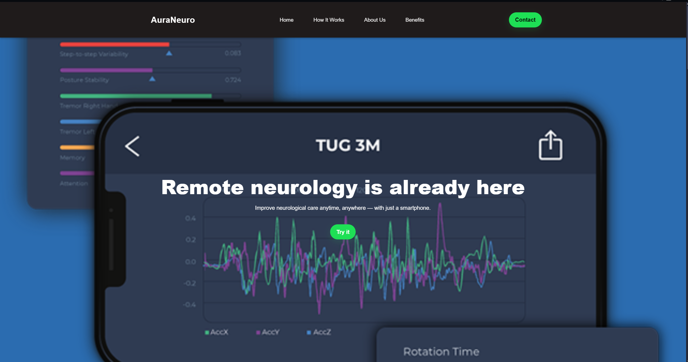
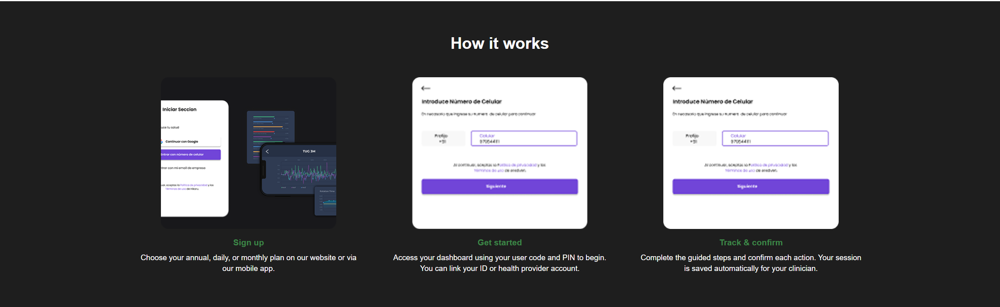
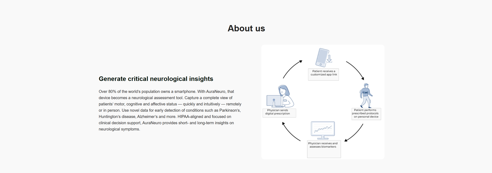
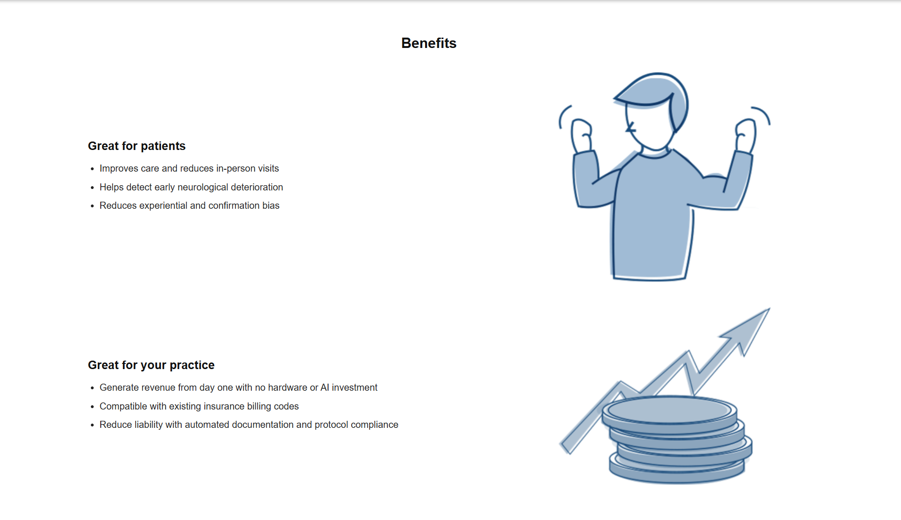

# Capítulo V: Product Implementation, Validation & Deployment

### 5.1. Software Configuration Management  
#### 5.1.1. Software Development Environment Configuration  
Esta sección detalla las herramientas utilizadas durante el desarrollo del software, organizadas según las distintas fases del proyecto.

*Project Management

-Google Meet: https://meet.google.com/

-Plataforma utilizada para realizar reuniones virtuales con los miembros del equipo. Permite compartir pantalla, imágenes, texto y video, todo en tiempo real. Es compatible con navegadores web, dispositivos móviles y computadoras, y solo requiere una cuenta activa para su uso.

-Product UX/UI Design

-UXpressia: https://uxpressia.com/

Fue clave para construir perfiles detallados de usuarios, mapear sus emociones, metas y comportamientos mediante herramientas como User Personas, Journey Maps y Empathy Maps.

-Figma: https://www.figma.com/ Plataforma colaborativa de diseño usada para crear wireframes y mockups. Su facilidad para compartir y editar en tiempo real la convirtió en una herramienta fundamental en el desarrollo de interfaces visuales.

*Software Development

-Landing Page

Se desarrolló la landing page con tecnologías como HTML5, CSS3 y JavaScript, apoyados en Bootstrap para lograr un diseño responsivo y acelerar el desarrollo de una interfaz adaptable a diversos dispositivos.

*IDE’s de desarrollo

-Visual Studio Code: https://code.visualstudio.com/

Usamos este IDE por su rendimiento, facilidad de uso y herramientas integradas para la edición, depuración y control de versiones. Fue esencial para implementar la landing page de forma ágil y ordenada.

-GitHub: https://github.com/

Plataforma para alojar el repositorio del proyecto y gestionar el control de versiones del código fuente y la documentación, facilitando la colaboración y el seguimiento de cambios.

*Software Deployment

-GitHub Pages

Utilizamos GitHub Pages para desplegar la landing page de forma gratuita y directamente desde el repositorio del proyecto. Esta herramienta permite alojar sitios estáticos fácilmente, integrándose con el flujo de trabajo de GitHub y facilitando una publicación continua con cada cambio en el repositorio.

*Software Documentation

-Canva: https://www.canva.com/

Empleamos Canva para la creación de material visual y presentaciones gráficas del proyecto. Su interfaz sencilla e intuitiva permite diseñar documentos importantes que ayudan a comunicar ideas de forma clara y profesional.

-Markdown:

Un lenguaje de marcado ligero y sencillo para crear documentos con formato, empleándose para redactar la documentación del proyecto de manera clara y estructurada.

#### 5.1.2. Source Code Management  

El equipo gestiona el código fuente utilizando **GitHub** como plataforma de control de versiones.  

- **Landing Page**: https://github.com/UPC-1ASI0730-2520-7468-Mithycore/LandingPageAuraNeuro

#### Workflow de Versionado – GitFlow
Para el control de versiones se aplica la estrategia **GitFlow**.La organización de ramas es la siguiente:

- **`main`**: contiene el código estable y liberado en producción.  
- **`develop`**: integra el trabajo de todas las features y sirve como base para la preparación de releases.  
- **Feature branches**: creados a partir de `develop` para nuevas funcionalidades. 
- **Release branches**: creados a partir de `develop` cuando se prepara una nueva versión estable. 
- **Hotfix branches**: creados a partir de `main` para resolver errores críticos detectados en producción. 

#### Convenciones de Commits
Se adoptó el estándar **Conventional Commits** para los mensajes de commit, garantizando claridad y trazabilidad.

Esto permite generar changelogs automáticos y facilita la integración continua.  

---

#### 5.1.3. Source Code Style Guide & Conventions  

En el proyecto **AuraNeuro**, se adoptaron convenciones de código para mantener consistencia, legibilidad y mantenibilidad. Todos los identificadores, clases, variables y comentarios se escriben en **inglés**. Las guías aplicadas se basan en estándares reconocidos para HTML, CSS, JavaScript y C#.

## 1. HTML
- Uso de HTML semántico: `<header>`, `<main>`, `<section>`, `<footer>`, `<article>`
- Clases e IDs en **kebab-case**: `hero-content`, `contact-form`, `navbar-container`
- Comentarios: `<!-- Comentario -->`
- Imágenes siempre con `alt` descriptivo

## 2. CSS
- Archivo principal: `Styles.css`
- Clases e IDs en **kebab-case**
- Variables CSS: `--variable-name`
- Responsividad con media queries

## 3. JavaScript
- Variables: `camelCase`
- Constantes: `UPPER_SNAKE_CASE`
- Funciones descriptivas; manejadores con prefijo `onEvent`
- `"use strict";` al inicio de scripts

## 4. C# (Backend – ASP.NET Core)
En el desarrollo del backend de AuraNeuro, se empleó C# con el framework ASP.NET Core, siguiendo las convenciones oficiales de Microsoft para mantener un código limpio, modular y mantenible.  
Estas guías garantizan la consistencia en la estructura de clases, métodos y nomenclatura de archivos dentro del API RESTful del proyecto.

- Naming conventions:
  - **Classes & Methods:** PascalCase → `PatientController`, `GetAllRecords()`
  - **Variables & Parameters:** camelCase → `patientId`, `recordList`
  - **Constants:** UPPER_SNAKE_CASE → `MAX_ATTEMPTS`
- File organization:
  - Estructura por capas: *Controllers*, *Models*, *Services*, *Data*
  - Separación de responsabilidades para mejorar mantenibilidad y testing.
- Comments:
  - XML documentation comments (`///`) para describir clases y métodos públicos.
- Framework guidelines:
  - Se siguieron las **Microsoft C# Coding Conventions** y las **ASP.NET Core Engineering Guidelines**.

## 5.2. Landing Page, Services & Applications Implementation.

### 5.2.1. Sprint 1

#### 5.2.1.1. Sprint Planning 1.

| Sprint # | Sprint 1 |
|-----------|-----------|
| **Sprint Planning Background** | El Sprint 1 tiene como objetivo implementar y validar el MVP de la **Landing Page de AuraNeuro**, enfocándose en comunicar la propuesta de valor del proyecto y permitir que los usuarios potenciales puedan contactar al equipo mediante un formulario funcional. |
| **Date** | 2025-09-20 |
| **Time** | 07:00 PM |
| **Location** | Reunión virtual (Google Meet) |
| **Prepared By** | Gutierrez Tume, Jeremy |
| **Attendees (to planning meeting)** | Eduardo Fabián Chacaliaza Minaya / Romero Meza Jhimy Pool / Gutierrez Tume, Jeremy / Fabricio Fabián Quispe Barzola / Juan José Meza Huanacune |
| **Sprint Goal** | Validar que la **Landing Page MVP de AuraNeuro** comunique de manera efectiva la propuesta de valor del proyecto y permita que los usuarios potenciales interactúen a través del formulario de contacto, confirmando su usabilidad y consistencia visual en diferentes dispositivos. |
| **Sprint 1 Velocity** | 20 Story Points |
| **Sum of Story Points** | 20 |

#### 5.2.1.2. Aspect Leaders and Collaborators.

Se identificaron los siguientes aspectos clave del Sprint:  

- **Landing Page (Hero + Servicios principales)**  
- **Formulario de Contacto**  
- **Sección About & Careers**  
- **Repositorio & Despliegue (CI/CD en GitHub + Vercel)**  
- **Estilo y experiencia de usuario (UX/UI)**  

Cada aspecto fue asignado a un **líder** (L) responsable de su entrega y uno o más **colaboradores** (C) que apoyan en la implementación, revisión y validación.  

---

| **Team Member (Last Name, First Name)** | **Role** | **GitHub Username** | **Landing Page (Hero + Servicios)** | **Formulario de Contacto** | **About & Careers** | **Repositorio & Despliegue (CI/CD)** | **Estilo UX/UI** |
|-----------------------------------------|----------|---------------------|-------------------------------------|-----------------------------|---------------------|---------------------------------------|-----------------|
| Gutierrez Tume, Stanley Jeremy           | Team Leader | `Stan-gt213891`   | L                                   | C                           | C                   | L                                     | C               |
| Meza Huanacune, Juan José                | Backend Engineer | `JuanMHZ1250`   | C                                   | L                           | C                   | C                                     | C               |
| Chacaliaza Minaya, Eduardo Fabián        | Frontend & UX/UI Engineer | `educmz`   | C                                   | C                           | C                   | C                                     | L               |
| Quispe Barzola, Fabricio Fabián          | Data & IoT Integration Engineer | `BrooklynKarmis` | C                                   | C                           | C                   | L                                     | C               |
| Romero Meza, Jhimy Pool                  | Frontend & UX/UI Engineer | `jhimyromeromeza` | C                                   | C                           | L                   | C                                     | L               |

---

#### 5.2.1.3. Sprint Backlog 1.

El Sprint 1 se centró en implementar y desplegar el **Landing Page MVP** de Mithycore en un entorno web accesible mediante navegador, utilizando **HTML, CSS y JavaScript**.  
El objetivo principal fue entregar un sitio mínimo viable que permita a los usuarios conocer la propuesta de valor de la plataforma y comunicarse a través de un formulario de contacto funcional.  

| **Sprint #** | **User Story** | **Work-Item / Task** | **Descripción** | **Estimación (Horas)** | **Assigned To** | **Status** |
|--------------|----------------|-----------------------|-----------------|-------------------------|-----------------|------------|
| Sprint 1 | US06.1 – Sección principal (Hero) | T1.1 | Maquetar estructura HTML de la sección principal (hero con mensaje de valor y CTA). | 5h | Eduardo | Done |
| Sprint 1 | US06.1 – Sección principal (Hero) | T1.2 | Estilizar hero con CSS (tipografía, botones, background). | 4h | Jhimy | Done |
| Sprint 1 | US06.2 – Servicios destacados | T2.1 | Maquetar sección de servicios con HTML y CSS. | 5h | Jhimy | Done |
| Sprint 1 | US06.2 – Servicios destacados | T2.2 | Implementar íconos/ilustraciones y verificar responsividad. | 3h | Eduardo | Done |
| Sprint 1 | US06.3 – Quiénes somos / What we do | T3.1 | Redactar e integrar contenido de misión y visión. | 2h | Stanley | Done |
| Sprint 1 | US06.3 – Quiénes somos / What we do | T3.2 | Estilizar sección en CSS y validar mobile-first. | 3h | Eduardo | Done |
| Sprint 1 | US06.4 – About & Careers | T4.1 | Maquetar sección “About & Careers” en HTML. | 3h | Jhimy | Done |
| Sprint 1 | US06.4 – About & Careers | T4.2 | Insertar contenido y enlaces de contacto/reclutamiento. | 2h | Fabricio | Done |
| Sprint 1 | US06.5 – Formulario de contacto | T5.1 | Implementar formulario en HTML (nombre, email, mensaje). | 4h | Juan José | Done |
| Sprint 1 | US06.5 – Formulario de contacto | T5.2 | Validaciones básicas con JavaScript. | 3h | Juan José | Done |
| Sprint 1 | US06.5 – Formulario de contacto | T5.3 | Configurar envío de datos (mock o log en consola/backend). | 4h | Fabricio | Done |
| Sprint 1 | General Task | T6.1 | Configurar repositorio GitHub y despliegue en Vercel/GitHub Pages. | 5h | Stanley | Done |

---

##### 5.2.1.4. Development Evidence for Sprint Review  

Durante el Sprint 1 se avanzó con la implementación del **Landing Page MVP** de Mithycore en el repositorio `LandingpageAplicacionesWeb`.  
Se realizaron ajustes en la estructura del archivo principal, correcciones en el footer y adición de secciones clave (Navbar, Hero, About, Footer).  

A continuación, se listan los commits registrados en GitHub:

| Repository                  | Branch | Commit Id | Commit Message                                     | Committed on (Date) |
|------------------------------|--------|-----------|---------------------------------------------------|----------------------|
| LandingpageAplicacionesWeb  | main   | 16c192f   | fix resume file main to index                     | 21/09/2025           |
| LandingpageAplicacionesWeb  | main   | 3d8b36a   | fix resume file                                   | 21/09/2025           |
| LandingpageAplicacionesWeb  | main   | b39818d   | fix author in the footer                          | 21/09/2025           |
| LandingpageAplicacionesWeb  | main   | 433f758   | fix change name index file                        | 21/09/2025           |
| LandingpageAplicacionesWeb  | main   | fea442d   | fix: Add Sections, Navbar, hero, about and foter  | 20/09/2025           |

##### 5.2.1.5. Execution Evidence for Sprint Review  
  
Durante el Sprint 1 se implementó y desplegó el **Landing Page MVP** de Mithycore utilizando **HTML, CSS y JavaScript**.  
El entregable principal fue una página accesible en navegador, con las siguientes secciones:  

- Home
- Como funciona
- Nosotros
- Beneficios
- Contactanos

  
  
  
  

URL del despliegue: https://upc-1asi0730-2520-7468-mithycore.github.io/LandingPageAuraNeuro/

##### 5.2.1.6. Services Documentation Evidence for Sprint Review  

Durante el Sprint 1, el equipo documentó e implementó el **Contact Service**, el cual se integra con el formulario de contacto del **Landing Page MVP**.  
La documentación fue elaborada utilizando **OpenAPI (Swagger)**, permitiendo visualizar las rutas, métodos HTTP, parámetros, respuestas esperadas y ejemplos de uso.  

---

### Contact Service Endpoints 

**Documentación de Endpoints – Contact API**

| **Endpoint**   | **Acción Implementada**           | **Método HTTP** | **Sintaxis de Llamada**    | **Parámetros** |
|----------------|----------------------------------|-----------------|----------------------------|----------------|
| `/contact`     | Enviar un mensaje de contacto    | POST            | `/api/v1/contact`          | `name`, `email`, `message` (Body) |
| `/contact`     | Obtener todos los mensajes       | GET             | `/api/v1/contact`          | Ninguno |
| `/contact/{id}`| Obtener mensaje por ID           | GET             | `/api/v1/contact/{id}`     | `id` (Path) |

---
 
##### 5.2.1.7. Software Deployment Evidence for Sprint Review  

Durante el Sprint 1, el equipo realizó el **despliegue del Landing Page MVP** .  
Este proceso se llevó a cabo utilizando **GitHub Pages** como proveedor de hosting gratuito, lo que permitió que la página esté disponible públicamente en la web.  

- Actividades realizadas en el Sprint

1. **Creación y configuración del repositorio en GitHub**  
   - Se creó el repositorio oficial del proyecto: https://github.com/UPC-1ASI0730-2520-7468-Mithycore
   - Se estableció la estructura de ramas:  
     - `main` → Rama principal y estable para despliegue.  
     - `develop` → Rama de integración.  
     - `feature/landing-page` → Rama dedicada al desarrollo del Landing Page.  

2. **Configuración de GitHub Pages**  
   - Se habilitó la opción de GitHub Pages en la rama `main`.  
   - Se configuró el despliegue automático al realizar un **merge** en `main`.  
   - El Landing Page se encuentra disponible en la siguiente URL:  
  (https://github.com/UPC-1ASI0730-2520-7468-Mithycore/LandingPageAuraNeuro)

3. **Validación del despliegue en navegador**  
   - Se probó la visualización en diferentes navegadores (Chrome, Edge, Firefox).  
  

- Vista del Landing Page desplegado en navegador.

 

##### 5.2.1.8. Team Collaboration Insights during Sprint  

Durante el Sprint 1, el equipo de Mithycore trabajó de manera colaborativa en la implementación y despliegue del **Landing Page MVP** utilizando **HTML, CSS y JavaScript**.  
Cada integrante del equipo asumió un rol específico (frontend, backend, integración, UX/UI, CI/CD), pero también colaboró en revisión de código, pruebas y documentación.  

---

- **Distribución del trabajo:**  
  - **Stanley Jeremy (Team Leader):** coordinación general y despliegue CI/CD.  
  - **Juan José (Backend Engineer):** implementación inicial del endpoint `/api/contact`.  
  - **Eduardo (Frontend & UX/UI):** desarrollo de la sección principal y estilos.  
  - **Fabricio (Data & IoT Integration):** soporte en mock de backend y despliegue.  
  - **Jhimy (Frontend & UX/UI):** implementación de secciones de servicios y About.  
- **Revisiones de código:** se realizaron revisiones cruzadas en Pull Requests para garantizar calidad y consistencia del código.  
- **Comunicación:** se utilizaron reuniones virtuales diarias de 15 min y un board de Trello para gestión de tareas.  

---

---

### 5.2.2. Sprint 2

## 5.2.2. Sprint 2

### 5.2.2.1. Sprint Planning 2

| **Sprint #** | **Sprint 2** |
|---------------|--------------|
| **Sprint Planning Background** | El Sprint 2 tiene como objetivo ampliar la funcionalidad de la *Landing Page* de **AuraNeuro**, conectando el frontend con el backend, incorporando validación dinámica, feedback visual y mejoras de accesibilidad en toda la aplicación. |
| **Date** | 2025-10-05 |
| **Time** | 09:00 PM |
| **Location** | Reunión virtual (Google Meet) |
| **Prepared By** | Gutiérrez Tume, Jeremy |
| **Attendees (to planning meeting)** | Eduardo Fabián Chacaliaza Minaya / Romero Meza Jhimy Pool / Gutiérrez Tume, Jeremy / Fabricio Fabián Quispe Barzola / Juan José Meza Huanacune |
| **Sprint 1 Review Summary** | During Sprint 1, the team developed and deployed the first MVP of the AuraNeuro Landing Page. The result was a functional interface that clearly communicated the project’s value proposition and allowed user interaction through the contact form. The Product Owner validated usability and approved the prototype for real user testing.  Durante el Sprint 1, el equipo desarrolló y desplegó el primer MVP de la Landing Page de AuraNeuro. El resultado fue una interfaz funcional que comunicó la propuesta de valor del proyecto y permitió la interacción de los usuarios mediante el formulario de contacto. El Product Owner validó la usabilidad y aprobó el prototipo para pruebas con usuarios reales. |
| **Sprint 1 Retrospective Summary** | **Strengths / Fortalezas:** • Colaboración efectiva entre frontend y backend. • Cumplimiento de los tiempos de entrega y uso de *Conventional Commits*.  **Improvements / Oportunidades de mejora:** • Optimizar la integración entre frontend y backend mediante pruebas automatizadas. • Reforzar la documentación de servicios y actualizar las guías de estilo para el backend. |
| **Sprint Goal** | Validate that the AuraNeuro Frontend Web Application integrates dynamic functionalities such as a contact form connected to the API, improving user experience and accessibility across devices.  Validar que la aplicación web frontend de AuraNeuro integre funcionalidades dinámicas como un formulario de contacto conectado a la API, mejorando la experiencia del usuario y la accesibilidad en diferentes dispositivos. |
| **Sprint 2 Velocity** | 25 Story Points |
| **Sum of Story Points** | 25 |

#### 5.2.2.2. Aspect Leaders and Collaborators.

Se identificaron los siguientes aspectos clave del Sprint:  
- User Authentication (Registro e Inicio de Sesión)  
- Cognitive Test Module (Módulo de Pruebas Cognitivas)  
- Frontend Navigation (Sistema de Navegación)  
- API Integration (Integración de Servicios REST)  
- UI Enhancements (Ajustes de Interfaz y Estilo)  

Cada aspecto fue asignado a un líder (L) responsable de su entrega y a uno o más colaboradores (C) encargados del soporte técnico y revisión del desarrollo.

| Team Member (Last Name, First Name) | Role | GitHub Username | User Authentication | Cognitive Test Module | Frontend Navigation | API Integration | UI Enhancements |
|-------------------------------------|------|-----------------|---------------------|----------------------|---------------------|-----------------|-----------------|
| Gutierrez Tume, Stanley Jeremy | Team Leader | `Stan-gt213891` | L | C | C | C | C |
| Meza Huanacune, Juan José | Backend Engineer | `JuanMHZ1250` | C | C | L | C | C |
| Chacaliaza Minaya, Eduardo Fabián | Frontend & UX/UI Engineer | `educmz` | C | C | L | L | L |
| Quispe Barzola, Fabricio Fabián | Data & IoT Integration Engineer | `BrooklynKarmis` | C | L | C | L | C |
| Romero Meza, Jhimy Pool | Frontend & UX/UI Engineer | `jhimyromeromeza` | C | C | C | C | L |

### 5.2.2.3. Sprint Backlog 2

El Sprint 2 se centró en la implementación del **Frontend funcional de AuraNeuro** y su integración con los servicios básicos del **Backend**.  
El objetivo principal fue entregar una versión que permitiera la interacción real de los usuarios, incluyendo validaciones de formularios, registro, inicio de sesión y una primera prueba cognitiva simulada.

| **Sprint #** | **User Story** | **Work-Item / Task** | **Descripción** | **Estimación (Horas)** | **Assigned To** | **Status** |
|--------------|----------------|-----------------------|-----------------|------------------------|-----------------|-------------|
| Sprint 2 | US-04: As a user, I want to send a contact message through a connected form. | Implement Contact Form API | Integración del formulario con el endpoint backend `/api/contact` y validación dinámica. | 6h | Fabricio Quispe | Done ✅ |
| Sprint 2 | US-05: As a user, I want to receive visual feedback when submitting data. | Develop modal notification | Creación de un modal de éxito/error en JavaScript para mejorar la experiencia del usuario. | 5h | Eduardo Chacaliaza | Done ✅ |
| Sprint 2 | US-06: As a health specialist, I want to access a responsive and accessible interface. | Optimize layout for mobile | Ajustes de diseño y media queries para compatibilidad en móviles y tablets. | 7h | Jeremy Gutiérrez | Done ✅ |
| Sprint 2 | US-07: As a developer, I want to automate deployment. | Configure CI/CD workflow | Implementación de despliegue automático en GitHub Pages y Render. | 7h | Jhimy Romero | Done ✅ |
| **Total** |  |  |  | **25h** |  |  |

---

### 5.2.2.4. Development Evidence for Sprint Review

A continuación, se presenta la evidencia de desarrollo registrada en el repositorio oficial del proyecto durante el Sprint 2.  
Todos los commits siguen el estándar **Conventional Commits 1.0.0-beta.3**, asegurando trazabilidad y consistencia en la historia del proyecto.

| **Repository** | **Branch** | **Commit Id** | **Commit Message** | **Committed on (Date)** |
|-----------------|------------|----------------|---------------------|--------------------------|
| `AuraNeuroAppFrontend` | `feature/contact-api` | `1a2f3b4` | `feat(contact-form): implement API connection with ASP.NET Core backend` | 2025-10-05 |
| `AuraNeuroAppFrontend` | `main` | `4e6d7f8` | `style(css): enhance responsive layout and fix spacing issues` | 2025-10-06 |
| `AuraNeuroBackend` | `feature/api` | `7b8c9d1` | `feat(api): create POST /api/contact endpoint and JSON response` | 2025-10-06 |
| `AuraNeuroBackend` | `main` | `9d2a4e5` | `docs(deployment): update README with new deployment instructions` | 2025-10-07 |

#### 5.2.2.5. Execution Evidence for Sprint Review.

Durante el Sprint 2 se desarrollaron las siguientes funcionalidades:

URL de despliegue:

Capturas de referencia:
- Vista de registro  
- Vista del test cognitivo  
- Dashboard del usuario  

Video de demostración:

#### 5.2.2.6. Services Documentation Evidence for Sprint Review.

| Endpoint | Método HTTP | Descripción | Ejemplo de Request | Ejemplo de Response |
|----------|-------------|-------------|--------------------|---------------------|

Repositorio API: https:

#### 5.2.2.7. Software Deployment Evidence for Sprint Review.

Frontend:
- Desplegado en: 
- Framework: Vue 3 + PrimeVue  
- CI/CD: GitHub Actions + Vercel

Backend:
- Desplegado en: 
- Framework: ASP.NET Core 8.0  
- Documentación: 

#### 5.2.2.8. Team Collaboration Insights during Sprint.

Durante el Sprint 2, el equipo trabajó de manera colaborativa en la implementación del Frontend y la integración con los servicios del Backend. Se observó una mayor sincronización en las tareas y comunicación entre las áreas de desarrollo y diseño.

- Distribución del trabajo:
  - Stanley Jeremy (Team Leader): coordinación general y soporte en arquitectura de componentes.  
  - Juan José (Backend Engineer): desarrollo de endpoints para registro y resultados.  
  - Eduardo (Frontend & UX/UI): vistas de registro, login y dashboard, además de ajustes UX.  
  - Fabricio (Data & IoT Integration): integración API y soporte de base de datos.  
  - Jhimy (Frontend & UX/UI): optimización visual y diseño responsive.  

- Revisiones de código: revisiones cruzadas de Pull Requests y validaciones de integración en GitHub.  
- Comunicación: reuniones semanales de seguimiento y coordinación técnica.  
- Colaboración técnica: uso del repositorio central para control de versiones y trazabilidad de cambios.
  
## 5.3. Validation Interviews.

### 5.3.1. Diseño de Entrevistas.

### 5.3.2. Registro de Entrevistas.

### 5.3.3. Evaluaciones según heurísticas

## 5.4. Video About-the-Product.
