# Capítulo V: Product Implementation, Validation & Deployment

### 5.1. Software Configuration Management  
#### 5.1.1. Software Development Environment Configuration  
Esta sección detalla las herramientas utilizadas durante el desarrollo del software, organizadas según las distintas fases del proyecto.

*Project Management

-Google Meet: https://meet.google.com/

-Plataforma utilizada para realizar reuniones virtuales con los miembros del equipo. Permite compartir pantalla, imágenes, texto y video, todo en tiempo real. Es compatible con navegadores web, dispositivos móviles y computadoras, y solo requiere una cuenta activa para su uso.

-Product UX/UI Design

-UXpressia: https://uxpressia.com/

Fue clave para construir perfiles detallados de usuarios, mapear sus emociones, metas y comportamientos mediante herramientas como User Personas, Journey Maps y Empathy Maps.

-Figma: https://www.figma.com/ Plataforma colaborativa de diseño usada para crear wireframes y mockups. Su facilidad para compartir y editar en tiempo real la convirtió en una herramienta fundamental en el desarrollo de interfaces visuales.

*Software Development

-Landing Page

Se desarrolló la landing page con tecnologías como HTML5, CSS3 y JavaScript, apoyados en Bootstrap para lograr un diseño responsivo y acelerar el desarrollo de una interfaz adaptable a diversos dispositivos.

*IDE’s de desarrollo

-Visual Studio Code: https://code.visualstudio.com/

Usamos este IDE por su rendimiento, facilidad de uso y herramientas integradas para la edición, depuración y control de versiones. Fue esencial para implementar la landing page de forma ágil y ordenada.

-GitHub: https://github.com/

Plataforma para alojar el repositorio del proyecto y gestionar el control de versiones del código fuente y la documentación, facilitando la colaboración y el seguimiento de cambios.

*Software Deployment

-GitHub Pages

Utilizamos GitHub Pages para desplegar la landing page de forma gratuita y directamente desde el repositorio del proyecto. Esta herramienta permite alojar sitios estáticos fácilmente, integrándose con el flujo de trabajo de GitHub y facilitando una publicación continua con cada cambio en el repositorio.

*Software Documentation

-Canva: https://www.canva.com/

Empleamos Canva para la creación de material visual y presentaciones gráficas del proyecto. Su interfaz sencilla e intuitiva permite diseñar documentos importantes que ayudan a comunicar ideas de forma clara y profesional.

-Markdown:

Un lenguaje de marcado ligero y sencillo para crear documentos con formato, empleándose para redactar la documentación del proyecto de manera clara y estructurada.

#### 5.1.2. Source Code Management  

El equipo gestiona el código fuente utilizando **GitHub** como plataforma de control de versiones.  

- **Landing Page**: https://github.com/UPC-1ASI0730-2520-7468-Mithycore/LandingPageAuraNeuro

#### Workflow de Versionado – GitFlow
Para el control de versiones se aplica la estrategia **GitFlow**.La organización de ramas es la siguiente:

- **`main`**: contiene el código estable y liberado en producción.  
- **`develop`**: integra el trabajo de todas las features y sirve como base para la preparación de releases.  
- **Feature branches**: creados a partir de `develop` para nuevas funcionalidades. 
- **Release branches**: creados a partir de `develop` cuando se prepara una nueva versión estable. 
- **Hotfix branches**: creados a partir de `main` para resolver errores críticos detectados en producción. 

#### Convenciones de Commits
Se adoptó el estándar **Conventional Commits** para los mensajes de commit, garantizando claridad y trazabilidad.

Esto permite generar changelogs automáticos y facilita la integración continua.  

---

#### 5.1.3. Source Code Style Guide & Conventions  

En el proyecto **AuraNeuro**, se adoptaron convenciones de código para mantener consistencia, legibilidad y mantenibilidad. Todos los identificadores, clases, variables y comentarios se escriben en **inglés**. Las guías aplicadas se basan en estándares reconocidos para HTML, CSS, JavaScript y C#.

## 1. HTML
- Uso de HTML semántico: `<header>`, `<main>`, `<section>`, `<footer>`, `<article>`
- Clases e IDs en **kebab-case**: `hero-content`, `contact-form`, `navbar-container`
- Comentarios: `<!-- Comentario -->`
- Imágenes siempre con `alt` descriptivo

## 2. CSS
- Archivo principal: `Styles.css`
- Clases e IDs en **kebab-case**
- Variables CSS: `--variable-name`
- Responsividad con media queries

## 3. JavaScript
- Variables: `camelCase`
- Constantes: `UPPER_SNAKE_CASE`
- Funciones descriptivas; manejadores con prefijo `onEvent`
- `"use strict";` al inicio de scripts

## 4. C# (Backend – ASP.NET Core)
En el desarrollo del backend de AuraNeuro, se empleó C# con el framework ASP.NET Core, siguiendo las convenciones oficiales de Microsoft para mantener un código limpio, modular y mantenible.  
Estas guías garantizan la consistencia en la estructura de clases, métodos y nomenclatura de archivos dentro del API RESTful del proyecto.

- Naming conventions:
  - **Classes & Methods:** PascalCase → `PatientController`, `GetAllRecords()`
  - **Variables & Parameters:** camelCase → `patientId`, `recordList`
  - **Constants:** UPPER_SNAKE_CASE → `MAX_ATTEMPTS`
- File organization:
  - Estructura por capas: *Controllers*, *Models*, *Services*, *Data*
  - Separación de responsabilidades para mejorar mantenibilidad y testing.
- Comments:
  - XML documentation comments (`///`) para describir clases y métodos públicos.
- Framework guidelines:
  - Se siguieron las **Microsoft C# Coding Conventions** y las **ASP.NET Core Engineering Guidelines**.

## 5.2. Landing Page, Services & Applications Implementation.

## 5.2.1. Sprint 1  

#### 5.2.1.1. Sprint Planning 1.

En esta sección se presenta la planificación del Sprint 1, cuyo objetivo principal es convertir los diseños validados en un MVP funcional de la landing page de AuraNeuro. El sprint se centra en entregar las secciones críticas que permiten comunicar la propuesta de valor, captar leads y validar interés: Hero con CTA, How-it-works, Features, About, Formulario de contacto, Footer y ajustes básicos de SEO, rendimiento y accesibilidad.

El alcance de la iteración incluye la implementación front-end responsiva, la integración básica del formulario de contacto (envío y confirmación), la optimización de imágenes y meta-etiquetas, así como verificaciones iniciales de accesibilidad y performance. Este trabajo busca habilitar a marketing y ventas con una página pública utilizable para la captación de usuarios y proporcionar una base técnica estable sobre la que iterar en sprints siguientes.

<table border="1" cellpadding="6" cellspacing="0" style="border-collapse:collapse; width:100%; font-family:Arial, sans-serif;">
  <caption style="text-align:left; font-weight:bold; padding:6px 0;">Sprint Planning - Sprint 1 (Landing Page)</caption>
  <tbody>
    <tr>
      <th style="width:20%;">Sprint #</th>
      <td>Sprint 1</td>
    </tr>
    <tr>
      <th>Sprint Planning Background - Date</th>
      <td>2025-09-20</td>
    </tr>
    <tr>
      <th>Time</th>
      <td>10:00 AM - 11:30 AM</td>
    </tr>
    <tr>
      <th>Location</th>
      <td>Reunión virtual (Zoom) / Oficina central AuraNeuro</td>
    </tr>
    <tr>
      <th>Prepared By</th>
      <td>Romero Meza Jhimy Pool (Product Owner)</td>
    </tr>
    <tr>
      <th>Attendees (to planning meeting)</th>
      <td>Eduardo Fabián Chacaliaza Minaya  (PO), Gutierrez Tume, Jeremy (Lead Dev), Fabricio Fabián Quispe Barzola (Frontend), Romero Meza Jhimy Pool (Frontend), Juan José Meza Huanacune (Content/UX), Juan José (Forms)</td>
    </tr>
  </tbody>
</table>
 
<table border="1" cellpadding="6" cellspacing="0" style="border-collapse:collapse; width:100%; font-family:Arial, sans-serif;">
  <caption style="text-align:left; font-weight:bold; padding:6px 0;">Sprint n − 1 Review & Retrospective (Resumen)</caption>
  <tbody>
    <tr>
      <th style="width:25%;">Sprint n − 1 Review Summary</th>
      <td>
        <em>Contexto:</em> Pre-sprint (fase de descubrimiento y diseño). 
        <strong>Resultados:</strong> Wireframes y mockups de la landing validados por stakeholders; alcance del MVP de la landing definido (hero, how-it-works, features, contacto, footer, performance y accesibilidad básica). 
        <strong>Feedback:</strong> Ajustes menores de copy, necesidad de plan de performance y plan de accesibilidad (WCAG).
      </td>
    </tr>
    <tr>
      <th>Sprint n − 1 Retrospective Summary</th>
      <td>
        <strong>Lo que funcionó:</strong> Comunicación entre diseño y frontend rápida; entregas de assets a tiempo. 
        <strong>Mejoras:</strong> Planificar tiempo de QA y testing cross-browser; acordar criterios de aceptación más detallados para CMS y analytics.
      </td>
    </tr>
  </tbody>
</table>
 
<table border="1" cellpadding="6" cellspacing="0" style="border-collapse:collapse; width:100%; font-family:Arial, sans-serif;">
  <caption style="text-align:left; font-weight:bold; padding:6px 0;">Sprint Goal & User Stories</caption>
  <tbody>
    <tr>
      <th style="width:25%;">Sprint Goal (template)</th>
      <td>
        <strong>Our focus is on</strong> Entrega de una landing page MVP adaptable y de alta conversión que permite a los visitantes comprender la propuesta de valor de AuraNeuro y contactar fácilmente con el equipo.  
        <strong>We believe it delivers</strong> Se mejoró la captación de leads y se aceleró la incorporación de los primeros usuarios al producto, lo que aumentó los leads cualificados por marketing (MQL).  
        <strong>This will be confirmed when</strong> Los visitantes pueden: (1) ver el hero y el flujo del producto, (2) enviar el formulario de contacto correctamente, (3) navegar por el sitio web de forma adaptable y (4) cumplir los objetivos de las métricas clave de rendimiento (LCP < 2,5 s y comprobaciones de accesibilidad AA superadas).
      </td>
    </tr>
    <tr>
      <th>Sprint Goal (SMART)</th>
      <td>
        <strong>Specific:</strong> Cree y publique las secciones MVP de la página de destino: Héroe, Cómo funciona, Tarjetas de características, Acerca de, Formulario de contacto, Pie de página y optimizaciones de rendimiento y SEO de referencia. 
        <strong>Measurable:</strong> El envío del formulario de contacto funciona; LCP < 2,5 s; accesibilidad AA para páginas principales; clics de CTA rastreables en análisis. 
        <strong>Attainable:</strong> El equipo se compromete a sumar 29 puntos de historia (ver Suma de puntos de historia). 
        <strong>Relevant:</strong> Permite que el marketing capture clientes potenciales y valide el interés en el producto. 
        <strong>Time-bound:</strong>Finalización al final del Sprint 1 (sprint de 2 semanas).
      </td>
    </tr>
    <tr>
      <th>Sprint n Velocity (team capacity)</th>
      <td>
        <strong>Planned Velocity:</strong> 30 story points (team capacity estimate) 
        <strong>Committed:</strong> 29 story points (see Sum of Story Points below)
      </td>
    </tr>
    <tr>
      <th>Sum of Story Points (this Sprint)</th>
      <td><strong>29 SP</strong> (subconjunto seleccionado y priorizado de historias de destino US21–US35)</td>
    </tr>
  </tbody>
</table>
 
<table border="1" cellpadding="6" cellspacing="0" style="border-collapse:collapse; width:100%; font-family:Arial, sans-serif;">
  <caption style="text-align:left; font-weight:bold; padding:6px 0;">User Stories included in Sprint 1 (Selected & Prioritized)</caption>
  <thead style="background:#f2f2f2;">
    <tr>
      <th style="width:8%;">Order</th>
      <th style="width:12%;">User Story Id</th>
      <th style="width:40%;">Título</th>
      <th style="width:10%;">Story Points</th>
      <th style="width:30%;">Acceptance Summary / Goal</th>
    </tr>
  </thead>
  <tbody>
    <tr>
      <td>21</td><td>US21</td><td>Hero con CTA principal</td><td style="text-align:center;">2</td><td>Hero visible, CTA Try/Contact funcional y redirige; copy y assets aprobados.</td>
    </tr>
    <tr>
      <td>22</td><td>US22</td><td>Navegación responsiva</td><td style="text-align:center;">3</td><td>Menu desktop + hamburger en mobile; enlaces a secciones funcionan y accesibles.</td>
    </tr>
    <tr>
      <td>23</td><td>US23</td><td>Sección “How it works” con pasos</td><td style="text-align:center;">2</td><td>3 pasos ilustrados con texto alternativo y semántica correcta.</td>
    </tr>
    <tr>
      <td>24</td><td>US24</td><td>Bloque de Features / Cards</td><td style="text-align:center;">3</td><td>Cards mostradas, hover/acción y enlace a más info o modal.</td>
    </tr>
    <tr>
      <td>25</td><td>US25</td><td>Sección About / Who we are</td><td style="text-align:center;">2</td><td>Texto e imágenes alineadas, versión imprimible adecuada.</td>
    </tr>
    <tr>
      <td>26</td><td>US26</td><td>Beneficios y “Good for business”</td><td style="text-align:center;">3</td><td>Bullets claros para pacientes y empresas; CTA institucional pre-fill al contacto.</td>
    </tr>
    <tr>
      <td>27</td><td>US27</td><td>Formulario de contacto validado</td><td style="text-align:center;">3</td><td>Formulario envía datos, validaciones client-side y confirmación visual; evento de conversión dispara en analytics.</td>
    </tr>
    <tr>
      <td>28</td><td>US28</td><td>Footer con enlaces y redes sociales</td><td style="text-align:center;">1</td><td>Footer con enlaces funcionando y accesibles por teclado; enlaces abren en nueva pestaña.</td>
    </tr>
    <tr>
      <td>29</td><td>US29</td><td>Responsive layout y comportamiento mobile</td><td style="text-align:center;">3</td><td>Layout reflow correcto en <768px y tablet; no solapamientos.</td>
    </tr>
    <tr>
      <td>30</td><td>US30</td><td>Performance y optimización de imágenes</td><td style="text-align:center;">5</td><td>Imágenes optimizadas, lazy-loading, objetivo LCP < 2.5s en entorno de prueba.</td>
    </tr>
    <tr>
      <td>31</td><td>US31</td><td>SEO básico y meta tags</td><td style="text-align:center;">2</td><td>Meta title/description/OG tags presentes y verificados; preview social correcto.</td>
    </tr>
  </tbody>
</table>
 
<table border="1" cellpadding="6" cellspacing="0" style="border-collapse:collapse; width:100%; font-family:Arial, sans-serif;">
  <caption style="text-align:left; font-weight:bold; padding:6px 0;">Definition of Done (DoD) & Acceptance Criteria highlights</caption>
  <tbody>
    <tr>
      <th style="width:30%;">Definition of Done (DoD)</th>
      <td>
        - Código revisado (PR) y aprobado. 
        - Tests básicos (UI/Functional) ejecutados y pasados. 
        - Documentación mínima actualizada (README / notas de despliegue). 
        - Despliegue en entorno de staging y revisión PO/QA. 
        - Eventos analytics instrumentados para CTAs y formulario.
      </td>
    </tr>
    <tr>
      <th>Exit criteria (Sprint 1)</th>
      <td>
        - Landing publicada en staging con LCP < 2.5s (medido en entorno de pruebas). 
        - Contact form enviado y registro de evento en analytics. 
        - Navegación responsive comprobada en 3 breakpoints y smoke test cross-browser. 
        - Accesibility smoke checks (focus order, alt text, contrast) completados.
      </td>
    </tr>
  </tbody>
</table>

#### 5.2.1.2. Aspect Leaders and Collaborators.  

<section>
  <h3>Aspect Leaders and Collaborators — Introducción</h3>
  

    En esta sección se presenta la <strong>Leadership-and-Collaboration Matrix (LACX)</strong> para el Sprint 1 (Landing Page).
    El propósito del LACX es dejar claro, para cada aspecto clave del alcance del sprint, quién actúa como <em>líder</em> (responsable principal)
    y quiénes son los <em>colaboradores</em>. Esto facilita la comunicación interna, la toma de decisiones y la velocidad de ejecución.
  

  

    Para este sprint se identificaron los siguientes aspectos relevantes (cada aspecto refleja un subconjunto del alcance funcional y no funcional):
    <strong>Content & Copy, Frontend Implementation (Hero y secciones), Accessibility & UX, Performance & SEO, Backend & Form Integration,
    </strong>. A continuación se muestra la matriz con líderes (L) y colaboradores (C) asignados.
  

</section>

<table border="1" cellpadding="6" cellspacing="0" style="border-collapse:collapse; width:100%; font-family:Arial, sans-serif; margin-top:12px;">
  <caption style="text-align:left; font-weight:bold; padding:6px 0;">Leadership-and-Collaboration Matrix (LACX) — Sprint 1 (Landing Page)</caption>
  <thead style="background:#f2f2f2;">
    <tr>
      <th>Team Member (Last Name, First Name)</th>
      <th>GitHub Username</th>
      <th>Content &amp; Copy (Aspect 1)</th>
      <th>Frontend Implementation (Hero + Sections) (Aspect 2)</th>
      <th>Accessibility &amp; UX (Aspect 3)</th>
      <th>Performance &amp; SEO (Aspect 4)</th>
      <th>Backend &amp; Form Integration (Aspect 5)</th>
    </tr>
  </thead>
  <tbody>
    <tr>
      <td><strong>Romero Meza, Jhimy</strong> (Sprint Lead / Frontend)</td>
      <td>jhimyromero (placeholder)</td>
      <td>C</td>
      <td><strong>L</strong></td>
      <td>C</td>
      <td>C</td>
      <td>C</td>
    </tr>
    <tr>
      <td><strong>Eduardo Fabián Chacaliaza Minaya</strong> (Product Owner)</td>
      <td>educmz</td>
      <td>C</td>
      <td>C</td>
      <td>C</td>
      <td>C</td>
      <td>C</td>
    </tr>
    <tr>
      <td><strong>Gutierrez Tume, Jeremy </strong> (Lead Dev)</td>
      <td>Stan-gt213891</td>
      <td>C</td>
      <td>C</td>
      <td>C</td>
      <td><strong>L</strong></td>
      <td>C</td>
    </tr>
    <tr>
      <td><strong>Fabricio Fabián Quispe Barzola</strong> (Frontend)</td>
      <td>BrooklynKarmis</td>
      <td>C</td>
      <td>C</td>
      <td>C</td>
      <td>C</td>
      <td>C</td>
    </tr>
    <tr>
      <td><strong>Juan José Meza Huanacune</strong> (Content / UX)</td>
      <td>JuanMHZ1250</td>
      <td><strong>L</strong></td>
      <td>C</td>
      <td><strong>L</strong></td>
      <td>C</td>
      <td>C</td>
    </tr>
  </tbody>
</table>
<section style="font-family:Arial, sans-serif; margin-top:10px;">
  

    <strong>Instrucciones:</strong> Esta matriz se debe mantener actualizada durante el Sprint (cambios en responsables,
    reasignaciones o inclusión de nuevos sub-aspectos). Las etiquetas <strong>L</strong> (Leader) y <strong>C</strong> (Collaborator)
    indican responsabilidades principales y de apoyo. Reemplazar los GitHub usernames marcados como <em>placeholder</em> por los reales.
  

</section>

#### 5.2.1.3. Sprint Backlog 1.  

<!-- SPRINT BACKLOG - SPRINT 1 (Landing Page) -->
<section>
  <h2>Sprint Backlog — Sprint 1 (Landing Page)</h2>
  

    Objetivo del sprint: entregar el MVP de la <strong>landing page</strong> de AuraNeuro con las secciones críticas
    (Hero, How-it-works, Features, About, Contact form, Footer) y mejoras básicas de SEO, rendimiento y accesibilidad.
    Este Sprint Backlog lista las User Stories comprometidas y la descomposición en Work-items / Tasks que el equipo
    (Front-end y Content/UX) realizará durante las dos semanas de iteración.
  

  <!-- Screenshot del Board (reemplazar src y URL por los reales) -->
  

    <strong>Sprint Board (tool):</strong>
     
    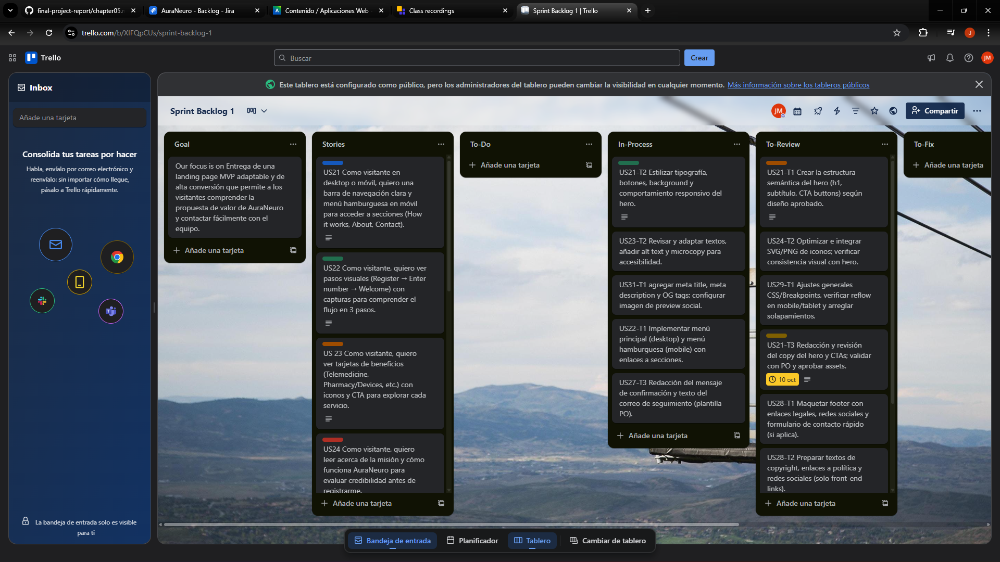
    

      <strong>URL del Board:</strong>
      <a href="https://trello.com/invite/b/68e8592120ae5b781c165835/ATTIc1385aeb0b3d5ea0b1fb310577f51f37B5D52B13/sprint-backlog-1" target="_blank" rel="noopener">https://trello.com/invite/b/68e8592120ae5b781c165835/ATTIc1385aeb0b3d5ea0b1fb310577f51f37B5D52B13/sprint-backlog-1</a>
    

  

</section>

<!-- Sprint Backlog Table -->
<table border="1" cellpadding="6" cellspacing="0" style="border-collapse:collapse; width:100%; font-family:Arial, sans-serif;">
  <caption style="text-align:left; font-weight:bold; padding:6px 0;">Sprint 1 Backlog — User Stories & Work-items</caption>
  <thead style="background:#f2f2f2;">
    <tr>
      <th style="width:6%;">User Story Id</th>
      <th style="width:22%;">User Story Title</th>
      <th style="width:8%;">Work-Item Id</th>
      <th style="width:18%;">Work-Item / Task Title</th>
      <th style="width:26%;">Description</th>
      <th style="width:8%;">Est. (Hours)</th>
      <th style="width:12%;">Assigned To</th>
      <th style="width:10%;">Status</th>
    </tr>
  </thead>
  <tbody>
    <tr>
      <td>US21</td>
      <td>Hero con CTA principal</td>
      <td>US21-T1</td>
      <td>HTML: Maquetación Hero</td>
      <td>Crear la estructura semántica del hero (h1, subtítulo, CTA buttons) según diseño aprobado.</td>
      <td style="text-align:center;">4</td>
      <td>Romero Meza, Jhimy</td>
      <td>To-do</td>
    </tr>
    <tr>
      <td>US21</td>
      <td>Hero con CTA principal</td>
      <td>US21-T2</td>
      <td>CSS: Estilos y responsive Hero</td>
      <td>Estilizar tipografía, botones, background y comportamiento responsivo del hero.</td>
      <td style="text-align:center;">3</td>
      <td>Fabricio Fabián Quispe Barzola</td>
      <td>To-do</td>
    </tr>
    <tr>
      <td>US21</td>
      <td>Hero con CTA principal</td>
      <td>US21-T3</td>
      <td>Content: Copy y microcopy</td>
      <td>Redacción y revisión del copy del hero y CTAs; validar con PO y aprobar assets.</td>
      <td style="text-align:center;">2</td>
      <td>Juan José Meza Huanacune</td>
      <td>To-do</td>
    </tr>
    <tr>
      <td>US22</td>
      <td>Navegación responsiva</td>
      <td>US22-T1</td>
      <td>HTML: Menú y estructura de navegación</td>
      <td>Implementar menú principal (desktop) y menú hamburguesa (mobile) con enlaces a secciones.</td>
      <td style="text-align:center;">3</td>
      <td>Romero Meza, Jhimy</td>
      <td>To-do</td>
    </tr>
    <tr>
      <td>US22</td>
      <td>Navegación responsiva</td>
      <td>US22-T2</td>
      <td>JS: Comportamiento del menú</td>
      <td>Scroll suave, apertura/cierre del menú hamburguesa y estado activo en enlaces al hacer scroll.</td>
      <td style="text-align:center;">2</td>
      <td>Fabricio Fabián Quispe Barzola</td>
      <td>To-do</td>
    </tr>
    <tr>
      <td>US23</td>
      <td>Sección “How it works” con pasos</td>
      <td>US23-T1</td>
      <td>HTML/CSS: Maquetación de pasos</td>
      <td>Maquetar los 3 pasos (Register → Enter number → Welcome) con imágenes y texto alternativo.</td>
      <td style="text-align:center;">2.5</td>
      <td>Romero Meza, Jhimy</td>
      <td>To-do</td>
    </tr>
    <tr>
      <td>US23</td>
      <td>Sección “How it works” con pasos</td>
      <td>US23-T2</td>
      <td>Content: Textos y alt text</td>
      <td>Revisar y adaptar textos, añadir alt text y microcopy para accesibilidad.</td>
      <td style="text-align:center;">1.5</td>
      <td>Juan José Meza Huanacune</td>
      <td>To-do</td>
    </tr>
    <tr>
      <td>US24</td>
      <td>Bloque de Features / Cards</td>
      <td>US24-T1</td>
      <td>HTML/CSS: Cards de features</td>
      <td>Crear tarjetas con iconos, títulos, descripciones cortas y CTA; responsive grid.</td>
      <td style="text-align:center;">3</td>
      <td>Fabricio Fabián Quispe Barzola</td>
      <td>To-do</td>
    </tr>
    <tr>
      <td>US24</td>
      <td>Bloque de Features / Cards</td>
      <td>US24-T2</td>
      <td>Assets: Integración de iconos/illust</td>
      <td>Optimizar e integrar SVG/PNG de iconos; verificar consistencia visual con hero.</td>
      <td style="text-align:center;">1.5</td>
      <td>Romero Meza, Jhimy</td>
      <td>To-do</td>
    </tr>
    <tr>
      <td>US25</td>
      <td>Sección About / Who we are</td>
      <td>US25-T1</td>
      <td>HTML/CSS: Maquetación About</td>
      <td>Maquetar la sección About con imágenes y bloques de texto según diseño.</td>
      <td style="text-align:center;">2</td>
      <td>Fabricio Fabián Quispe Barzola</td>
      <td>To-do</td>
    </tr>
    <tr>
      <td>US25</td>
      <td>Sección About / Who we are</td>
      <td>US25-T2</td>
      <td>Content: Revisión y aprobación copy</td>
      <td>Validar misión, visión y textos; ajustar tono y longitud para web.</td>
      <td style="text-align:center;">1.5</td>
      <td>Juan José Meza Huanacune</td>
      <td>To-do</td>
    </tr>
    <tr>
      <td>US26</td>
      <td>Beneficios y “Good for business”</td>
      <td>US26-T1</td>
      <td>HTML/CSS: Maquetación de beneficios</td>
      <td>Listar bullets para pacientes y empresas; incluir CTA institucional con prefill.</td>
      <td style="text-align:center;">2.5</td>
      <td>Romero Meza, Jhimy</td>
      <td>To-do</td>
    </tr>
    <tr>
      <td>US26</td>
      <td>Beneficios y “Good for business”</td>
      <td>US26-T2</td>
      <td>Content: Copy para decisores</td>
      <td>Redactar texto orientado a decisores institucionales; preparar prefill para contacto.</td>
      <td style="text-align:center;">1.5</td>
      <td>Juan José Meza Huanacune</td>
      <td>To-do</td>
    </tr>
    <tr>
      <td>US27</td>
      <td>Formulario de contacto validado</td>
      <td>US27-T1</td>
      <td>HTML/CSS: Formulario</td>
      <td>Crear formulario con campos (nombre, email, teléfono, mensaje) y diseño responsive.</td>
      <td style="text-align:center;">3</td>
      <td>Fabricio Fabián Quispe Barzola</td>
      <td>To-do</td>
    </tr>
    <tr>
      <td>US27</td>
      <td>Formulario de contacto validado</td>
      <td>US27-T2</td>
      <td>JS: Validaciones y UX de envío</td>
      <td>Validaciones client-side, mensajes de error, estado de envío y confirmación visual; mock submit (console / mock endpoint).</td>
      <td style="text-align:center;">3</td>
      <td>Romero Meza, Jhimy</td>
      <td>To-do</td>
    </tr>
    <tr>
      <td>US27</td>
      <td>Formulario de contacto validado</td>
      <td>US27-T3</td>
      <td>Content: Texto del success/follow-up</td>
      <td>Redacción del mensaje de confirmación y texto del correo de seguimiento (plantilla PO).</td>
      <td style="text-align:center;">1</td>
      <td>Juan José Meza Huanacune</td>
      <td>To-do</td>
    </tr>
    <tr>
      <td>US28</td>
      <td>Footer con enlaces y redes sociales</td>
      <td>US28-T1</td>
      <td>HTML/CSS: Pie de página</td>
      <td>Maquetar footer con enlaces legales, redes sociales y formulario de contacto rápido (si aplica).</td>
      <td style="text-align:center;">2</td>
      <td>Fabricio Fabián Quispe Barzola</td>
      <td>To-do</td>
    </tr>
    <tr>
      <td>US28</td>
      <td>Footer con enlaces y redes sociales</td>
      <td>US28-T2</td>
      <td>Content: Enlaces y textos legales</td>
      <td>Preparar textos de copyright, enlaces a política y redes sociales (solo front-end links).</td>
      <td style="text-align:center;">1</td>
      <td>Juan José Meza Huanacune</td>
      <td>To-do</td>
    </tr>
    <tr>
      <td>US29</td>
      <td>Responsive layout y comportamiento mobile</td>
      <td>US29-T1</td>
      <td>Responsive tuning</td>
      <td>Ajustes generales CSS/Breakpoints, verificar reflow en mobile/tablet y arreglar solapamientos.</td>
      <td style="text-align:center;">3</td>
      <td>Romero Meza, Jhimy</td>
      <td>To-do</td>
    </tr>
    <tr>
      <td>US30</td>
      <td>Performance y optimización de imágenes</td>
      <td>US30-T1</td>
      <td>Optimizar imágenes</td>
      <td>Comprimir y exportar imágenes en WebP/SVG; generar versiones responsivas y añadir lazy-load.</td>
      <td style="text-align:center;">3</td>
      <td>Fabricio Fabián Quispe Barzola</td>
      <td>To-do</td>
    </tr>
    <tr>
      <td>US30</td>
      <td>Performance y optimización de imágenes</td>
      <td>US30-T2</td>
      <td>Measure & tweak</td>
      <td>Medir LCP y CLS en entorno local/staging; aplicar ajustes para acercarse al objetivo LCP &lt; 2.5s.</td>
      <td style="text-align:center;">2</td>
      <td>Gutierrez Tume, Jeremy</td>
      <td>To-do</td>
    </tr>
    <tr>
      <td>US31</td>
      <td>SEO básico y meta tags</td>
      <td>US31-T1</td>
      <td>Meta tags & OG</td>
      <td>Agregar meta title, meta description y OG tags; configurar imagen de preview social.</td>
      <td style="text-align:center;">2</td>
      <td>Romero Meza, Jhimy</td>
      <td>To-do</td>
    </tr>
    <tr>
      <td>US31</td>
      <td>SEO básico y meta tags</td>
      <td>US31-T2</td>
      <td>Sitemap & robots (placeholder)</td>
      <td>Preparar archivo robots.txt y sitemap básico (para integración por backend/despliegue posterior).</td>
      <td style="text-align:center;">1</td>
      <td>Gutierrez Tume, Jeremy</td>
      <td>To-do</td>
    </tr>

  </tbody>
</table>
<section style="margin-top:12px; font-family:Arial, sans-serif;">
  <strong>Equipo (Sprint 1):</strong>
  <ul>
    <li>Romero Meza, Jhimy — Sprint Lead / Frontend</li>
    <li>Eduardo Fabián Chacaliaza Minaya — Product Owner</li>
    <li>Gutierrez Tume, Jeremy — Lead Dev</li>
    <li>Fabricio Fabián Quispe Barzola — Frontend</li>
    <li>Juan José Meza Huanacune — Content / UX</li>
  </ul>
  
<em>Nota:</em> conforme avance el sprint se actualizarán los estados (To-do / In-Process / To-Review / Done) en el Sprint Board indicado.

</section>

#### 5.2.1.4. Development Evidence for Sprint Review.

<section style="font-family: Arial, sans-serif;">

  

    A continuación se presenta un resumen de los avances de implementación
    relacionados con el alcance del <strong>Sprint 1</strong> (Landing Page). La tabla incluye
    los commits más relevantes realizados en los repositorios del proyecto durante el sprint.
    Estos commits reflejan la conversión de los diseños validados a código (maquetación del Hero,
    secciones clave, formulario de contacto, optimización de imágenes, meta tags y despliegue
    inicial en entorno de staging).
  

  <table border="1" cellpadding="6" cellspacing="0" style="border-collapse:collapse; width:100%; font-family:Arial, sans-serif; margin-top:12px;">
    <caption style="text-align:left; font-weight:bold; padding:6px 0;">Commits relacionados con Sprint 1</caption>
    <thead style="background:#f2f2f2;">
      <tr>
        <th style="width:18%;">Repository</th>
        <th style="width:12%;">Branch</th>
        <th style="width:12%;">Commit ID</th>
        <th style="width:18%;">Commit message</th>
        <th style="width:28%;">Commit message body</th>
        <th style="width:12%;">Committed on (date)</th>
      </tr>
    </thead>
    <tbody>
      <tr>
        <td><code>aura-neuro-landing</code></td>
        <td><code>sprint-1-landing</code></td>
        <td><code>9f4a2b7</code></td>
        <td>Maquetación Hero y CTA principal</td>
        <td>Se añade la estructura HTML del Hero con h1, subtítulo y botones CTA (Try / Contact). Incluye placeholders para imágenes y atributos ARIA básicos.</td>
        <td style="text-align:center;">2025-09-20</td>
      </tr>
      <tr>
        <td><code>aura-neuro-landing</code></td>
        <td><code>feature/hero-styles</code></td>
        <td><code>2c7e3d1</code></td>
        <td>Estilos responsive para Hero</td>
        <td>Implementa CSS (variables, tipografías, breakpoints) y reglas responsive para que el Hero se muestre correctamente en mobile/desktop.</td>
        <td style="text-align:center;">2025-09-20</td>
      </tr>
      <tr>
        <td><code>aura-neuro-frontend</code></td>
        <td><code>feature/nav-and-scroll</code></td>
        <td><code>af8b4c0</code></td>
        <td>Implementación de navegación y scroll suave</td>
        <td>Agrega menú principal, menú hamburguesa para mobile y comportamiento de scroll suave; añade test manual de anclas internas.</td>
        <td style="text-align:center;">2025-09-20</td>
      </tr>
      <tr>
        <td><code>aura-neuro-landing</code></td>
        <td><code>feature/how-it-works</code></td>
        <td><code>71d9e5a</code></td>
        <td>Sección "How it works" con pasos</td>
        <td>Se crean tarjetas de pasos con imágenes optimizadas y texto alternativo. Se verifica semántica para lectores de pantalla.</td>
        <td style="text-align:center;">2025-09-2022</td>
      </tr>
      <tr>
        <td><code>aura-neuro-landing</code></td>
        <td><code>feature/features-cards</code></td>
        <td><code>4b2f1d8</code></td>
        <td>Cards de features y assets SVG</td>
        <td>Integración de iconografía SVG, layout en grid responsive y enlaces CTA en cada card (abrir modal / ancla).</td>
        <td style="text-align:center;">2025-09-21</td>
      </tr>
      <tr>
        <td><code>aura-neuro-landing</code></td>
        <td><code>feature/about-and-benefits</code></td>
        <td><code>8a6c9f2</code></td>
        <td>Sección About y beneficios</td>
        <td>Se añade contenido de "Who we are" y listado de beneficios para pacientes y empresas. Se incluye CTA institucional con prefill.</td>
        <td style="text-align:center;">2025-09-20</td>
      </tr>
      <tr>
        <td><code>aura-neuro-frontend</code></td>
        <td><code>feature/contact-form</code></td>
        <td><code>c3d5e11</code></td>
        <td>Formulario de contacto y validaciones</td>
        <td>Formulario con campos nombre, email, teléfono y mensaje. Validaciones client-side y UX de envío (in-flight state y mensaje de éxito).</td>
        <td style="text-align:center;">2025-09-20</td>
      </tr>
      <tr>
        <td><code>aura-neuro-frontend</code></td>
        <td><code>perf/opt-images</code></td>
        <td><code>bb7a2f0</code></td>
        <td>Optimización de imágenes y lazy-load</td>
        <td>Conversión de imágenes a WebP, generación de srcset/responsive images y lazy-loading en secciones bajas para mejorar LCP/CLS.</td>
        <td style="text-align:center;">2025-09-20</td>
      </tr>
      <tr>
        <td><code>aura-neuro-landing</code></td>
        <td><code>docs/seo-meta</code></td>
        <td><code>f2e4b6c</code></td>
        <td>Meta tags y OG tags</td>
        <td>Se agregan meta title, meta description y Open Graph tags para mejorar preview en redes; añade imagen de preview y canonical tag.</td>
        <td style="text-align:center;">2025-09-20</td>
      </tr>
      <tr>
        <td><code>aura-neuro-infra</code></td>
        <td><code>ci/deploy-staging</code></td>
        <td><code>a19c8b3</code></td>
        <td>Config CI/CD y despliegue a staging</td>
        <td>Pipeline inicial para deploy automático en Vercel/GitHub Pages desde branch <code>sprint-1-landing</code>; incluye pasos de build y smoke-check básico.</td>
        <td style="text-align:center;">2025-09-20</td>
      </tr>
    </tbody>
  </table>
</section>

#### 5.2.1.5. Execution Evidence for Sprint Review.

<section style="font-family: Arial, sans-serif; line-height:1.45;">

  <!-- Introducción / Resumen -->
  <h3 style="margin-bottom:6px;">Execution Evidence — Resumen de lo alcanzado (Sprint 1)</h3>
  

    En este Sprint se entregó el <strong>MVP de la landing page</strong> de AuraNeuro con las secciones y capacidades prioritarias
    definidas en el Sprint Goal. Se implementaron y desplegaron en entorno de <em>staging</em> las siguientes funcionalidades clave:
    <strong>Hero con CTA</strong>, <strong>navegación responsiva</strong>, <strong>sección "How it works"</strong>, <strong>features cards</strong>,
    <strong>About / Benefits</strong>, <strong>formulario de contacto validado</strong> y <strong>footer</strong>. Además se aplicaron optimizaciones
    básicas de performance (imágenes WebP / lazy-loading), se añadieron meta tags / OG tags para SEO y se configuró el pipeline de despliegue
    automático a staging. El trabajo comprometido en el Sprint fue 29 story points (US21–US31 prioritarias) y se logró la implementación funcional
    de todas las historias seleccionadas para esta iteración.
  

  

    <strong>Historias implementadas (resumen):</strong>
    US21 (Hero), US22 (Nav), US23 (How it works), US24 (Features cards), US25 (About), US26 (Benefits), US27 (Contact form),
    US28 (Footer), US29 (Responsive), US30 (Performance), US31 (SEO/meta tags).
  

  <!-- Screenshots gallery -->
  <h4 style="margin-top:18px; margin-bottom:8px;">Screenshots — Vistas principales implementadas</h4>

  

    <!-- Hero -->
    <figure style="width:320px; margin:0; font-size:0.9em;">
      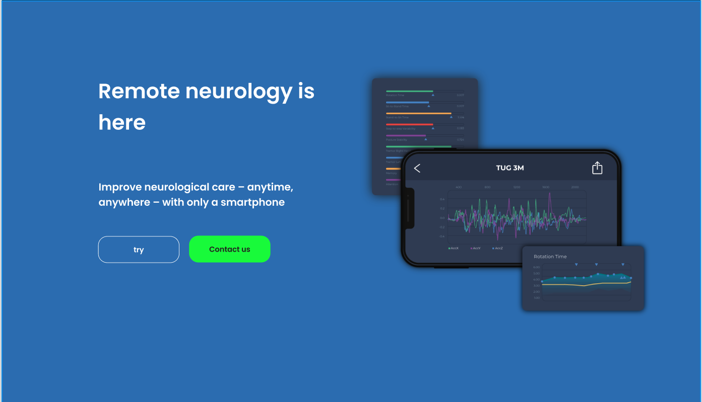
      <figcaption style="padding:6px 0 0 0;">
        <strong>Hero con CTA</strong> 
        (US21) — Título, subtítulo y CTA principal visibles; CTA redirige al formulario.
      </figcaption>
    </figure>
    <!-- Navigation -->
    <figure style="width:320px; margin:0; font-size:0.9em;">
      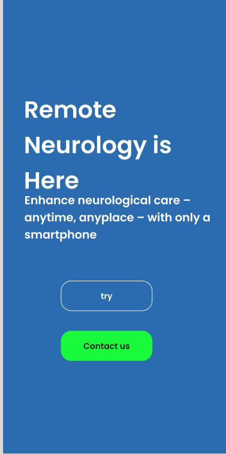
      <figcaption style="padding:6px 0 0 0;">
        <strong>Navegación responsiva</strong> 
        (US22) — Menú desktop y hamburguesa en mobile.
      </figcaption>
    </figure>
    <!-- How it works -->
    <figure style="width:320px; margin:0; font-size:0.9em;">
      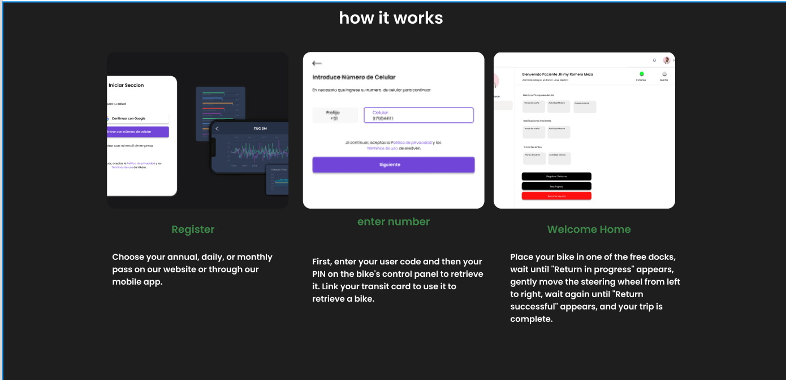
      <figcaption style="padding:6px 0 0 0;">
        <strong>How it works</strong> 
        (US23) — 3 pasos ilustrados con texto alternativo.
      </figcaption>
    </figure>
    <!-- Features cards -->
    <figure style="width:320px; margin:0; font-size:0.9em;">
      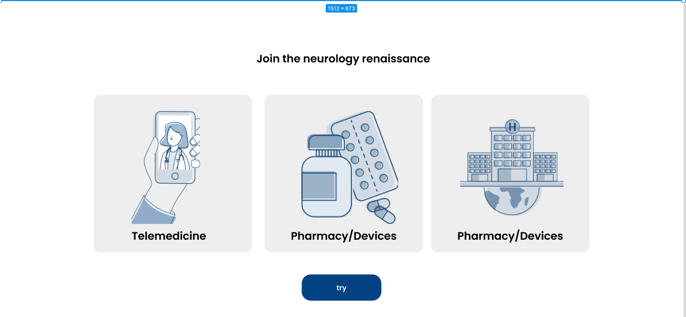
      <figcaption style="padding:6px 0 0 0;">
        <strong>Features / Cards</strong> 
        (US24) — Iconos SVG integrados y CTA en cada tarjeta.
      </figcaption>
    </figure>
    <!-- About -->
    <figure style="width:320px; margin:0; font-size:0.9em;">
      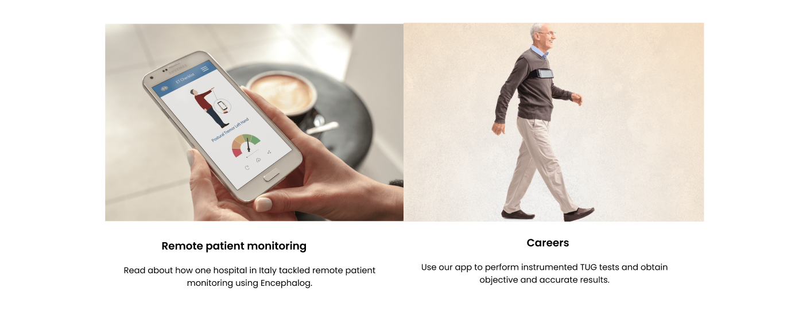
      <figcaption style="padding:6px 0 0 0;">
        <strong>About / Who we are</strong> 
        (US25) — Misión, visión e imágenes alineadas.
      </figcaption>
    </figure>
    <!-- Benefits -->
    <figure style="width:320px; margin:0; font-size:0.9em;">
      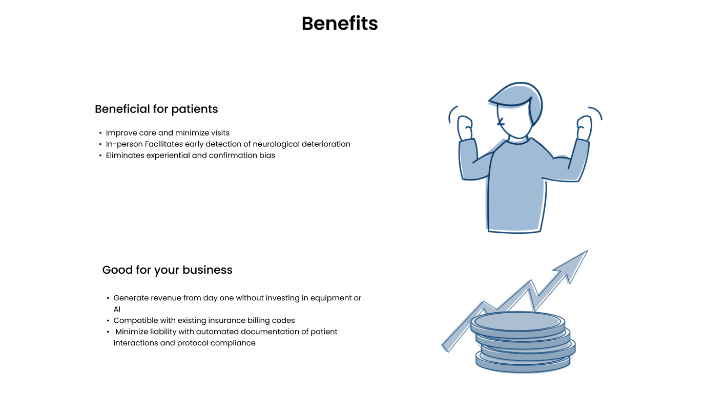
      <figcaption style="padding:6px 0 0 0;">
        <strong>Benefits / Good for business</strong> 
        (US26) — Bullets para pacientes y decisores.
      </figcaption>
    </figure>
    <!-- Contact form -->
    <figure style="width:320px; margin:0; font-size:0.9em;">
      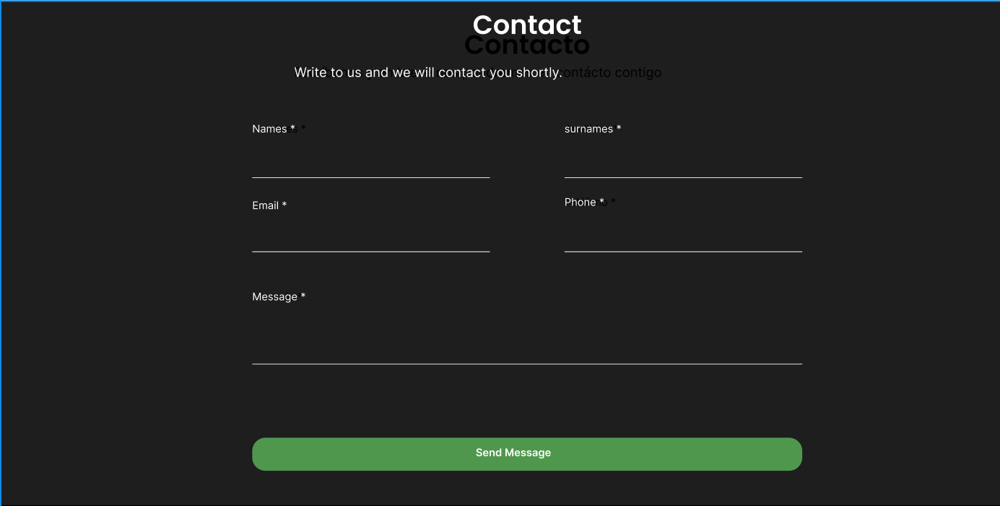
      <figcaption style="padding:6px 0 0 0;">
        <strong>Formulario de contacto</strong> 
        (US27) — Validaciones client-side y confirmación visual.
      </figcaption>
    </figure>
    <!-- Footer -->
    <figure style="width:320px; margin:0; font-size:0.9em;">
      
      <figcaption style="padding:6px 0 0 0;">
        <strong>Footer</strong> 
        (US28) — Enlaces legales y redes sociales.
      </figcaption>
    </figure>
    <!-- Mobile responsive -->
    <figure style="width:320px; margin:0; font-size:0.9em;">
      
      <figcaption style="padding:6px 0 0 0;">
        <strong>Mobile view</strong> 
        (US29) — Ejemplo de reflow / breakpoints.
      </figcaption>
    </figure>
     <h4 style="margin-top:18px; margin-bottom:6px;">Video de demostración / walkthrough</h4>
  

    Se incluye un video corto que muestra la navegación y las interacciones clave del MVP. 
  

  

    <strong>Link al video:</strong>
    <a href="https://drive.google.com/file/d/1DO8FUsUeIa6yMUwamc1Imro7JsFA-P_B/view?usp=sharing" target="_blank" rel="noopener">https://drive.google.com/file/d/1DO8FUsUeIa6yMUwamc1Imro7JsFA-P_B/view?usp=sharing</a>
  

</section>

##### 5.2.1.6. Services Documentation Evidence for Sprint Review  

Durante el Sprint 1, el equipo documentó e implementó el **Contact Service**, el cual se integra con el formulario de contacto del **Landing Page MVP**.  
La documentación fue elaborada utilizando **OpenAPI (Swagger)**, permitiendo visualizar las rutas, métodos HTTP, parámetros, respuestas esperadas y ejemplos de uso.  

---

### Contact Service Endpoints 

**Documentación de Endpoints – Contact API**

| **Endpoint**   | **Acción Implementada**           | **Método HTTP** | **Sintaxis de Llamada**    | **Parámetros** |
|----------------|----------------------------------|-----------------|----------------------------|----------------|
| `/contact`     | Enviar un mensaje de contacto    | POST            | `/api/v1/contact`          | `name`, `email`, `message` (Body) |
| `/contact`     | Obtener todos los mensajes       | GET             | `/api/v1/contact`          | Ninguno |
| `/contact/{id}`| Obtener mensaje por ID           | GET             | `/api/v1/contact/{id}`     | `id` (Path) |

---
 
##### 5.2.1.7. Software Deployment Evidence for Sprint Review  

Durante el Sprint 1, el equipo realizó el **despliegue del Landing Page MVP** .  
Este proceso se llevó a cabo utilizando **GitHub Pages** como proveedor de hosting gratuito, lo que permitió que la página esté disponible públicamente en la web.  

- Actividades realizadas en el Sprint

1. **Creación y configuración del repositorio en GitHub**  
   - Se creó el repositorio oficial del proyecto: https://github.com/UPC-1ASI0730-2520-7468-Mithycore
   - Se estableció la estructura de ramas:  
     - `main` → Rama principal y estable para despliegue.  
     - `develop` → Rama de integración.  
     - `feature/landing-page` → Rama dedicada al desarrollo del Landing Page.  

2. **Configuración de GitHub Pages**  
   - Se habilitó la opción de GitHub Pages en la rama `main`.  
   - Se configuró el despliegue automático al realizar un **merge** en `main`.  
   - El Landing Page se encuentra disponible en la siguiente URL:  
  (https://github.com/UPC-1ASI0730-2520-7468-Mithycore/LandingPageAuraNeuro)

3. **Validación del despliegue en navegador**  
   - Se probó la visualización en diferentes navegadores (Chrome, Edge, Firefox).  
  

- Vista del Landing Page desplegado en navegador.

 <a href="https://upc-1asi0730-2520-7468-mithycore.github.io/LandingPageAuraNeuro/">https://upc-1asi0730-2520-7468-mithycore.github.io/LandingPageAuraNeuro/</a>

##### 5.2.1.8. Team Collaboration Insights during Sprint  

Durante el Sprint 1, el equipo de Mythicore trabajó de manera colaborativa en la implementación y despliegue del **Landing Page MVP** utilizando **HTML, CSS y JavaScript**.  
Cada integrante del equipo asumió un rol específico (frontend, backend, integración, UX/UI, CI/CD), pero también colaboró en revisión de código, pruebas y documentación.  

---

- **Distribución del trabajo:**  
  - **Stanley Jeremy (Team Leader):** coordinación general y despliegue CI/CD.  
  - **Juan José (Backend Engineer):** implementación inicial del endpoint `/api/contact`.  
  - **Eduardo (Frontend & UX/UI):** desarrollo de la sección principal y estilos.  
  - **Fabricio (Data & IoT Integration):** soporte en mock de backend y despliegue.  
  - **Jhimy (Frontend & UX/UI):** implementación de secciones de servicios y About.  
- **Revisiones de código:** se realizaron revisiones cruzadas en Pull Requests para garantizar calidad y consistencia del código.  
- **Comunicación:** se utilizaron reuniones virtuales diarias de 15 min y un board de Trello para gestión de tareas.  

---

### 5.2.2. Sprint 2
#### 5.2.2.1.Sprint Planning 2.

<!-- SPRINT PLANNING - SPRINT 2 (Frontend: Login & Auth Flows) -->
<!-- Presentación / Introducción -->
<section style="font-family: Arial, sans-serif; line-height:1.45;">
  

    El Sprint 2 se enfoca exclusivamente en el <strong>frontend</strong> del subsistema de autenticación de AuraNeuro:
    vistas de inicio de sesión, registro (paciente y neurólogo), autenticación por número de celular y verificación OTP,
    e integración visual con inicio de sesión vía Google (OAuth) — todo en capa de interfaz (HTML/CSS/JS).
    para validar flujos UI, estados de error y mensajes. El objetivo es entregar vistas producidas, accesibles, responsivas y
    con interacciones completas (validaciones, manejo de errores y mensajes) listas para conectar con los endpoints reales en sprints posteriores.
  

</section>
<!-- SPRINT PLANNING METADATA -->
<table border="1" cellpadding="6" cellspacing="0" style="border-collapse:collapse; width:100%; font-family:Arial, sans-serif; margin-top:12px;">
  <caption style="text-align:left; font-weight:bold; padding:6px 0;">Sprint Planning - Sprint 2 (Metadata)</caption>
  <tbody>
    <tr>
      <th style="width:20%;">Sprint #</th>
      <td>Sprint 2</td>
    </tr>
    <tr>
      <th>Date</th>
      <td>2025-10-09</td>
    </tr>
    <tr>
      <th>Time</th>
      <td>10:00 AM - 11:30 AM</td>
    </tr>
    <tr>
      <th>Location</th>
      <td>Reunión virtual (Zoom) / Oficina central AuraNeuro</td>
    </tr>
    <tr>
      <th>Prepared By</th>
      <td>Romero Meza, Jhimy (Sprint Lead)</td>
    </tr>
    <tr>
      <th>Attendees</th>
      <td>
        Romero Meza, Jhimy — Sprint Lead (Frontend) 
        Eduardo F. Chacaliaza Minaya — Product Owner 
        Gutierrez Tume, Jeremy — Lead Dev (Frontend architect / code reviews) 
        Fabricio F. Quispe Barzola — Frontend 
        Juan José Meza Huanacune — Content / UX
      </td>
    </tr>
  </tbody>
</table>
 
<!-- REVIEW of Sprint 1 (brief) -->
<table border="1" cellpadding="6" cellspacing="0" style="border-collapse:collapse; width:100%; font-family:Arial, sans-serif;">
  <caption style="text-align:left; font-weight:bold; padding:6px 0;">Sprint 1 — Quick Review (context for Sprint 2)</caption>
  <tbody>
    <tr>
      <th style="width:25%;">Summary</th>
      <td>
        Se entregó el MVP de la landing page (Hero, How-it-works, Features, About, Contact form, Footer) con despliegue a staging.
        Se completaron optimizaciones de imágenes, meta tags y pipeline CI para staging. Los diseños visuales y los contratos OpenAPI mínimos
        para contacto y eventos quedaron disponibles como base para las integraciones frontend en Sprint 2.
      </td>
    </tr>
    <tr>
      <th>Feedback / Improvements</th>
      <td>
        Priorizar consistencia visual con las vistas de product (login/register), definir estados de error/edge-cases para flows de autenticación,
        y preparar mocks API de autorización para pruebas UI.
      </td>
    </tr>
  </tbody>
</table>
 
<!-- SPRINT GOAL -->
<table border="1" cellpadding="6" cellspacing="0" style="border-collapse:collapse; width:100%; font-family:Arial, sans-serif;">
  <caption style="text-align:left; font-weight:bold; padding:6px 0;">Sprint Goal (Outcome / Impact / Customer / Event)</caption>
  <tbody>
    <tr>
      <th style="width:25%;">Our focus is on</th>
      <td>entregando una implementación frontend completa, accesible y receptiva de los flujos de autenticación (inicio de sesión, registros, teléfono y OTP, inicio de sesión de Google) con integración de API simulada y UX pulida.</td>
    </tr>
    <tr>
      <th>We believe it delivers</th>
      <td> Incorporación más rápida y menor fricción para los usuarios (pacientes y neurólogos) al proporcionar pantallas de autenticación claras y validadas y mensajes de error sólidos.</td>
    </tr>
    <tr>
      <th>This will be confirmed when</th>
      <td>
        (1) Los usuarios pueden navegar por los flujos de inicio de sesión y registro de extremo a extremo utilizando API simuladas o simuladas;  
        (2) La interfaz de usuario del flujo OTP es completamente funcional con estados de reenvío/límite;  
        (3) El botón de inicio de sesión de Google inicia la interfaz de usuario de OAuth y muestra los estados de éxito/error (simulado);  
        (4) Las comprobaciones de accesibilidad pasan y la capacidad de respuesta se valida en todos los puntos de interrupción.
      </td>
    </tr>
    <tr>
      <th>Sprint Goal (SMART)</th>
      <td>
        <strong>Specific:</strong> Build/login/register/phone-auth/OTP/Google sign-in frontend views with validations and mocked integrations. 
        <strong>Measurable:</strong> All included US pass acceptance – flows demoable in staging and recorded video walkthrough. 
        <strong>Attainable:</strong> Team commits 21 story points (see Sum). 
        <strong>Relevant:</strong> Reduces time-to-first-use for users and prepares contract for backend integration. 
        <strong>Time-bound:</strong> Complete in this 2-week Sprint 2.
      </td>
    </tr>
    <tr>
      <th>Planned Velocity (Capacity)</th>
      <td>Planned: 24 SP — Committed: <strong>21 SP</strong></td>
    </tr>
    <tr>
      <th>Sum of Story Points</th>
      <td><strong>21 SP</strong> (US01, US02, US03, US36, US37, US38)</td>
    </tr>
  </tbody>
</table>
 
<!-- User Stories included in Sprint 2 -->
<table border="1" cellpadding="6" cellspacing="0" style="border-collapse:collapse; width:100%; font-family:Arial, sans-serif;">
  <caption style="text-align:left; font-weight:bold; padding:6px 0;">User Stories included in Sprint 2 (Auth UI)</caption>
  <thead style="background:#f2f2f2;">
    <tr>
      <th style="width:8%;">Order</th>
      <th style="width:12%;">User Story Id</th>
      <th style="width:40%;">Título</th>
      <th style="width:10%;">Story Points</th>
      <th style="width:30%;">Acceptance Summary / Goal</th>
    </tr>
  </thead>
  <tbody>
    <tr>
      <td>1</td><td>US01</td><td>Inicio de sesión (UI)</td><td style="text-align:center;">2</td>
      <td>Login screen with email/password inputs, show/hide password, validation messages, error states (invalid credentials), success redirect (mock).</td>
    </tr>
    <tr>
      <td>2</td><td>US02</td><td>Registro de paciente (UI)</td><td style="text-align:center;">3</td>
      <td>Registration form for patient with client-side validation, password strength indicator, terms consent checkbox, and success flow (mock account created).</td>
    </tr>
    <tr>
      <td>3</td><td>US03</td><td>Registro de neurólogo (UI)</td><td style="text-align:center;">3</td>
      <td>Registration for neurólogo with professional fields (license number), file upload placeholder for docs, and pending-verification state UI (mock).</td>
    </tr>
    <tr>
      <td>4</td><td>US36</td><td>Autenticación por número de celular (UI)</td><td style="text-align:center;">5</td>
      <td>Phone number entry view, format validation, request OTP action (mock), and transition to OTP entry screen; consent checkbox for SMS.</td>
    </tr>
    <tr>
      <td>5</td><td>US37</td><td>Verificación de número de celular (OTP) (UI)</td><td style="text-align:center;">5</td>
      <td>OTP entry screen with timer, resend link handling UI, attempt counters, success and lockout visual states (all simulated client-side).</td>
    </tr>
    <tr>
      <td>6</td><td>US38</td><td>Inicio de sesión con Google (OAuth) (UI)</td><td style="text-align:center;">3</td>
      <td>Google sign-in button and flow start; show mocked callback handling and UI for success/failure; ensure privacy notices are shown.</td>
    </tr>
  </tbody>
</table>
 

<!-- Definition of Done & Exit Criteria -->
<table border="1" cellpadding="6" cellspacing="0" style="border-collapse:collapse; width:100%; font-family:Arial, sans-serif;">
  <caption style="text-align:left; font-weight:bold; padding:6px 0;">Definition of Done (DoD) & Exit Criteria — Sprint 2</caption>
  <tbody>
    <tr>
      <th style="width:30%;">Definition of Done</th>
      <td>
        <ul style="margin:6px 0 0 18px;">
          <li>Code in feature branches with PRs; reviewed by Lead Dev (Jeremy).</li>
          <li>End-to-end frontend flows validated against mocked APIs.</li>
          <li>Accessibility smoke checks (labels, focus, alt text) passed.</li>
          <li>Responsive verified across breakpoints (desktop, tablet, mobile).</li>
          <li>Story acceptance criteria met and approved by PO (Eduardo F.).</li>
          <li>Staging deployed and demo video recorded for Sprint Review.</li>
        </ul>
      </td>
    </tr>
    <tr>
      <th>Exit Criteria (Sprint 2)</th>
      <td>
        <ul style="margin:6px 0 0 18px;">
          <li>All included US (US01, US02, US03, US36, US37, US38) implemented at UI level and demoed.</li>
          <li>Mocks documented (OpenAPI stubs or mock server URL) and used in demo.</li>
          <li>PO signs off basic acceptance for each story.</li>
        </ul>
      </td>
    </tr>
  </tbody>
</table>

 

<!-- Team & Responsibilities reminder -->
<section style="font-family:Arial, sans-serif;">
  <h4>Equipo (Sprint 2) — Roles y responsabilidades</h4>
  <ul>
    <li><strong>Romero Meza, Jhimy</strong> — Sprint Lead / Frontend: coordinate frontend implementation, lead PR reviews for UI.</li>
    <li><strong>Eduardo F. Chacaliaza Minaya</strong> — Product Owner: acceptance, copy approval, priority clarifications.</li>
    <li><strong>Gutierrez Tume, Jeremy</strong> — Lead Dev (Frontend architect): implement mock integration, staging builds, review complex JS behaviours.</li>
    <li><strong>Fabricio F. Quispe Barzola</strong> — Frontend: implement components, styles, responsive tuning.</li>
    <li><strong>Juan José Meza Huanacune</strong> — Content / UX: microcopy, privacy text, help text and accessibility checks.</li>
  </ul>

#### 5.2.2.2. Aspect Leaders and Collaborators.

<!-- LEADERSHIP AND COLLABORATION MATRIX (LACX) — Sprint 2 (Auth UI, Frontend - Vue) -->
<section style="font-family:Arial, sans-serif; line-height:1.45;">

  <!-- INTRODUCCIÓN -->
  

    Para el <strong>Sprint 2</strong> (implementación frontend de los flujos de autenticación en <em>Vue</em>),
    se han identificado los principales <em>aspectos</em> del alcance —cada uno representa un subconjunto funcional o no funcional
    que requiere liderazgo claro para acelerar la toma de decisiones y la ejecución. El siguiente artefacto
    <strong>Leadership-and-Collaboration Matrix (LACX)</strong> asigna, por aspecto, quién actúa como <strong>Leader (L)</strong>
    (responsable principal) y quiénes son <strong>Collaborators (C)</strong> (apoyo/ejecución).
    Esta organización servirá para guiar la asignación de tareas y clarificar puntos de contacto durante el sprint.
  

  <!-- LACX TABLE -->
  <table border="1" cellpadding="8" cellspacing="0" style="border-collapse:collapse; width:100%; font-family:Arial, sans-serif; margin-top:12px;">
    <caption style="text-align:left; font-weight:bold; padding:6px 0;">LACX — Sprint 2 (Auth UI)</caption>
    <thead style="background:#f2f2f2;">
      <tr>
        <th style="width:18%;">Team Member (Last Name, First Name)</th>
        <th style="width:12%;">GitHub Username</th>
        <th style="width:12%;">Component Library &amp; Vue Architecture (Aspect 1)</th>
        <th style="width:12%;">Auth Flows UI (Login / Register) (Aspect 2)</th>
        <th style="width:12%;">Phone Auth &amp; OTP UX (Aspect 3)</th>
        <th style="width:12%;">Google OAuth UI (Aspect 4)</th>
        <th style="width:12%;">Accessibility &amp; UX (Aspect 5)</th>
        <th style="width:12%;">Responsive &amp; Performance (Aspect 6)</th>
        <th style="width:12%;">Content &amp; Microcopy (Aspect 7)</th>
        <th style="width:12%;">Mock API Integration &amp; OpenAPI Stubs (Aspect 8)</th>
        <th style="width:12%;">Staging Build &amp; Demo (Aspect 9)</th>
      </tr>
    </thead>
    <tbody>
      <tr>
        <td><strong>Romero Meza, Jhimy</strong> Sprint Lead / Frontend</td>
        <td><code>jhimyromero</code></td>
        <td><strong>L</strong></td>
        <td><strong>L</strong></td>
        <td>C</td>
        <td>C</td>
        <td>C</td>
        <td>C</td>
        <td>C</td>
        <td><strong>L</strong></td>
        <td>C</td>
      </tr>
      <tr>
        <td><strong>Chacaliaza Minaya, Eduardo F.</strong> Product Owner</td>
        <td><code>eduardoFchac</code></td>
        <td>C</td>
        <td>C</td>
        <td>C</td>
        <td>C</td>
        <td>C</td>
        <td>C</td>
        <td><strong>L</strong></td>
        <td>C</td>
        <td>C</td>
      </tr>
      <tr>
        <td><strong>Gutierrez Tume, Jeremy</strong> Lead Dev (Frontend)</td>
        <td><code>jgutierrez</code></td>
        <td>C</td>
        <td>C</td>
        <td>C</td>
        <td><strong>L</strong></td>
        <td>C</td>
        <td><strong>L</strong></td>
        <td>C</td>
        <td>C</td>
        <td><strong>L</strong></td>
      </tr>
      <tr>
        <td><strong>Fabricio Fabián Quispe Barzola</strong> Frontend</td>
        <td><code>fabricioqfb</code></td>
        <td>C</td>
        <td>C</td>
        <td><strong>C</strong></td>
        <td>C</td>
        <td>C</td>
        <td>C</td>
        <td>C</td>
        <td>C</td>
        <td>C</td>
      </tr>
      <tr>
        <td><strong>Juan José Meza Huanacune</strong> Content / UX</td>
        <td><code>juanjosemh</code></td>
        <td>C</td>
        <td>C</td>
        <td>C</td>
        <td>C</td>
        <td><strong>L</strong></td>
        <td>C</td>
        <td><strong>C</strong></td>
        <td>C</td>
        <td>C</td>
      </tr>
    </tbody>
  </table>
</section>

#### 5.2.2.3.Sprint Backlog 2.

<!-- SPRINT BACKLOG - SPRINT 2 (Frontend) -->
<section>
  

    Nuestro foco está en entregar la implementación frontend completa y accesible de los flujos de autenticación (vistas de login, registro paciente y neurólogo, entrada por número de celular + OTP y botón de Google Sign-In) como componentes Vue listos para integración con mocks/OpenAPI.  
    Creemos que esto entregará una experiencia de onboarding más rápida y confiable para pacientes y neurólogos, reduciendo la fricción de registro e inicio de sesión y permitiendo validar los flujos claves de acceso antes de integrar el backend.
  

  

    <strong>Sprint Board (tool):</strong>
     
    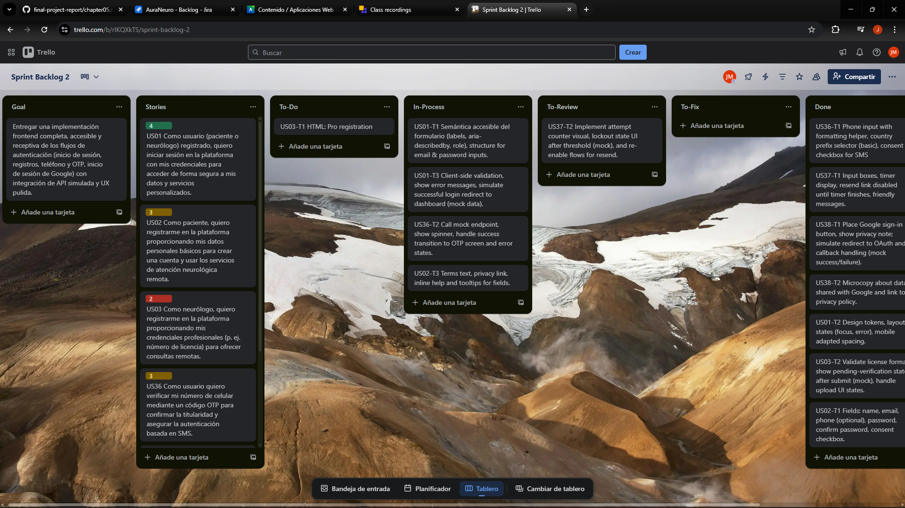
    

      <strong>URL del Board:</strong>
      <a href="https://trello.com/invite/b/68e862cd5ff8049fdbaff83d/ATTI66d206e520486448f87c4cd3f2afad94F9CCD5AF/sprint-backlog-2" target="_blank" rel="noopener">https://trello.com/invite/b/68e862cd5ff8049fdbaff83d/ATTI66d206e520486448f87c4cd3f2afad94F9CCD5AF/sprint-backlog-2</a>
    

  

</section>

<!-- Sprint Backlog: Work-items / Tasks (detailed) -->
<table border="1" cellpadding="6" cellspacing="0" style="border-collapse:collapse; width:100%; font-family:Arial, sans-serif; margin-top:12px;">
  <caption style="text-align:left; font-weight:bold; padding:6px 0;">Sprint Backlog — Work-items / Tasks (Frontend only)</caption>
  <thead style="background:#f2f2f2;">
    <tr>
      <th style="width:8%;">US Id</th>
      <th style="width:22%;">User Story Title</th>
      <th style="width:8%;">Task Id</th>
      <th style="width:24%;">Work-Item / Task</th>
      <th style="width:20%;">Description</th>
      <th style="width:6%;">Est. (hrs)</th>
      <th style="width:12%;">Assigned To</th>
      <th style="width:10%;">Status</th>
    </tr>
  </thead>
  <tbody>
    <!-- US01 tasks -->
    <tr>
      <td>US01</td><td>Inicio de sesión (UI)</td><td>US01-T1</td><td>HTML: Login form</td>
      <td>Semántica accesible del formulario (labels, aria-describedby, role), structure for email & password inputs.</td>
      <td style="text-align:center;">3</td><td>Romero Meza, Jhimy</td><td>To-do</td>
    </tr>
    <tr>
      <td>US01</td><td>Inicio de sesión (UI)</td><td>US01-T2</td><td>CSS: Styles & responsive</td>
      <td>Design tokens, layout, states (focus, error), mobile adapted spacing.</td>
      <td style="text-align:center;">2</td><td>Fabricio F. Q. B.</td><td>To-do</td>
    </tr>
    <tr>
      <td>US01</td><td>Inicio de sesión (UI)</td><td>US01-T3</td><td>JS: Validation & mock auth</td>
      <td>Client-side validation, show error messages, simulate successful login redirect to dashboard (mock data).</td>
      <td style="text-align:center;">2</td><td>Gutierrez Tume, Jeremy</td><td>To-do</td>
    </tr>
    <!-- US02 tasks -->
    <tr>
      <td>US02</td><td>Registro de paciente (UI)</td><td>US02-T1</td><td>HTML: Registration form</td>
      <td>Fields: name, email, phone (optional), password, confirm password, consent checkbox.</td>
      <td style="text-align:center;">3</td><td>Fabricio F. Q. B.</td><td>To-do</td>
    </tr>
    <tr>
      <td>US02</td><td>Registro de paciente (UI)</td><td>US02-T2</td><td>JS: Password strength & validation</td>
      <td>Password strength meter, confirm password match, field-level errors.</td>
      <td style="text-align:center;">2</td><td>Romero Meza, Jhimy</td><td>To-do</td>
    </tr>
    <tr>
      <td>US02</td><td>Registro de paciente (UI)</td><td>US02-T3</td><td>Content: copy & microcopy</td>
      <td>Terms text, privacy link, inline help and tooltips for fields.</td>
      <td style="text-align:center;">1</td><td>Juan José M. H.</td><td>To-do</td>
    </tr>
    <!-- US03 tasks -->
    <tr>
      <td>US03</td><td>Registro de neurólogo (UI)</td><td>US03-T1</td><td>HTML: Pro registration</td>
      <td>Form with license number field, clinic/affiliation, optional file upload placeholder (no backend upload), and notes about verification.</td>
      <td style="text-align:center;">3</td><td>Romero Meza, Jhimy</td><td>To-do</td>
    </tr>
    <tr>
      <td>US03</td><td>Registro de neurólogo (UI)</td><td>US03-T2</td><td>JS: validation & state</td>
      <td>Validate license format, show pending-verification state after submit (mock), handle upload UI states.</td>
      <td style="text-align:center;">2</td><td>Fabricio F. Q. B.</td><td>To-do</td>
    </tr>
    <!-- US36 tasks (phone auth) -->
    <tr>
      <td>US36</td><td>Autenticación por número de celular (UI)</td><td>US36-T1</td><td>HTML/CSS: Phone entry screen</td>
      <td>Phone input with formatting helper, country prefix selector (basic), consent checkbox for SMS.</td>
      <td style="text-align:center;">3</td><td>Fabricio F. Q. B.</td><td>To-do</td>
    </tr>
    <tr>
      <td>US36</td><td>Autenticación por número de celular (UI)</td><td>US36-T2</td><td>JS: request OTP (mock)</td>
      <td>Call mock endpoint, show spinner, handle success transition to OTP screen and error states.</td>
      <td style="text-align:center;">2</td><td>Gutierrez Tume, Jeremy</td><td>To-do</td>
    </tr>
    <!-- US37 tasks (OTP) -->
    <tr>
      <td>US37</td><td>Verificación OTP (UI)</td><td>US37-T1</td><td>HTML/CSS: OTP entry screen</td>
      <td>Input boxes, timer display, resend link disabled until timer finishes, friendly messages.</td>
      <td style="text-align:center;">3</td><td>Romero Meza, Jhimy</td><td>To-do</td>
    </tr>
    <tr>
      <td>US37</td><td>Verificación OTP (UI)</td><td>US37-T2</td><td>JS: attempts & lockout UI</td>
      <td>Implement attempt counter visual, lockout state UI after threshold (mock), and re-enable flows for resend.</td>
      <td style="text-align:center;">2</td><td>Fabricio F. Q. B.</td><td>To-do</td>
    </tr>
    <!-- US38 tasks (Google OAuth UI) -->
    <tr>
      <td>US38</td><td>Inicio sesión con Google (UI)</td><td>US38-T1</td><td>UI: Google button & flows</td>
      <td>Place Google sign-in button, show privacy note; simulate redirect to OAuth and callback handling (mock success/failure).</td>
      <td style="text-align:center;">3</td><td>Romero Meza, Jhimy</td><td>To-do</td>
    </tr>
    <tr>
      <td>US38</td><td>Inicio sesión con Google (UI)</td><td>US38-T2</td><td>Content: consent & copy</td>
      <td>Microcopy about data shared with Google and link to privacy policy.</td>
      <td style="text-align:center;">1</td><td>Juan José M. H.</td><td>To-do</td>
    </tr>
    <!-- Integration / Staging tasks -->
    <tr>
      <td>—</td><td>Integration / Demo</td><td>INT-T1</td><td>Staging build & demo</td>
      <td>Build and deploy frontend to staging (static) with mocked endpoints; record demo video of flows for Sprint Review.</td>
      <td style="text-align:center;">4</td><td>Gutierrez Tume, Jeremy</td><td>To-do</td>
    </tr>
  </tbody>
</table>

#### 5.2.1.5. Developmet Evidence for Sprint Review.
<!-- DEVELOPMENT EVIDENCE FOR SPRINT 2 — Sprint 2 (Auth UI, Frontend - Vue) -->
<section style="font-family: Arial, sans-serif; line-height:1.45;">

  <!-- INTRO -->
  <h3>Development Evidence — Sprint 2 (Resumen)</h3>
  

    Durante el <strong>Sprint 2</strong> el equipo se enfocó en la implementación frontend de los flujos de autenticación
    (Login, Registro paciente, Registro neurólogo, Autenticación por número + OTP y disparador visual para Google Sign-In) utilizando
    <strong>Vue</strong>. Se desarrollaron componentes reutilizables, vistas completas con validaciones client-side, manejo de estados (loading / error / success)
    y se integraron mocks/OpenAPI stubs para simular las respuestas del backend durante la demo en staging. A continuación se lista evidencia
    de desarrollo —commits relevantes por repositorio— que documentan los cambios realizados en el sprint.
  

  <!-- COMMITS TABLE -->
  <table border="1" cellpadding="6" cellspacing="0" style="border-collapse:collapse; width:100%; font-family:Arial, sans-serif; margin-top:12px;">
    <caption style="text-align:left; font-weight:bold; padding:6px 0;">Commits relacionados con Sprint 2 (Auth UI - Frontend)</caption>
    <thead style="background:#f2f2f2;">
      <tr>
        <th style="width:18%;">Repository</th>
        <th style="width:14%;">Branch</th>
        <th style="width:12%;">Commit Id</th>
        <th style="width:16%;">Commit Message</th>
        <th style="width:28%;">Commit Message Body</th>
        <th style="width:12%;">Committed on (Date)</th>
      </tr>
    </thead>
    <tbody>
      <tr>
        <td><code>aura-neuro-frontend</code></td>
        <td><code>feature/login-ui-vue</code></td>
        <td><code>1a9b3c4</code></td>
        <td>feat(login): add login view and form component</td>
        <td>
          Adds <code>&lt;LoginForm/&gt;</code> Vue component with email/password fields, show/hide password toggle and basic client-side validation.
          Includes unit tests for validation rules and initial styles following design tokens.
        </td>
        <td style="text-align:center;">2025-10-24</td>
      </tr>
      <tr>
        <td><code>aura-neuro-frontend</code></td>
        <td><code>feature/register-patient-vue</code></td>
        <td><code>2f4d7e9</code></td>
        <td>feat(register): patient registration view & password strength</td>
        <td>
          Implements patient registration screen with password strength meter, confirm password validation and terms consent checkbox.
          Adds form-level error display and accessibility attributes (aria-describedby).
        </td>
        <td style="text-align:center;">2025-10-25</td>
      </tr>
      <tr>
        <td><code>aura-neuro-frontend</code></td>
        <td><code>feature/register-pro-vue</code></td>
        <td><code>3c6e2b1</code></td>
        <td>feat(register-pro): neurólogo registration placeholder + license field</td>
        <td>
          Adds professional registration form with fields for license number and affiliation. Includes UI for file upload placeholder
          (no backend upload) and pending-verification state UI to reflect review process.
        </td>
        <td style="text-align:center;">2025-10-25</td>
      </tr>
      <tr>
        <td><code>aura-neuro-components</code></td>
        <td><code>chore/component-library</code></td>
        <td><code>4b8d9a0</code></td>
        <td>refactor(ui): base input, button and modal components</td>
        <td>
          Extracts reusable <code>BaseInput</code>, <code>BaseButton</code> and <code>BaseModal</code> components to the shared component library.
          Adds props for accessibility, loading state and error display.
        </td>
        <td style="text-align:center;">2025-10-26</td>
      </tr>
      <tr>
        <td><code>aura-neuro-frontend</code></td>
        <td><code>feature/phone-auth-ui</code></td>
        <td><code>5e1f0d2</code></td>
        <td>feat(auth): phone entry screen & mock request OTP</td>
        <td>
          Phone number input with country prefix selector (basic), input masking and request OTP flow calling mock endpoint.
          Adds consent checkbox for SMS and transition to OTP screen on success.
        </td>
        <td style="text-align:center;">2025-10-27</td>
      </tr>
      <tr>
        <td><code>aura-neuro-frontend</code></td>
        <td><code>feature/otp-ui</code></td>
        <td><code>6a2c7f5</code></td>
        <td>feat(otp): otp entry UI, timer and resend handling</td>
        <td>
          Implements OTP input UI with segmented inputs, countdown timer, resend button disabled while timer active and visual attempt counter.
          Includes mock lockout state and user-friendly error messages.
        </td>
        <td style="text-align:center;">2025-10-28</td>
      </tr>
      <tr>
        <td><code>aura-neuro-frontend</code></td>
        <td><code>feature/google-oauth-ui</code></td>
        <td><code>7d3b8e6</code></td>
        <td>feat(auth): Google sign-in button and mocked callback</td>
        <td>
          Adds Google Sign-In button to auth pages and implements mocked OAuth callback handling for success/failure states.
          Adds privacy microcopy explaining data shared by Google.
        </td>
        <td style="text-align:center;">2025-10-28</td>
      </tr>
      <tr>
        <td><code>aura-neuro-mocks</code></td>
        <td><code>mock/auth-stubs</code></td>
        <td><code>8c9f1d4</code></td>
        <td>chore(mocks): add auth API stubs for login/register/otp</td>
        <td>
          Adds JSON stubs and a small mock server (json-server / express-mock) for /api/auth/login, /api/auth/register, /api/auth/otp endpoints.
          Documents response formats for integration with frontend mocks.
        </td>
        <td style="text-align:center;">2025-10-27</td>
      </tr>
      <tr>
        <td><code>aura-neuro-frontend</code></td>
        <td><code>ci/staging-deploy</code></td>
        <td><code>9b0e4a7</code></td>
        <td>ci: update pipeline to deploy auth UI to staging</td>
        <td>
          CI changes to include auth UI build and deploy to staging. Adds smoke test step to verify the login page loads and mock endpoints respond.
        </td>
        <td style="text-align:center;">2025-10-29</td>
      </tr>
      <tr>
        <td><code>aura-neuro-frontend</code></td>
        <td><code>docs/mock-openapi</code></td>
        <td><code>af4d2c9</code></td>
        <td>docs: openapi stubs for auth endpoints</td>
        <td>
          Adds OpenAPI (YAML) minimal spec for POST /api/auth/login, POST /api/auth/register, POST /api/auth/otp and GET /api/health.
          Includes example requests/responses to guide backend implementation.
        </td>
        <td style="text-align:center;">2025-10-29</td>
      </tr>
    </tbody>
  </table>
</section>

#### 5.2.1.5. Execution Evidence for Sprint Review.

<section>
  

    En el <strong>Sprint 2</strong> el equipo implementó las vistas front-end del subsistema de autenticación usando <strong>Vue</strong>.
    Se completaron los principales flujos UI definidos en el Sprint Goal: <em>Login (email/password)</em>, <em>Registro de paciente</em>,
    <em>Registro de neurólogo (pro)</em>, <em>Autenticación por número de celular</em> (flujo request OTP) y <em>Verificación OTP</em>,
    además del disparador visual para <em>Google Sign-In</em>. Todo fue desarrollado con componentes reutilizables, validaciones client-side,
    estados (loading / error / success / lockout) y mock API integration (stubs) para permitir demos en staging sin backend productivo.
  

  

    <strong>Historias completadas (resumen):</strong>
    US01 (Inicio de sesión), US02 (Registro paciente), US03 (Registro neurólogo), US36 (Autenticación por número celular UI), US37 (OTP UI), US38 (Google Sign-In UI).
  

  <!-- SCREENSHOTS GALLERY -->
  <h4 style="margin-top:18px; margin-bottom:8px;">Screenshots — Vistas principales implementadas</h4>
  

    <figure style="width:320px; margin:0;">
      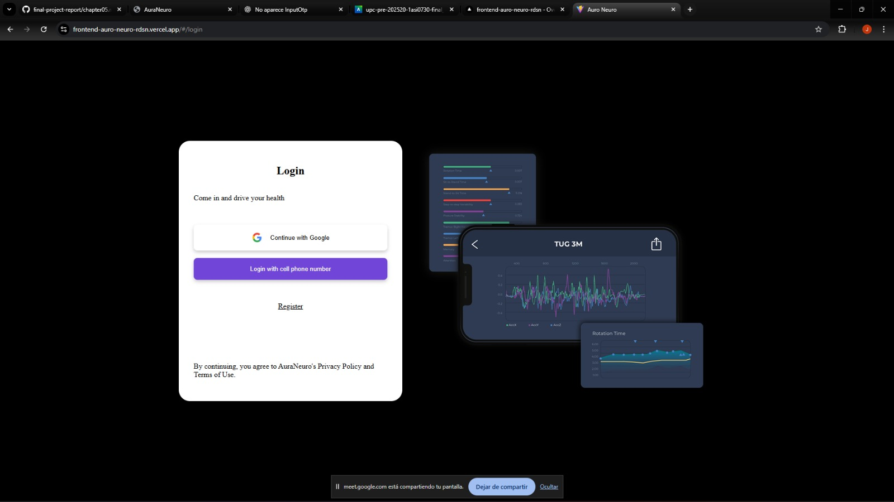
      <figcaption style="padding:6px 0 0 0;">
        <strong>Login (email/password)</strong> 
        Pantalla de inicio de sesión con validaciones, show/hide password y mensajes de error.
      </figcaption>
    </figure>
    <figure style="width:320px; margin:0;">
      
      <figcaption style="padding:6px 0 0 0;">
        <strong>Registro de paciente</strong> 
        Formulario con password strength indicator, confirm password y consentimiento.
      </figcaption>
    </figure>
    <figure style="width:320px; margin:0;">
      
      <figcaption style="padding:6px 0 0 0;">
        <strong>Registro de neurólogo (pro)</strong> 
        Form con campo de número de licencia y estado "pendiente de verificación" (UI).
      </figcaption>
    </figure>
    <figure style="width:320px; margin:0;">
      
      <figcaption style="padding:6px 0 0 0;">
        <strong>Entrada de número (Phone Auth)</strong> 
        Selector de prefijo, input masked y consentimiento para SMS; transición al OTP.
      </figcaption>
    </figure>
    <figure style="width:320px; margin:0;">
      
      <figcaption style="padding:6px 0 0 0;">
        <strong>Verificación OTP</strong> 
        Segment inputs, contador (timer), resend disabled y UI de intentos/lockout (mock).
      </figcaption>
    </figure>
    <figure style="width:320px; margin:0;">
      
      <figcaption style="padding:6px 0 0 0;">
        <strong>Biblioteca de componentes (Vue)</strong> 
        BaseInput, BaseButton, BaseModal y patterns reutilizables usados por las vistas.
      </figcaption>
    </figure>
  

  <!-- VIDEO DEMO -->
  <h4 style="margin-top:10px; margin-bottom:6px;">Video de demostración / walkthrough</h4>
  

    <strong>Link al video:</strong>
    <a href="https://drive.google.com/file/d/1edA7paR_5kUAaOHbBeWsZ5oi0LkZ_KPa/view?usp=sharing" target="_blank" rel="noopener">https://drive.google.com/file/d/1edA7paR_5kUAaOHbBeWsZ5oi0LkZ_KPa/view?usp=sharing</a>
  

</section>

### 5.2.2.6. Services Documentation Evidence for Sprint Review

| **Endpoint** | **Método HTTP** | **Descripción** | **Ejemplo de Request** | **Ejemplo de Response** |
|---------------|------------------|------------------|--------------------------|--------------------------|
| `/api/auth/login` | `POST` | Permite a los usuarios iniciar sesión usando email y contraseña. | `{ "email": "user@example.com", "password": "12345" }` | `{ "token": "jwt1234", "user": { "name": "John Doe" } }` |
| `/api/auth/register` | `POST` | Registra a un nuevo usuario en el sistema. | `{ "name": "Jane Doe", "email": "jane@example.com", "password": "abc123" }` | `{ "message": "User created successfully" }` |
| `/api/auth/otp` | `POST` | Envía y valida el código OTP de autenticación móvil. | `{ "phone": "+51999999999", "otp": "123456" }` | `{ "status": "verified", "user": { "id": 5, "role": "patient" } }` |
| `/api/health` | `GET` | Verifica el estado general del servidor. | — | `{ "status": "OK", "uptime": "3 days" }` |

**FrontEnd Desplegado:**  
<a href="https://frontend-auro-neuro-rdsn.vercel.app/#/">https://frontend-auro-neuro-rdsn.vercel.app/#/login</a>

/login
/register
/home
/map
---

### 5.2.2.7. Software Deployment Evidence for Sprint Review

**Frontend:**  
- **Desplegado en:** GitHub Pages / Vercel  
- **Framework:** Vue 3 + PrimeVue  
- **CI/CD:** GitHub Actions + Vercel  
- **Branch principal:** `main`  
- **Evidencias:**  
  - Deploy automático tras merge en `main`.  
  - Tests visuales de autenticación y validaciones mockeadas.  
  - Entorno staging accesible con API simulada (mock server).

**Backend:**  
- **Desplegado en:** Render (entorno gratuito de staging).  
- **Framework:** ASP.NET Core 8.0  
- **Documentación API:** Swagger (OpenAPI v3).  
- **CI/CD:** GitHub Actions (build + test + deploy pipeline).  

---

### 5.2.2.8. Team Collaboration Insights during Sprint

Durante el Sprint 2, el equipo trabajó de manera colaborativa en la implementación del **Frontend** y su integración con los servicios del **Backend**.  
Se observó una mejor sincronización en las tareas y una comunicación constante entre las áreas de desarrollo, diseño y QA.

**Distribución del trabajo:**
- **Jeremy Gutiérrez (Team Leader):** coordinación general y soporte en la arquitectura de componentes, revisión de PR y CI/CD.  
- **Juan José Meza (Backend Engineer / QA):** desarrollo y pruebas de endpoints mock (login, register, otp) y revisión de textos de privacidad.  
- **Eduardo Chacaliaza (Frontend & UX/UI):** diseño de vistas de registro, login y dashboard, además de ajustes de accesibilidad y UX.  
- **Fabricio Quispe (Frontend & Data Integration):** integración de la API mock, optimización de UI responsive y ajustes de rendimiento.  
- **Jhimy Romero (Frontend Lead):** desarrollo de los flujos de autenticación, validaciones client-side y componentes Vue reutilizables.

**Colaboración técnica:**
- Uso de **Pull Requests** y revisiones cruzadas en GitHub para control de calidad de código.  
- **Reuniones semanales** en Google Meet y coordinación técnica mediante Trello y Discord.  
- **Repositorio centralizado** para control de versiones y trazabilidad de commits.  
- **Registro de actividades** y evidencias en GitHub Projects y README de Sprint.  

El equipo completó exitosamente la **interfaz de autenticación** con flujos funcionales simulados (login, registro, OTP, Google Sign-In), desplegada en staging y validada con usuarios de prueba.  
La sincronización entre frontend y backend permitió un desarrollo estable y documentado según los criterios del *Project Statement ABET 2025*.

### 5.2.3. Sprint 3  
### 5.2.3.1.Spring Planning 3

<!-- SPRINT PLANNING - SPRINT 3  -->
<section style="font-family: Arial, sans-serif; line-height:1.45;">
   

    El <strong>Sprint 3</strong> se centra en el <strong>backend</strong> del sistema <em>AuraNeuro</em>, 
    específicamente en la implementación de los servicios y endpoints REST del subsistema de autenticación y gestión clínica. 
    Este sprint busca establecer la base funcional de la API en C# (.NET Core), garantizando la seguridad, roles, y el acceso controlado a recursos médicos.
  

</section>
<!-- SPRINT PLANNING - SPRINT 3 -->
<table border="1" cellpadding="6" cellspacing="0" style="border-collapse:collapse; width:100%; font-family:Arial, sans-serif;">
  <caption style="text-align:left; font-weight:bold; padding:6px 0;">Sprint Planning Background</caption>
  <tbody>
    <tr>
      <th style="width:25%;">Sprint #</th>
      <td>Sprint 3</td>
    </tr>
    <tr>
      <th>Date</th>
      <td>2025-11-05</td>
    </tr>
    <tr>
      <th>Time</th>
      <td>10:00 AM – 11:30 AM</td>
    </tr>
    <tr>
      <th>Location</th>
      <td>Reunión virtual (Zoom) / Oficina central AuraNeuro</td>
    </tr>
    <tr>
      <th>Prepared By</th>
      <td>Romero Meza, Jhimy</td>
    </tr>
    <tr>
      <th>Attendees (to planning meeting)</th>
      <td>
        Romero Meza, Jhimy — Sprint Lead (Backend) 
        Eduardo F. Chacaliaza Minaya — Product Owner 
        Gutierrez Tume, Jeremy — Lead Dev (Arquitectura / Code Reviews) 
        Fabricio F. Quispe Barzola — Backend Developer 
        Juan José Meza Huanacune — QA / DevOps Support
      </td>
    </tr>
    <tr>
      <th style="width:25%;">Summary</th>
      <td>
        Durante el Sprint 2 se completó la implementación del frontend del subsistema de autenticación de AuraNeuro.
        Se desarrollaron las vistas de inicio de sesión, registro (paciente y neurólogo), verificación OTP, e integración visual con Google (OAuth).
        Todas las vistas fueron validadas con flujos UI funcionales, manejo de errores y diseño responsivo.  
        El Product Owner destacó la calidad visual y consistencia del diseño, y recomendó iniciar la conexión con los servicios reales en el siguiente sprint.
      </td>
    </tr>
    <tr>
    <th style="width:25%;">Retrospective Summary</th>
      <td>
        El equipo valoró la buena coordinación entre desarrolladores y el cumplimiento de todas las historias planificadas dentro del plazo.
        Se identificó como mejora para el Sprint 3 fortalecer la integración continua y definir un entorno de staging para pruebas de backend.
        Además, se acordó mantener reuniones técnicas más cortas pero con acuerdos más claros sobre dependencias y endpoints.
      </td>
    </tr>
    
  </tbody>
</table>
 

<!-- SPRINT GOAL & USER STORIES -->
<table border="1" cellpadding="6" cellspacing="0" style="border-collapse:collapse; width:100%; font-family:Arial, sans-serif;">
  <caption style="text-align:left; font-weight:bold; padding:6px 0;">Sprint Goal & User Stories</caption>
  <tbody>
    <tr>
      <th style="width:25%;">Sprint 3 Goal</th>
      <td>
        Our focus is on habilitar una experiencia integral, segura y fluida para los usuarios de AuraNeuro mediante la implementación del backend que cubre                autenticación, gestión completa de usuarios, edición de perfil, visualización de historial médico, administración de recetas, y configuración de                   disponibilidad y agenda para neurólogos.  
        We believe it delivers un acceso confiable a la plataforma, una interacción más completa con la información personal y médica del usuario, mayor autonomía         en la gestión de su cuenta, y nuevas capacidades para que neurólogos administren sus horarios y emitan recetas, mientras el frontend obtiene endpoints             estables, seguros y documentados para construir la experiencia del Sprint 2.  
        This will be confirmed when el frontend integre correctamente los flujos de autenticación, perfil, gestión de recetas y disponibilidad en el entorno de           staging, logrando al menos un 95% de éxito en registro e inicio de sesión, permitiendo consultar y editar el perfil sin errores, visualizar historial               médico y recetas según permisos, y alcanzando más del 90% de cobertura en pruebas unitarias e integradas sobre los módulos desarrollados.
      </td>
    </tr>
    <tr>
      <th>Sprint 3 Velocity</th>
      <td>Planned: 28 SP — Committed: <strong>26 SP</strong></td>
    </tr>
    <tr>
      <th>Sum of Story Points</th>
      <td><strong>26 SP</strong> (US41, US42, US43, US44, US45, US46)</td>
    </tr>
  </tbody>
</table>

 

<!-- Team & Responsibilities reminder -->
<section style="font-family:Arial, sans-serif;">
  <h4>Equipo (Sprint 3) — Roles y responsabilidades</h4>
  <ul>
    <li><strong>Romero Meza, Jhimy</strong> — Sprint Lead / Backend Developer: coordinar el desarrollo backend, definir endpoints REST, asegurar seguridad y manejo de tokens JWT, revisión técnica de integración con frontend.</li>
    <li><strong>Eduardo F. Chacaliaza Minaya</strong> — Product Owner: validar funcionalidades entregadas en API (autenticación, registro, OTP, Google OAuth), priorizar ajustes y asegurar cumplimiento de criterios de aceptación funcional.</li>
    <li><strong>Gutierrez Tume, Jeremy</strong> — Lead Dev (Backend Architect): diseñar estructura de módulos, servicios y controladores; definir esquema de base de datos para usuarios y sesiones; configurar seguridad y middleware.</li>
    <li><strong>Fabricio F. Quispe Barzola</strong> — Backend Developer / QA Support: implementar endpoints secundarios (verificación, manejo de errores), realizar pruebas unitarias y de integración con Postman y Jest, documentar API (Swagger).</li>
    <li><strong>Juan José Meza Huanacune</strong> — DevOps & Deployment: configurar entorno de despliegue (Docker / Railway), gestionar variables de entorno y base de datos MongoDB Atlas, coordinar integración continua (CI/CD).</li>
  </ul>
</section>

#### 5.2.3.2. Aspect Leaders and Collaborators.
<!-- LACX TABLE -->
  <table border="1" cellpadding="8" cellspacing="0" style="border-collapse:collapse; width:100%; font-family:Arial, sans-serif; margin-top:12px;">
    <caption style="text-align:left; font-weight:bold; padding:6px 0;">LACX — Sprint 2 (Auth UI)</caption>
    <thead style="background:#f2f2f2;">
      <tr>
        <th style="width:18%;">Team Member (Last Name, First Name)</th>
        <th style="width:12%;">GitHub Username</th>
        <th style="width:12%;">Bounded Context: Patients (Aspect 1)</th>
        <th style="width:12%;"> Bounded Context: Neurologists(Aspect 2)</th>
        <th style="width:12%;">Bounded Context: Assessments (o neurological-health) (Aspect 3)</th>
        <th style="width:12%;">Bounded Context: Appointments (Aspect 4)</th>
        <th style="width:12%;">Bounded Context: Availabilities (Aspect 5)</th>
        <th style="width:12%;"> Bounded Context: Prescriptions(Aspect 6)</th>
        <th style="width:12%;">Bounded Context: Users / Auth  (Aspect 7)</th>
      </tr>
    </thead>
    <tbody>
      <tr>
        <td><strong>Romero Meza, Jhimy</strong></td>
        <td><code>jhimyromero</code></td>
        <td><strong>L</strong></td>
        <td><strong>L</strong></td>
        <td>C</td>
        <td>C</td>
        <td>C</td>
        <td>C</td>
        <td>C</td>
        <td><strong>L</strong></td>
        <td>C</td>
      </tr>
      <tr>
        <td><strong>Chacaliaza Minaya, Eduardo F.</strong></td>
        <td><code>eduardoFchac</code></td>
        <td>C</td>
        <td>C</td>
        <td>C</td>
        <td>C</td>
        <td>C</td>
        <td>C</td>
        <td><strong>L</strong></td>
        <td>C</td>
        <td>C</td>
      </tr>
      <tr>
        <td><strong>Gutierrez Tume, Jeremy</strong></td>
        <td><code>jgutierrez</code></td>
        <td>C</td>
        <td>C</td>
        <td>C</td>
        <td><strong>L</strong></td>
        <td>C</td>
        <td><strong>L</strong></td>
        <td>C</td>
        <td>C</td>
        <td><strong>L</strong></td>
      </tr>
      <tr>
        <td><strong>Fabricio Fabián Quispe Barzola</strong></td>
        <td><code>fabricioqfb</code></td>
        <td>C</td>
        <td>C</td>
        <td><strong>C</strong></td>
        <td>C</td>
        <td>C</td>
        <td>C</td>
        <td>C</td>
        <td>C</td>
        <td>C</td>
      </tr>
      <tr>
        <td><strong>Juan José Meza Huanacune</strong></td>
        <td><code>juanjosemh</code></td>
        <td>C</td>
        <td>C</td>
        <td>C</td>
        <td>C</td>
        <td><strong>L</strong></td>
        <td>C</td>
        <td><strong>C</strong></td>
        <td>C</td>
        <td>C</td>
      </tr>
    </tbody>
  </table>
</section>

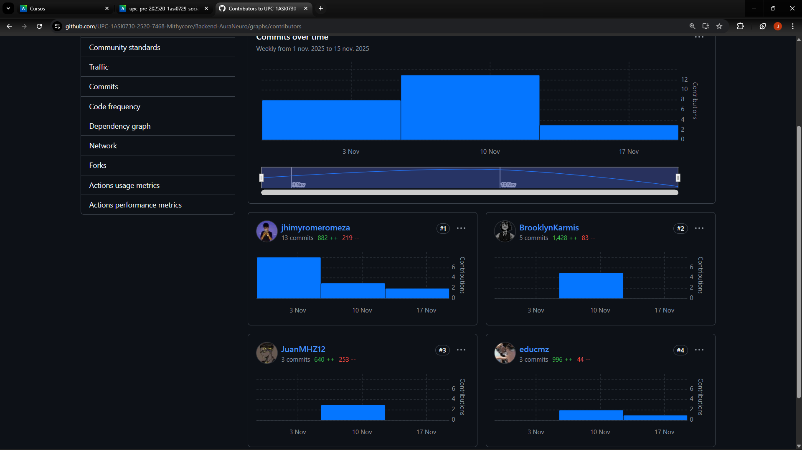

#### 5.2.3.3.Sprint Backlog 3.  

En este sprint, el objetivo es consolidar la experiencia integral y segura de los usuarios de **AuraNeuro** mediante la implementación completa del backend, enfocado en optimizar la autenticación, gestión de usuarios, edición de perfil, historial médico, administración de recetas y configuración de disponibilidad para neurólogos.
Estas funcionalidades garantizarán un acceso confiable a la plataforma, una interacción fluida con la información personal y médica, y una mayor autonomía tanto para pacientes como para neurólogos en la gestión de sus cuentas y horarios. Asimismo, permitirán al frontend consumir endpoints estables, seguros y documentados para integrar los flujos de autenticación, perfil, recetas y agenda en el entorno de staging.  

    <strong>Sprint Board (tool):</strong>
     
    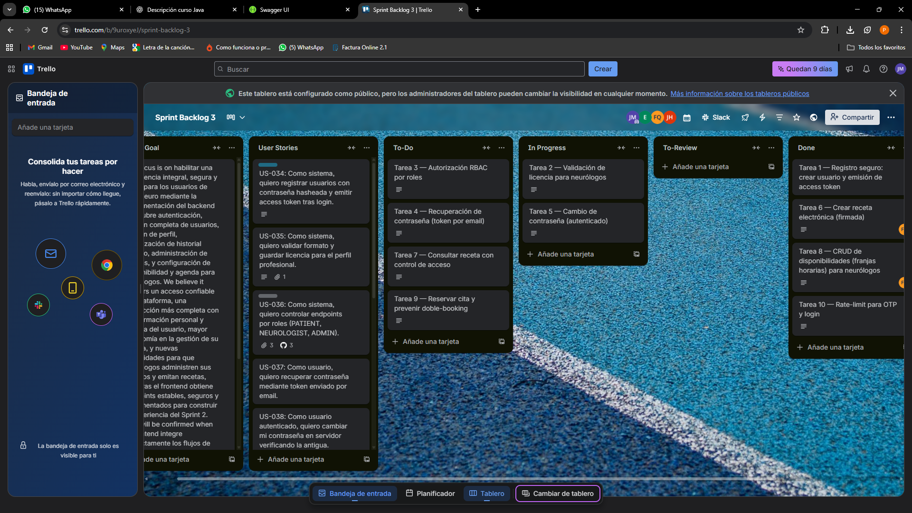
    

      <strong>URL del Board:</strong>
      <a href="https://trello.com/invite/b/69139ce10bff9bfc6e37ecc2/ATTIb7718bb3db115796e09ec5846aab1653BDAC2C0C/sprint-backlog-3" target="_blank" rel="noopener">https://trello.com/invite/b/69139ce10bff9bfc6e37ecc2/ATTIb7718bb3db115796e09ec5846aab1653BDAC2C0C/sprint-backlog-3</a>
    

  

</section>

<table>
  <thead>
    <tr>
      <th>Story ID</th>
      <th>Story name</th>
      <th>Task ID</th>
      <th>Task title</th>
      <th>Task description</th>
      <th>Est. (hrs)</th>
      <th>Assigned To</th>
      <th>Status (To-do / InProcess / ToReview / Done)</th>
    </tr>
  </thead>
  <tbody>
    <tr>
      <td>US01</td>
      <td>Registro de paciente</td>
      <td>T01.1</td>
      <td>Implementar modelo Patient y hashing de contraseña</td>
      <td>Definir entidad Patient y añadir campo passwordHash; implementar hashing seguro (Argon2/Bcrypt) en el servicio de registro.</td>
      <td>5</td>
      <td>Chacaliaza Minaya, Eduardo F.</td>
      <td>In Progress</td>
    </tr>
    <tr>
      <td>US01</td>
      <td>Registro de paciente</td>
      <td>T01.2</td>
      <td>Endpoint POST /api/v1/patients/register</td>
      <td>Implementar endpoint REST que reciba DTO, valide duplicados (email/phone) y cree el paciente devolviendo 201 con id.</td>
      <td>4</td>
      <td>Chacaliaza Minaya, Eduardo F.</td>
      <td>In Progress</td>
    </tr>
    <tr>
      <td>US02</td>
      <td>Visualizar perfil del paciente</td>
      <td>T02.1</td>
      <td>Servicio: Obtener perfil de paciente por ID</td>
      <td>Crear servicio que recupere paciente y mapee a DTO excluyendo campos sensibles.</td>
      <td>3</td>
      <td>Chacaliaza Minaya, Eduardo F.</td>
      <td>Done</td>
    </tr>
    <tr>
      <td>US02</td>
      <td>Visualizar perfil del paciente</td>
      <td>T02.2</td>
      <td>Endpoint GET /api/v1/patients/{patientId}</td>
      <td>Exponer endpoint protegido que devuelva el perfil; validar permisos (paciente o neurólogo autorizado).</td>
      <td>3</td>
      <td>Chacaliaza Minaya, Eduardo F.</td>
      <td>In Progress</td>
    </tr>
    <tr>
      <td>US04</td>
      <td>Vincular paciente a un neurólogo</td>
      <td>T04.1</td>
      <td>Repositorio: persistir vínculo paciente–neurólogo</td>
      <td>Implementar método para crear relación patient_neurologists evitando duplicados.</td>
      <td>3</td>
      <td>Chacaliaza Minaya, Eduardo F.</td>
      <td>Done</td>
    </tr>
    <tr>
      <td>US04</td>
      <td>Vincular paciente a un neurólogo</td>
      <td>T04.2</td>
      <td>Endpoint POST /api/v1/patients/{patientId}/neurologists/{neurologistId}</td>
      <td>Endpoint que valida existencia de entidades y crea la solicitud/vínculo en estado requested.</td>
      <td>3</td>
      <td>Chacaliaza Minaya, Eduardo F.</td>
      <td>to Review</td>
    </tr>
    <tr>
      <td>US05</td>
      <td>Crear perfil profesional de neurólogo</td>
      <td>T05.1</td>
      <td>Modelo Neurologist y validaciones de licencia</td>
      <td>Definir entidad con licenseNumber, specialties, verificationStatus; validar formato de licencia.</td>
      <td>4</td>
      <td>Fabricio Fabián Quispe Barzola</td>
      <td>Done</td>
    </tr>
    <tr>
      <td>US05</td>
      <td>Crear perfil profesional de neurólogo</td>
      <td>T05.2</td>
      <td>Endpoint POST /api/v1/neurologists</td>
      <td>Endpoint para crear perfil profesional; devuelve 201 Created con neurologistId y verificationStatus.</td>
      <td>3</td>
      <td>Fabricio Fabián Quispe Barzola</td>
      <td>Done</td>
    </tr>
    <tr>
      <td>NEU-002</td>
      <td>Listar pacientes asociados</td>
      <td>T-NEU002-1</td>
      <td>Repositorio: Obtener pacientes por neurologistId</td>
      <td>Método que retorna pacientes asociados con metadata (assignedAt, status).</td>
      <td>3</td>
      <td>Fabricio Fabián Quispe Barzola</td>
      <td>Done</td>
    </tr>
    <tr>
      <td>NEU-002</td>
      <td>Listar pacientes asociados</td>
      <td>T-NEU002-2</td>
      <td>Endpoint GET /api/v1/neurologists/{neurologistId}/patients</td>
      <td>Endpoint protegido que devuelve la lista; admite filtro simple ?status=.</td>
      <td>3</td>
      <td>Fabricio Fabián Quispe Barzola</td>
      <td>Done</td>
    </tr>
    <tr>
      <td>NEU-005</td>
      <td>Gestionar solicitudes de asociación</td>
      <td>T-NEU005-2</td>
      <td>Endpoint PATCH /api/v1/neurologists/{neurologistId}/requests/{requestId}</td>
      <td>Endpoint para aceptar/rechazar solicitud; al aceptar crear relación patient_neurologists.</td>
      <td>4</td>
      <td>Fabricio Fabián Quispe Barzola</td>
      <td>To Review</td>
    </tr>
    <tr>
      <td>ASS-001</td>
      <td>Crear evaluación médica básica</td>
      <td>T-ASS001-2</td>
      <td>Endpoint POST /api/v1/patients/{patientId}/assessments</td>
      <td>Endpoint protegido para que el neurólogo cree la evaluación y retorne assessmentId.</td>
      <td>3</td>
      <td>jhimyromero</td>
      <td>Done</td>
    </tr>
    <tr>
      <td>ASS-002</td>
      <td>Listar evaluaciones de un paciente</td>
      <td>T-ASS002-1</td>
      <td>Repositorio: GetAssessmentsByPatient(patientId)</td>
      <td>Método que devuelve resumen de evaluaciones (id, assessedAt, diagnosisPreview, neurologistName).</td>
      <td>3</td>
      <td>jhimyromero</td>
      <td>Done</td>
    </tr>
    <tr>
      <td>ASS-003</td>
      <td>Ver detalle de una evaluación médica</td>
      <td>T-ASS003-1</td>
      <td>Repositorio: Obtener evaluación por Id</td>
      <td>GetById(assessmentId) que retorna la evaluación completa si no está deleted.</td>
      <td>3</td>
      <td>jhimyromero</td>
      <td>Done</td>
    </tr>
    <tr>
      <td>ASS-003</td>
      <td>Ver detalle de una evaluación médica</td>
      <td>T-ASS003-2</td>
      <td>Endpoint GET /api/v1/assessments/{assessmentId}</td>
      <td>Endpoint que valida permisos (paciente/creador/admin) y retorna detalle o 404.</td>
      <td>3</td>
      <td>jhimyromero</td>
      <td>Done</td>
    </tr>
    <tr>
      <td>ASS-004</td>
      <td>Editar evaluación médica (propietario)</td>
      <td>T-ASS004-2</td>
      <td>Endpoint PATCH /api/v1/assessments/{assessmentId}</td>
      <td>Endpoint protegido que recibe cambios parciales y devuelve la evaluación actualizada.</td>
      <td>3</td>
      <td>jhimyromero</td>
      <td>Done</td>
    </tr>
    <tr>
      <td>ASS-005</td>
      <td>Eliminar evaluación médica (soft-delete)</td>
      <td>T-ASS005-2</td>
      <td>Endpoint DELETE /api/v1/assessments/{assessmentId}</td>
      <td>Endpoint protegido que invoca SoftDelete; solo autor o admin puede ejecutar; devuelve 204.</td>
      <td>2</td>
      <td>jhimyromero</td>
      <td>Done</td>
    </tr>
    <tr>
      <td>APP-001</td>
      <td>Solicitar cita (paciente)</td>
      <td>T-APP001-1</td>
      <td>Servicio: Crear cita y validar disponibilidad simple</td>
      <td>Crear lógica que valide startAt &lt; endAt, que el neurólogo exista y no haya cita confirmada idéntica.</td>
      <td>4</td>
      <td>Juan José Meza Huanacune</td>
      <td>Done</td>
    </tr>
    <tr>
      <td>APP-001</td>
      <td>Solicitar cita (paciente)</td>
      <td>T-APP001-2</td>
      <td>Endpoint POST /api/v1/appointments</td>
      <td>Endpoint que crea cita en estado requested y devuelve appointmentId; notifica in-app al neurólogo.</td>
      <td>3</td>
      <td>Juan José Meza Huanacune</td>
      <td>Done</td>
    </tr>
    <tr>
      <td>APP-002</td>
      <td>Ver mis citas (paciente)</td>
      <td>T-APP002-1</td>
      <td>Repositorio: Obtener citas por patientId</td>
      <td>Implementar GetByPatientId(patientId) con orden por startAt.</td>
      <td>3</td>
      <td>Juan José Meza Huanacune</td>
      <td>Done</td>
    </tr>
    <tr>
      <td>APP-002</td>
      <td>Ver mis citas (paciente)</td>
      <td>T-APP002-2</td>
      <td>Endpoint GET /api/v1/patients/{patientId}/appointments</td>
      <td>Endpoint protegido que retorna citas del paciente autenticado.</td>
      <td>3</td>
      <td>Juan José Meza Huanacune</td>
      <td>Done</td>
    </tr>
    <tr>
      <td>APP-003</td>
      <td>Listar solicitudes de cita (neurólogo)</td>
      <td>T-APP003-1</td>
      <td>Repositorio: Obtener solicitudes por neurologistId</td>
      <td>Método para listar citas con estado requested y datos de paciente.</td>
      <td>3</td>
      <td>Juan José Meza Huanacune</td>
      <td>Done</td>
    </tr>
    <tr>
      <td>APP-004</td>
      <td>Confirmar o rechazar solicitud de cita</td>
      <td>T-APP004-1</td>
      <td>Servicio: Actualizar estado de cita a confirmed/rejected</td>
      <td>Lógica que cambia estado, setea respondedAt y evita colisiones de slots.</td>
      <td>3</td>
      <td>Juan José Meza Huanacune</td>
      <td>Done</td>
    </tr>
    <tr>
      <td>APP-004</td>
      <td>Confirmar o rechazar solicitud de cita</td>
      <td>T-APP004-2</td>
      <td>Endpoint PATCH /api/v1/appointments/{appointmentId}/status</td>
      <td>Endpoint protegido para que el neurólogo cambie el estado mediante action en body.</td>
      <td>2</td>
      <td>Juan José Meza Huanacune</td>
      <td>Done</td>
    </tr>
    <tr>
      <td>APP-005</td>
      <td>Cancelar cita (paciente o neurólogo)</td>
      <td>T-APP005-1</td>
      <td>Servicio: Cancelar cita y registrar metadata</td>
      <td>Verificar que quien solicita pertenece a la cita; setear cancelled, cancelledBy, cancelledAt.</td>
      <td>3</td>
      <td>Juan José Meza Huanacune</td>
      <td>Done</td>
    </tr>
    <tr>
      <td>APP-005</td>
      <td>Cancelar cita (paciente o neurólogo)</td>
      <td>T-APP005-2</td>
      <td>Endpoint DELETE /api/v1/appointments/{appointmentId}</td>
      <td>Endpoint que cancela la cita; devolver 204 si éxito o 403 si falta permiso.</td>
      <td>2</td>
      <td>Juan José Meza Huanacune</td>
      <td>Done</td>
    </tr>
    <tr>
      <td>AVB-001</td>
      <td>Crear franja de disponibilidad</td>
      <td>T-AVB001-2</td>
      <td>Endpoint POST /api/v1/neurologists/{neurologistId}/availability</td>
      <td>Endpoint protegido para crear franja; validar solapamientos básicos.</td>
      <td>3</td>
      <td>Juan José Meza Huanacune</td>
      <td>Done</td>
    </tr>
    <tr>
      <td>AVB-002</td>
      <td>Listar mis franjas de disponibilidad</td>
      <td>T-AVB002-1</td>
      <td>Repositorio: Obtener franjas por neurologistId</td>
      <td>Implementar GetByNeurologistId que retorne franjas activas ordenadas.</td>
      <td>2</td>
      <td>Juan José Meza Huanacune</td>
      <td>Done</td>
    </tr>
    <tr>
      <td>AVB-004</td>
      <td>Eliminar franja de disponibilidad</td>
      <td>T-AVB004-2</td>
      <td>Endpoint DELETE /api/v1/availability/{slotId}</td>
      <td>Endpoint protegido para eliminar la franja; responde 204.</td>
      <td>1.5</td>
      <td>Juan José Meza Huanacune</td>
      <td>Done</td>
    </tr>
    <tr>
      <td>AVB-005</td>
      <td>Consultar franjas disponibles (paciente)</td>
      <td>T-AVB005-1</td>
      <td>Servicio: GetAvailableSlots por fecha</td>
      <td>Lógica que filtra franjas activas y no ocupadas por citas confirmadas.</td>
      <td>3</td>
      <td>Juan José Meza Huanacune</td>
      <td>Done</td>
    </tr>
    <tr>
      <td>REC-001</td>
      <td>Crear receta electrónica básica</td>
      <td>T-REC001-1</td>
      <td>Entidad Prescription y validaciones básicas</td>
      <td>Definir entidad con patientId, neurologistId, medicines, issuedAt, signatureHash.</td>
      <td>3</td>
      <td>Fabricio Fabián Quispe Barzola</td>
      <td>Done</td>
    </tr>
    <tr>
      <td>REC-001</td>
      <td>Crear receta electrónica básica</td>
      <td>T-REC001-2</td>
      <td>Endpoint POST /api/v1/recipes</td>
      <td>Endpoint protegido (NEUROLOGIST) que crea receta y devuelve id; almacenar signatureHash.</td>
      <td>3</td>
      <td>Fabricio Fabián Quispe Barzola</td>
      <td>Done</td>
    </tr>
    <tr>
      <td>REC-002</td>
      <td>Listar recetas del paciente</td>
      <td>T-REC002-1</td>
      <td>Repositorio: GetByPatientId para recetas</td>
      <td>Método que retorna resumen de recetas por paciente con orden por fecha.</td>
      <td>2</td>
      <td>Fabricio Fabián Quispe Barzola</td>
      <td>Done</td>
    </tr>
    <tr>
      <td>REC-002</td>
      <td>Listar recetas del paciente</td>
      <td>T-REC002-2</td>
      <td>Endpoint GET /api/v1/patients/{patientId}/recipes</td>
      <td>Endpoint protegido que devuelve la lista de recetas del paciente.</td>
      <td>2</td>
      <td>Fabricio Fabián Quispe Barzola</td>
      <td>Done</td>
    </tr>
    <tr>
      <td>REC-003</td>
      <td>Ver detalle de receta</td>
      <td>T-REC003-1</td>
      <td>Servicio: Obtener receta completa por id</td>
      <td>Obtener receta con medicamentos, dosis, emisor y estado; validar permisos.</td>
      <td>3</td>
      <td>Fabricio Fabián Quispe Barzola</td>
      <td>Done</td>
    </tr>
    <tr>
      <td>REC-003</td>
      <td>Ver detalle de receta</td>
      <td>T-REC003-2</td>
      <td>Endpoint GET /api/v1/recipes/{recipeId}</td>
      <td>Endpoint que retorna detalle o 403/404 según permisos.</td>
      <td>2</td>
      <td>Fabricio Fabián Quispe Barzola</td>
      <td>Done</td>
    </tr>
    <tr>
      <td>REC-004</td>
      <td>Actualizar receta (corrección menor)</td>
      <td>T-REC004-1</td>
      <td>Servicio: UpdatePrescription limitado</td>
      <td>Permitir editar campos menores (notes, instructions) solo si estado active.</td>
      <td>3</td>
      <td>Fabricio Fabián Quispe Barzola</td>
      <td>Done</td>
    </tr>
    <tr>
      <td>AUTH-001</td>
      <td>Inicio de sesión con correo/contraseña</td>
      <td>T-AUTH001-1</td>
      <td>Servicio Auth: Validación y generación de JWT</td>
      <td>Verificar credenciales, usuario activo y generar access token JWT con claims.</td>
      <td>4</td>
      <td>jhimyromero</td>
      <td>Done</td>
    </tr>
    <tr>
      <td>AUTH-001</td>
      <td>Inicio de sesión con correo/contraseña</td>
      <td>T-AUTH001-2</td>
      <td>Endpoint POST /api/v1/auth/login</td>
      <td>Endpoint que recibe credenciales y devuelve { accessToken, user } o 401.</td>
      <td>2</td>
      <td>jhimyromero</td>
      <td>Done</td>
    </tr>
    <tr>
      <td>AUTH-002</td>
      <td>Inicio de sesión por teléfono mediante OTP</td>
      <td>T-AUTH002-1</td>
      <td>Servicio OTP: Validar OTP y autenticar</td>
      <td>Verificar código OTP, TTL y estado; generar JWT si es válido.</td>
      <td>3</td>
      <td>jhimyromero</td>
      <td>Done</td>
    </tr>
    <tr>
      <td>AUTH-002</td>
      <td>Inicio de sesión por teléfono mediante OTP</td>
      <td>T-AUTH002-2</td>
      <td>Endpoint POST /api/v1/auth/verify-otp</td>
      <td>Endpoint que recibe phone + otp y devuelve token si es válido.</td>
      <td>2</td>
      <td>jhimyromero</td>
      <td>Done</td>
    </tr>
    <tr>
      <td>AUTH-003</td>
      <td>Recuperación de contraseña vía token</td>
      <td>T-AUTH003-1</td>
      <td>Servicio: Generar token de recuperación</td>
      <td>Generar token temporal y guardarlo con TTL; encolar/simular envío por email.</td>
      <td>3</td>
      <td>jhimyromero</td>
      <td>Done</td>
    </tr>
    <tr>
      <td>AUTH-003</td>
      <td>Recuperación de contraseña vía token</td>
      <td>T-AUTH003-2</td>
      <td>Endpoint POST /api/v1/auth/reset-password</td>
      <td>Endpoint que recibe { token, newPassword } y actualiza hash si token válido.</td>
      <td>2</td>
      <td>jhimyromero</td>
      <td>Done</td>
    </tr>

  </tbody>
</table>

#### 5.2.3.4.Development Evidence for Sprint Review.

Durante este Sprint 3 el equipo centró sus esfuerzos en consolidar la capa de **Web Services** del producto, avanzando decisivamente en la implementación de los módulos que soportan la interacción clínica entre pacientes y neurólogos. Se priorizaron las piezas funcionales que permiten documentar y consultar evaluaciones médicas, gestionar citas y disponibilidades, emitir y administrar recetas electrónicas, y atender los flujos de autenticación necesarios para proteger los accesos. Estos desarrollos buscan garantizar que los flujos críticos del dominio (registro de evaluación, agendamiento, emisión de receta y autenticación) estén disponibles y sean consumibles por el frontend del Sprint 2.

<table>
  <thead>
    <tr>
      <th>Repository</th>
      <th>Branch</th>
      <th>Commit Id</th>
      <th>Commit Message</th>
      <th>Commit Message Body</th>
      <th>Committed On Date</th>
    </tr>
  </thead>
  <tbody>
    <tr>
      <td>Backend-AuraNeuro</td>
      <td>feature/assessments</td>
      <td>a9f4d32</td>
      <td>Implement CRUD endpoints for assessments</td>
      <td>Added AssessmentController, AssessmentService and AssessmentRepository. Implemented Create, Read (list &amp; detail), Update and entity mapping; added DTOs for input/output.</td>
      <td>2025-11-04</td>
    </tr>
    <tr>
      <td>Backend-AuraNeuro</td>
      <td>feature/assessments</td>
      <td>b28e9c1</td>
      <td>Add soft-delete and author-permission checks for assessments</td>
      <td>Introduced deleted, deletedAt fields; updated repository queries to ignore soft-deleted records; enforced that only creator or admin can edit/delete; added audit log entries for create/update/delete.</td>
      <td>2025-11-05</td>
    </tr>
    <tr>
      <td>Backend-AuraNeuro</td>
      <td>feature/appointments</td>
      <td>c83d711</td>
      <td>Implement appointment request and creation flow</td>
      <td>Implemented AppointmentController and AppointmentService with flow to create appointment requests (status=requested), basic availability validation and initial notification enqueue.</td>
      <td>2025-11-06</td>
    </tr>
    <tr>
      <td>Backend-AuraNeuro</td>
      <td>feature/appointments</td>
      <td>d97a5b0</td>
      <td>Add confirm/reject and cancellation endpoints for appointments</td>
      <td>Added endpoints to update appointment status (confirm/reject) and to cancel appointments; implemented state transitions, respondedAt/cancelledAt metadata and permission checks.</td>
      <td>2025-11-07</td>
    </tr>
    <tr>
      <td>Backend-AuraNeuro</td>
      <td>feature/availability</td>
      <td>e42cb1a</td>
      <td>Implement availability CRUD for neurologists</td>
      <td>Added AvailabilitySlot entity, repository and controller; supports create/list/update/delete of availability slots with preliminary overlap checks.</td>
      <td>2025-11-07</td>
    </tr>
    <tr>
      <td>Backend-AuraNeuro</td>
      <td>feature/availability</td>
      <td>f0c9de3</td>
      <td>Improve availability validation and overlap detection</td>
      <td>Enhanced overlap detection logic, normalized timezone handling for slots and added constraints to prevent conflicting availabilities for the same neurologist.</td>
      <td>2025-11-08</td>
    </tr>
    <tr>
      <td>Backend-AuraNeuro</td>
      <td>feature/prescriptions</td>
      <td>a63bd91</td>
      <td>Add prescriptions CRUD and revoke flow</td>
      <td>Implemented Prescription entity, create/list/detail endpoints, basic signature hash storage and revoke (soft-revoke) behavior with revoked and revokedAt metadata.</td>
      <td>2025-11-09</td>
    </tr>
    <tr>
      <td>Backend-AuraNeuro</td>
      <td>feature/auth</td>
      <td>b7a9c00</td>
      <td>Implement JWT auth, OTP login and password recovery</td>
      <td>Added AuthService with JWT generation, OTP verification endpoints, forgot/reset password flows, and basic token blacklist for logout handling.</td>
      <td>2025-11-10</td>
    </tr>
  </tbody>
</table>

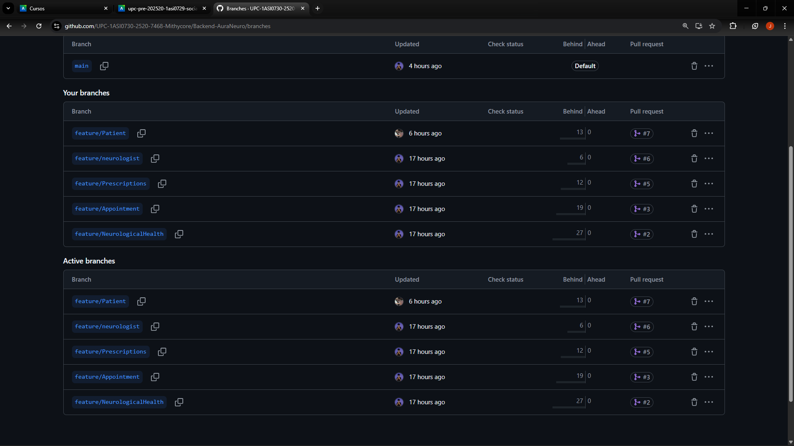

#### 5.2.3.5.Execution Evidence for Sprint Review.

Durante este Sprint 3 el equipo completó la implementación y la integración de las piezas funcionales clave que sustentan los flujos clínicos entre pacientes y neurólogos. A nivel de backend se entregaron y estabilizaron los servicios REST versionados (/api/v1/...) para la gestión de evaluaciones médicas (crear, listar, ver detalle, editar y soft-delete), el ciclo completo de citas (solicitar, listar, confirmar/rechazar y cancelar), la administración de franjas de disponibilidad de neurólogos y la emisión, consulta y revocación básica de recetas . Paralelamente se consolidó la capa de autenticación con emisión de access tokens (JWT), login por OTP y recuperación de contraseña, incluyendo controles de autorización que garantizan que solo usuarios con los permisos adecuados puedan crear o modificar recursos sensibles.  

<h4 style="margin-top:18px; margin-bottom:8px;">Screenshots — Bounded Context Api Core Bussines</h4>
  

    <figure style="width:320px; margin:0;">
      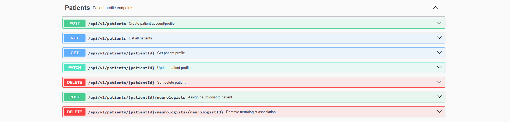
    </figure>
    <figure style="width:320px; margin:0;">
      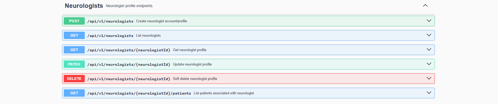
    </figure>
    <figure style="width:320px; margin:0;">
      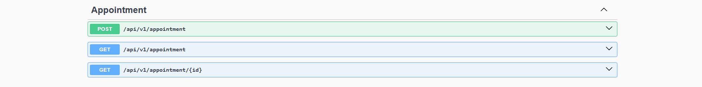
    </figure>
    <figure style="width:320px; margin:0;">
      
    </figure>
    <figure style="width:320px; margin:0;">
      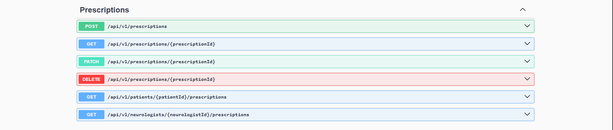
    </figure>
  

  <!-- VIDEO DEMO -->
  <h4 style="margin-top:10px; margin-bottom:6px;">Video de demostración</h4>
  

    <strong>Link al video:</strong>
    <a href="https://drive.google.com/file/d/1xdrGSOp4atoK4BMhQepm0GHCTkNLSgt7/view" target="_blank" rel="noopener">https://drive.google.com/file/d/1xdrGSOp4atoK4BMhQepm0GHCTkNLSgt7/view</a>
  

</section>

#### 5.2.3.6.Services Documentation Evidence for Sprint Review.  
En el Sprint 3 se completó y publicó la documentación OpenAPI de los Web Services desarrollados para soportar los flujos esenciales entre pacientes y neurólogos. La documentación cubre los endpoints versionados api/v1 implementados en este sprint: gestión de evaluaciones (assessments), citas (appointments), disponibilidades (availability), recetas (prescriptions), así como los mecanismos de autenticación (auth) y los recursos básicos de patients y neurologists necesarios para el funcionamiento del MVP.
La especificación OpenAPI se actualizó para describir cada operación (verbos), parámetros (path / query / body), esquemas de request y response, códigos HTTP esperados y ejemplos JSON representativos. Se expusieron estas especificaciones a través de la UI de Swagger (local) para que el equipo de frontend  puedan ejecutar ejemplos en vivo (Try it out). Como evidencia, en la tabla siguiente se relacionan los endpoints documentados, las acciones soportadas y un ejemplo de uso por cada endpoint importante desarrollado en el Sprint 3.  

<table>
  <thead>
    <tr>
      <th>Endpoint (resource)</th>
      <th>Actions implemented (HTTP verb)</th>
      <th>Syntax / Call</th>
      <th>Parameters (path / query / body)</th>
      <th>Example Request (JSON / cURL)</th>
      <th>Example Response (status &amp; body)</th>
    </tr>
  </thead>
  <tbody>
    <tr>
      <td>Assessments — Crear evaluación</td>
      <td>POST</td>
      <td><code>POST /api/v1/patients/{patientId}/assessments</code></td>
      <td>path: <code>patientId</code> (UUID). body: <code>{ assessedAt, diagnosis, notes }</code></td>
      <td>
        <pre><code>JSON:
{"assessedAt":"2025-11-11T10:00:00Z","diagnosis":"Migraine","notes":"Follow-up in 2 weeks"}

cURL:
curl -X POST "http://localhost:5000/api/v1/patients/{id}/assessments" \
 -H "Authorization: Bearer &lt;token&gt;" \
 -H "Content-Type: application/json" \
 -d '{"assessedAt":"2025-11-11T10:00:00Z","diagnosis":"Migraine","notes":"Follow-up in 2 weeks"}'
</code></pre>
      </td>
      <td>
        <pre><code>201 Created
{
  "assessmentId":"uuid",
  "patientId":"...",
  "assessedAt":"2025-11-11T10:00:00Z",
  "diagnosis":"Migraine",
  "createdBy":"neurologistId"
}</code></pre>
      </td>
    </tr>
    <tr>
      <td>Assessments — Listar por paciente</td>
      <td>GET</td>
      <td><code>GET /api/v1/patients/{patientId}/assessments</code></td>
      <td>path: <code>patientId</code>. optional query: <code>?from=YYYY-MM-DD&amp;to=YYYY-MM-DD</code></td>
      <td>
        <pre><code>cURL:
curl -X GET "http://localhost:5000/api/v1/patients/{id}/assessments" \
 -H "Authorization: Bearer &lt;token&gt;"</code></pre>
      </td>
      <td>
        <pre><code>200 OK
[
  { "id":"..", "assessedAt":"..", "diagnosis":"..", "neurologistName":"Dr. X" },
  ...
]  (ordered by assessedAt desc)</code></pre>
      </td>
    </tr>
    <tr>
      <td>Assessments — Detalle</td>
      <td>GET</td>
      <td><code>GET /api/v1/assessments/{assessmentId}</code></td>
      <td>path: <code>assessmentId</code></td>
      <td>
        <pre><code>cURL:
curl -X GET "http://localhost:5000/api/v1/assessments/{aid}" \
 -H "Authorization: Bearer &lt;token&gt;"</code></pre>
      </td>
      <td>
        <pre><code>200 OK
{
  "id":"..",
  "patientId":"..",
  "assessedAt":"..",
  "diagnosis":"..",
  "notes":"..",
  "createdBy":".."
}
or 404 Not Found</code></pre>
      </td>
    </tr>
    <tr>
      <td>Assessments — Edit (propietario)</td>
      <td>PATCH</td>
      <td><code>PATCH /api/v1/assessments/{assessmentId}</code></td>
      <td>path: <code>assessmentId</code>. body: partial fields <code>{ diagnosis?, notes?, assessedAt? }</code></td>
      <td>
        <pre><code>cURL:
curl -X PATCH "http://localhost:5000/api/v1/assessments/{aid}" \
 -H "Authorization: Bearer &lt;token&gt;" \
 -H "Content-Type: application/json" \
 -d '{"notes":"updated"}'</code></pre>
      </td>
      <td>
        <pre><code>200 OK
(updated resource JSON)

403 Forbidden if not owner</code></pre>
      </td>
    </tr>
    <tr>
      <td>Assessments — Soft-delete</td>
      <td>DELETE</td>
      <td><code>DELETE /api/v1/assessments/{assessmentId}</code></td>
      <td>path: <code>assessmentId</code></td>
      <td>
        <pre><code>cURL:
curl -X DELETE "http://localhost:5000/api/v1/assessments/{aid}" \
 -H "Authorization: Bearer &lt;token&gt;"</code></pre>
      </td>
      <td>
        <pre><code>204 No Content
(resource marked deleted=true, deletedAt set)

403 if unauthorized</code></pre>
      </td>
    </tr>
    <tr>
      <td>Appointments — Solicitar cita</td>
      <td>POST</td>
      <td><code>POST /api/v1/appointments</code></td>
      <td>body: <code>{ patientId, neurologistId, startAt, endAt, reason }</code></td>
      <td>
        <pre><code>JSON:
{"patientId":"...","neurologistId":"...","startAt":"2025-11-20T09:00:00-05:00","endAt":"2025-11-20T09:30:00-05:00","reason":"Follow-up"}

cURL:
curl -X POST "http://localhost:5000/api/v1/appointments" \
 -H "Authorization: Bearer &lt;token&gt;" \
 -H "Content-Type: application/json" \
 -d '{...}'</code></pre>
      </td>
      <td>
        <pre><code>201 Created
{
  "appointmentId":"uuid",
  "status":"requested",
  "startAt":"2025-11-20T09:00:00-05:00",
  "endAt":"2025-11-20T09:30:00-05:00"
}</code></pre>
      </td>
    </tr>
    <tr>
      <td>Appointments — Listar (paciente)</td>
      <td>GET</td>
      <td><code>GET /api/v1/patients/{patientId}/appointments</code></td>
      <td>path: <code>patientId</code>. query: <code>?status=confirmed|requested|cancelled</code></td>
      <td>
        <pre><code>cURL:
curl -X GET "http://localhost:5000/api/v1/patients/{id}/appointments?status=confirmed" \
 -H "Authorization: Bearer &lt;token&gt;"</code></pre>
      </td>
      <td>
        <pre><code>200 OK
[ {appointment objects...} ]</code></pre>
      </td>
    </tr>
    <tr>
      <td>Appointments — Listar solicitudes (neurólogo)</td>
      <td>GET</td>
      <td><code>GET /api/v1/neurologists/{neurologistId}/appointments/requests</code></td>
      <td>path: <code>neurologistId</code></td>
      <td>
        <pre><code>cURL:
curl -X GET "http://localhost:5000/api/v1/neurologists/{nid}/appointments/requests" \
 -H "Authorization: Bearer &lt;token&gt;"</code></pre>
      </td>
      <td>
        <pre><code>200 OK
array of requested appointments with patient info</code></pre>
      </td>
    </tr>
    <tr>
      <td>Appointments — Confirmar / Rechazar</td>
      <td>PATCH</td>
      <td><code>PATCH /api/v1/appointments/{appointmentId}/status</code></td>
      <td>path: <code>appointmentId</code>. body: <code>{ action: "confirm" | "reject", note?: string }</code></td>
      <td>
        <pre><code>cURL:
curl -X PATCH "http://localhost:5000/api/v1/appointments/{id}/status" \
 -H "Authorization: Bearer &lt;token&gt;" \
 -H "Content-Type: application/json" \
 -d '{"action":"confirm"}'</code></pre>
      </td>
      <td>
        <pre><code>200 OK
(updated appointment with new status)</code></pre>
      </td>
    </tr>
    <tr>
      <td>Appointments — Cancelar</td>
      <td>DELETE</td>
      <td><code>DELETE /api/v1/appointments/{appointmentId}</code></td>
      <td>path: <code>appointmentId</code></td>
      <td>
        <pre><code>cURL:
curl -X DELETE "http://localhost:5000/api/v1/appointments/{id}" \
 -H "Authorization: Bearer &lt;token&gt;"</code></pre>
      </td>
      <td>
        <pre><code>204 No Content on success

403 if user not part of appointment</code></pre>
      </td>
    </tr>
    <tr>
      <td>Availability — Crear franja</td>
      <td>POST</td>
      <td><code>POST /api/v1/neurologists/{neurologistId}/availability</code></td>
      <td>path: <code>neurologistId</code>. body: <code>{ startAt, endAt, recurrence? }</code></td>
      <td>
        <pre><code>JSON example with start/end timestamps

cURL:
curl -X POST "http://localhost:5000/api/v1/neurologists/{nid}/availability" \
 -H "Authorization: Bearer &lt;token&gt;" \
 -H "Content-Type: application/json" \
 -d '{...}'</code></pre>
      </td>
      <td>
        <pre><code>201 Created
slot object { id, neurologistId, startAt, endAt }
or 409 Conflict on overlap</code></pre>
      </td>
    </tr>
    <tr>
      <td>Availability — Listar (neurologist)</td>
      <td>GET</td>
      <td><code>GET /api/v1/neurologists/{neurologistId}/availability</code></td>
      <td>path: <code>neurologistId</code>. query: <code>?from=&amp;to=</code></td>
      <td>
        <pre><code>cURL:
curl -X GET "http://localhost:5000/api/v1/neurologists/{nid}/availability?from=2025-11-01&amp;to=2025-11-30" \
 -H "Authorization: Bearer &lt;token&gt;"</code></pre>
      </td>
      <td>
        <pre><code>200 OK
[ {id, startAt, endAt, isActive}, ... ]</code></pre>
      </td>
    </tr>
    <tr>
      <td>Availability — Actualizar</td>
      <td>PATCH</td>
      <td><code>PATCH /api/v1/availability/{slotId}</code></td>
      <td>path: <code>slotId</code>. body: partial <code>{ startAt?, endAt?, isActive? }</code></td>
      <td>
        <pre><code>cURL:
curl -X PATCH "http://localhost:5000/api/v1/availability/{slotId}" \
 -H "Authorization: Bearer &lt;token&gt;" \
 -H "Content-Type: application/json" \
 -d '{"startAt":"2025-11-21T10:00:00-05:00"}'</code></pre>
      </td>
      <td>
        <pre><code>200 OK updated slot
or 409 Conflict if new time overlaps</code></pre>
      </td>
    </tr>
    <tr>
      <td>Availability — Consultar slots disponibles (paciente)</td>
      <td>GET</td>
      <td><code>GET /api/v1/neurologists/{neurologistId}/available-slots?date=YYYY-MM-DD</code></td>
      <td>path: <code>neurologistId</code>. query: <code>date=YYYY-MM-DD</code></td>
      <td>
        <pre><code>cURL:
curl -X GET "http://localhost:5000/api/v1/neurologists/{nid}/available-slots?date=2025-11-20" \
 -H "Authorization: Bearer &lt;token&gt;"</code></pre>
      </td>
      <td>
        <pre><code>200 OK
list of available slots not occupied by confirmed appointments</code></pre>
      </td>
    </tr>
    <tr>
      <td>Prescriptions — Crear receta</td>
      <td>POST</td>
      <td><code>POST /api/v1/recipes</code></td>
      <td>body: <code>{ patientId, medicines:[{name,dose,frequency}], instructions }</code></td>
      <td>
        <pre><code>JSON example:
{"patientId":"...","medicines":[{"name":"Ibuprofen","dose":"200mg","frequency":"8h"}],"instructions":"Take after meals"}

cURL:
curl -X POST "http://localhost:5000/api/v1/recipes" \
 -H "Authorization: Bearer &lt;token&gt;" \
 -H "Content-Type: application/json" \
 -d '{...}'</code></pre>
      </td>
      <td>
        <pre><code>201 Created
{ "id":"..","issuedAt":"..","signatureHash":".." }</code></pre>
      </td>
    </tr>
    <tr>
      <td>Prescriptions — Listar por paciente</td>
      <td>GET</td>
      <td><code>GET /api/v1/patients/{patientId}/recipes</code></td>
      <td>path: <code>patientId</code></td>
      <td>
        <pre><code>cURL:
curl -X GET "http://localhost:5000/api/v1/patients/{id}/recipes" \
 -H "Authorization: Bearer &lt;token&gt;"</code></pre>
      </td>
      <td>
        <pre><code>200 OK
[ {id, issuedAt, neurologistName, status}, ... ]</code></pre>
      </td>
    </tr>
    <tr>
      <td>Prescriptions — Detalle</td>
      <td>GET</td>
      <td><code>GET /api/v1/recipes/{recipeId}</code></td>
      <td>path: <code>recipeId</code></td>
      <td>
        <pre><code>cURL:
curl -X GET "http://localhost:5000/api/v1/recipes/{rid}" \
 -H "Authorization: Bearer &lt;token&gt;"</code></pre>
      </td>
      <td>
        <pre><code>200 OK
full prescription object including medicines[] and signatureHash</code></pre>
      </td>
    </tr>
    <tr>
      <td>Prescriptions — Actualizar (parcial)</td>
      <td>PATCH</td>
      <td><code>PATCH /api/v1/recipes/{recipeId}</code></td>
      <td>path: <code>recipeId</code>. body: partial updates</td>
      <td>
        <pre><code>cURL:
curl -X PATCH "http://localhost:5000/api/v1/recipes/{rid}" \
 -H "Authorization: Bearer &lt;token&gt;" \
 -H "Content-Type: application/json" \
 -d '{"instructions":"Take with water"}'</code></pre>
      </td>
      <td>
        <pre><code>200 OK updated resource
or 403 if not creator</code></pre>
      </td>
    </tr>
    <tr>
      <td>Prescriptions — Revocar</td>
      <td>PATCH</td>
      <td><code>PATCH /api/v1/recipes/{recipeId}/revoke</code></td>
      <td>path: <code>recipeId</code>. body: <code>{ reason }</code></td>
      <td>
        <pre><code>cURL:
curl -X PATCH "http://localhost:5000/api/v1/recipes/{rid}/revoke" \
 -H "Authorization: Bearer &lt;token&gt;" \
 -H "Content-Type: application/json" \
 -d '{"reason":"Error in dosage"}'</code></pre>
      </td>
      <td>
        <pre><code>200 OK
resource with revoked: true, revokedAt: ...</code></pre>
      </td>
    </tr>
    <tr>
      <td>Auth — Login email/password</td>
      <td>POST</td>
      <td><code>POST /api/v1/auth/login</code></td>
      <td>body: <code>{ email, password }</code></td>
      <td>
        <pre><code>cURL:
curl -X POST "http://localhost:5000/api/v1/auth/login" \
 -H "Content-Type: application/json" \
 -d '{"email":"juan@example.com","password":"P@ssw0rd!"}'</code></pre>
      </td>
      <td>
        <pre><code>200 OK
{ accessToken:"ey...", expiresIn:900, user:{id,email,role} }
or 401 Unauthorized</code></pre>
      </td>
    </tr>
    <tr>
      <td>Auth — Send OTP</td>
      <td>POST</td>
      <td><code>POST /api/v1/auth/send-otp</code></td>
      <td>body: <code>{ phone }</code></td>
      <td>
        <pre><code>JSON:
{"phone":"+51987654321"}
Response:
202 Accepted (enqueued)</code></pre>
      </td>
      <td>
        <pre><code>202 Accepted
(OTP token persisted / enqueued)</code></pre>
      </td>
    </tr>
    <tr>
      <td>Auth — Verify OTP</td>
      <td>POST</td>
      <td><code>POST /api/v1/auth/verify-otp</code></td>
      <td>body: <code>{ phone, otp }</code></td>
      <td>
        <pre><code>cURL:
curl -X POST "http://localhost:5000/api/v1/auth/verify-otp" \
 -H "Content-Type: application/json" \
 -d '{"phone":"+51987654321","otp":"123456"}'</code></pre>
      </td>
      <td>
        <pre><code>200 OK
{ accessToken:"..." }
or 400/429 on failures/limits</code></pre>
      </td>
    </tr>
    <tr>
      <td>Auth — Forgot password</td>
      <td>POST</td>
      <td><code>POST /api/v1/auth/forgot-password</code></td>
      <td>body: <code>{ emailOrPhone }</code></td>
      <td>
        <pre><code>cURL:
curl -X POST "http://localhost:5000/api/v1/auth/forgot-password" \
 -H "Content-Type: application/json" \
 -d '{"emailOrPhone":"juan@example.com"}'</code></pre>
      </td>
      <td>
        <pre><code>202 Accepted
token created and (simulated) sent</code></pre>
      </td>
    </tr>
    <tr>
      <td>Auth — Reset password</td>
      <td>POST</td>
      <td><code>POST /api/v1/auth/reset-password</code></td>
      <td>body: <code>{ token, newPassword }</code></td>
      <td>
        <pre><code>cURL:
curl -X POST "http://localhost:5000/api/v1/auth/reset-password" \
 -H "Content-Type: application/json" \
 -d '{"token":"...","newPassword":"N3wP@ss!"}'</code></pre>
      </td>
      <td>
        <pre><code>200 OK
password updated, previous sessions invalidated (if applicable)</code></pre>
      </td>
    </tr>
    <tr>
      <td>Patients — Registro (simplified)</td>
      <td>POST</td>
      <td><code>POST /api/v1/patients/register</code></td>
      <td>body: <code>{ fullName, email?, phone?, password }</code></td>
      <td>
        <pre><code>cURL:
curl -X POST "http://localhost:5000/api/v1/patients/register" \
 -H "Content-Type: application/json" \
 -d '{"fullName":"Juan Perez","email":"juan@example.com","phone":"+51987654321","password":"P@ssw0rd!"}'</code></pre>
      </td>
      <td>
        <pre><code>201 Created
{ userId: "...", nextAction: "verify_otp" }</code></pre>
      </td>
    </tr>
    <tr>
      <td>Neurologists — Registro profesional</td>
      <td>POST</td>
      <td><code>POST /api/v1/neurologists</code></td>
      <td>body: <code>{ fullName, email, password, licenseNumber, specialties }</code></td>
      <td>
        <pre><code>cURL:
curl -X POST "http://localhost:5000/api/v1/neurologists" \
 -H "Content-Type: application/json" \
 -d '{"fullName":"Dr. Ana","email":"ana@clinic.com","password":"DrP@ss1","licenseNumber":"LIC-12345","specialties":["Epilepsy"]}'</code></pre>
      </td>
      <td>
        <pre><code>201 Created
{ neurologistId, verificationStatus:"pending" }</code></pre>
      </td>
    </tr>

  </tbody>
</table>

Tabla de Endpoints documentados (Sprint 3)  
**Enlace base de documentación (ejemplo local):**  
http://localhost:5152/swagger/index.html  
**Backend Desplegado:**  
<a href="http://20.81.154.140:5152/swagger/index.html">http://20.81.154.140:5152/swagger/index.html</a>  

#### 5.2.3.7.Software Deployment Evidence for Sprint Review.

Durante este sprint se realizó el despliegue del backend en un servidor Linux sobre Microsoft Azure, utilizando Docker y Docker Compose como herramientas principales de contenedorización y orquestación. El objetivo fue asegurar que la aplicación pueda ejecutarse en un entorno productivo estable, escalable y reproducible.

Primero, se configuró una máquina virtual Linux dentro de Azure (Ubuntu Server), en la cual se instalaron Docker Engine y Docker Compose. Posteriormente, se copiaron el proyecto backend y los archivos de configuración (Dockerfile y docker-compose.yml) a la instancia remota mediante SSH.

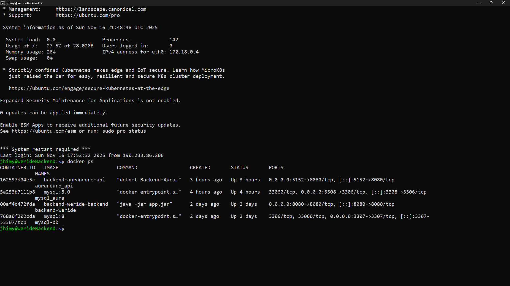
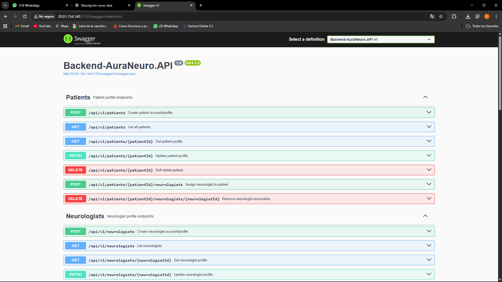

La evidencia de despliegue puede observarse en las siguientes capturas:  

Figura 1: Contenedores en ejecución utilizando docker ps, mostrando que el backend se encuentra activo en la máquina Linux.  

Figura 2: Prueba de despliegue exitoso, donde se visualiza la aplicación en funcionamiento desde el servidor Azure.  

Con esta acción, se confirma que el backend está completamente desplegado y accesible desde la nube, cumpliendo el objetivo del Sprint y permitiendo continuar  

#### 5.2.3.8.Team Collaboration Insights during Sprint.
Durante el Sprint 3, el equipo de desarrollo de AuraNeuro mantuvo una comunicación y coordinación continua mediante el uso de diversas herramientas colaborativas que facilitaron la gestión de tareas, el seguimiento del progreso y la toma de decisiones técnicas.  

La planificación y seguimiento de tareas se gestionó principalmente a través de Trello, donde se organizaron todas las historias de usuario y sus respectivas tareas técnicas dentro de tableros estructurados por columnas (“Backlog”, “In Progress”, “Code Review”, “Done”). Cada tarjeta en Trello incluyó descripciones detalladas, criterios de aceptación y estimaciones en horas, permitiendo así una visibilidad clara del estado de avance del Sprint.
La comunicación sincrónica y asincrónica se realizó mediante Discord, herramienta que permitió al equipo coordinar reuniones diarias, resolver bloqueos técnicos y compartir avances en tiempo real.  
Estas sesiones incluyeron reuniones breves de daily stand-up y pair programming sessions, donde se resolvieron incidencias en la integración entre el Backend (Web Services) y el Frontend (Web Application).
En cuanto al control de versiones y evidencia de trabajo colaborativo, todos los miembros del equipo realizaron commits y pull requests en el repositorio oficial alojado en GitHub, siguiendo las convenciones de nomenclatura acordadas. Las ramas de trabajo se gestionan bajo la estructura feature/, fix/ y doc/, facilitando la trazabilidad del desarrollo.  

La revisión de código (code review) se implementó de forma sistemática antes de integrar cambios en la rama principal, garantizando así la calidad y consistencia del código. Los analytics de GitHub evidencian una distribución equitativa de contribuciones entre los miembros, tanto en commits como en issues y pull requests.
En conjunto, la colaboración efectiva entre las herramientas Trello, Discord y GitHub permitió al equipo cumplir los objetivos del Sprint, mejorar la eficiencia del flujo de trabajo y mantener una comunicación constante, asegurando la entrega de los componentes planificados: Web Services (API REST con endpoints documentados), Web Application (módulos de interacción paciente-neurólogo) y Landing Page (sección informativa del sistema AuraNeuro).

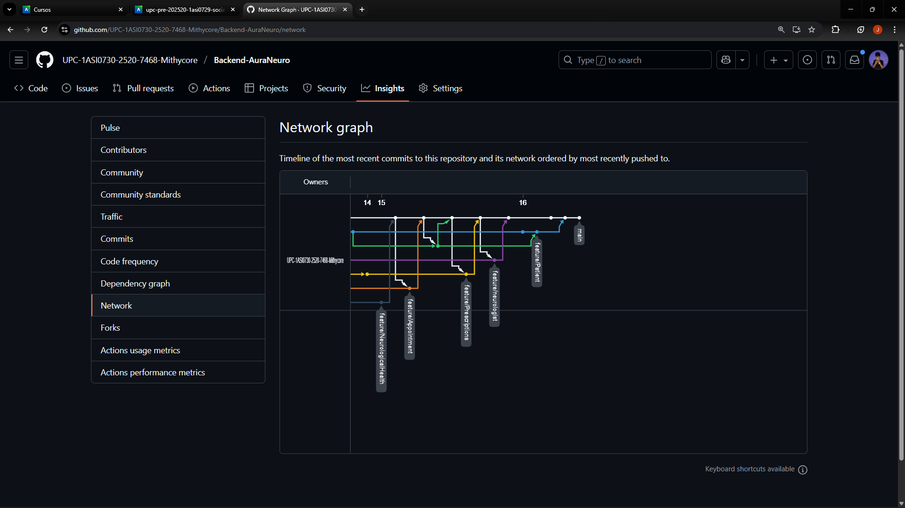

## 5.2.4. Sprint 4

### 5.2.4.1. Sprint Planning 4

El Sprint 4 se centra en la integración final del sistema *AuraNeuro*, uniendo el frontend y backend, cerrando todas las funcionalidades pendientes, realizando pruebas end-to-end y preparando el despliegue final del producto.  
Durante esta iteración se logró integrar completamente el flujo real entre la aplicación web, los servicios REST del backend, la visualización de métricas, dispositivos IoT simulados y los módulos clínicos. Además, se validaron las HU completas y se generaron las evidencias finales del ciclo de vida del proyecto.

---

### Sprint Planning Background

| **Sprint #** | Sprint 4 |
|--------------|----------|
| **Date** | 2025-11-28 |
| **Time** | 21:00 PM – 11:30 PM |
| **Location** | Reunión virtual (Zoom) |
| **Prepared By** | Romero Meza, Jhimy |
| **Attendees (to planning meeting)** | Romero Meza — Sprint Lead (Backend)   Eduardo F. Chacaliaza Minaya — Product Owner   Gutierrez Tume, Jeremy — Lead Dev (Arquitectura / Code Reviews)   Fabricio F. Quispe Barzola — Backend Developer / QA   Juan José Meza Huanacune — DevOps & Deployment |
| **Sprint 4 – Summary** | Durante el Sprint 3 se completó la base estable del backend (autenticación, agendas, recetas, historial médico y perfil). Para el Sprint 4, el Product Owner priorizó la entrega del sistema *integrado end-to-end*, habilitando:    - Teleconsulta MVP (chat + sala virtual simulada)   - Integración IoT simulada (biomarcadores automáticos conectados al backend)   - Consolidación del historial médico completo   - Integración total Frontend ↔ Backend en todos los módulos   - Despliegue final en producción (Frontend en Firebase, Backend en Render)   - Evidencias finales, capturas y validación de HU completas. |
| **Sprint 4 – Retrospective Summary** | El equipo destacó como fortaleza la madurez del backend, la estabilidad del frontend y la fluidez del trabajo coordinado. Se identificaron mejoras aplicadas dentro del sprint:    - Optimización de comunicación técnica diaria   - Consolidación y limpieza de documentación de endpoints   - Incremento de pruebas unitarias y E2E    Con estos ajustes, la integración final se completó sin bloqueos y se entregó una versión estable y funcional para su despliegue. | **Sprint 4 Goal** | Our focus is on enabling the final integrated version of *AuraNeuro*, connecting the frontend with the backend, stabilizing all modules, completing clinical workflows, incorporating IoT data, and delivering a production-ready release. We believe it delivers a full neurological monitoring experience with real metrics, clinical records, stress tests, and appointment management. This will be confirmed when all modules run smoothly with real API data, all HU pass E2E testing, and the system is deployed successfully.    **Traducción:** El enfoque está en integrar completamente el sistema, asegurar estabilidad, finalizar UI/UX, integrar datos clínicos, pruebas de estrés y agenda, y desplegar la versión final de AuraNeuro. Esto se confirmará cuando todos los módulos funcionen con datos reales desde la API, pasen validaciones E2E, y el despliegue final sea exitoso. |
| **Sprint 4 Velocity** | Se completaron 11 historias de usuario, con ~46 Story Points. |
| **Sum of Story Points** | 46 |

## 5.2.4.2. Aspect Leaders and Collaborators

En este sprint se mantuvo la lógica LACX, orientada a integración técnica y despliegue.

| **Team Member** | **GitHub Username** | **Frontend (Angular/UI)** | **Backend (C# / .NET)** | **API Integration** | **Testing & QA** | **Deployment** |
|------------------|----------------------|---------------------------|--------------------------|----------------------|------------------|-----------------|
| Romero Meza, Jhimy | @jhimyromero | C | L | C | L | C |
| Eduardo F. Chacaliaza Minaya | @educmz | L | — | C | C | L |
| Gutierrez Tume, Jeremy | @jgutierrerz | C | C | L | C | C |
| Fabricio F. Quispe Barzola | @BrooklynKarmis | — | C | — | L | C |
| Juan José Meza Huanacune | @JuanMHZ12 | C | L | C | C | L |

---

## 5.2.4.3. Sprint Backlog 4 – Tareas Técnicas

| **Sprint #** | **Sprint 4** |
|--------------|--------------|
| **Task ID** | **Work-Item / Task** |
| T01 | Integración del Test de Estrés ↔ API (US04, US05, US06) |
| T02 | Integración completa del módulo de Recomendaciones ↔ API (US07, US08, US09) |
| T03 | Integración del Dashboard clínico ↔ API (US10, US11, US12) |
| T04 | Integración de módulo de Psicólogos ↔ API (US13, US14, US15) |
| T05 | Correcciones de validación y manejo de errores en frontend |
| T06 | Mejoras de UI/UX: colores, consistencia visual, responsive |
| T07 | Optimización de carga, DOM y rendimiento |
| T08 | Pruebas funcionales completas (Testing de cada módulo ↔ API) |
| T09 | Pruebas End-to-End para flujos de usuario |
| T10 | Configuración de despliegue backend (Render / Railway / Docker) |
| T11 | Configuración de despliegue frontend (Firebase Hosting) |
| T12 | Documentación del Sprint 4 + Evidencias finales |

---

## 5.2.4.4. Development Evidence for Sprint Review

| **Repositorio** | **Branch** | **Commit ID** | **Mensaje del Commit** | **Descripción** | **Fecha** |
|------------------|------------|----------------|--------------------------|------------------|-----------|
| /auraneuro-frontend | feature/api-sync | c91f2ab | feat(api): connected dashboard to neuro-metrics | Dashboard conectado a métricas reales del backend | 2025-10-24 |
| /auraneuro-frontend | feature/auth-jwt | 1b2ca77 | feat(auth): implemented JWT login flow | Autenticación real usando JWT | 2025-10-26 |
| /auraneuro-frontend | feature/appointments | f51a9e3 | feat(appointments): wired booking module to API | Integración real del módulo de citas | 2025-11-02 |
| /auraneuro-backend | feature/swagger-update | 5fe17af | docs(api): updated Swagger documentation | Actualización final de documentación OpenAPI | 2025-11-08 |
| /auraneuro-backend | feature/final-services | 8dcebe1 | fix(services): improved stress & metrics engine | Ajustes finales en servicios de backend | 2025-11-16 |
| /auraneuro-frontend | main | 9f812e2 | chore(deploy): final build and firebase deploy | Despliegue final del frontend | 2025-11-19 |
| /auraneuro-backend | main | af92cd7 | chore(deploy): backend deployment on Render | Deploy final backend | 2025-11-26 |

---

## 5.2.4.5. Execution Evidence for Sprint Review

Se validó el funcionamiento completo del sistema integrado:

- Inicio de sesión con JWT  
- Registro conectado al backend  
- Test de estrés conectado a API  
- Dashboard con métricas reales  
- Recomendaciones dinámicas  
- Búsqueda de psicólogos conectada  
- Módulo de citas operativo  
- Navegación fluida y responsiva  
- Comprobación en múltiples dispositivos  

*(Insertar capturas: Dashboard, JWT Login, Psicólogos, Citas, Swagger)*

---

## 5.2.4.6. Software Deployment Evidence for Sprint Review

### **Frontend: Firebase Hosting**
- Build: `npm run build`
- Hosting activo: **https://tinyurl.com/p28fk93x**

### **Backend: Render**
- Entorno productivo habilitado
- Swagger activo para pruebas: **http://20.81.154.140:5152/swagger/index.html**

Validaciones realizadas:

- Integración completa Frontend ↔ Backend  
- Pruebas de rutas, componentes y servicios  
- Flujo funcional estable  
- Compatibilidad multiplataforma  

---

## 5.2.4.7. Team Collaboration Insights during Sprint

El equipo mantuvo comunicación constante mediante:

- Reuniones semanales y checkpoints diarios  
- Gestión mediante Trello  
- Uso disciplinado de GitFlow  
- Revisiones cruzadas de código  
- GitHub Insights para seguimiento  
- Coordinación frontend, backend y DevOps  

El Sprint 4 consolidó los avances previos y entregó una versión final lista para presentación.

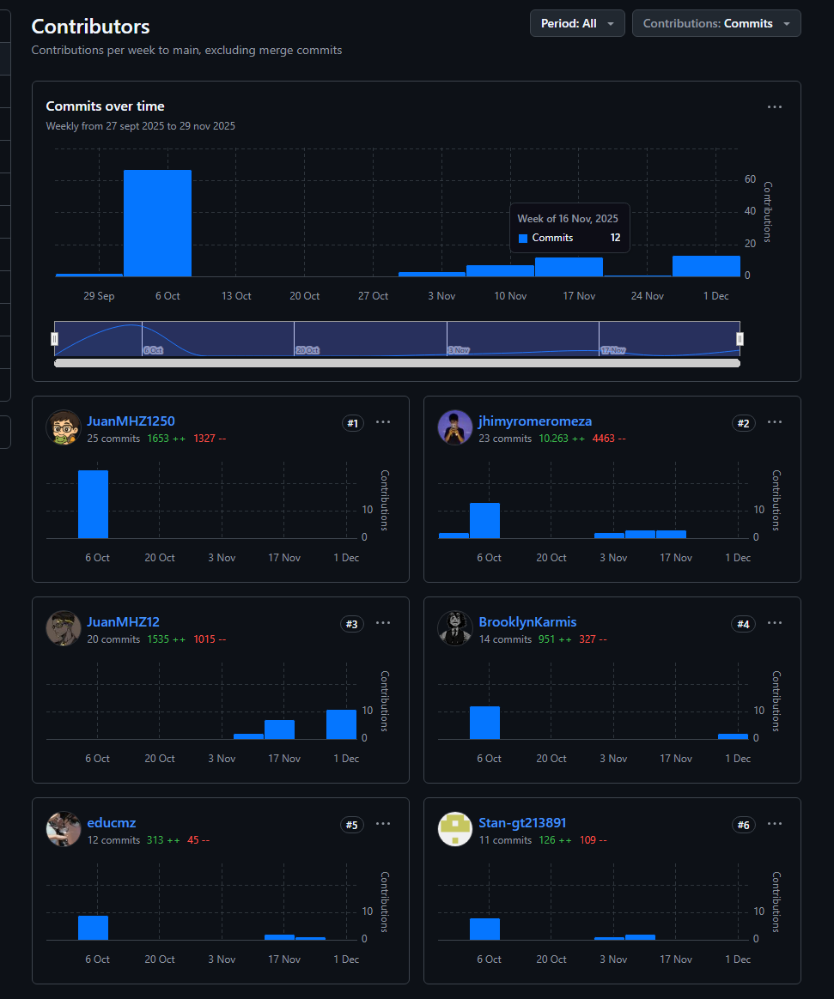

## 5.3. Validation Interviews.  
**Objetivo general**  

Validar con usuarios reales (segmentos objetivo) la usabilidad, comprensión y valor percibido de la Landing Page y de la aplicación web (Paciente / Neurólogo) en entornos reales de staging. Detectar fricciones, confirmar hipótesis de conversión y verificar que los flujos críticos funcionan end-to-end.  

**Segmentos objetivo**  

- Neurólogos / terapeutas — Profesionales que usarán el dashboard clínico, gestionarán pacientes, evaluaciones, citas y recetas.

- Pacientes o cuidadores — Usuarios que solicitarán citas, consultarán evaluaciones y recetas, y usarán el panel personal.

Evaluación heurística básica (aplicada post-tarea)
Aplicar una rápida checklist heurística (moderador) por cada participante:
- Visibilidad del estado del sistema.
- Correspondencia entre el sistema y el mundo real (terminología clínica clara).
- Control y libertad del usuario (cancelar/editar cita).
- Consistencia y estándares (nomenclaturas, iconografía).
- Prevención de errores (validaciones en formularios).
- Reconocimiento en vez de recuerdo (labels claros).
- Flexibilidad y eficiencia de uso (atajos para expertos).
- Estética y diseño minimalista.
- Ayuda y documentación (mensajes de error útiles).

Registrar observaciones por heurística con severidad leve/moderada/crítica.

### 5.3.1. Diseño de Entrevistas.

**Formato de la sesión:**
- Duración: 30–45 minutos por participante
- Modalidad: virtual
- Registro: Video grabado con consentimiento informado
  
Materiales:

- Landing Page final de AuraNeuro

- Aplicación web funcional (frontend y backend integrados)

- Guion de entrevista y hoja de observación

Estructura general de la sesión:
- Introducción y consentimiento
- Preguntas demográficas y contexto
- Exploración libre de la Landing Page
- Tareas dirigidas (user flows en Landing y aplicación)
- Evaluación heurística y discusión final

-----
# Guion de entrevista de validación — AuraNeuro

## 1. Introducción y consentimiento (moderador)

> “Hola, soy **[nombre del entrevistador/a]**, miembro del equipo de AuraNeuro. Gracias por participar en esta entrevista de validación. El propósito de esta sesión es comprender tus impresiones y nivel de satisfacción al usar la Landing Page y la aplicación web de AuraNeuro. La sesión será grabada únicamente con fines de análisis interno. ¿Das tu consentimiento para grabar la entrevista y utilizar tus comentarios de manera anónima en el informe final?”

**Registrar:**  
- **Consentimiento otorgado:** ☐ Sí  ☐ No

**Moderador:** ____________________  
**Fecha:** ____________________  
**Grabación (ID / archivo):** ____________________

---

## 2. Preguntas demográficas y contexto (2–3 min)

- **Nombre:** ____________________  
- **Edad:** ____________________  
- **Distrito (residencia):** ____________________  

- **Ocupación principal:**  
  - ☐ Médico  ☐ Terapeuta  ☐ Paciente  ☐ Familiar  ☐ Otro: ________

- **¿Tienes experiencia previa utilizando plataformas de salud digital o telemedicina?**  
  - ☐ Sí  ☐ No  
  - **Si responde “Sí”:** ¿Cuáles y para qué las utilizas?  
    - ________________________________________________________________

- **¿Qué te motiva más?:**  
  - ☐ Optimizar tu práctica médica  ☐ Mejorar tu experiencia como paciente

**Objetivo:** Comprender el perfil del participante y su nivel de familiaridad con soluciones digitales de salud.

---

## 3. Exploración libre de la Landing Page (5–7 min)

**Instrucción:**  
> “Por favor, navega libremente por la Landing Page de AuraNeuro como si la hubieras encontrado por primera vez. Comenta en voz alta lo que vas observando, entendiendo o sintiendo.”

**Observaciones a registrar:**  
- **Secciones más visitadas:** Inicio / Características / Planes / Otro: ________  
- **Elementos que generan atención o confusión:** ____________________  
- **Tiempos de permanencia por sección:** ____________________  

**Preguntas durante o después de la exploración:**
- En una frase: **¿qué crees que ofrece AuraNeuro?**  
  - ________________________________________________________________
- **¿Para quién consideras que está dirigida la plataforma?**  
  - ________________________________________________________________
- **¿Qué parte del diseño o contenido te generó mayor confianza?**  
  - ________________________________________________________________
- **¿Hubo algo que te generó dudas o te pareció poco claro?**  
  - ________________________________________________________________
- **¿Qué esperarías que ocurra al hacer clic en “Optimizar mi práctica”?**  
  - ________________________________________________________________
- **¿El mensaje principal te motiva a suscribirte o explorar más?**  
  - ☐ Sí  ☐ No  **Comentario:** ____________________

**Objetivo:** Validar la claridad del mensaje, atractivo visual, y efectividad del CTA.

---

## 4. Tareas dirigidas (User Flows) — Landing Page y Aplicación Web

### 4.A — Landing Page: Suscripción / Registro
**Instrucción:**  
> “Haz clic en ‘Suscribirse’ y completa el formulario.”

**Observaciones:**  
- Tiempo en encontrar el CTA: ______________  
- Dudas al completar el formulario: ______________  
- Percepción de seguridad al ingresar datos: ______________

**Preguntas post-tarea:**
- ¿El formulario te pareció claro y fácil de completar? ☐ Sí ☐ No — **Comentario:** __________  
- ¿Sentiste confianza al dejar tus datos personales? ☐ Sí ☐ No — **Comentario:** __________  
- ¿Cambiarías o eliminarías algún campo del formulario? ______________  
- ¿Qué te motivaría a finalizar el registro en una situación real? ______________

---

### 4.B — Aplicación (Rol: Paciente): Solicitar una cita
**Instrucción:**  
> “Imagina que eres un paciente que desea solicitar una cita para la próxima semana con su neurólogo.”

**Preguntas post-tarea:**
- ¿Encontraste fácilmente la opción para agendar una cita? ☐ Sí ☐ No — **Comentario:** __________  
- ¿El proceso fue claro desde la selección hasta la confirmación? ☐ Sí ☐ No — **Comentario:** __________  
- **¿Cómo evaluarías la rapidez y facilidad del flujo (1–5)?** ☐ 1 ☐ 2 ☐ 3 ☐ 4 ☐ 5  
- ¿Qué mejorarías para que el proceso sea más intuitivo? ______________

---

### 4.C — Aplicación (Rol: Neurólogo): Revisar y confirmar una solicitud
**Instrucción:**  
> “Ahora imagina que eres un neurólogo. Revisa las solicitudes de cita pendientes y confirma una.”

**Preguntas post-tarea:**
- ¿Encontraste rápidamente la solicitud de cita? ☐ Sí ☐ No — **Comentario:** __________  
- ¿Fue claro cómo confirmar o rechazar una solicitud? ☐ Sí ☐ No — **Comentario:** __________  
- **¿Qué información adicional te gustaría tener antes de confirmar?** (ej. historial del paciente, notas previas, alergias)  
  - ________________________________________________________________

---

### 4.D — Aplicación (Rol: Paciente): Consultar evaluaciones y recetas
**Instrucción:**  
> “Desde tu panel, abre el historial de evaluaciones y revisa la última receta médica.”

**Preguntas post-tarea:**
- ¿Encontraste la evaluación sin dificultad? ☐ Sí ☐ No — **Comentario:** __________  
- ¿La información clínica y las indicaciones fueron comprensibles? ☐ Sí ☐ No — **Comentario:** __________  
- ¿Percibes claridad en el formato y lenguaje médico? ☐ Sí ☐ No — **Comentario:** __________  
- ¿Qué mejorarías para hacerlo más amigable o visualmente claro? ______________

---

## 5. Evaluación heurística rápida y discusión final (5–7 min)

**Pide al entrevistado calificar del 1 al 5 los siguientes aspectos:**  
*(1 = Muy deficiente, 5 = Excelente)*

| Criterio                                                               | Calificación (1–5) | Comentario breve |
|------------------------------------------------------------------------|:------------------:|------------------|
| Claridad del propósito de AuraNeuro                                     | ☐1 ☐2 ☐3 ☐4 ☐5     | __________________ |
| Confianza que transmite la plataforma                                   | ☐1 ☐2 ☐3 ☐4 ☐5     | __________________ |
| Facilidad de registro / suscripción                                     | ☐1 ☐2 ☐3 ☐4 ☐5     | __________________ |
| Facilidad para solicitar o confirmar citas                              | ☐1 ☐2 ☐3 ☐4 ☐5     | __________________ |
| Claridad de información en secciones “Cómo funciona” y “Planes”         | ☐1 ☐2 ☐3 ☐4 ☐5     | __________________ |

---

### Preguntas abiertas finales

- **¿Qué mejorarías en la Landing Page o en la app para hacerla más atractiva o útil?**  
  - ________________________________________________________________

- **¿Qué elemento te haría más propenso a registrarte o recomendarla a otros?**  
  - ________________________________________________________________

- **¿Te genera alguna preocupación sobre la seguridad o privacidad de los datos en AuraNeuro?**  
  - ________________________________________________________________

- **En una palabra, ¿cómo describirías tu experiencia general con la plataforma?**  
  - ______________

---

**Notas adicionales del entrevistador:**  
- ________________________________________________________________

**Firma del entrevistador:** ____________________  
**Firma del participante (opcional):** ____________________

### 5.3.2. Registro de Entrevistas.

**Segmento 1**

  

    <strong>Entrevista N°1:</strong>
  

  

    

      <strong>Evidencia</strong> 
      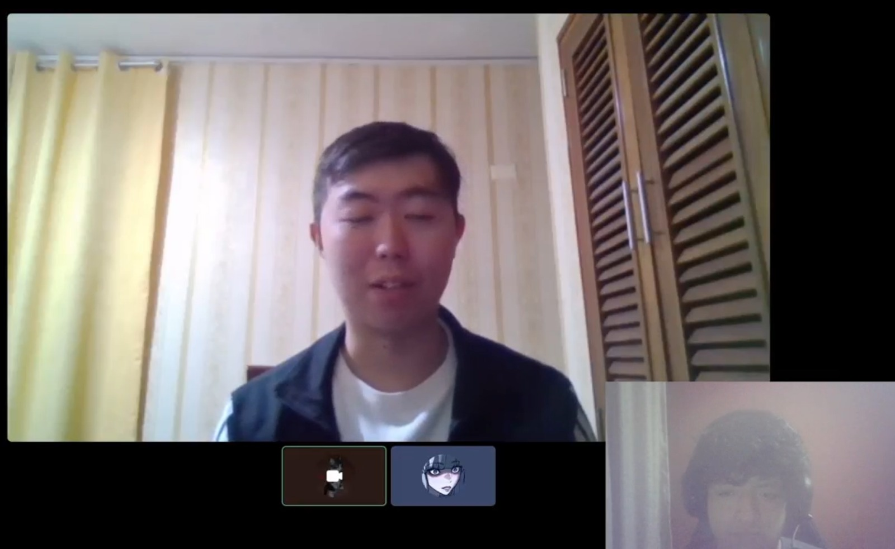 
      Entrevista con Xin Yu Shi Lin (Entrevistado) y Meza Huanacune Juan José (Entrevistador).
    

  

  <table style="width:100%; border-collapse:collapse; margin-bottom:8px;">
    <tr>
      <td style="border:1px solid #111; padding:8px; vertical-align:top; width:50%;"><strong>Entrevistado:</strong> Shi Lin, Xin Yu</td>
      <td style="border:1px solid #111; padding:8px; vertical-align:top; width:50%;"><strong>Entrevistador:</strong> Meza Huanacune, Juan José</td>
    </tr>
    <tr>
      <td colspan="2" style="border:1px solid #111; padding:8px; vertical-align:top;">
        <strong>Información del entrevistado:</strong> 
        Sexo: Masculino / Edad: 21 / Residencia: Lima Perú
      </td>
    </tr>
    <tr>
      <td colspan="2" style="border:1px solid #111; padding:8px; vertical-align:top;">
        <strong>Enlace Entrevista:</strong>
        <a href="https://tinyurl.com/njtfjbam" target="_blank" rel="noopener">entrevista a Xin</a>
      </td>
    </tr>
    <tr>
      <td style="border:1px solid #111; padding:8px; vertical-align:top; width:50%;"><strong>Inicio:</strong> 0:00</td>
      <td style="border:1px solid #111; padding:8px; vertical-align:top; width:50%;"><strong>Duración:</strong> 7:30</td>
    </tr>
    <tr>
      <td colspan="2" style="border:1px solid #111; padding:12px; vertical-align:top; min-height:120px;">
        <strong>Resumen de Entrevista:</strong>
        
Xin Yu mostró una recepción muy positiva frente a la plataforma AuraNeuro. Comentó que el frontend le pareció moderno, limpio y agradable a la vista, destacando que las secciones están bien distribuidas y que la navegación es intuitiva incluso para usuarios nuevos. Señaló que la Landing Page comunica bien la propuesta de valor y que los colores suaves transmiten calma y profesionalismo, algo adecuado para un producto de salud mental.

Al probar el flujo de registro y cita, destacó que el formulario está bien organizado y que los mensajes de validación ayudan a avanzar sin confusiones. También mencionó que las pantallas del paciente en la aplicación le parecieron rápidas y que el tiempo de carga fue mínimo.

Sobre el backend, comentó que la aplicación respondió de forma inmediata al solicitar una cita y al revisar el historial, lo que le transmitió confiabilidad. Señaló que la estructura de datos, especialmente en recetas y evaluaciones, es clara y fácil de entender. Finalmente, afirmó que usaría AuraNeuro si estuviera disponible públicamente porque siente que ofrece una experiencia segura, confiable y profesional.

      </td>
    </tr>
  </table>

  

    <strong>Entrevista N°2:</strong>
  

  

    

      <strong>Entrevista 2 segmento 1</strong> 
      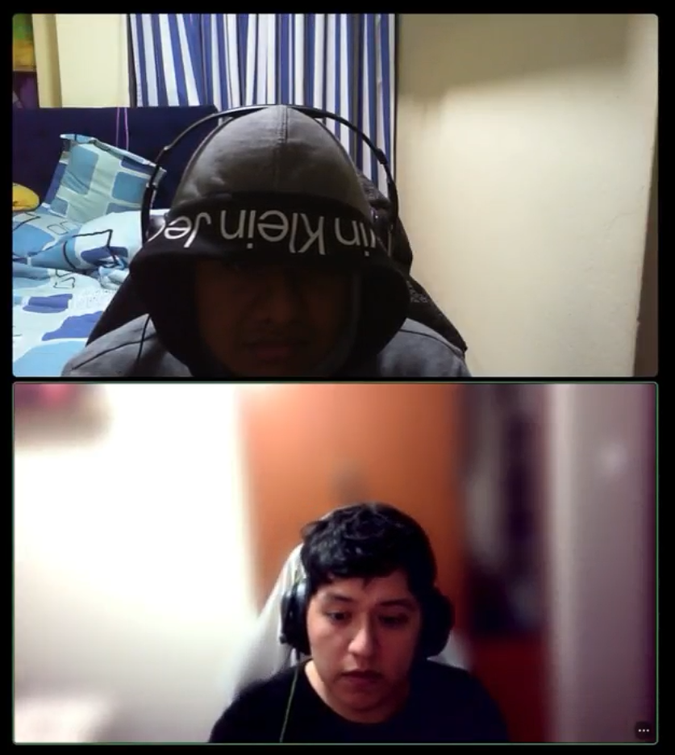 
      Entrevista con Eduardo Diaz Veliz (Entrevistada) y Meza Huanacune Juan José (Entrevistador).
    

  

  <table style="width:100%; border-collapse:collapse; margin-bottom:8px;">
    <tr>
      <td style="border:1px solid #111; padding:8px; vertical-align:top; width:50%;"><strong>Entrevistado/a:</strong> Eduardo Diaz Veliz</td>
      <td style="border:1px solid #111; padding:8px; vertical-align:top; width:50%;"><strong>Entrevistador:</strong> Meza Huanacune Juan José</td>
    </tr>
    <tr>
      <td colspan="2" style="border:1px solid #111; padding:8px; vertical-align:top;">
        <strong>Información del entrevistado:</strong> 
        Sexo: Masculino / Edad: 21 / Residencia: La Victoria, Perú
      </td>
    </tr>
    <tr>
      <td colspan="2" style="border:1px solid #111; padding:8px; vertical-align:top;">
        <strong>Enlace Entrevista:</strong>
        <a href="https://tinyurl.com/yc76d55w" target="_blank" rel="noopener">Entrevista a Eduardo</a>
      </td>
    </tr>
    <tr>
      <td style="border:1px solid #111; padding:8px; vertical-align:top; width:50%;"><strong>Inicio:</strong> 0:00</td>
      <td style="border:1px solid #111; padding:8px; vertical-align:top; width:50%;"><strong>Duración:</strong> 7:10</td>
    </tr>
    <tr>
      <td colspan="2" style="border:1px solid #111; padding:12px; vertical-align:top; min-height:120px;">
        <strong>Resumen de Entrevista:</strong>
        
Eduardo destacó que el frontend de AuraNeuro es ordenado, sencillo de entender y visualmente atractivo. Mencionó que la Landing Page le generó confianza desde el inicio por su diseño minimalista y su mensaje directo. Indicó que el CTA es claro y que el flujo de suscripción es bastante rápido.

Durante el flujo de paciente, resaltó la facilidad para solicitar citas y la organización del panel. Comentó que los iconos y botones son visibles, y que la experiencia general se siente estable. También señaló que el diseño responsive funciona adecuadamente al cambiar entre dispositivos.

Sobre el backend, Eduardo expresó que la carga de la información fue bastante fluida y que no percibió retrasos en la actualización de citas o evaluaciones. Indicó que el sistema responde bien ante peticiones y que los endpoints parecen estar bien estructurados. En sus palabras, “se siente como una plataforma profesional y confiable”, especialmente por la claridad en los datos clínicos y la rapidez al mostrar la información médica.

      </td>
    </tr>
  </table>

  

    <strong>Entrevista N°3:</strong>
  

  

    

      <strong>Entrevista 3 segmentoo 1</strong> 
      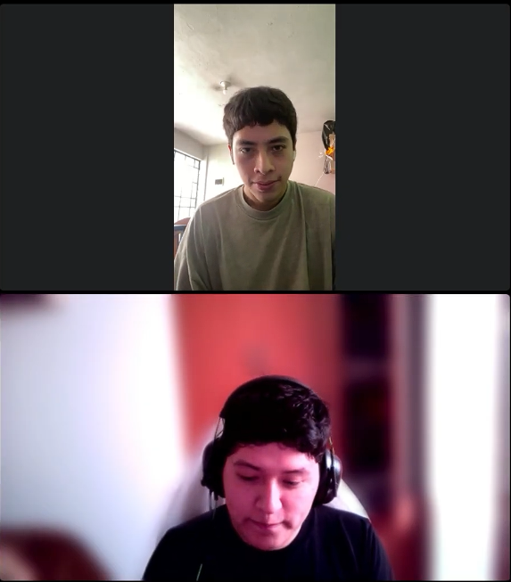 
      Entrevista con Cornejo, Cesar Aaron (Entrevistada) y Meza Huanacune, Juan José (Entrevistador).
    

  

  <table style="width:100%; border-collapse:collapse; margin-bottom:8px;">
    <tr>
      <td style="border:1px solid #111; padding:8px; vertical-align:top; width:50%;"><strong>Entrevistado/a:</strong> Meza Huanacune, Juan José</td>
      <td style="border:1px solid #111; padding:8px; vertical-align:top; width:50%;"><strong>Entrevistador:</strong> Cornejo, Cesar Aaron</td>
    </tr>
    <tr>
      <td colspan="2" style="border:1px solid #111; padding:8px; vertical-align:top;">
        <strong>Información del entrevistado:</strong> 
        Sexo: Masculino / Edad: 20 / Residencia: San Juan de Lurigancho, Lima
      </td>
    </tr>
    <tr>
      <td colspan="2" style="border:1px solid #111; padding:8px; vertical-align:top;">
        <strong>Enlace Entrevista:</strong>
        <a href="https://tinyurl.com/f5kaj2fz" target="_blank" rel="noopener">Entrevista a Aaron</a>
      </td>
    </tr>
    <tr>
      <td style="border:1px solid #111; padding:8px; vertical-align:top; width:50%;"><strong>Inicio:</strong> 0:00</td>
      <td style="border:1px solid #111; padding:8px; vertical-align:top; width:50%;"><strong>Duración:</strong> 8:20</td>
    </tr>
    <tr>
      <td colspan="2" style="border:1px solid #111; padding:12px; vertical-align:top; min-height:120px;">
        <strong>Resumen de Entrevista:</strong>
        
Aarón comentó que el frontend de AuraNeuro está bien logrado, destacando la estética limpia y profesional. Mencionó que la estructura facilita que un paciente encuentre lo que necesita sin explorar demasiado. Apreciò el uso de iconografía y la claridad del flujo de usuario, especialmente al consultar evaluaciones y recetas.

Además, mencionó que el menú lateral le resultó familiar y fácil de navegar. También resaltó que la experiencia visual del sistema es coherente y que los colores contribuyen a una experiencia calmada y adecuada para salud mental.

Respecto al backend, señaló que todo funcionó de manera estable, especialmente en las acciones relacionadas a citas y recetas. Indicó que le gustó que las evaluaciones se carguen rápido y que el formato de las recetas sea entendible sin ser profesional de salud. Considera que el backend es eficiente y que la sincronización entre vistas es inmediata, transmitiendo que la plataforma está bien integrada y lista para uso real.

      </td>
    </tr>
  </table>

**Segmento 2**

  

    <strong>Entrevista N°1:</strong>
  

  

    

      <strong>Tabla 58</strong> 
      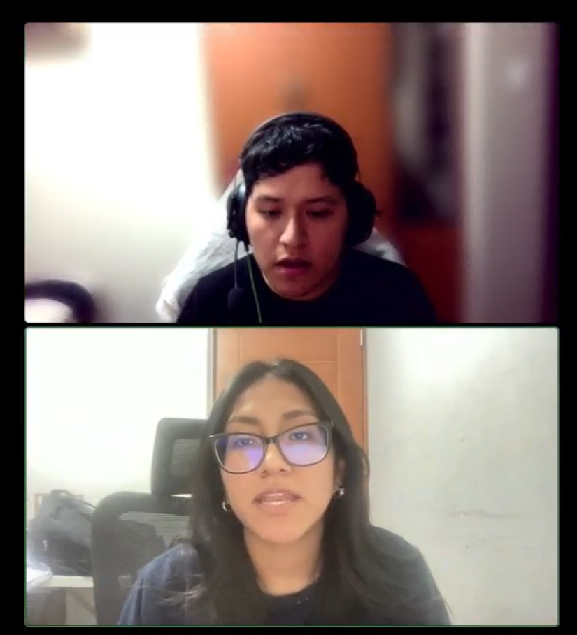 
      Entrevista con Villanueva Castillo, Karen Guadalupe (Entrevistada) y Meza Huanacune Juan José (Entrevistador).
    

  

  <table style="width:100%; border-collapse:collapse; margin-bottom:8px;">
    <tr>
      <td style="border:1px solid #111; padding:8px; vertical-align:top; width:50%;"><strong>Entrevistado/a:</strong> Villanueva Castillo, Karen Guadalupe</td>
      <td style="border:1px solid #111; padding:8px; vertical-align:top; width:50%;"><strong>Entrevistador:</strong> Meza Huanacune Juan José</td>
    </tr>
    <tr>
      <td colspan="2" style="border:1px solid #111; padding:8px; vertical-align:top;">
        <strong>Información del entrevistado:</strong> 
        Sexo: Femenino / Edad: 26 / Residencia: Magdalena del mar, Perú 
      </td>
    </tr>
    <tr>
      <td colspan="2" style="border:1px solid #111; padding:8px; vertical-align:top;">
        <strong>Enlace Entrevista:</strong>
        <a href="https://tinyurl.com/yy3t2k65" target="_blank" rel="noopener">Entrevista a Karen</a>
      </td>
    </tr>
    <tr>
      <td style="border:1px solid #111; padding:8px; vertical-align:top; width:50%;"><strong>Inicio:</strong> 0:00</td>
      <td style="border:1px solid #111; padding:8px; vertical-align:top; width:50%;"><strong>Duración:</strong> 7:50</td>
    </tr>
    <tr>
      <td colspan="2" style="border:1px solid #111; padding:12px; vertical-align:top; min-height:120px;">
        <strong>Resumen de Entrevista:</strong>
        
Karen, como profesional del área, valoró positivamente el frontend, señalando que la interfaz es clara y que la separación entre pacientes, evaluaciones y citas está bien organizada. Destacó que el flujo para revisar solicitudes de citas es rápido y que la interfaz de evaluaciones le pareció especialmente útil por su formato limpio.

Mencionó que el sistema evita sobrecargar la pantalla con demasiada información, lo cual facilita el análisis clínico. Señaló también que las recetas están presentadas en un formato profesional y entendible.

Sobre el backend, comentó que las acciones más importantes para un neurólogo (confirmar citas, revisar evaluaciones, emitir recetas) son rápidas y sin errores perceptibles. La carga instantánea de datos y la correcta filtración de pacientes le transmitieron seguridad. Indicó que AuraNeuro podría ser muy útil en consultorios porque agiliza tareas administrativas y mejora la trazabilidad clínica.

      </td>
    </tr>
  </table>

  

    <strong>Entrevista N°2:</strong>
  

  

    

      <strong>Entrevista 2 Segmento 2</strong> 
      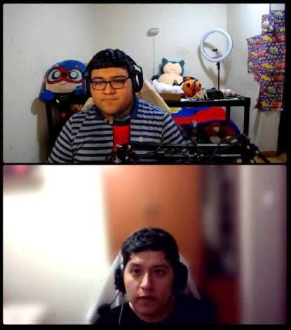 
      Entrevista con Manrique Meza, Jesús Antonio (Entrevistado) y Meza Huanacune, Juan José (Entrevistador).
    

  

  <table style="width:100%; border-collapse:collapse; margin-bottom:8px;">
    <tr>
      <td style="border:1px solid #111; padding:8px; vertical-align:top; width:50%;"><strong>Entrevistado/a:</strong> Manrique Meza, Jesús Antonio</td>
      <td style="border:1px solid #111; padding:8px; vertical-align:top; width:50%;"><strong>Entrevistador:</strong> Meza Huanacune, Juan José</td>
    </tr>
    <tr>
      <td colspan="2" style="border:1px solid #111; padding:8px; vertical-align:top;">
        <strong>Información del entrevistado:</strong> 
        Sexo: Masculino / Edad: 24 / Residencia: San Juan de Lurigancho, Lima
      </td>
    </tr>
    <tr>
      <td colspan="2" style="border:1px solid #111; padding:8px; vertical-align:top;">
        <strong>Enlace Entrevista:</strong>
        <a href="https://tinyurl.com/2ss85hfc" target="_blank" rel="noopener">Entrevista a Jesús</a>
      </td>
    </tr>
    <tr>
      <td style="border:1px solid #111; padding:8px; vertical-align:top; width:50%;"><strong>Inicio:</strong> 0:00</td>
      <td style="border:1px solid #111; padding:8px; vertical-align:top; width:50%;"><strong>Duración:</strong> 7:58</td>
    </tr>
    <tr>
      <td colspan="2" style="border:1px solid #111; padding:12px; vertical-align:top; min-height:120px;">
        <strong>Resumen de Entrevista:</strong>
        
Jesús señaló que el frontend es altamente intuitivo, especialmente en la vista del profesional. Destacó la claridad de los botones de acción, el panel limpio y la facilidad para alternar entre pacientes, citas y evaluaciones. Mencionó que la estética transmite confianza y profesionalismo, y que la experiencia visual está bien alineada con un software de salud.

En relación al backend, señaló que el sistema es estable, pues las listas de pacientes cargan rápido y las solicitudes de citas se actualizan sin demora. Mencionó que la API parece estar correctamente construida porque no percibió errores de sincronización ni tiempos de espera altos. Consideró que AuraNeuro tiene potencial real para uso clínico, especialmente porque automatiza tareas que normalmente consumen tiempo.

      </td>
    </tr>
  </table>

  

    Entrevista N°3
  

    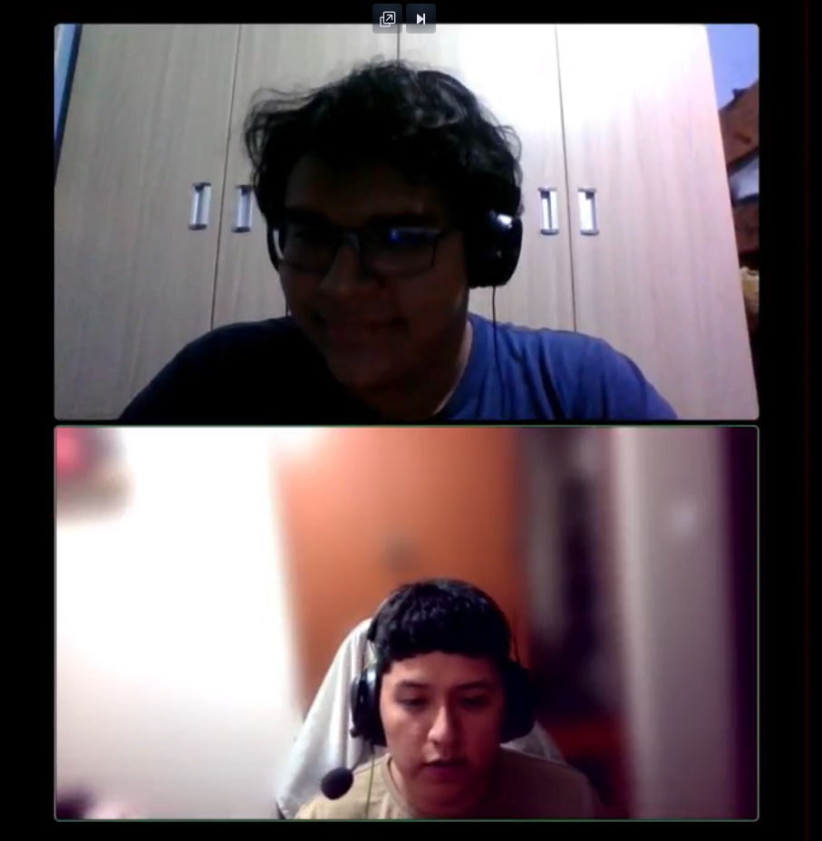

  <table style="width:100%; border-collapse:collapse; margin-bottom:10px;">
    <tr>
      <td style="padding:8px 12px; border:1px solid #333; background:#1f2933; font-weight:bold;">
        Entrevistado/a:
      </td>
      <td style="padding:8px 12px; border:1px solid #333; background:#161b22;">
        Paredes Paredes, Carlos Augusto
      </td>
      <td style="padding:8px 12px; border:1px solid #333; background:#1f2933; font-weight:bold;">
        Entrevistador:
      </td>
      <td style="padding:8px 12px; border:1px solid #333; background:#161b22;">
        Meza Huancane, Juan José
      </td>
    </tr>
    <tr>
      <td style="padding:8px 12px; border:1px solid #333; background:#1f2933; font-weight:bold;">
        Información del entrevistado:
      </td>
      <td colspan="3" style="padding:8px 12px; border:1px solid #333; background:#161b22;">
        Sexo: Masculino &nbsp;•&nbsp; Edad: 26 &nbsp;•&nbsp; Residencia: San Juan de Miraflores, Lima
      </td>
    </tr>
    <tr>
      <td style="padding:8px 12px; border:1px solid #333; background:#1f2933; font-weight:bold;">
        Enlace de la Entrevista:
      </td>
      <td colspan="3" style="padding:8px 12px; border:1px solid #333; background:#161b22;">
        <a href="https://tinyurl.com/4p76sbjp" target="_blank" style="color:#4ea3ff; text-decoration:underline;">
          https://tinyurl.com/4p76sbjp
        </a>
      </td>
    </tr>
    <tr>
      <td style="padding:8px 12px; border:1px solid #333; background:#1f2933; font-weight:bold;">
        Inicio:
      </td>
      <td style="padding:8px 12px; border:1px solid #333; background:#161b22;">
        0:00
      </td>
      <td style="padding:8px 12px; border:1px solid #333; background:#1f2933; font-weight:bold;">
        Duración:
      </td>
      <td style="padding:8px 12px; border:1px solid #333; background:#161b22;">
        4:26
      </td>
    </tr>
  </table>

### Resumen de Entrevista

Carlos indicó que la Landing Page de AuraNeuro le pareció clara, moderna y bien estructurada. Destacó que el diseño transmite profesionalismo y un enfoque clínico gracias al uso de colores suaves, tipografía limpia y secciones organizadas de forma lógica. Mencionó que los apartados “Cómo funciona” y “Beneficios” permiten entender muy rápido la propuesta de valor del producto.

Sobre la navegación, comentó que el flujo es intuitivo y que tanto el menú superior como el footer facilitan encontrar la información necesaria. Percibió que la experiencia general es coherente y que la interfaz resulta accesible para cualquier usuario, incluso para pacientes sin experiencia previa en plataformas de salud digital.

Respecto al frontend, Carlos señaló que las páginas de Inicio de Sesión y Registro le parecieron sencillas y fáciles de usar, y que la estructura minimalista ayuda a evitar confusiones. Consideró que, aunque el frontend está en versión inicial, transmite correctamente la intención del producto y se siente listo para integrarse con funcionalidades más avanzadas como citas, IoT y telemedicina.

Finalmente, destacó que AuraNeuro tiene un buen equilibrio entre claridad, simplicidad y enfoque clínico, lo que facilitaría la adopción por parte de consultorios pequeños o medianos.

---

### 5.3.3. Evaluaciones según heurísticas.

Este análisis se basa en principios de usabilidad para evaluar la experiencia del usuario en la aplicación AuraNeuro. Se identifican fortalezas, debilidades y recomendaciones de mejora.

---

### SITE o APP A EVALUAR:
**AuraNeuro**

---

### TAREAS A EVALUAR:
El alcance de esta evaluación incluye la revisión de la usabilidad de las siguientes tareas:

1. Visualización de recetas médicas (Prescriptions)  
2. Revisión de citas médicas (Appointments)  
3. Navegación entre secciones usando el menú lateral  
4. Interpretar información médica presentada (fechas, dosis, contenido)  
5. Visualización del mapa (Map)  
6. Reconocimiento de estados del sistema (feedback, selección, carga)

---

### TAREAS NO INCLUIDAS EN ESTA EVALUACIÓN:

1. Conexión de dispositivos IoT
2. Flujos del profesional médico (dashboard clínico)
2. Administración avanzada y logs del sistema  

---

### ESCALA DE SEVERIDAD:

Los errores son puntuados tomando en cuenta la siguiente escala de severidad:

| Nivel | Descripción |
|-------|-------------|
| **1** | Problema superficial: puede ser fácilmente superado por el usuario o ocurre con baja frecuencia. No requiere corrección inmediata. |
| **2** | Problema menor: puede presentarse con más frecuencia o requerir mayor esfuerzo para el usuario. Se recomienda resolverlo en un siguiente release. |
| **3** | Problema mayor: ocurre frecuentemente o los usuarios no pueden resolverlo por sí mismos. Requiere corrección prioritaria. |
| **4** | Problema crítico: impide el uso correcto de la herramienta. Debe corregirse antes del lanzamiento. |

---

### TABLA RESUMEN DE PROBLEMAS IDENTIFICADOS

| # | Problema | Severidad | Heurística violada |
|---|----------|-----------|---------------------|
| 1 | No existe indicador de carga ni estado del sistema en recetas o citas | 3 | Usability: Visibilidad del estado del sistema |
| 2 | El menú lateral usa iconos pequeños y no hay labels claros en móvil | 2 | Inclusive Design: Provide comparable experiences |
| 3 | La jerarquía visual es débil; mucho espacio vacío y contenido centrado | 2 | Usability: Minimalist aesthetic / IA layout |
| 4 | Las recetas se muestran sin bloques, sin cajas ni estructura visual | 3 | Usability: Recognition > recall |
| 5 | No existen opciones de volver, deshacer ni editar dentro de las vistas | 2 | Usability: Control y libertad del usuario |
| 6 | El texto de recetas es muy pequeño y no accesible | 2 | Inclusive Design: Ensure legibility |
| 7 | No existe feedback al seleccionar elementos del menú | 2 | Usability: Feedback y visibilidad |
| 8 | El contenido se pierde en pantallas grandes (mala densidad informativa) | 2 | IA: Is the layout effective? |

---

### DESCRIPCIÓN DETALLADA DE PROBLEMAS

---

#### **PROBLEMA #1: No existe indicador de carga ni estado del sistema en recetas o citas**

**Severidad:** 3  
**Heurística violada:** Usability — Visibilidad del estado del sistema  

**Evidencia:**  
El usuario no sabe si la pantalla está cargando, falló o simplemente no tiene información.

**Recomendación:**  
Agregar loader, skeletons y mensajes explícitos de estado.

---

#### **PROBLEMA #2: Menú lateral con iconos pequeños y sin claridad en mobile**

**Severidad:** 2  
**Heurística violada:** Inclusive Design — Provide comparable experiences  

**Evidencia:**  
Los iconos del menú son muy pequeños y carecen de etiquetas claras.

**Recomendación:**  
Aumentar tamaño, agregar labels y mejorar contraste.

---

#### **PROBLEMA #3: Mucho espacio vacío y pobre jerarquía visual**

**Severidad:** 2  
**Heurística violada:** Usability — Minimalist aesthetic / IA Layout  

**Evidencia:**  
El contenido se concentra a la derecha y deja grandes áreas vacías.

**Recomendación:**  
Usar tarjetas, mejorar estructura y ajustar grillas.

---

#### **PROBLEMA #4: Las recetas no usan contenedores ni estructura visual clara**

**Severidad:** 3  
**Heurística violada:** Usability — Recognition over recall  

**Evidencia:**  
Texto plano sin separación visual, difícil de escanear.

**Recomendación:**  
Agrupar cada receta en tarjetas con fecha resaltada.

---

#### **PROBLEMA #5: No hay opción de deshacer, editar o regresar**

**Severidad:** 2  
**Heurística violada:** Usability — Control y libertad del usuario  

**Evidencia:**  
Las vistas no ofrecen forma de revertir acciones o volver atrás.

**Recomendación:**  
Añadir botones “Atrás”, “Cancelar” y/o “Editar”.

---

#### **PROBLEMA #6: El texto de recetas es pequeño y no accesible**

**Severidad:** 2  
**Heurística violada:** Inclusive Design — Ensure legibility  

**Evidencia:**  
Dosis y texto médico aparecen en tipografías pequeñas.

**Recomendación:**  
Aumentar tamaños a 16–18px y mejorar contraste.

---

#### **PROBLEMA #7: No existe feedback al seleccionar ítems del menú**

**Severidad:** 2  
**Heurística violada:** Usability — Feedback y visibilidad  

**Evidencia:**  
El estado activo del menú es poco notorio.

**Recomendación:**  
Cambiar color activo, agregar hover y animaciones.

---

#### **PROBLEMA #8: El contenido se pierde en pantallas grandes**

**Severidad:** 2  
**Heurística violada:** IA — Effective layout  

**Evidencia:**  
Las recetas quedan pegadas al margen derecho, con exceso de espacio vacío.

**Recomendación:**  
Ajustar ancho del contenedor (70–80%), centrar contenido y aplicar márgenes consistentes.

---

## 5.4. Video About-the-Product.

  <a href="https://tinyurl.com/5av89yc9" target="_blank">
    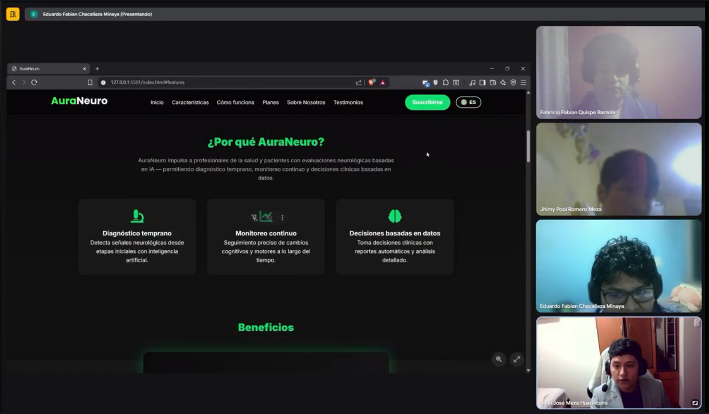
  </a>

El **Video About-the-Product** presenta una demostración clara y guiada del funcionamiento de **AuraNeuro**, orientada a los visitantes de la *Landing Page* y a los usuarios potenciales del sistema. El propósito principal del video es explicar el modelo de negocio, los beneficios centrales de la plataforma y las características principales del frontend que permiten comprender cómo funciona la solución.

Durante el video se realiza un recorrido completo por la **Landing Page**, mostrando secciones esenciales como *Por qué AuraNeuro*, *Beneficios*, *Cómo funciona*, *Servicios* y *Planes*. Estas secciones permiten entender rápidamente la propuesta de valor basada en diagnóstico temprano, monitoreo continuo, decisiones médicas informadas y uso de IA para apoyar a profesionales de la salud neurológica.

Posteriormente, se presenta una **demo del Frontend**, en la que se evidencia la navegación fluida, el diseño responsivo, la estructura del menú, la organización visual y la interacción de los módulos principales. Esta demostración permite apreciar la experiencia real del usuario final.

Siguiendo el *Project Statement*, el video también incluye un **testimonio positivo** de un usuario entrevistado durante el proceso de validación. En este caso, **Carlos Paredes**, especialista en soluciones IoT, comenta sobre la claridad visual del diseño, la rapidez del flujo de navegación y la utilidad clínica que AuraNeuro podría aportar en contextos reales de salud.

Finalmente, esta sección incluye el **screenshot del video**, el enlace oficial publicado en Microsoft Stream y la duración registrada del contenido.

**Screenshot del Video:**  
*(insertar imagen aquí)*

**URL del video (Microsoft Stream):**  
https://tinyurl.com/5av89yc9

**Usuario entrevistado (testimonio):** Carlos Paredes  
**Duración:** 4:24 minutos

